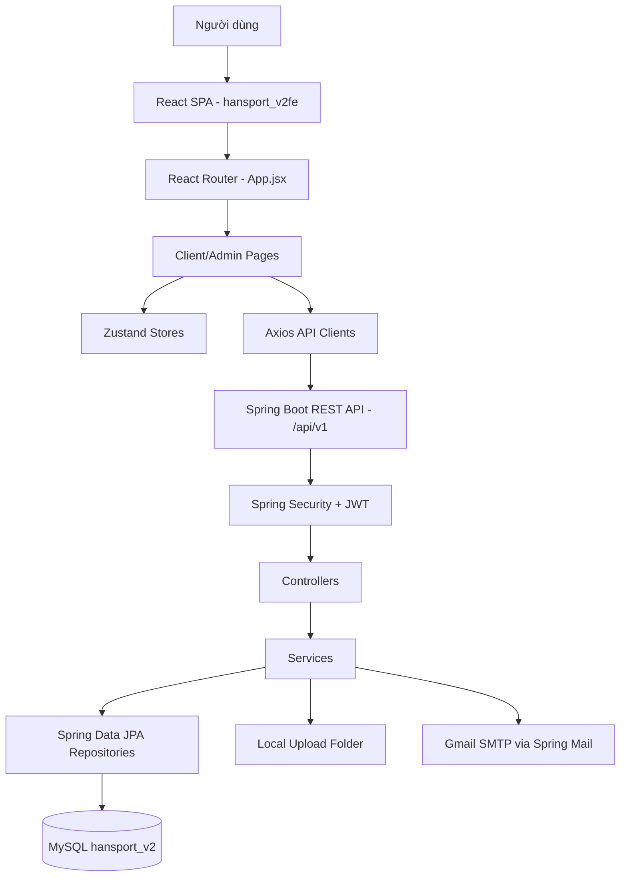
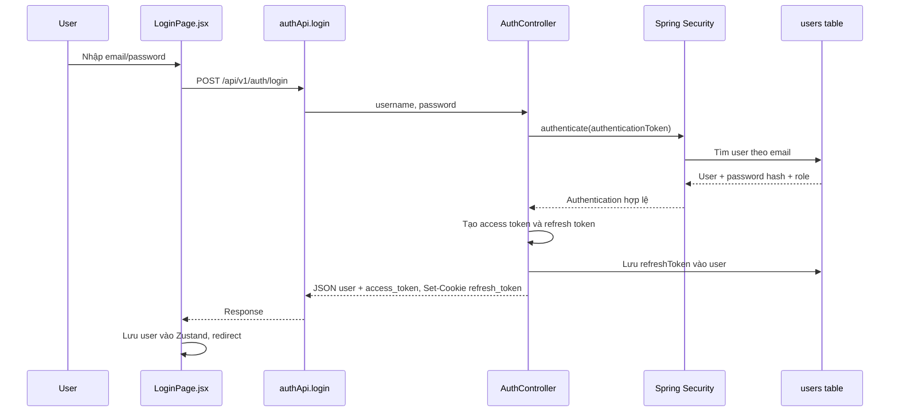
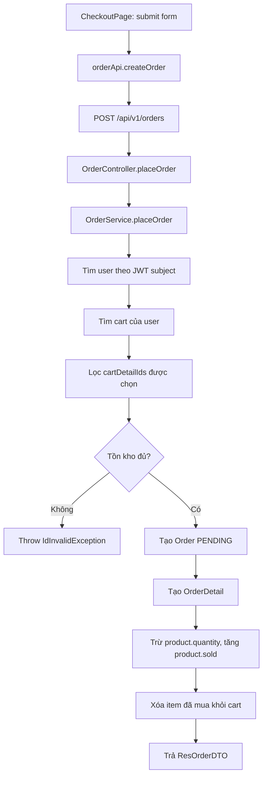
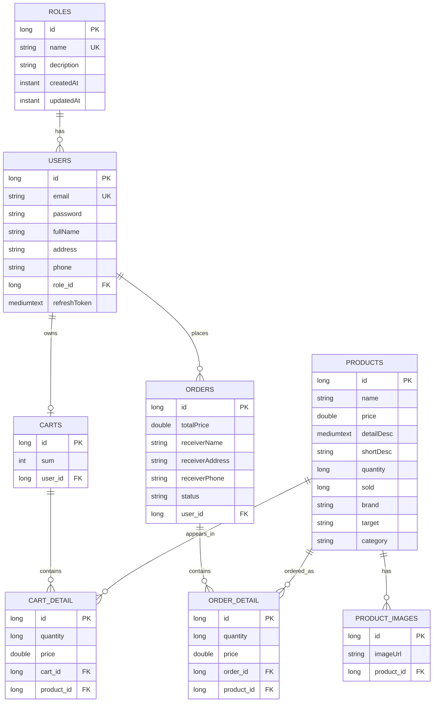
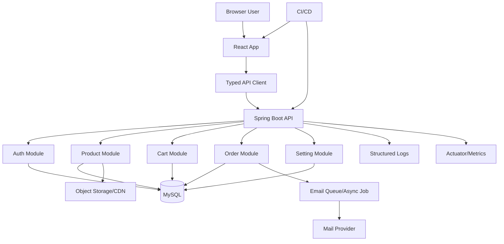

# Báo Cáo Kỹ Thuật Project Han Sports v2

> Báo cáo này được viết dựa trên source code hiện có trong workspace `D:\web\Han-Sports-v2-main\Han-Sports-v2-main`.
> Các nhận định về chức năng, kiến trúc, database, bảo mật và chất lượng code đều bám theo file thực tế đã đọc. Nếu một phần chưa xuất hiện trong source code, báo cáo ghi rõ "Chưa tìm thấy phần triển khai này trong source code hiện tại."

## Mục Lục

1. [Giới thiệu tổng quan về project](#chương-1-giới-thiệu-tổng-quan-về-project)
2. [Phân tích yêu cầu hệ thống](#chương-2-phân-tích-yêu-cầu-hệ-thống)
3. [Công nghệ sử dụng](#chương-3-công-nghệ-sử-dụng)
4. [Kiến trúc tổng thể của hệ thống](#chương-4-kiến-trúc-tổng-thể-của-hệ-thống)
5. [Phân tích cấu trúc thư mục](#chương-5-phân-tích-cấu-trúc-thư-mục)
6. [Thiết kế cơ sở dữ liệu](#chương-6-thiết-kế-cơ-sở-dữ-liệu)
7. [Phân tích chi tiết từng chức năng](#chương-7-phân-tích-chi-tiết-từng-chức-năng)
8. [Giải thích frontend](#chương-8-giải-thích-frontend)
9. [Giải thích backend](#chương-9-giải-thích-backend)
10. [Phân tích bảo mật](#chương-10-phân-tích-bảo-mật)
11. [Kiểm thử và xử lý lỗi](#chương-11-kiểm-thử-và-xử-lý-lỗi)
12. [Cài đặt và chạy project](#chương-12-cài-đặt-và-chạy-project)
13. [Đánh giá chất lượng code](#chương-13-đánh-giá-chất-lượng-code)
14. [So sánh với một project thực tế](#chương-14-so-sánh-với-một-project-thực-tế)
15. [Danh sách hạn chế và kế hoạch cải tiến](#chương-15-danh-sách-hạn-chế-và-kế-hoạch-cải-tiến)
16. [Kiến trúc đề xuất sau khi cải tiến](#chương-16-kiến-trúc-đề-xuất-sau-khi-cải-tiến)
17. [Kết luận](#chương-17-kết-luận)
18. [Phụ lục](#phụ-lục)

---

# Chương 1. Giới thiệu tổng quan về project

## 1.1. Tên project

Tên project trong README và cấu trúc source là **Han Sports - E-commerce Platform v2**.

Project được chia thành hai phần:

- `hansport_v2be`: backend Spring Boot.
- `hansport_v2fe`: frontend React/Vite.

## 1.2. Mục tiêu của hệ thống

Han Sports v2 là một website thương mại điện tử cho sản phẩm thể thao. Dựa trên source code, hệ thống đang tập trung vào luồng mua sắm cơ bản:

- Người dùng xem danh sách sản phẩm, chi tiết sản phẩm.
- Người dùng đăng ký, đăng nhập, duy trì phiên bằng JWT và refresh token.
- Người dùng thêm sản phẩm vào giỏ hàng.
- Người dùng chọn một phần hoặc toàn bộ giỏ hàng để đặt đơn.
- Quản trị viên quản lý sản phẩm, người dùng, đơn hàng và cấu hình nội dung website.

## 1.3. Bài toán mà project giải quyết

Project giải quyết bài toán xây dựng một website bán hàng thể thao có frontend riêng và backend API riêng. Đây là nhận định dựa trên:

- REST controllers trong `hansport_v2be/src/main/java/com/javaweb/controller`.
- API clients trong `hansport_v2fe/src/api`.
- Các trang client/admin trong `hansport_v2fe/src/pages`.
- Database entities trong `hansport_v2be/src/main/java/com/javaweb/domain`.

## 1.4. Đối tượng người dùng

| Nhóm người dùng | Mô tả | Bằng chứng trong source |
| --- | --- | --- |
| Khách chưa đăng nhập | Xem trang chủ, danh sách sản phẩm, chi tiết sản phẩm, đăng ký/đăng nhập | Public route trong `SecurityConfiguration.java`, client route trong `App.jsx` |
| Người dùng đã đăng nhập | Thêm giỏ hàng, xem giỏ hàng, đặt hàng, xem đơn hàng cá nhân, đăng xuất | `CartController`, `OrderController`, `AuthController`, `CartPage.jsx`, `CheckoutPage.jsx`, `MyOrdersPage.jsx` |
| Quản trị viên | Quản lý sản phẩm, người dùng, đơn hàng, cấu hình website | Role `ADMIN`, admin pages, `hasRole("ADMIN")` trong security config |

## 1.5. Các nhóm chức năng chính

| Nhóm chức năng | Mô tả | Trạng thái triển khai | File liên quan |
| --- | --- | --- | --- |
| Xác thực | Đăng nhập email/password, đăng ký, refresh token, logout, Google login | Đã triển khai | `AuthController.java`, `UserService.java`, `SecurityUtil.java`, `LoginPage.jsx`, `RegisterPage.jsx` |
| Sản phẩm | Xem danh sách, xem chi tiết, admin thêm/sửa/xóa sản phẩm | Đã triển khai | `ProductController.java`, `ProductService.java`, `ProductsPage.jsx`, `ShopPage.jsx`, `ProductDetailPage.jsx` |
| Upload file | Admin upload ảnh sản phẩm/logo, backend phục vụ file qua API | Đã triển khai một phần | `FileController.java`, `FileService.java`, `StaticResourcesWebConfiguration.java`, `ProductsPage.jsx`, `SettingsPage.jsx` |
| Giỏ hàng | Thêm sản phẩm, xem giỏ, xóa dòng giỏ hàng | Đã triển khai | `CartController.java`, `CartService.java`, `CartPage.jsx`, `useCartStore.js` |
| Đặt hàng | Tạo đơn từ cart detail được chọn, trừ tồn kho, tăng sold | Đã triển khai | `OrderController.java`, `OrderService.java`, `CheckoutPage.jsx` |
| Quản lý đơn hàng | Admin xem danh sách, cập nhật trạng thái, xóa, gửi email | Đã triển khai | `OrdersAdminPage.jsx`, `OrderService.java`, `EmailController.java` |
| Quản lý người dùng | Admin tạo/sửa/xóa/tìm kiếm user | Đã triển khai | `UserController.java`, `UserService.java`, `UsersPage.jsx` |
| Cấu hình website | Lấy/cập nhật settings: banner, category, brand, target, phí ship | Đã triển khai | `AppSettingController.java`, `AppSettingService.java`, `AppSettingSeeder.java`, `SettingsPage.jsx` |
| Dashboard admin | Tổng hợp số sản phẩm, đơn hàng, user, đơn gần đây | Đã triển khai mức cơ bản | `DashboardPage.jsx` |
| Thanh toán online | UI có lựa chọn `VNPAY`, nhưng backend order không xử lý cổng thanh toán | Chưa hoàn chỉnh | `CheckoutPage.jsx`, `ReqOrderDTO.java`, `OrderService.java` |
| Đổi mật khẩu profile | UI có form đổi mật khẩu, chưa thấy API backend tương ứng | Chưa hoàn chỉnh | `ProfilePage.jsx`, `UserController.java` |
| Wishlist | Header có placeholder, chưa thấy entity/API | Chưa tìm thấy phần triển khai này trong source code hiện tại | `Header.jsx` |

## 1.6. Phạm vi hiện tại của project

Project hiện phù hợp với mức **MVP demo hoặc portfolio học tập có cấu trúc**. Hệ thống có đủ các module cốt lõi của website thương mại điện tử nhỏ, nhưng còn thiếu nhiều yếu tố production như CI/CD, migration, monitoring, logging chuẩn, rate limiting, test nghiệp vụ, payment gateway thật và quy trình deploy.

---

# Chương 2. Phân tích yêu cầu hệ thống

## 2.1. Yêu cầu chức năng

### Khách chưa đăng nhập

| Mã chức năng | Tên chức năng | Vai trò được phép sử dụng | Mô tả | Code triển khai |
| --- | --- | --- | --- | --- |
| GUEST-01 | Xem trang chủ | Public | Hiển thị banner, category, sản phẩm mới, flash sale UI | `HomePage.jsx`, `ProductController.getAllProducts()` |
| GUEST-02 | Xem danh sách sản phẩm | Public | Tìm kiếm theo tên, phân trang, lọc client-side theo brand/target/price | `ShopPage.jsx`, `ProductController.getAllProducts()` |
| GUEST-03 | Xem chi tiết sản phẩm | Public | Xem ảnh, mô tả, tồn kho, sản phẩm liên quan | `ProductDetailPage.jsx`, `ProductController.getProductById()` |
| GUEST-04 | Đăng ký | Public | Tạo tài khoản role `USER`, mật khẩu được hash | `RegisterPage.jsx`, `AuthController.register()`, `UserService.register()` |
| GUEST-05 | Đăng nhập | Public | Đăng nhập bằng email/password, nhận access token, refresh token cookie | `LoginPage.jsx`, `AuthController.login()` |
| GUEST-06 | Đăng nhập Google | Public | Frontend lấy Google ID token, backend verify token và tạo user nếu chưa có | `LoginPage.jsx`, `AuthController.login(ReqGoogleLoginDTO)`, `GoogleTokenVerifierService.java` |

### Người dùng đã đăng nhập

| Mã chức năng | Tên chức năng | Vai trò được phép sử dụng | Mô tả | Code triển khai |
| --- | --- | --- | --- | --- |
| USER-01 | Xem thông tin tài khoản | USER, ADMIN | Lấy user hiện tại từ JWT subject | `AuthController.getAccount()`, `ProfilePage.jsx` |
| USER-02 | Refresh phiên | USER, ADMIN | Dùng refresh token HTTP-only cookie để cấp access token mới | `AuthController.getRefeshToken()`, `axiosSetup.js` |
| USER-03 | Đăng xuất | USER, ADMIN | Xóa refresh token trong DB và cookie | `AuthController.logoutAccount()` |
| USER-04 | Thêm vào giỏ hàng | USER, ADMIN | Tạo cart nếu chưa có; cộng số lượng nếu sản phẩm đã có trong cart | `CartController.addToCart()`, `CartService.addProductToCart()` |
| USER-05 | Xem giỏ hàng | USER, ADMIN | Lấy cart theo user hiện tại | `CartController.getCart()`, `CartService.getCart()` |
| USER-06 | Xóa dòng giỏ hàng | USER, ADMIN | Kiểm tra cart detail thuộc user trước khi xóa | `CartController.deleteCartDetail()`, `CartService.deleteCartDetail()` |
| USER-07 | Đặt hàng | USER, ADMIN | Tạo order từ các cart detail được chọn, cập nhật tồn kho | `OrderController.placeOrder()`, `OrderService.placeOrder()` |
| USER-08 | Xem đơn hàng cá nhân | USER, ADMIN | Lấy order theo user hiện tại và phân trang | `OrderController.getMyOrders()`, `OrderService.fetchMyOrders()` |
| USER-09 | Hủy/xóa đơn cá nhân | USER, ADMIN | User chỉ xóa đơn thuộc chính mình; admin xóa được mọi đơn | `OrderController.deleteOrder()`, `OrderService.deleteOrder()` |

### Quản trị viên

| Mã chức năng | Tên chức năng | Vai trò được phép sử dụng | Mô tả | Code triển khai |
| --- | --- | --- | --- | --- |
| ADMIN-01 | Truy cập admin layout | ADMIN | Frontend redirect nếu không có user hoặc không phải admin | `AdminLayout.jsx` |
| ADMIN-02 | Quản lý sản phẩm | ADMIN | Tạo, sửa, xóa, upload ảnh, tìm kiếm tên sản phẩm | `ProductsPage.jsx`, `ProductController`, `ProductService` |
| ADMIN-03 | Quản lý đơn hàng | ADMIN | Xem danh sách, lọc trạng thái, cập nhật trạng thái, gửi email | `OrdersAdminPage.jsx`, `OrderController`, `OrderService`, `EmailController` |
| ADMIN-04 | Quản lý người dùng | ADMIN | Tạo, sửa role, xóa, tìm kiếm người dùng | `UsersPage.jsx`, `UserController`, `UserService` |
| ADMIN-05 | Quản lý cấu hình | ADMIN | Cập nhật settings dạng key-value | `SettingsPage.jsx`, `AppSettingController.updateBulkSettings()` |
| ADMIN-06 | Dashboard | ADMIN | Tổng hợp count sản phẩm/order/user và doanh thu mẫu từ đơn gần đây | `DashboardPage.jsx` |

## 2.2. Yêu cầu phi chức năng

| Yếu tố | Trạng thái hiện tại | Nhận xét |
| --- | --- | --- |
| Hiệu năng | Triển khai một phần | Backend dùng JPA pageable cho danh sách. Chưa thấy cache, index tùy chỉnh, query tối ưu hoặc đo hiệu năng. |
| Bảo mật | Triển khai một phần | Có Spring Security, JWT, BCrypt, role authorization. Còn rủi ro secret trong `.env`, CSRF disabled, CORS dev rộng, refresh token plaintext, chưa có rate limiting. |
| Khả năng mở rộng | Trung bình | Backend có layer controller/service/repository khá rõ. Frontend nhiều page lớn, một số component có thể tách nhỏ hơn. |
| Tính ổn định | Trung bình | Có global exception handler và test context. Chưa thấy test nghiệp vụ, retry policy, circuit breaker, monitoring. |
| Khả năng bảo trì | Trung bình | Cấu trúc module rõ, nhưng có duplicate DTO conversion, page React dài, lint chưa đạt. |
| UX | Khá | Có toast, loading, empty state, mobile nav, admin UI. Một số luồng như đổi mật khẩu/payment chưa có backend. |
| Responsive | Triển khai | Tailwind dùng nhiều breakpoint `md`, `lg`, mobile nav, grid responsive. |
| Accessibility | Thiếu | Có một số `alt`, label form; chưa thấy kiểm thử a11y, aria đầy đủ cho menu/modal/toast. |
| SEO | Thiếu | React SPA, chưa thấy meta theo route, SSR, sitemap, structured data. |
| Logging | Thiếu | Có `System.out.println` trong seeder/email; chưa thấy logging framework dùng nhất quán. |
| CI/CD | Thiếu | Chưa tìm thấy workflow CI/CD trong source code hiện tại. |
| Docker/deploy | Thiếu | Chưa tìm thấy Dockerfile, docker-compose hoặc config deploy trong source code hiện tại. |

---

# Chương 3. Công nghệ sử dụng

| Thành phần | Công nghệ | Phiên bản nếu xác định được | Vai trò | File cấu hình liên quan |
| --- | --- | --- | --- | --- |
| Backend language | Java | 17 | Ngôn ngữ backend | `pom.xml` |
| Backend framework | Spring Boot | 3.2.2 | Web server, DI, REST API | `pom.xml`, `HansportApplication.java` |
| Web server | Embedded Tomcat | Theo Spring Boot | Chạy HTTP server backend | `spring-boot-starter-web` |
| Security | Spring Security | Theo Spring Boot 3.2.2 | Xác thực/ủy quyền JWT | `SecurityConfiguration.java` |
| JWT | Spring OAuth2 Resource Server + Nimbus | Theo dependencies | Encode/decode JWT HS512 | `SecurityUtil.java`, `SecurityConfiguration.java` |
| ORM | Spring Data JPA/Hibernate | Hibernate 6.4.1.Final | Entity mapping, repository, pagination | `pom.xml`, domain entities |
| Database | MySQL | Connector 8.0.33 | Database chính | `application.properties` |
| Test database | H2 | scope test | Test context với DB memory | `HansportApplicationTests.java` |
| Validation | Jakarta Validation/Hibernate Validator | 8.0.1.Final | Validate DTO/entity | `Req*.java`, `StrongPasswordValidator.java` |
| Email | Spring Mail + Thymeleaf | Theo Spring Boot | Gửi email xác nhận đơn | `EmailService.java`, `templates/order.html` |
| Dotenv | `spring-dotenv` | 4.0.0 | Đọc biến môi trường từ `.env` | `pom.xml`, `.env` |
| Package manager backend | Maven | Không xác định cụ thể | Build/test backend | `pom.xml` |
| Frontend framework | React | 19.2.5 | UI SPA | `package.json` |
| Build frontend | Vite | 8.0.10 | Dev server/build frontend | `vite.config.js` |
| Router | React Router DOM | 7.15.0 | Routing client/admin | `App.jsx` |
| State management | Zustand | 5.0.13 | Auth/cart/settings state | `src/store/*.js` |
| HTTP client | Axios | 1.16.0 | Gọi REST API | `src/api/axiosSetup.js` |
| Styling | Tailwind CSS | 3.4.19 | Utility CSS/design tokens | `tailwind.config.js`, `index.css` |
| Toast | React Hot Toast | 2.6.0 | Thông báo UI | `App.jsx`, các page |
| Icons | Material Symbols | 0.44.6 | Icon UI | `package.json`, components |
| Lint | ESLint | 10.2.1 | Kiểm tra code frontend | `eslint.config.js` |

## Nhận xét về độ phù hợp

- Spring Boot + JPA phù hợp cho backend thương mại điện tử nhỏ vì giúp xây REST API, security, transaction và persistence nhanh.
- React + Vite + Tailwind phù hợp cho UI SPA, admin dashboard và client e-commerce.
- Zustand đủ nhẹ cho auth/cart/settings, không cần Redux ở quy mô hiện tại.
- MySQL phù hợp cho dữ liệu quan hệ như user, product, cart, order.
- Dùng `ddl-auto=update` tiện cho học tập, nhưng chưa phù hợp production vì thiếu versioned migration.
- Frontend đang dùng React 19 và ESLint rules mới; lint hiện fail nhiều lỗi, cần xử lý trước khi coi là portfolio sạch.

---

# Chương 4. Kiến trúc tổng thể của hệ thống

## 4.1. Mô hình kiến trúc

Project đang dùng kiến trúc:

- **Client-Server**: frontend React gọi backend REST API.
- **Monorepo hai ứng dụng**: backend và frontend nằm chung repository nhưng chạy riêng.
- **Layered backend**: Controller -> Service -> Repository -> Entity/Database.
- **REST API**: các endpoint dưới `/api/v1`.
- **Component/page-based frontend**: pages, layouts, common components, stores, API clients.

Đây là nhận định suy luận dựa trên cấu trúc code hiện có.

## 4.2. Sơ đồ kiến trúc



## 4.3. Luồng request và response

### Luồng 1: Đăng nhập



### Luồng 2: Thêm sản phẩm vào giỏ hàng

1. Người dùng bấm nút thêm vào giỏ trên `HomePage.jsx`, `ShopPage.jsx` hoặc `ProductDetailPage.jsx`.
2. Frontend gọi `cartApi.addToCart(productId, quantity)`.
3. Axios interceptor gắn `Authorization: Bearer <accessToken>`.
4. `CartController.addToCart()` lấy email từ `SecurityUtil.getCurrentUserLogin()`.
5. `CartService.addProductToCart()` tìm user, tìm/tạo cart, tìm product.
6. Service kiểm tra tổng số lượng mới không vượt tồn kho.
7. Nếu sản phẩm chưa có trong cart, tạo `CartDetail`; nếu đã có, cộng số lượng.
8. Backend trả `ResCartDTO`.
9. Frontend gọi lại `cartApi.getCart()` ở nhiều nơi để đồng bộ cart store.

### Luồng 3: Đặt hàng



---

# Chương 5. Phân tích cấu trúc thư mục

## 5.1. Cây thư mục rút gọn

```text
Han-Sports-v2-main/
├── README.md
├── PROJECT_TECHNICAL_REPORT.md
├── hansport_v2be/
│   ├── pom.xml
│   ├── .env
│   └── src/
│       ├── main/
│       │   ├── java/com/javaweb/
│       │   │   ├── HansportApplication.java
│       │   │   ├── config/
│       │   │   ├── controller/
│       │   │   ├── domain/
│       │   │   │   ├── request/
│       │   │   │   └── response/
│       │   │   ├── repository/
│       │   │   ├── service/
│       │   │   └── util/
│       │   └── resources/
│       │       ├── application.properties
│       │       └── templates/order.html
│       └── test/java/com/javaweb/
│           └── HansportApplicationTests.java
└── hansport_v2fe/
    ├── package.json
    ├── vite.config.js
    ├── tailwind.config.js
    ├── .env
    ├── upload/
    └── src/
        ├── api/
        ├── components/common/
        ├── layouts/
        ├── pages/
        │   ├── admin/
        │   └── client/
        ├── store/
        └── utils/
```

## 5.2. Vai trò từng phần

| Thư mục hoặc file | Vai trò | Thành phần liên quan | Ghi chú |
| --- | --- | --- | --- |
| `README.md` | Mô tả project, hướng dẫn chạy, tài khoản demo | Cả project | Nội dung bị hiển thị lỗi encoding trong terminal, cần kiểm tra UTF-8 |
| `hansport_v2be/pom.xml` | Khai báo dependencies/build backend | Backend | Spring Boot, JPA, Security, MySQL, Mail, Dotenv |
| `application.properties` | Cấu hình DB, JWT, upload, frontend URL, mail | Backend config | Có fallback default và biến môi trường |
| `config/` | Security, CORS, seed data, static resources, user details | Backend infrastructure | `SecurityConfiguration` là file quan trọng nhất cho authz |
| `controller/` | REST endpoints `/api/v1` | Backend API | Nhận request, gọi service |
| `service/` | Business logic | Backend nghiệp vụ | Xử lý cart/order/product/user/file/email/settings |
| `repository/` | Spring Data JPA repository | Database access | Không thấy SQL custom phức tạp |
| `domain/` | JPA entities | Database schema | Hibernate sinh schema từ entity |
| `domain/request` | DTO request + validation | API input | Ví dụ `ReqProductDTO`, `ReqOrderDTO` |
| `domain/response` | DTO response | API output | Tránh trả entity trực tiếp ở nhiều API |
| `templates/order.html` | Template email order | Email | Dùng Thymeleaf |
| `HansportApplicationTests.java` | Test context/seeder | Testing | Dùng H2 memory |
| `hansport_v2fe/package.json` | Scripts/dependencies frontend | Frontend | `dev`, `build`, `lint`, `preview` |
| `vite.config.js` | Dev server/proxy/build | Frontend tooling | Proxy `/api` sang backend 8080 |
| `tailwind.config.js` | Design tokens/theme | Frontend styling | Brand color, shadow, animation |
| `src/api` | Axios API clients | FE-BE integration | Auth/product/cart/order/user/setting |
| `src/store` | Zustand stores | FE state | Auth/cart/settings |
| `src/layouts` | Layout client/admin | Routing shell | `AdminLayout` có guard client-side |
| `src/pages/client` | Trang người dùng | Frontend client | Home/shop/detail/cart/checkout/auth/profile/orders |
| `src/pages/admin` | Trang quản trị | Frontend admin | Dashboard/products/orders/users/settings |
| `src/components/common` | Component dùng chung | Frontend UI | Header/footer/mobile nav/product card |
| `upload/` | Ảnh sản phẩm/logo/banner local | File storage | Backend config trỏ `../hansport_v2fe/upload` |

---

# Chương 6. Thiết kế cơ sở dữ liệu

## 6.1. Nguồn xác định schema

Không tìm thấy file migration, `schema.sql`, `data.sql`, Flyway hoặc Liquibase trong source code hiện tại. Schema được suy ra từ các JPA entity:

- `User.java`
- `Role.java`
- `Product.java`
- `ProductImage.java`
- `Cart.java`
- `CartDetail.java`
- `Order.java`
- `OrderDetail.java`
- `AppSetting.java`

`application.properties` cấu hình:

```properties
spring.jpa.hibernate.ddl-auto=${JPA_DDL_AUTO:update}
spring.datasource.url=${DB_URL:jdbc:mysql://localhost:3306/hansport_v2?...}
```

Điều này cho thấy Hibernate đang được dùng để cập nhật schema tự động khi chạy app.

## 6.2. Danh sách bảng dữ liệu

| Bảng dữ liệu | Mục đích | Khóa chính | Khóa ngoại | Liên kết với bảng khác |
| --- | --- | --- | --- | --- |
| `roles` | Lưu vai trò `ADMIN`, `USER` | `id` | Không | 1 role có nhiều users |
| `users` | Lưu tài khoản, thông tin cá nhân, refresh token | `id` | `role_id` | Nhiều user thuộc 1 role; 1 user có 1 cart; 1 user có nhiều orders |
| `products` | Lưu sản phẩm, giá, mô tả, tồn kho, brand/category/target | `id` | Không | 1 product có nhiều images/cart_detail/order_detail |
| `product_images` | Lưu tên file ảnh sản phẩm | `id` | `product_id` | Nhiều ảnh thuộc 1 product |
| `carts` | Lưu giỏ hàng hiện tại của user | `id` | `user_id` | 1 cart thuộc 1 user; 1 cart có nhiều cart_detail |
| `cart_detail` | Lưu dòng sản phẩm trong giỏ | `id` | `cart_id`, `product_id` | Nhiều dòng thuộc 1 cart; mỗi dòng tham chiếu 1 product |
| `orders` | Lưu đơn hàng | `id` | `user_id` | 1 order thuộc 1 user; 1 order có nhiều order_detail |
| `order_detail` | Lưu sản phẩm trong đơn hàng | `id` | `order_id`, `product_id` | Nhiều dòng thuộc 1 order; mỗi dòng tham chiếu 1 product |
| `settings` | Lưu cấu hình key-value của website | `id` | Không | Không liên kết trực tiếp |

## 6.3. Chi tiết các bảng chính

### `users`

File: `hansport_v2be/src/main/java/com/javaweb/domain/User.java`  
Dòng quan trọng: 14-44

```java
@Entity
@Table(name = "users")
public class User {
    @Id
    @GeneratedValue(strategy = GenerationType.IDENTITY)
    private long id;

    @Email(...)
    @Column(nullable = false, unique = true)
    private String email;

    private String password;

    @ManyToOne
    @JoinColumn(name = "role_id")
    private Role role;

    @Column(columnDefinition = "MEDIUMTEXT")
    private String refreshToken;
}
```

Ý nghĩa:

- `email` là unique và là username đăng nhập.
- `password` lưu BCrypt hash cho tài khoản thường; tài khoản Google có thể không có password.
- `refreshToken` đang lưu trong DB dạng text. Đây là rủi ro nếu DB bị lộ.

### `products` và `product_images`

File: `Product.java` dòng 16-51.

```java
@Entity
@Table(name = "products")
public class Product {
    @Id
    @GeneratedValue(strategy = GenerationType.IDENTITY)
    private long id;
    private String name;
    private double price;
    @Column(columnDefinition = "MEDIUMTEXT")
    private String detailDesc;
    private long quantity;
    private long sold;

    @OneToMany(mappedBy = "product", fetch = FetchType.LAZY,
               cascade = CascadeType.ALL, orphanRemoval = true)
    private List<ProductImage> images;
}
```

Ý nghĩa:

- `quantity` là tồn kho.
- `sold` là số lượng đã bán.
- `brand`, `target`, `category` là string trực tiếp, chưa chuẩn hóa thành bảng riêng.
- Ảnh được tách sang `product_images`, giúp một sản phẩm có nhiều ảnh.

### `orders` và `order_detail`

File: `Order.java` dòng 12-37.

```java
@Entity
@Table(name = "orders")
public class Order {
    @Id
    @GeneratedValue(strategy = GenerationType.IDENTITY)
    private long id;
    private double totalPrice;
    private String receiverName;
    private String receiverAddress;
    private String receiverPhone;
    private String status;

    @ManyToOne
    @JoinColumn(name = "user_id")
    private User user;

    @OneToMany(mappedBy = "order", fetch = FetchType.LAZY,
               cascade = CascadeType.ALL, orphanRemoval = true)
    private List<OrderDetail> orderDetails;
}
```

Ý nghĩa:

- `status` là string, được validate ở service khi admin cập nhật.
- Chưa thấy enum DB hoặc check constraint cho trạng thái.
- `totalPrice` dùng `double`, có thể gây sai số tiền tệ; nên đổi sang `BigDecimal` hoặc `long` VND.

## 6.4. ERD Mermaid



## 6.5. Đánh giá database

| Tiêu chí | Nhận xét |
| --- | --- |
| Chuẩn hóa | Cơ bản ổn cho user/order/cart/product. `brand`, `target`, `category`, `status` đang là string nên chưa chuẩn hóa hoàn toàn. |
| Ràng buộc | Có unique cho `users.email`, `roles.name`, `settings.setting_key`. Chưa thấy unique cho product name ở DB, dù service kiểm tra trùng tên. |
| Kiểu tiền tệ | `double` cho `price`, `totalPrice` chưa lý tưởng cho tiền. Nên dùng `BigDecimal` hoặc `long` đơn vị VND. |
| Index | Chưa tìm thấy khai báo index tùy chỉnh trong entity. |
| Migration | Chưa tìm thấy migration. `ddl-auto=update` không phù hợp production. |
| SQL Injection | Repository dùng Spring Data JPA và Specification, không thấy raw SQL trực tiếp. Rủi ro SQL injection thấp hơn, nhưng filter string từ frontend cần kiểm soát cú pháp springfilter. |
| Xóa cascade | Product/order/cart có `orphanRemoval = true`; cần cẩn thận khi xóa để tránh mất dữ liệu ngoài ý muốn. |

---

# Chương 7. Phân tích chi tiết từng chức năng

## 7.1. Đăng ký tài khoản

### Mục đích

Cho khách tạo tài khoản `USER`. Backend validate email, fullName, password mạnh và hash mật khẩu trước khi lưu.

### Luồng xử lý

1. `RegisterPage.jsx` nhận form: `fullName`, `email`, `password`, `phone`, `address`.
2. Frontend gọi `authApi.register(data)`.
3. Backend route `POST /api/v1/auth/register`.
4. `AuthController.register()` gọi `UserService.register()`.
5. `UserService.register()` chuyển sang `ReqUserCreateDTO` role `USER`.
6. `createUser()` kiểm tra email tồn tại, hash password, gán role, lưu DB.

### File code liên quan

| File | Thành phần | Vai trò |
| --- | --- | --- |
| `hansport_v2fe/src/pages/client/RegisterPage.jsx` | `handleSubmit()` | Submit form đăng ký |
| `hansport_v2fe/src/api/authApi.js` | `register()` | Gọi API |
| `hansport_v2be/src/main/java/com/javaweb/controller/AuthController.java` | `register()` | REST endpoint |
| `hansport_v2be/src/main/java/com/javaweb/service/UserService.java` | `register()`, `createUser()` | Nghiệp vụ tạo user |
| `ReqRegisterDTO.java`, `ReqUserCreateDTO.java` | DTO | Validation input |

### Giải thích code

File: `AuthController.java`  
Hàm: `register()`  
Vai trò: Nhận request đăng ký và trả DTO user mới.

```java
@PostMapping("/auth/register")
@ApiMessage("register a user")
public ResponseEntity<ResCreateUserDTO> register(
        @RequestBody @Valid ReqRegisterDTO registerDTO) throws IdInvalidException {
    return ResponseEntity.status(HttpStatus.CREATED)
            .body(this.userService.register(registerDTO));
}
```

Input: JSON body từ frontend.  
Output: `ResCreateUserDTO` được wrapper bởi `FormatRestResponse`.

File: `UserService.java`  
Hàm: `createUser()`

```java
if (this.userRepository.existsByEmail(req.getEmail())) {
    throw new IdInvalidException("Email đã tồn tại");
}
user.setPassword(this.passwordEncoder.encode(req.getPassword()));
user.setRole(this.getRoleOrThrow(normalizeRoleName(req.getRoleName(), "USER")));
```

Điểm tốt:

- Không lưu plaintext password.
- Kiểm tra trùng email.
- Role được normalize.

Hạn chế:

- Chưa thấy xác thực email.
- Chưa thấy rate limiting hoặc captcha chống spam đăng ký.
- Google user có thể không có password, cần xử lý rõ khi đăng nhập bằng password.

## 7.2. Đăng nhập, JWT và refresh token

### Mục đích

Xác thực user bằng email/password, cấp access token cho API và refresh token trong cookie HTTP-only.

### Luồng xử lý

1. Frontend gọi `authApi.login(username, password)`.
2. `AuthController.login()` tạo `UsernamePasswordAuthenticationToken`.
3. Spring Security gọi `UserDetailsCustom.loadUserByUsername()`.
4. Nếu password hợp lệ, backend tạo `access_token` và `refresh_token`.
5. Refresh token được lưu vào `users.refreshToken`.
6. Cookie `refresh_token` được set với `httpOnly`, `sameSite=Lax`, `secure` theo cấu hình.

### File code liên quan

| File | Thành phần | Vai trò |
| --- | --- | --- |
| `LoginPage.jsx` | `handleSubmit()`, Google init | UI đăng nhập |
| `authApi.js` | `login()`, `refresh()`, `logout()` | API auth |
| `AuthController.java` | `login()`, `getRefeshToken()`, `logoutAccount()` | Endpoint auth |
| `SecurityUtil.java` | `createAccessToken()`, `createRefreshToken()` | Sinh JWT |
| `SecurityConfiguration.java` | `SecurityFilterChain` | Bảo vệ route |
| `UserDetailsCustom.java` | `loadUserByUsername()` | Adapter Spring Security |

### Giải thích code

File: `AuthController.java`  
Dòng tham khảo: 50-99

```java
UsernamePasswordAuthenticationToken authenticationToken =
        new UsernamePasswordAuthenticationToken(loginDTO.getUsername(), loginDTO.getPassword());

Authentication authentication = authenticationManagerBuilder.getObject()
        .authenticate(authenticationToken);

String access_token = this.securityUtil.createAccessToken(authentication.getName(), resLoginDTO);
String refresh_token = this.securityUtil.createRefreshToken(loginDTO.getUsername(), resLoginDTO);
this.userService.updateUserToken(refresh_token, loginDTO.getUsername());
```

Đoạn này biến input email/password thành authentication token, nhờ Spring Security xác thực, rồi sinh hai token.

File: `AuthController.java`  
Dòng tham khảo: 89-97

```java
ResponseCookie resCookies = ResponseCookie
        .from("refresh_token", refresh_token)
        .httpOnly(true)
        .secure(secureCookie)
        .path("/")
        .sameSite("Lax")
        .maxAge(refreshTokenExpiration)
        .build();
```

Điểm tốt:

- Refresh token dùng HTTP-only cookie nên JavaScript không đọc trực tiếp được.
- Access token không persist trong localStorage theo `useAuthStore`.

Hạn chế:

- Refresh token lưu plaintext trong DB.
- `sameSite=Lax` ổn cho nhiều luồng web, nhưng nếu có cross-site flow phức tạp cần đánh giá lại.
- CSRF đang disabled, cần cân nhắc vì refresh token nằm trong cookie.

## 7.3. Refresh token và Axios interceptor

### Mục đích

Khi access token hết hạn, frontend tự gọi `/auth/refresh`, lấy access token mới và retry request.

### Giải thích code

File: `hansport_v2fe/src/api/axiosSetup.js`  
Dòng tham khảo: 26-34

```js
axiosInstance.interceptors.request.use((config) => {
  const { accessToken } = useAuthStore.getState();
  if (accessToken) {
    config.headers.Authorization = `Bearer ${accessToken}`;
  }
  return config;
});
```

Input: mọi request dùng `axiosInstance`.  
Output: request có header `Authorization`.

File: `axiosSetup.js`  
Dòng tham khảo: 53-104

```js
if (error.response?.status === 401 && !originalRequest._retry) {
  originalRequest._retry = true;
  isRefreshing = true;
  const { data } = await axiosPublic.get("/api/v1/auth/refresh");
  const newAccessToken = resData?.access_token || resData?.accessToken;
  useAuthStore.getState().setAccessToken(newAccessToken);
  return axiosInstance(originalRequest);
}
```

Điểm tốt:

- Có queue `failedQueue` để tránh nhiều refresh đồng thời.
- Khi refresh fail, clear auth và redirect login.

Hạn chế:

- `BASE_URL` hard-code `http://localhost:8080`, chưa dùng `VITE_API_URL`.
- Nếu response wrapper thay đổi, logic `resData?.access_token || resData?.accessToken` cần kiểm thử kỹ.

## 7.4. Quản lý sản phẩm

### Mục đích

Cho admin tạo, sửa, xóa sản phẩm; cho public xem danh sách/chi tiết sản phẩm.

### Luồng xử lý

- Public:
  - `ShopPage.jsx` gọi `productApi.getAll({ page, size, filter })`.
  - Backend `ProductController.getAllProducts()` nhận `@Filter Specification<Product>` và `Pageable`.
  - `ProductService.fetchAllProducts()` trả `ResultPaginationDTO`.
- Admin:
  - `ProductsPage.jsx` mở modal, upload ảnh, submit product DTO.
  - Backend kiểm tra trùng tên, lưu product, lưu product images.

### File code liên quan

| File | Thành phần | Vai trò |
| --- | --- | --- |
| `ProductsPage.jsx` | form admin | CRUD sản phẩm |
| `ShopPage.jsx` | listing | Tìm kiếm/lọc/phân trang sản phẩm |
| `ProductDetailPage.jsx` | detail | Xem chi tiết, thêm giỏ |
| `productApi.js` | API client | Gọi `/api/v1/products` và `/api/v1/files` |
| `ProductController.java` | REST endpoints | CRUD sản phẩm |
| `ProductService.java` | business logic | Validate, save, convert DTO |
| `Product.java`, `ProductImage.java` | entity | Schema sản phẩm |

### Giải thích code

File: `ProductController.java`  
Hàm: `getAllProducts()`

```java
@GetMapping("/products")
public ResponseEntity<ResultPaginationDTO> getAllProducts(
        @Filter Specification<Product> spec,
        Pageable pageable) {
    return ResponseEntity.status(HttpStatus.OK)
            .body(this.productService.fetchAllProducts(spec, pageable));
}
```

Input: query params `page`, `size`, `sort`, `filter`.  
Output: `ResultPaginationDTO` gồm `meta` và `result`.

File: `ProductService.java`  
Hàm: `handleSaveProduct()`

```java
if (this.productRepository.existsByName(req.getName())) {
    throw new IdInvalidException("Sản phẩm đã tồn tại");
}
Product product = new Product();
this.applyProductRequest(product, req);
Product currentProduct = this.productRepository.save(product);
currentProduct.setImages(this.addImage(req.getImages(), currentProduct));
```

Điểm tốt:

- DTO validation kiểm tra tên, price, mô tả, quantity.
- Service kiểm tra trùng tên.
- Có pagination metadata.

Hạn chế:

- `addImage()` khi update chỉ thêm ảnh mới, không thấy xóa ảnh cũ theo danh sách mới; có thể gây trùng ảnh.
- `price` dùng `Double/double`.
- Chưa thấy unique DB constraint cho product name.
- Chưa thấy xử lý phân loại sản phẩm thành bảng category/brand riêng.

## 7.5. Upload ảnh/file

### Mục đích

Cho admin upload file vào thư mục local, chủ yếu ảnh sản phẩm và logo.

### Giải thích code

File: `FileController.java`  
Hàm: `upload()`

```java
List<String> allowedExtensions = Arrays.asList("pdf", "jpg", "jpeg", "png", "doc", "docx");
String extension = fileName.substring(fileName.lastIndexOf(".") + 1).toLowerCase();
boolean isValid = allowedExtensions.contains(extension);
```

File: `FileService.java`  
Dòng tham khảo: 19-37, 54-72

```java
private static final Set<String> ALLOWED_FOLDERS = Set.of("product", "logo");

String safeName = originalName.replaceAll("[^a-zA-Z0-9._-]", "_");
String finalName = System.currentTimeMillis() + "-" + safeName;
Path path = resolveFile(folder, finalName);
Files.copy(inputStream, path, StandardCopyOption.REPLACE_EXISTING);
```

Điểm tốt:

- Chặn path traversal bằng allowed folder và kiểm tra `..`, `/`, `\`.
- Làm sạch filename.
- Giới hạn thư mục `product`, `logo`.

Hạn chế:

- Kiểm tra extension, chưa thấy kiểm tra MIME thật hoặc scan file.
- Cho phép `pdf`, `doc`, `docx` dù mục đích chính là ảnh sản phẩm/logo.
- Upload local storage không phù hợp khi scale nhiều server.
- File cũ không được dọn khi product image bị thay.

## 7.6. Giỏ hàng

### Mục đích

Lưu các sản phẩm người dùng muốn mua, hỗ trợ chọn một phần giỏ hàng để checkout.

### Luồng xử lý

1. User thêm sản phẩm.
2. `CartService` tạo cart nếu chưa có.
3. Nếu sản phẩm đã có trong cart, tăng quantity.
4. Nếu quantity vượt tồn kho, throw `IdInvalidException`.
5. Cart trả về frontend, Zustand cập nhật `cartItems`, `selectedIds`, `totalCount`.

### Giải thích code

File: `CartService.java`  
Hàm: `addProductToCart()`

```java
Cart cart = this.cartRepository.findByUser(currentUser).orElse(null);
if (cart == null) {
    Cart otherCart = new Cart();
    otherCart.setUser(currentUser);
    otherCart.setSum(0);
    cart = this.cartRepository.save(otherCart);
}

CartDetail oldDetail = this.cartDetailRepository.findByCartAndProduct(cart, realProduct);
long currentQuantity = oldDetail == null ? 0 : oldDetail.getQuantity();
if (currentQuantity + requestedQuantity > realProduct.getQuantity()) {
    throw new IdInvalidException("Số lượng vượt quá tồn kho");
}
```

Điểm tốt:

- Kiểm tra tồn kho trước khi thêm.
- Kiểm tra quyền khi xóa cart detail.
- Có `orphanRemoval` cho cart detail.

Hạn chế:

- Chưa có API update quantity trực tiếp; frontend giảm/tăng quantity bằng cách xóa rồi thêm lại, dễ tạo race condition và trải nghiệm không tối ưu.
- `Cart.sum` là số dòng sản phẩm, còn frontend `totalCount` là tổng quantity; cần document rõ để tránh nhầm.

## 7.7. Đặt hàng

### Mục đích

Tạo đơn hàng từ các dòng cart được chọn, cập nhật tồn kho và xóa dòng đã đặt khỏi cart.

### Giải thích code

File: `OrderService.java`  
Hàm: `placeOrder()`

```java
List<CartDetail> orderItems = allCartDetails.stream()
        .filter(cd -> reqOrder.getCartDetailIds().contains(cd.getId()))
        .collect(Collectors.toList());

for (CartDetail cd : orderItems) {
    Product product = cd.getProduct();
    if (product.getQuantity() < cd.getQuantity()) {
        throw new IdInvalidException("Sản phẩm " + product.getName() + " không đủ tồn kho");
    }
    sum += cd.getPrice() * cd.getQuantity();
}
```

Đoạn này nhận danh sách `cartDetailIds` từ frontend, chỉ đặt các sản phẩm được chọn và tính tổng tiền.

```java
product.setQuantity(product.getQuantity() - cartDetail.getQuantity());
product.setSold(product.getSold() + cartDetail.getQuantity());
this.productRepository.save(product);

OrderDetail orderDetail = new OrderDetail();
orderDetail.setOrder(order);
orderDetail.setProduct(product);
orderDetail.setPrice(cartDetail.getPrice());
orderDetail.setQuantity(cartDetail.getQuantity());
```

Điểm tốt:

- Có transaction.
- Kiểm tra cart rỗng và tồn kho.
- Cho phép checkout một phần giỏ hàng.

Hạn chế:

- Chưa thấy khóa tồn kho pessimistic/optimistic; khi nhiều người mua cùng lúc có thể oversell.
- Chưa thấy payment status hoặc payment transaction.
- Chưa thấy địa chỉ/phone validation nâng cao ngoài `@NotBlank`.
- `CheckoutPage.jsx` có UI `VNPAY`, nhưng backend chưa xử lý thanh toán online.

## 7.8. Quản lý đơn hàng admin và gửi email

### Mục đích

Admin xem/cập nhật trạng thái đơn hàng và gửi email xác nhận khi chuyển trạng thái.

### Giải thích code

File: `OrderService.java`  
Hàm: `updateOrderStatus()`

```java
String status = req.getStatus().trim().toUpperCase();
List<String> allowedStatus = Arrays.asList(
    "PENDING", "PROCESSING", "SHIPPING", "COMPLETED", "CANCELLED");
if (!allowedStatus.contains(status)) {
    throw new IdInvalidException("Trạng thái đơn hàng không hợp lệ");
}
order.setStatus(status);
```

File: `EmailController.java`

```java
@GetMapping("/email/{id}")
public String sendSimpleEmail(@PathVariable long id) {
    this.orderService.sendOrderEmail(id);
    return "ok";
}
```

Điểm tốt:

- Có whitelist trạng thái.
- Email dùng Thymeleaf template `order.html`.

Hạn chế:

- Endpoint gửi email dùng GET, đây không phải lựa chọn tốt cho side effect. Nên đổi thành POST.
- Security config không chỉ định riêng role ADMIN cho `/api/v1/email/{id}`; do `anyRequest().authenticated()`, user đăng nhập có thể gọi nếu biết ID. Đây là rủi ro quyền truy cập cần sửa.
- `EmailService` catch lỗi và `System.out.println`, không trả lỗi rõ cho admin.

## 7.9. Quản lý người dùng

### Mục đích

Admin tạo, sửa, xóa và tìm kiếm user.

### Giải thích code

File: `UserController.java`

```java
@PostMapping("/users")
public ResponseEntity<ResCreateUserDTO> createUser(
        @RequestBody @Valid ReqUserCreateDTO user) throws IdInvalidException {
    return ResponseEntity.status(HttpStatus.CREATED).body(userService.createUser(user));
}
```

File: `SecurityConfiguration.java` dòng 55:

```java
.requestMatchers("/api/v1/users", "/api/v1/users/**").hasRole("ADMIN")
```

Điểm tốt:

- Backend bắt buộc ADMIN cho `/users`.
- DTO validation cho create/update.
- Password admin tạo user cũng được hash.

Hạn chế:

- Update user không xử lý đổi password dù frontend admin có input "Mật khẩu mới".
- Xóa user cần kiểm tra dữ liệu phụ thuộc order/cart; hiện gọi `deleteById` trực tiếp.

## 7.10. Cấu hình website

### Mục đích

Quản trị viên thay đổi các giá trị như banner, category, brand, target, hotline, phí ship.

### Giải thích code

File: `AppSettingController.java`

```java
@GetMapping("/settings")
public ResponseEntity<Map<String, String>> getAllSettings() {
    return ResponseEntity.ok(appSettingService.getAllSettings());
}

@PutMapping("/settings/bulk")
@PreAuthorize("hasRole('ADMIN')")
public ResponseEntity<Void> updateBulkSettings(@RequestBody List<ReqSettingUpdateDTO> updates) {
    appSettingService.updateBulkSettings(updates);
    return ResponseEntity.ok().build();
}
```

File: `useSettingStore.js`

```js
getSetting: (key, defaultValue = null) => {
  const s = get().settings;
  if (!s || s[key] === undefined) return defaultValue;
  if (typeof s[key] === "string" && (s[key].startsWith("[") || s[key].startsWith("{"))) {
    return JSON.parse(s[key]);
  }
  return s[key];
}
```

Điểm tốt:

- Settings dạng key-value linh hoạt.
- Public có thể đọc settings để render UI.
- Admin cập nhật bulk.

Hạn chế:

- `ReqSettingUpdateDTO` chưa thấy validation key/value.
- Dữ liệu JSON lưu dạng string trong DB, không có schema validate.
- Nếu admin nhập class Tailwind hoặc JSON sai, frontend có thể render lỗi.

---

# Chương 8. Giải thích frontend

## 8.1. Tổ chức giao diện

Frontend là React SPA. Entry point:

- `hansport_v2fe/src/main.jsx`: mount React vào `#root`.
- `hansport_v2fe/src/App.jsx`: khai báo router, layouts, routes, Toaster.

File: `App.jsx` dòng 36-64

```jsx
<BrowserRouter>
  <Routes>
    <Route element={<ClientLayout />}>
      <Route index element={<HomePage />} />
      <Route path="shop" element={<ShopPage />} />
      <Route path="products/:id" element={<ProductDetailPage />} />
      ...
    </Route>

    <Route path="admin" element={<AdminLayout />}>
      <Route index element={<DashboardPage />} />
      <Route path="products" element={<ProductsPage />} />
      ...
    </Route>
  </Routes>
</BrowserRouter>
```

## 8.2. Layout và component

| Thành phần | File | Vai trò |
| --- | --- | --- |
| Client layout | `ClientLayout.jsx` | Header, footer, mobile nav, restore session/cart |
| Admin layout | `AdminLayout.jsx` | Sidebar, topbar, guard admin client-side |
| Header | `Header.jsx` | Logo, nav category, search, user menu, cart badge |
| Footer | `Footer.jsx` | Thông tin shop, hotline, link footer |
| Mobile nav | `MobileNav.jsx` | Navigation dưới màn hình mobile |
| Product card | `ProductCard.jsx` | Card sản phẩm dùng trong listing |

## 8.3. State management

| Store | File | State chính | Vai trò |
| --- | --- | --- | --- |
| Auth | `useAuthStore.js` | `accessToken`, `user` | Lưu auth state, check admin |
| Cart | `useCartStore.js` | `cartItems`, `selectedIds`, `totalCount` | Lưu giỏ hàng và dòng được chọn checkout |
| Settings | `useSettingStore.js` | `settings`, `loading` | Lấy/cached cấu hình website |

`useAuthStore` dùng `persist`, nhưng chỉ persist `user`, không persist `accessToken`. Đây là lựa chọn tốt hơn localStorage token dài hạn.

## 8.4. API calling

API clients nằm trong `src/api`:

- `authApi.js`
- `productApi.js`
- `cartApi.js`
- `orderApi.js`
- `userApi.js`
- `settingApi.js`
- `axiosSetup.js`

Tất cả API backend dùng prefix `/api/v1`.

## 8.5. Các trang quan trọng

| Trang | Chức năng | File liên quan | Dữ liệu hiển thị | Hành động của người dùng |
| --- | --- | --- | --- | --- |
| Trang chủ | Banner, category, flash sale UI, sản phẩm mới | `HomePage.jsx` | Settings, products | Xem sản phẩm, thêm giỏ |
| Shop | Danh sách sản phẩm | `ShopPage.jsx` | Products paginated | Search, lọc brand/target/price, phân trang, thêm giỏ |
| Product detail | Chi tiết sản phẩm | `ProductDetailPage.jsx` | Product, related products | Chọn ảnh, chọn số lượng, thêm giỏ, mua ngay |
| Cart | Giỏ hàng | `CartPage.jsx` | Cart details | Chọn dòng mua, xóa dòng, tăng/giảm quantity |
| Checkout | Đặt hàng | `CheckoutPage.jsx` | Cart selected items, shipping fee | Nhập thông tin nhận hàng, submit order |
| My orders | Đơn cá nhân | `MyOrdersPage.jsx` | Orders của user | Lọc trạng thái, mở chi tiết, hủy/xóa đơn |
| Login/Register | Auth | `LoginPage.jsx`, `RegisterPage.jsx` | Form auth | Đăng nhập email/password, Google login, đăng ký |
| Admin products | CRUD product | `ProductsPage.jsx` | Product list | Thêm/sửa/xóa/upload ảnh |
| Admin orders | Quản lý order | `OrdersAdminPage.jsx` | Order list | Lọc/cập nhật trạng thái/gửi email/xóa |
| Admin users | Quản lý user | `UsersPage.jsx` | User list | Tạo/sửa/xóa |
| Admin settings | Cấu hình web | `SettingsPage.jsx` | Settings | Sửa banner/category/brand/target/fee |

## 8.6. Validation frontend

Frontend có validation HTML cơ bản qua `required`, `type="email"`, `type="number"`, `min`. Ví dụ `ProductsPage.jsx` có input required cho name, price, quantity, descriptions. Tuy nhiên validation quan trọng vẫn cần ở backend, và backend đã có DTO validation cho nhiều request.

Chưa tìm thấy validation frontend nâng cao cho:

- Format số điện thoại.
- Confirm password đăng ký.
- Xác thực dữ liệu settings JSON/class.
- Payment method thật.

## 8.7. Responsive và UX

Đã triển khai responsive qua Tailwind:

- `md:hidden`, `hidden md:block`, grid `grid-cols-2`, `md:grid-cols-*`.
- `MobileNav.jsx` cho mobile.
- Header có mobile menu.
- Admin UI chủ yếu desktop, chưa thấy mobile admin đầy đủ.

UX tốt ở các điểm:

- Có toast (`react-hot-toast`) và custom toast ở admin pages.
- Có loading skeleton/spinner.
- Có empty state.
- Có trạng thái disabled khi out of stock hoặc đang xử lý.

## 8.8. Điểm cần cải thiện frontend

- `npm run lint` hiện fail 32 errors/11 warnings.
- `axiosSetup.js` hard-code base URL thay vì dùng `VITE_API_URL`.
- Một số page rất dài: `ProductsPage.jsx` 439 dòng, `HomePage.jsx` 348 dòng, `SettingsPage.jsx` 314 dòng; nên tách component/form/table.
- `ProfilePage.jsx` có UI đổi mật khẩu nhưng chưa thấy API backend.
- `CheckoutPage.jsx` có VNPAY option nhưng backend chưa xử lý thanh toán.

---

# Chương 9. Giải thích backend

## 9.1. Entry point

File: `hansport_v2be/src/main/java/com/javaweb/HansportApplication.java`

```java
@SpringBootApplication
public class HansportApplication {
    public static void main(String[] args) {
        SpringApplication.run(HansportApplication.class, args);
    }
}
```

Đây là entry point chạy Spring Boot application.

## 9.2. Cấu hình database

File: `application.properties`

```properties
spring.jpa.hibernate.ddl-auto=${JPA_DDL_AUTO:update}
spring.datasource.url=${DB_URL:jdbc:mysql://localhost:3306/hansport_v2?...}
spring.datasource.username=${DB_USERNAME:root}
spring.datasource.password=${DB_PASSWORD:123456}
```

Vai trò:

- Kết nối MySQL.
- Tự động update schema bằng Hibernate.
- Có fallback default để chạy local nhanh.

Rủi ro:

- Fallback password DB và JWT secret default không nên dùng production.
- `ddl-auto=update` không kiểm soát thay đổi schema như migration.

## 9.3. Route/controller

| Controller | Base path | Endpoint chính |
| --- | --- | --- |
| `AuthController` | `/api/v1` | `/auth/login`, `/auth/register`, `/auth/google`, `/auth/account`, `/auth/refresh`, `/auth/logout` |
| `ProductController` | `/api/v1` | CRUD `/products` |
| `CartController` | `/api/v1` | `/carts`, `/carts/add`, `/carts/{id}` |
| `OrderController` | `/api/v1` | `/orders`, `/orders/my`, `/orders/{id}` |
| `UserController` | `/api/v1` | CRUD `/users` |
| `FileController` | `/api/v1` | `/files` upload/download |
| `AppSettingController` | `/api/v1` | `/settings`, `/settings/bulk` |
| `EmailController` | `/api/v1` | `/email/{id}` |

## 9.4. Service

Service chứa nghiệp vụ chính:

- `UserService`: tạo user, register, Google user, update token, mapping DTO.
- `ProductService`: CRUD product, mapping images.
- `CartService`: get/add/delete cart detail.
- `OrderService`: place order, fetch orders, update status, delete order, send email.
- `FileService`: lưu và đọc file local.
- `EmailService`: gửi email qua SMTP và Thymeleaf.
- `AppSettingService`: get/update settings.

## 9.5. Repository

Các repository extends `JpaRepository`, nhiều repository cũng extends `JpaSpecificationExecutor` để hỗ trợ filter/pagination.

Ví dụ `ProductRepository.java`:

```java
public interface ProductRepository
        extends JpaRepository<Product, Long>, JpaSpecificationExecutor<Product> {
    boolean existsByName(String name);
    Optional<Product> findByName(String name);
}
```

## 9.6. Middleware/security

File: `SecurityConfiguration.java` dòng 44-66:

```java
.csrf(c -> c.disable())
.cors(Customizer.withDefaults())
.authorizeHttpRequests(authz -> authz
    .requestMatchers("/", "/api/v1/auth/login", "/api/v1/auth/register",
        "/api/v1/auth/refresh", "/storage/**", "/api/v1/auth/google").permitAll()
    .requestMatchers(HttpMethod.GET, "/api/v1/products", "/api/v1/products/**",
        "/api/v1/files", "/api/v1/settings").permitAll()
    .requestMatchers(HttpMethod.POST, "/api/v1/products", "/api/v1/files").hasRole("ADMIN")
    .requestMatchers("/api/v1/users", "/api/v1/users/**").hasRole("ADMIN")
    .anyRequest().authenticated())
.oauth2ResourceServer(...)
.sessionManagement(session -> session.sessionCreationPolicy(SessionCreationPolicy.STATELESS));
```

Ý nghĩa:

- Public có thể đọc sản phẩm, file, settings và auth endpoints.
- Admin mới được tạo/sửa/xóa sản phẩm và quản lý user.
- Các request còn lại cần authenticated.
- Backend stateless, không dùng session server.

## 9.7. Response wrapper

File: `FormatRestResponse.java`

```java
if (body instanceof RestResponse<?> || body instanceof Resource ||
        (selectedContentType != null && !MediaType.APPLICATION_JSON.includes(selectedContentType))) {
    return body;
}

RestResponse<Object> res = new RestResponse<>();
res.setStatusCode(status);
res.setData(body);
```

Vai trò:

- Wrap response JSON thành format thống nhất: `statusCode`, `message`, `data`.
- Không wrap file resource.

## 9.8. Xử lý lỗi

File: `GlobalException.java`

- `Exception.class`: trả 500.
- `IdInvalidException`, `BadCredentialsException`, `IllegalArgumentException`, validation violation: trả 400.
- `MethodArgumentNotValidException`: gom lỗi field validation.
- `AccessDeniedException`: trả 403.
- `StorageException`: trả 400 upload lỗi.

Hạn chế:

- `handleAllException` trả `ex.getMessage()` có thể lộ thông tin nội bộ.
- Chưa thấy structured logging.

---

# Chương 10. Phân tích bảo mật

| Vấn đề bảo mật | Trạng thái hiện tại | Mức độ rủi ro | File liên quan | Đề xuất |
| --- | --- | --- | --- | --- |
| SQL Injection | Chưa thấy raw SQL; dùng JPA repository/specification | Thấp-Trung bình | `repository/*`, `ShopPage.jsx` filter string | Validate/sanitize filter; giới hạn field filter được phép |
| XSS | React escape text mặc định; chưa thấy `dangerouslySetInnerHTML` | Thấp | Frontend pages | Kiểm tra dữ liệu settings/banner nhập từ admin, tránh render HTML raw |
| CSRF | CSRF disabled; refresh token dùng cookie | Trung bình-Cao | `SecurityConfiguration.java` | Bật CSRF cho cookie endpoint hoặc dùng double-submit/CSRF token nếu cần |
| Hash mật khẩu | Có BCrypt | Tốt | `SecurityConfiguration.java`, `UserService.java` | Giữ BCrypt/Argon2, tăng policy nếu production |
| Strong password | Có custom annotation | Tốt | `StrongPasswordValidator.java` | Thêm confirm password frontend |
| Session fixation | Không dùng session server, stateless JWT | Thấp | `SecurityConfiguration.java` | Tiếp tục stateless |
| Refresh token storage | Lưu plaintext trong `users.refreshToken` | Cao | `User.java`, `UserService.java` | Lưu hash refresh token, rotate token, revoke theo device |
| Cookie security | `httpOnly`, `sameSite=Lax`; `secure` tùy env | Trung bình | `AuthController.java`, `.env` | Production bắt buộc `COOKIE_SECURE=true`, HTTPS |
| Authorization | Có role admin cho product/user/order/settings | Trung bình | `SecurityConfiguration.java`, `AppSettingController.java` | Bổ sung rule rõ cho `/api/v1/email/**`; audit từng endpoint |
| Upload file nguy hiểm | Có extension allowlist/folder allowlist/path check; thiếu MIME check | Trung bình | `FileController.java`, `FileService.java` | Kiểm tra MIME, giới hạn chỉ image cho product/logo, scan file |
| Validation server | Có DTO validation cho nhiều request | Tốt một phần | `domain/request/*` | Thêm validation cho setting, Google token DTO, phone |
| Lộ thông tin DB/secret | Workspace có `.env` chứa secret thật; report không ghi giá trị | Nghiêm trọng nếu bị commit/chia sẻ | `.env`, `application.properties` | Rotate secret, dùng `.env.example`, kiểm tra git tracking |
| Error message | Một số lỗi trả `ex.getMessage()` | Trung bình | `GlobalException.java` | Trả message an toàn cho client, log chi tiết server-side |
| CORS | Cho phép `frontendUrl`, `localhost:*`, `127.0.0.1:*` với credentials | Trung bình | `CorsConfig.java` | Production chỉ allow domain thật |
| Rate limiting | Chưa tìm thấy | Cao cho login/register | Chưa có | Thêm rate limit/brute-force protection |
| HTTPS | Chưa có config deploy HTTPS | Cao khi production | Chưa có | Deploy sau reverse proxy HTTPS |
| Secret key management | JWT/mail/Google secret lấy env nhưng có default và `.env` local | Cao | `application.properties`, `.env` | Không commit secret, rotate, dùng secret manager |

Ghi chú: Không khẳng định secret đã bị commit vào Git từ báo cáo này. `git status` hiện chỉ báo thay đổi ở `DataSeeder.java`; tuy nhiên `.env` tồn tại trong workspace và chứa thông tin nhạy cảm nên vẫn là rủi ro vận hành/chia sẻ máy.

---

# Chương 11. Kiểm thử và xử lý lỗi

## 11.1. Test hiện có

Backend có một test:

File: `hansport_v2be/src/test/java/com/javaweb/HansportApplicationTests.java`

```java
@SpringBootTest(properties = {
    "spring.datasource.url=jdbc:h2:mem:hansport;MODE=MySQL;...",
    "spring.jpa.hibernate.ddl-auto=create-drop",
    "app.seed.enabled=true"
})
class HansportApplicationTests {
    @Test
    void contextLoads() {
        Assertions.assertTrue(roleRepository.existsByName("ADMIN"));
        Assertions.assertTrue(roleRepository.existsByName("USER"));
        Assertions.assertTrue(userRepository.existsByEmail("admin@hansport.local"));
        Assertions.assertTrue(productRepository.existsByName("Giày đá bóng 11Play Pro"));
    }
}
```

Kết quả kiểm chứng đã chạy:

- `mvn test`: pass.
- 1 test, 0 failures, 0 errors.

## 11.2. Frontend lint

Kết quả kiểm chứng đã chạy:

- `npm run lint`: fail.
- 32 errors, 11 warnings.

Nhóm lỗi chính:

- Unused variables/imports.
- Empty block statement.
- React hook dependency warnings.
- React 19 hooks rules: `set-state-in-effect`, `purity`, `static-components`.

## 11.3. Xử lý lỗi hiện tại

Backend có `GlobalException` để trả lỗi JSON cho:

- Validation DTO.
- Bad credentials.
- Access denied.
- Storage exception.
- Generic exception.

Frontend có:

- Toast báo lỗi/thành công ở nhiều page.
- Redirect về login khi refresh token fail.
- Loading state và empty state.

## 11.4. Test case đề xuất

| Mã test | Chức năng | Dữ liệu đầu vào | Kết quả mong đợi | Mức độ ưu tiên |
| --- | --- | --- | --- | --- |
| T-AUTH-01 | Đăng ký thành công | Email mới, password mạnh | Tạo user role USER, password hash | P0 |
| T-AUTH-02 | Đăng ký email trùng | Email đã tồn tại | 400, không tạo user | P0 |
| T-AUTH-03 | Đăng nhập sai mật khẩu | Email đúng, password sai | 400/401, không cấp token | P0 |
| T-AUTH-04 | Refresh token hợp lệ | Cookie refresh token đúng | Access token mới, rotate refresh token | P0 |
| T-AUTH-05 | Logout | Bearer token hợp lệ | DB refreshToken null, cookie maxAge 0 | P0 |
| T-PROD-01 | Admin tạo sản phẩm | DTO hợp lệ | 201, product/images được lưu | P0 |
| T-PROD-02 | User thường tạo sản phẩm | Bearer USER | 403 | P0 |
| T-CART-01 | Thêm cart vượt tồn kho | quantity > stock | 400, không đổi cart | P0 |
| T-CART-02 | Xóa cart detail người khác | ID thuộc user khác | 400/403 | P0 |
| T-ORDER-01 | Đặt hàng thành công | cartDetailIds hợp lệ | Order PENDING, trừ tồn kho, xóa cart detail | P0 |
| T-ORDER-02 | Đặt hàng cart rỗng | Không có cart | 400 | P0 |
| T-ORDER-03 | Admin update status hợp lệ | `SHIPPING` | Status đổi | P1 |
| T-ORDER-04 | Admin update status sai | `DONE` | 400 | P1 |
| T-FILE-01 | Upload ảnh hợp lệ | jpg/png | Lưu file, trả filename | P1 |
| T-FILE-02 | Upload extension không hợp lệ | `.exe` | 400 | P0 |
| T-SET-01 | Admin update settings | List key-value | DB settings cập nhật | P1 |
| T-SEC-01 | Gọi email endpoint bằng USER | `/email/{id}` | Nên bị 403 sau khi sửa rule | P0 |

---

# Chương 12. Cài đặt và chạy project

## 12.1. Yêu cầu môi trường

Dựa trên README và config:

- Java 17+
- Maven
- Node.js 18+ hoặc version tương thích Vite/React đang dùng
- MySQL 8.x

## 12.2. Tạo database

```sql
CREATE DATABASE hansport_v2 CHARACTER SET utf8mb4 COLLATE utf8mb4_unicode_ci;
```

Backend có `createDatabaseIfNotExist=true` trong JDBC URL mặc định, nhưng tạo trước database vẫn rõ ràng hơn.

## 12.3. Cấu hình backend

File backend config:

- `hansport_v2be/src/main/resources/application.properties`
- `hansport_v2be/.env`

Không nên dùng secret thật trong tài liệu. Cấu hình minh họa:

```env
DB_URL=jdbc:mysql://localhost:3306/hansport_v2?createDatabaseIfNotExist=true&useSSL=false&allowPublicKeyRetrieval=true&serverTimezone=UTC
DB_USERNAME=<your_database_user>
DB_PASSWORD=<your_database_password>
JWT_BASE64_SECRET=<your_base64_jwt_secret>
JWT_ACCESS_TOKEN_VALIDITY=86400
JWT_REFRESH_TOKEN_VALIDITY=604800
UPLOAD_FILE_BASE_PATH=../hansport_v2fe/upload
GOOGLE_CLIENT_ID=<your_google_client_id>
GOOGLE_CLIENT_SECRET=<your_google_client_secret>
YOUR_EMAIL=<your_gmail_address>
YOUR_APP_PASSWORD=<your_gmail_app_password>
SERVER_PORT=8080
FRONTEND_URL=http://localhost:5173
COOKIE_SECURE=false
SEED_ENABLED=true
```

## 12.4. Chạy backend

```bash
cd hansport_v2be
mvn clean spring-boot:run
```

Backend mặc định chạy ở:

```text
http://localhost:8080
```

## 12.5. Cấu hình frontend

File:

- `hansport_v2fe/.env`

Minh họa:

```env
VITE_API_URL=http://localhost:8080/api/v1
VITE_GOOGLE_CLIENT_ID=<your_google_client_id>
VITE_BASE_URL=http://localhost:5173
```

Lưu ý: `axiosSetup.js` hiện hard-code `http://localhost:8080`, nên `VITE_API_URL` chưa được tận dụng đầy đủ.

## 12.6. Chạy frontend

```bash
cd hansport_v2fe
npm install
npm run dev
```

Frontend mặc định chạy ở:

```text
http://localhost:5173
```

## 12.7. Tài khoản demo

Source có seeder tạo admin nếu `SEED_ENABLED=true`:

| Vai trò | Email | Mật khẩu |
| --- | --- | --- |
| Admin | `admin@hansport.local` | `Admin@123` |

File liên quan: `DataSeeder.java`.

## 12.8. Lỗi thường gặp

| Lỗi | Nguyên nhân có thể | Cách xử lý |
| --- | --- | --- |
| Backend không kết nối DB | MySQL chưa chạy, sai user/password | Kiểm tra `.env`, tạo database, bật MySQL |
| Không gửi được email | Gmail app password sai hoặc thiếu env | Cấu hình `YOUR_EMAIL`, `YOUR_APP_PASSWORD` |
| 401 liên tục | Access token mất, refresh cookie không gửi | Kiểm tra `withCredentials`, CORS, cookie domain/secure |
| Upload lỗi folder | Folder không thuộc allowlist | Chỉ dùng `product` hoặc `logo` theo `FileService` |
| Frontend lint fail | Code hiện có chưa đạt ESLint | Sửa unused vars, hooks dependencies/rules |
| Tiếng Việt hiển thị lỗi encoding ở terminal | Có thể do encoding file hoặc terminal | Chuẩn hóa UTF-8 cho source/docs |

---

# Chương 13. Đánh giá chất lượng code

| Tiêu chí | Mức đánh giá | Nhận xét | Ví dụ file liên quan |
| --- | --- | --- | --- |
| Cấu trúc thư mục | Khá | Backend chia layer rõ, frontend chia page/api/store/layout | `controller`, `service`, `repository`, `src/pages` |
| Tách biệt trách nhiệm | Khá ở backend, trung bình ở frontend | Service chứa nghiệp vụ; React page còn dài | `OrderService.java`, `ProductsPage.jsx` |
| Naming | Trung bình | Nhiều tên rõ; có typo như `getRefeshToken`, `decription`, `converTo...` | `AuthController.java`, `Role.java`, `CartService.java` |
| Validation | Khá | DTO có validation, strong password; settings/Google DTO còn thiếu | `Req*.java`, `StrongPasswordValidator.java` |
| Bảo mật | Trung bình | Có JWT/BCrypt/role; còn secret, CSRF/CORS/rate-limit | `SecurityConfiguration.java`, `.env` |
| Error handling | Trung bình | Có global exception; generic error có thể lộ message | `GlobalException.java` |
| Logging | Yếu | Chưa dùng logger chuẩn nhất quán | `EmailService.java`, `AppSettingSeeder.java` |
| Test | Yếu | Chỉ có contextLoads/seeder test | `HansportApplicationTests.java` |
| Reuse code | Trung bình | DTO conversion lặp lại nhiều | `ProductService.java`, `OrderService.java`, `UserService.java` |
| Frontend lint | Yếu hiện tại | `npm run lint` fail 32 errors/11 warnings | `src/**/*.jsx` |
| Config environment | Trung bình | Có env, nhưng base URL hard-code và `.env` chứa secret thật trong workspace | `application.properties`, `axiosSetup.js` |
| Khả năng mở rộng | Trung bình | Nền tảng ổn cho MVP; cần migration, service tách nhỏ, test | Toàn project |

## Đoạn nên refactor

1. `ProductService.addImage()`:
   - Hiện update product có thể thêm ảnh trùng/lưu ảnh cũ.
   - Nên đồng bộ danh sách ảnh theo request hoặc có endpoint quản lý ảnh riêng.

2. `CartPage.jsx` quantity update:
   - Hiện giảm/tăng bằng xóa item rồi thêm lại.
   - Nên có endpoint `PUT /carts/{cartDetailId}` để update quantity atomic.

3. `EmailController.sendSimpleEmail()`:
   - Side effect qua GET.
   - Nên đổi thành `POST /orders/{id}/send-email` và yêu cầu ADMIN.

4. `GlobalException.handleAllException()`:
   - Trả `ex.getMessage()` cho client.
   - Nên log chi tiết server-side và trả message an toàn.

5. `axiosSetup.js`:
   - Hard-code base URL.
   - Nên dùng `import.meta.env.VITE_API_URL` hoặc base backend URL rõ ràng.

6. Các React page dài:
   - `ProductsPage.jsx`, `SettingsPage.jsx`, `HomePage.jsx`.
   - Nên tách table, modal, form, filters thành components.

---

# Chương 14. So sánh với một project thực tế

| Tiêu chí | Project hiện tại | Project thực tế cần có | Khoảng cách cần cải thiện |
| --- | --- | --- | --- |
| Kiến trúc | FE/BE tách, layered backend | Tách rõ module domain, migration, config theo env | Trung bình |
| Giao diện | Đẹp, có client/admin | UX test, a11y, design system nhất quán | Trung bình |
| Responsive | Có mobile client | Admin mobile/tablet tốt hơn | Trung bình |
| Database | JPA entities, MySQL | Migration, index, constraints, backup | Cao |
| Bảo mật | JWT/BCrypt/role | Rate limit, CSRF strategy, secret manager, token hash | Cao |
| Phân quyền | Có ADMIN/USER | Audit từng endpoint, ownership policy rõ | Trung bình |
| Validation | DTO validation | Validation đầy đủ phone/settings/payment | Trung bình |
| Xử lý lỗi | Global exception | Error code chuẩn, log correlation ID | Trung bình |
| Logging | Gần như chưa có | Structured logging | Cao |
| Testing | 1 test context | Unit/integration/e2e/auth/security tests | Cao |
| Hiệu năng | Pageable cơ bản | Cache, index, query profiling | Trung bình |
| Cache | Chưa thấy | Cache settings/products nếu cần | Trung bình |
| Pagination | Có backend pageable | Thống nhất toàn bộ list, giới hạn size max | Thấp-Trung bình |
| Tìm kiếm | Springfilter/simple search | Full-text/search service nếu sản phẩm nhiều | Trung bình |
| Upload file | Local upload | Object storage/CDN, MIME scan | Cao |
| Backup dữ liệu | Chưa thấy | Backup/restore plan | Cao |
| CI/CD | Chưa thấy | Pipeline build/test/lint/deploy | Cao |
| Docker | Chưa thấy | Dockerfile/docker-compose | Trung bình |
| Deployment | Chưa thấy | Cloud/server deploy config | Cao |
| HTTPS/domain | Chưa thấy | TLS, domain, secure cookie | Cao |
| Monitoring | Chưa thấy | Metrics, alerting, uptime check | Cao |
| SEO | Chưa thấy | Meta tags, sitemap, SSR/prerender nếu cần | Trung bình |
| Accessibility | Một phần | Keyboard nav, aria, contrast audit | Trung bình |
| Tài liệu kỹ thuật | README + báo cáo này | API docs, architecture docs | Trung bình |
| README | Có nhưng encoding cần kiểm tra | README chuẩn UTF-8, setup rõ | Thấp-Trung bình |
| Git workflow | Chưa thấy workflow | Branch/PR/release convention | Trung bình |
| Scale user tăng | Chưa có cache/index/lock tồn kho | DB index, locking, queue/email async robust | Cao |

## Mức độ hoàn thiện tổng thể

Đánh giá: **Project portfolio / MVP có thể demo**.

Lý do:

- Có đầy đủ lõi e-commerce: auth, product, cart, order, admin.
- Kiến trúc backend tương đối rõ.
- UI frontend đã có nhiều trang và tương tác thực tế.
- Tuy nhiên chưa đạt production vì thiếu test nghiệp vụ, migration, bảo mật production, CI/CD, monitoring, payment thật và lint chưa sạch.

---

# Chương 15. Danh sách hạn chế và kế hoạch cải tiến

## P0 - Cần sửa ngay

| Độ ưu tiên | Vấn đề | Ảnh hưởng | Giải pháp đề xuất | File hoặc module cần chỉnh sửa | Độ phức tạp |
| --- | --- | --- | --- | --- | --- |
| P0 | Secret thật nằm trong workspace `.env` | Lộ tài khoản email/Google/JWT/DB nếu chia sẻ | Rotate secret, tạo `.env.example`, đảm bảo `.env` không commit | `.env`, `.gitignore`, docs | Trung bình |
| P0 | Endpoint gửi email dùng GET và chưa khóa ADMIN rõ | User đăng nhập có thể trigger email nếu biết ID | Đổi sang POST và `hasRole('ADMIN')` | `EmailController.java`, `SecurityConfiguration.java`, `orderApi.js` | Thấp |
| P0 | Refresh token lưu plaintext | DB leak dẫn đến chiếm phiên | Lưu hash token, rotate theo device | `User.java`, `AuthController.java`, `UserService.java` | Trung bình |
| P0 | Chưa có rate limit login/register | Brute-force credential | Thêm rate limiting hoặc lock account | Auth module | Trung bình |
| P0 | Frontend lint fail | Code chưa sẵn sàng portfolio/prod | Sửa 32 errors/11 warnings | `hansport_v2fe/src` | Trung bình |
| P0 | Payment online chưa triển khai nhưng UI có VNPAY | Gây hiểu nhầm chức năng | Ẩn VNPAY hoặc triển khai gateway thật | `CheckoutPage.jsx`, order/payment backend | Trung bình-Cao |

## P1 - Nên hoàn thiện trước khi đưa vào portfolio

| Độ ưu tiên | Vấn đề | Ảnh hưởng | Giải pháp đề xuất | File hoặc module cần chỉnh sửa | Độ phức tạp |
| --- | --- | --- | --- | --- | --- |
| P1 | Chưa có migration | Khó kiểm soát schema | Thêm Flyway hoặc Liquibase | Backend config/database | Trung bình |
| P1 | Test nghiệp vụ thiếu | Dễ regression | Viết test auth/cart/order/product | Backend tests | Trung bình |
| P1 | React pages quá dài | Khó bảo trì | Tách component/table/modal/form | `ProductsPage.jsx`, `SettingsPage.jsx`, `HomePage.jsx` | Trung bình |
| P1 | Update cart quantity chưa tối ưu | Race condition, UX kém | Thêm API update quantity | `CartController`, `CartService`, `CartPage.jsx` | Trung bình |
| P1 | Settings thiếu validation | Admin nhập sai làm hỏng UI | Validate key/value/schema JSON | `ReqSettingUpdateDTO`, `AppSettingService` | Trung bình |
| P1 | README encoding và nội dung | Giảm tính chuyên nghiệp | Chuẩn hóa UTF-8, thêm setup/troubleshooting | `README.md` | Thấp |

## P2 - Nâng cấp để gần sản phẩm thực tế

| Độ ưu tiên | Vấn đề | Ảnh hưởng | Giải pháp đề xuất | File hoặc module cần chỉnh sửa | Độ phức tạp |
| --- | --- | --- | --- | --- | --- |
| P2 | Thiếu Docker | Khó chạy đồng nhất | Thêm Dockerfile/docker-compose MySQL/BE/FE | Root project | Trung bình |
| P2 | Thiếu CI/CD | Không tự động test/lint | GitHub Actions build FE/BE/test/lint | `.github/workflows` | Trung bình |
| P2 | Local file storage | Khó scale | S3/Cloudinary/CDN | File module | Cao |
| P2 | Logging yếu | Khó debug production | Thêm SLF4J structured logs | Services/controllers | Trung bình |
| P2 | Không có monitoring | Không biết lỗi runtime | Actuator metrics, Prometheus/Grafana hoặc uptime monitor | Backend/deploy | Trung bình |
| P2 | Tiền dùng double | Sai số tiền tệ | Đổi sang `BigDecimal` hoặc `long` VND | Entities/DTO/service | Trung bình |

## P3 - Hướng phát triển mở rộng

| Độ ưu tiên | Vấn đề | Ảnh hưởng | Giải pháp đề xuất | File hoặc module cần chỉnh sửa | Độ phức tạp |
| --- | --- | --- | --- | --- | --- |
| P3 | Chưa có wishlist | Thiếu tính năng e-commerce phổ biến | Thêm wishlist entity/API/UI | New module | Trung bình |
| P3 | Chưa có coupon/voucher | Thiếu promotion | Thêm coupon/order discount | Order/payment module | Cao |
| P3 | Chưa có dashboard nâng cao | Admin thiếu insight | Revenue chart, top products, inventory alert | Dashboard/admin API | Trung bình |
| P3 | Chưa có notification | UX admin/user hạn chế | Email/order notification/in-app notification | Notification module | Cao |
| P3 | Chưa có đa ngôn ngữ | Khó mở rộng thị trường | i18n frontend | Frontend | Trung bình |

---

# Chương 16. Kiến trúc đề xuất sau khi cải tiến

## 16.1. Cấu trúc thư mục đề xuất

Không cần kiến trúc quá phức tạp. Với quy mô hiện tại, nên giữ monorepo FE/BE nhưng chuẩn hóa module:

```text
project/
├── docs/
│   ├── API.md
│   ├── ARCHITECTURE.md
│   └── SECURITY.md
├── docker-compose.yml
├── hansport_v2be/
│   ├── src/main/java/com/javaweb/
│   │   ├── auth/
│   │   ├── product/
│   │   ├── cart/
│   │   ├── order/
│   │   ├── user/
│   │   ├── setting/
│   │   ├── file/
│   │   ├── common/
│   │   └── config/
│   └── src/main/resources/db/migration/
└── hansport_v2fe/
    └── src/
        ├── api/
        ├── app/
        ├── features/
        │   ├── auth/
        │   ├── products/
        │   ├── cart/
        │   ├── orders/
        │   └── admin/
        ├── shared/
        └── routes/
```

## 16.2. Sơ đồ kiến trúc đề xuất



## 16.3. Phần nên giữ nguyên

- Tách frontend/backend.
- REST API `/api/v1`.
- Spring Security stateless JWT.
- DTO request/response thay vì trả entity trực tiếp.
- Zustand cho state nhẹ.
- Tailwind cho UI nhanh.

## 16.4. Phần nên refactor

- Backend module theo feature để giảm service/controller quá chung.
- Thêm Flyway migration.
- Hash refresh token.
- Tách Product image management.
- Tách React pages lớn thành component nhỏ.
- Đưa API base URL về env.
- Thêm endpoint update cart quantity.
- Bổ sung payment module nếu giữ VNPAY.

## 16.5. Lộ trình chuyển đổi an toàn

1. Sửa bảo mật P0: secret, email endpoint, refresh token hash, CORS production.
2. Sửa lint frontend và các bug nhỏ không đổi behavior.
3. Thêm test integration cho auth/cart/order/product.
4. Thêm Flyway từ schema hiện tại, chuyển `ddl-auto` sang `validate` hoặc `none` ở production.
5. Refactor frontend pages lớn sau khi đã có test/smoke test.
6. Thêm Docker và CI/CD.
7. Triển khai demo với HTTPS, domain, env secret riêng.
8. Nâng cấp payment/upload/monitoring nếu muốn gần production.

---

# Chương 17. Kết luận

## 17.1. Project đã giải quyết được gì

Han Sports v2 đã xây được một nền tảng e-commerce thể thao mức demo khá đầy đủ: người dùng có thể xem sản phẩm, đăng ký/đăng nhập, quản lý giỏ hàng, đặt hàng; admin có thể quản lý sản phẩm, user, đơn hàng và cấu hình giao diện.

## 17.2. Điểm mạnh

- Backend Spring Boot có layer controller/service/repository/entity rõ.
- Có JWT auth, BCrypt password, refresh token cookie.
- Có role ADMIN/USER và security rule cho nhiều endpoint quan trọng.
- Frontend có đầy đủ client/admin routes, UI responsive, state management, toast/loading/empty states.
- Database quan hệ đủ cho e-commerce cơ bản.

## 17.3. Kiến thức có thể học được

- Xây REST API bằng Spring Boot.
- Dùng Spring Security với JWT resource server.
- Thiết kế entity JPA cho e-commerce.
- Kết nối React với backend qua Axios interceptor.
- Quản lý state bằng Zustand.
- Tổ chức admin dashboard và client shopping flow.

## 17.4. Hạn chế quan trọng

- Chưa đủ tiêu chuẩn production về secret management, rate limit, CSRF strategy, migration, logging, monitoring.
- Test rất ít; frontend lint chưa đạt.
- Một số chức năng UI chưa có backend đầy đủ như đổi mật khẩu, VNPAY/payment thật.
- Upload file còn đơn giản, chưa kiểm tra MIME/storage production.
- Tiền dùng `double`, chưa lý tưởng.

## 17.5. Ưu tiên tiếp theo

1. Rotate và bảo vệ secret.
2. Sửa email endpoint và authorization.
3. Sửa frontend lint.
4. Viết test auth/cart/order/product.
5. Thêm migration và README chuẩn.
6. Refactor page lớn và các API thiếu.

## 17.6. Mức độ phù hợp portfolio

Project phù hợp để đưa vào GitHub/portfolio xin thực tập sau khi sửa các vấn đề P0/P1. Hiện tại đã có giá trị trình bày tốt vì có frontend, backend, DB, auth và admin, nhưng cần làm sạch lint, tài liệu, secret và test để tạo ấn tượng chuyên nghiệp.

## 17.7. Gợi ý mô tả trong CV

- Xây dựng website thương mại điện tử Han Sports với React, Spring Boot, Spring Security JWT và MySQL.
- Thiết kế REST API cho xác thực, sản phẩm, giỏ hàng, đơn hàng, người dùng và cấu hình hệ thống.
- Triển khai luồng đăng nhập JWT với refresh token HTTP-only cookie và phân quyền ADMIN/USER.
- Xây dựng admin dashboard quản lý sản phẩm, đơn hàng, người dùng, upload ảnh và cấu hình banner/category.
- Tích hợp Spring Data JPA, validation DTO, pagination/filter và email template xác nhận đơn hàng.

---

# Phụ lục

## Phụ lục A - Danh sách file quan trọng

| File | Vai trò | Mức độ quan trọng |
| --- | --- | --- |
| `hansport_v2be/pom.xml` | Dependencies/build backend | Rất cao |
| `hansport_v2be/src/main/resources/application.properties` | Cấu hình DB/JWT/mail/upload | Rất cao |
| `hansport_v2be/src/main/java/com/javaweb/HansportApplication.java` | Entry point backend | Cao |
| `hansport_v2be/src/main/java/com/javaweb/config/SecurityConfiguration.java` | Security/authorization/JWT decoder | Rất cao |
| `hansport_v2be/src/main/java/com/javaweb/config/CorsConfig.java` | CORS credentials | Cao |
| `hansport_v2be/src/main/java/com/javaweb/config/DataSeeder.java` | Seed roles/admin/product | Cao |
| `hansport_v2be/src/main/java/com/javaweb/config/AppSettingSeeder.java` | Seed settings | Cao |
| `hansport_v2be/src/main/java/com/javaweb/controller/AuthController.java` | Auth endpoints | Rất cao |
| `hansport_v2be/src/main/java/com/javaweb/controller/ProductController.java` | Product API | Rất cao |
| `hansport_v2be/src/main/java/com/javaweb/controller/CartController.java` | Cart API | Rất cao |
| `hansport_v2be/src/main/java/com/javaweb/controller/OrderController.java` | Order API | Rất cao |
| `hansport_v2be/src/main/java/com/javaweb/controller/UserController.java` | User admin API | Cao |
| `hansport_v2be/src/main/java/com/javaweb/controller/FileController.java` | Upload/download API | Cao |
| `hansport_v2be/src/main/java/com/javaweb/service/UserService.java` | User/auth business logic | Rất cao |
| `hansport_v2be/src/main/java/com/javaweb/service/ProductService.java` | Product business logic | Rất cao |
| `hansport_v2be/src/main/java/com/javaweb/service/CartService.java` | Cart business logic | Rất cao |
| `hansport_v2be/src/main/java/com/javaweb/service/OrderService.java` | Order business logic | Rất cao |
| `hansport_v2be/src/main/java/com/javaweb/util/SecurityUtil.java` | JWT generation/validation | Rất cao |
| `hansport_v2be/src/main/java/com/javaweb/util/error/GlobalException.java` | Error handling | Cao |
| `hansport_v2fe/package.json` | Frontend dependencies/scripts | Rất cao |
| `hansport_v2fe/vite.config.js` | Dev server/proxy/build | Cao |
| `hansport_v2fe/tailwind.config.js` | Design system Tailwind | Cao |
| `hansport_v2fe/src/App.jsx` | Frontend routing | Rất cao |
| `hansport_v2fe/src/api/axiosSetup.js` | Axios auth/refresh interceptor | Rất cao |
| `hansport_v2fe/src/store/useAuthStore.js` | Auth state | Rất cao |
| `hansport_v2fe/src/store/useCartStore.js` | Cart state | Cao |
| `hansport_v2fe/src/store/useSettingStore.js` | Settings state | Cao |
| `hansport_v2fe/src/layouts/AdminLayout.jsx` | Admin guard/layout | Cao |
| `hansport_v2fe/src/pages/admin/ProductsPage.jsx` | Admin product management | Rất cao |
| `hansport_v2fe/src/pages/client/CheckoutPage.jsx` | Checkout UI | Rất cao |

## Phụ lục B - Thuật ngữ kỹ thuật

| Thuật ngữ | Giải thích ngắn |
| --- | --- |
| REST API | Kiểu API dùng HTTP method như GET/POST/PUT/DELETE để thao tác dữ liệu. |
| JWT | Token JSON có chữ ký, dùng để chứng minh người dùng đã đăng nhập. |
| Access token | Token ngắn hạn gửi trong `Authorization` header để gọi API. |
| Refresh token | Token dài hạn dùng để xin access token mới. |
| HTTP-only cookie | Cookie không thể đọc bằng JavaScript, giảm rủi ro XSS lấy token. |
| ORM | Công cụ ánh xạ object trong code với bảng database. |
| JPA/Hibernate | ORM trong Java/Spring dùng để mapping entity và repository. |
| Entity | Class Java đại diện cho bảng database. |
| DTO | Object request/response dùng trao đổi dữ liệu API, tránh lộ entity. |
| Repository | Layer truy cập database trong Spring Data JPA. |
| Service | Layer chứa nghiệp vụ chính. |
| Controller | Layer nhận HTTP request và trả HTTP response. |
| Middleware | Thành phần xử lý request trước/sau controller, ví dụ security/CORS. |
| CORS | Cơ chế cho phép frontend ở domain khác gọi backend. |
| CSRF | Tấn công khiến browser gửi request ngoài ý muốn bằng cookie của user. |
| XSS | Tấn công chèn script độc vào trang web. |
| SQL Injection | Tấn công chèn SQL độc vào query. |
| Migration | File versioned thay đổi schema database theo từng bước. |
| Pagination | Chia dữ liệu danh sách thành từng trang. |
| Seeder | Code tạo dữ liệu mẫu ban đầu. |
| CI/CD | Pipeline tự động build, test và deploy. |
| Lint | Kiểm tra code theo rule để phát hiện lỗi/style issue. |
| Responsive | Giao diện thích nghi với mobile/tablet/desktop. |

## Phụ lục C - Checklist hoàn thiện project

- [ ] Rotate toàn bộ secret đã từng nằm trong `.env`.
- [ ] Tạo `.env.example` không chứa secret thật.
- [ ] Đảm bảo `.env` không bị commit.
- [ ] Sửa endpoint gửi email: dùng POST và chỉ ADMIN.
- [ ] Hash refresh token trước khi lưu DB.
- [ ] Bổ sung rate limiting cho login/register/refresh.
- [ ] Thiết kế lại CSRF strategy cho refresh token cookie.
- [ ] Thu hẹp CORS khi deploy production.
- [ ] Chạy và sửa toàn bộ lỗi `npm run lint`.
- [ ] Thêm test đăng ký/đăng nhập/refresh/logout.
- [ ] Thêm test giỏ hàng: thêm, vượt tồn kho, xóa sai quyền.
- [ ] Thêm test đặt hàng: cart rỗng, chọn một phần, trừ tồn kho.
- [ ] Thêm test admin product/user/order/settings.
- [ ] Thêm Flyway hoặc Liquibase migration.
- [ ] Đổi `ddl-auto=update` sang cấu hình an toàn cho production.
- [ ] Đổi kiểu tiền từ `double` sang `BigDecimal` hoặc `long`.
- [ ] Thêm API update quantity cart detail.
- [ ] Hoàn thiện hoặc ẩn thanh toán VNPAY.
- [ ] Hoàn thiện API đổi mật khẩu profile.
- [ ] Validate settings key/value/schema.
- [ ] Kiểm tra MIME thật khi upload file.
- [ ] Dọn file upload không còn dùng.
- [ ] Tách component cho các page React dài.
- [ ] Dùng `VITE_API_URL` thay vì hard-code backend URL.
- [ ] Chuẩn hóa encoding UTF-8 cho README/source text.
- [ ] Thêm Dockerfile và docker-compose.
- [ ] Thêm GitHub Actions build/test/lint.
- [ ] Thêm logging chuẩn bằng SLF4J.
- [ ] Thêm monitoring/metrics/health check.
- [ ] Viết API documentation.
- [ ] Viết README portfolio chuyên nghiệp.
- [ ] Deploy demo với HTTPS và domain.
