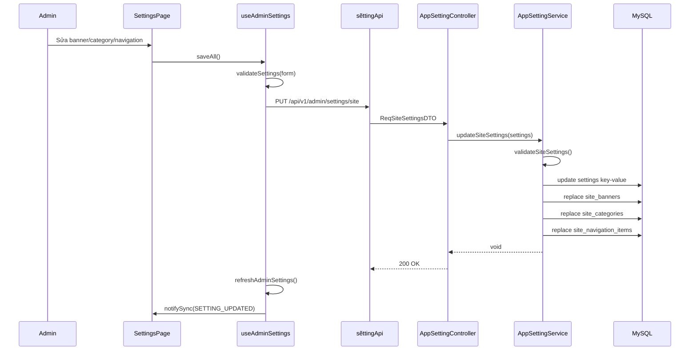

# Phân tích admin dashboard và cấu hình hệ thống - Han Sports v2

Tài liệu này chỉ dựa trên source code trong project Han Sports v2.

## 1. DashboardPage frontend

File chính: `hansport_v2fe/src/pages/admin/DashboardPage.jsx`

Dashboard admin là trang `/admin`, được khai báo trong router:

```jsx
// hansport_v2fe/src/App.jsx
<Route path="/admin" element={<AdminLayout />}>
  <Route index element={<DashboardPage />} />
  ...
</Route>
```

Trang này gửi API summary khi mount:

```jsx
// hansport_v2fe/src/pages/admin/DashboardPage.jsx
useEffect(() => {
  setLoading(true);
  dashboardApi
    .getSummary()
    .then((res) => setSummary(res.data?.data || res.data || DEFAULT_SUMMARY))
    .catch(console.error)
    .finally(() => setLoading(false));
}, []);
```

API wrapper:

```js
// hansport_v2fe/src/api/dashboardApi.js
export const dashboardApi = {
  getSummary: () => axiosInstance.get("/api/v1/admin/dashboard/summary"),
};
```

State mặc định:

```jsx
// hansport_v2fe/src/pages/admin/DashboardPage.jsx
const DEFAULT_SUMMARY = {
  totalProducts: 0,
  totalUsers: 0,
  totalOrders: 0,
  revenueTotal: 0,
  revenueRecent: 0,
  lowStockCount: 0,
  recentOrders: [],
};
```

DashboardPage render các khỏi:

| Component | File | Vai trò |
|---|---|---|
| `AdminPageHeader` | `hansport_v2fe/src/components/admin/AdminPageHeader.jsx` | Tiêu đề trang vì action nhanh |
| `DashboardKpiGrid` | `hansport_v2fe/src/pages/admin/dashboard/DashboardKpiGrid.jsx` | KPI cards |
| `DashboardCharts` | `hansport_v2fe/src/pages/admin/dashboard/DashboardCharts.jsx` | Biểu đồ đơn hàng, doanh thu, top product, status |
| `RecentOrdersTable` | `hansport_v2fe/src/pages/admin/dashboard/RecentOrdersTable.jsx` | Bảng đơn hàng gần đây |
| `DashboardActionCards` | `hansport_v2fe/src/pages/admin/dashboard/DashboardActionCards.jsx` | Link nhanh đến Products, Orders, Users |

Dashboard có cảnh báo tồn kho dựa vào `lowStockCount`:

```jsx
// hansport_v2fe/src/pages/admin/DashboardPage.jsx
const hasOperationalWarning = (summary.lowStockCount || 0) > 0;
```

KPI grid đọc các field từ summary:

```jsx
// hansport_v2fe/src/pages/admin/dashboard/DashboardKpiGrid.jsx
const statCards = [
  { icon: "inventory_2", label: "Tong san pham", value: (summary.totalProducts || 0).toLocaleString("vi-VN") },
  { icon: "receipt_long", label: "Tong don hang", value: (summary.totalOrders || 0).toLocaleString("vi-VN") },
  { icon: "group", label: "Khach hang", value: (summary.totalUsers || 0).toLocaleString("vi-VN") },
  { icon: "payments", label: "Doanh thu", value: formatVND(summary.revenueTotal || 0) },
  { icon: "warning", label: "Sap het hang", value: (summary.lowStockCount || 0).toLocaleString("vi-VN") },
];
```

Charts đọc các list:

- `dailyOrders`
- `monthlyRevenue`
- `topProducts`
- `statusDistribution`

```jsx
// hansport_v2fe/src/pages/admin/dashboard/DashboardCharts.jsx
<DailyOrdersChart data={summary.dailyOrders || []} />
<MonthlyRevenueChart data={summary.monthlyRevenue || []} />
<TopProductsChart data={summary.topProducts || []} />
<OrderStatusChart data={summary.statusDistribution || []} />
```

## 2. DashboardController và DashboardService backend

Controller:

```java
// hansport_v2be/src/main/java/com/javaweb/controller/DashboardController.java
@RestController
@RequestMapping("/api/v1/admin/dashboard")
public class DashboardController {
    @GetMapping("/summary")
    @ApiMessage("get admin dashboard summary")
    public ResponseEntity<ResDashboardSummaryDTO> getSummary() {
        return ResponseEntity.ok(this.dashboardService.getSummary());
    }
}
```

Endpoint thực tế:

| Endpoint | Method | Quyền |
|---|---|---|
| `/api/v1/admin/dashboard/summary` | GET | ADMIN, vì `SecurityConfiguration` match `/api/v1/admin/**` |

Security rule:

```java
// hansport_v2be/src/main/java/com/javaweb/config/SecurityConfiguration.java
.requestMatchers("/api/v1/admin", "/api/v1/admin/**").hasRole("ADMIN")
```

Service:

```java
// hansport_v2be/src/main/java/com/javaweb/service/DashboardService.java
@Transactional(readOnly = true)
public ResDashboardSummaryDTO getSummary() {
    Instant recentBoundary = Instant.now().minus(30, ChronoUnit.DAYS);

    ResDashboardSummaryDTO summary = new ResDashboardSummaryDTO();
    summary.setTotalProducts(this.productRepository.count());
    summary.setTotalUsers(this.userRepository.count());
    summary.setTotalOrders(this.orderRepository.count());
    summary.setRevenueTotal(this.orderRepository.sumTotalPrice());
    summary.setRevenueRecent(this.orderRepository.sumTotalPriceSince(recentBoundary));
    summary.setLowStockCount(this.productRepository.countByQuantityLessThanEqual(5));
    summary.setRecentOrders(this.orderRepository.findTop5ByOrderByCreatedAtDesc().stream()
            .map(this.orderService::convertToResOrderDTO)
            .toList());
```

Repository được dùng:

| Repository | Method | Ý nghĩa |
|---|---|---|
| `ProductRepository` | `count()` | Tổng số product |
| `ProductRepository` | `countByQuantityLessThanEqual(5)` | Product sắp hết hàng |
| `UserRepository` | `count()` | Tổng user |
| `OrderRepository` | `count()` | Tổng order |
| `OrderRepository` | `sumTotalPrice()` | Tổng doanh thu đơn `COMPLETED` |
| `OrderRepository` | `sumTotalPriceSince(recentBoundary)` | Doanh thu `COMPLETED` trong 30 ngày |
| `OrderRepository` | `findTop5ByOrderByCreatedAtDesc()` | 5 đơn mới nhất |
| `OrderRepository` | `findAllByStatusAndCreatedAtBetween(...)` | Doanh thu tổng ngày |
| `OrderRepository` | `findAll()` | Aggregate chart daily/monthly/top/status |

OrderRepository:

```java
// hansport_v2be/src/main/java/com/javaweb/repository/OrderRepository.java
@Query("select coalesce(sum(o.totalPrice), 0) from Order o where o.status = 'COMPLETED'")
long sumTotalPrice();

@Query("select coalesce(sum(o.totalPrice), 0) from Order o where o.status = 'COMPLETED' and o.createdAt >= :createdAt")
long sumTotalPriceSince(Instant createdAt);
```

ProductRepository:

```java
// hansport_v2be/src/main/java/com/javaweb/repository/ProductRepository.java
long countByQuantityLessThanEqual(long quantity);
```

Response DTO:

```java
// hansport_v2be/src/main/java/com/javaweb/domain/response/dashboard/ResDashboardSummaryDTO.java
private long totalProducts;
private long totalUsers;
private long totalOrders;
private long revenueTotal;
private long revenueRecent;
private long lowStockCount;
private List<ResOrderDTO> recentOrders;
private List<DailyRevenue> dailyRevenue;
private List<DailyOrders> dailyOrders;
private List<MonthlyRevenue> monthlyRevenue;
private List<TopProduct> topProducts;
private List<StatusCount> statusDistribution;
```

## 3. Dashboard lấy số liệu gì từ database?

| Nhóm số liệu | Nguồn DB | Điều kiện |
|---|---|---|
| Tổng sản phẩm | `products` | `productRepository.count()` |
| Tổng user | `users` | `userRepository.count()` |
| Tổng order | `orders` | `orderRepository.count()` |
| Doanh thu tổng | `orders.total_price` | Chỉ tính status `COMPLETED` |
| Doanh thu 30 ngày | `orders.total_price`, `orders.created_at` | Status `COMPLETED`, createdAt >= now - 30 days |
| Sắp hết hàng | `products.quantity` | quantity <= 5 |
| Đơn gần đây | `orders` + relation order details/user | top 5 theo `createdAt desc` |
| Doanh thu 7 ngày | `orders` | Service lặp 7 ngày, mỗi ngày query status `COMPLETED` |
| Đơn theo ngày 60 ngày | `orders.created_at` | Aggregate in-memory từ `findAll()` |
| Doanh thu theo tháng | `orders.created_at`, `orders.total_price` | Chỉ status `COMPLETED`, aggregate in-memory |
| Top products | `orders`, `order_detail`, `products` | Chỉ order `COMPLETED`, aggregate quantity |
| Phân bố status | `orders.status` | Aggregate in-memory |

Lưu ý quan trọng: nếu chưa có order nào, service có hard-code dữ liệu mock:

```java
// hansport_v2be/src/main/java/com/javaweb/service/DashboardService.java
if (allOrders.isEmpty()) {
    List<ResDashboardSummaryDTO.DailyOrders> mDailyOrders = new ArrayList<>();
    mDailyOrders.add(new ResDashboardSummaryDTO.DailyOrders("2026-01-01", 1));
    ...
    summary.setDailyOrders(mDailyOrders);
    ...
    if (summary.getTotalOrders() == 0) {
        summary.setTotalOrders(20);
        summary.setRevenueTotal(52000000L);
        summary.setRevenueRecent(52000000L);
    }
}
```

Nghĩa là dashboard hiện tại không hoàn toàn là số liệu DB thật trong trường hợp `orders` rỗng. Đây là Điểm cần cải thiện nếu hệ thống đi vào production.

## 4. SettingsPage frontend

File chính: `hansport_v2fe/src/pages/admin/SettingsPage.jsx`

SettingsPage dùng hook `useAdminSettings`:

```jsx
// hansport_v2fe/src/pages/admin/SettingsPage.jsx
const {
  activeTab,
  setActiveTab,
  form,
  catalogGroups,
  saving,
  uploadingBannerIndex,
  isDirty,
  activeTabDirty,
  isTabDirty,
  updateField,
  updateListItem,
  addListItem,
  removeListItem,
  moveListItem,
  handleBannerUpload,
  saveAll,
  saveCurrentTab,
  handleRevert,
  handleSyncCatalog,
} = useAdminSettings();
```

Tabs:

```js
// hansport_v2fe/src/pages/admin/settings/settingsUtils.js
export const TABS = [
  { key: "banner", label: "Banner", icon: "image" },
  { key: "navigation", label: "Menu", icon: "menu" },
  { key: "catalog", label: "Danh muc", icon: "category" },
  { key: "shipping", label: "Van chuyen", icon: "local_shipping" },
  { key: "contact", label: "Lien he", icon: "call" },
];
```

Metric trên trang:

```jsx
// hansport_v2fe/src/pages/admin/SettingsPage.jsx
const activeSlides = form.slides.filter((slide) => slide.active !== false).length;
const activeNavItems = 3 + form.headerNav.filter((item) => item.active !== false).length;
const totalNavItems = 3 + form.headerNav.length;
```

Nó render các section:

| Tab | Component | Dữ liệu chính |
|---|---|---|
| `banner` | `BannerSettings` | `slides`, upload banner |
| `navigation` | `NavigationSettings` | `headerNav`, catalog groups |
| `catalog` | `CatalogSettings` | `brands`, `targets`, `categories` |
| `shipping` | `ShippingSettings` | `shippingFee`, `freeShipLimit` |
| `contact` | `ContactSettings` | `hotline` |

Hook load settings admin:

```js
// hansport_v2fe/src/pages/admin/settings/useAdminSettings.js
useEffect(() => {
  refreshAdminSettings();
}, [refreshAdminSettings]);
```

Default form lấy từ settings store:

```js
// hansport_v2fe/src/pages/admin/settings/useAdminSettings.js
return {
  hotline: String(readSetting(settings, "HOTLINE", "090 123 4567")),
  shippingFee: String(readSetting(settings, "SHIPPING_FEE", "30000")),
  freeShipLimit: String(readSetting(settings, "FREE_SHIP_LIMIT", "500000")),
  brands: normalizeStringList(readSetting(settings, "BRANDS", ["Yonex", "Victor", "Lining"])),
  targets: normalizeStringList(readSetting(settings, "TARGETS", ["Nam", "Nu", "Unisex"])),
  slides: normalizeSlides(readSetting(settings, "HERO_SLIDES", [])),
  categories: normalizeCategories(readSetting(settings, "CATEGORIES", [])),
  headerNav,
};
```

Payload gửi vì backend:

```js
// hansport_v2fe/src/pages/admin/settings/settingsUtils.js
export function toSitePayload(form) {
  return {
    hotline: form.hotline.trim(),
    shippingFee: Number(form.shippingFee),
    freeShipLimit: Number(form.freeShipLimit),
    brands: normalizeStringList(form.brands),
    targets: normalizeStringList(form.targets),
    heroSlides: normalizeSlides(form.slides),
    categories: normalizeCategories(form.categories),
    headerNav: serializeNavList(form.headerNav),
  };
}
```

Save tất cả:

```js
// hansport_v2fe/src/pages/admin/settings/useAdminSettings.js
await settingApi.updateSiteSettings(toSitePayload(form));
await refreshAdminSettings();
notifySync(syncEvent.SETTING_UPDATED);
```

Save theo tab:

```js
// hansport_v2fe/src/pages/admin/settings/useAdminSettings.js
await settingApi.updateBulkSettings(toTabUpdates(form, activeTab));
await refreshAdminSettings();
notifySync(syncEvent.SETTING_UPDATED);
```

Upload banner:

```js
// hansport_v2fe/src/pages/admin/settings/useAdminSettings.js
const res = await productApi.uploadFile(file, "banner");
const uploaded = res.data?.data?.fileName || res.data?.fileName;
const fileName = Array.isArray(uploaded) ? uploaded[0] : (uploaded || "");
updateListItem("slides", index, "image", fileName);
updateListItem("slides", index, "imageFolder", "banner");
```

## 5. AppSettingController và AppSettingService backend

Controller:

```java
// hansport_v2be/src/main/java/com/javaweb/controller/AppSettingController.java
@RestController
@RequestMapping("/api/v1")
public class AppSettingController {
    @GetMapping("/settings")
    public ResponseEntity<Map<String, String>> getAllSettings() {
        return ResponseEntity.ok(appSettingService.getPublicSettings());
    }

    @PutMapping("/settings/bulk")
    @PreAuthorize("hasRole('ADMIN')")
    public ResponseEntity<Void> updateBulkSettings(@RequestBody @Valid List<@Valid ReqSettingUpdateDTO> updates)
            throws IdInvalidException {
        appSettingService.updateBulkSettings(updates);
        return ResponseEntity.ok().build();
    }

    @GetMapping("/admin/settings")
    @PreAuthorize("hasRole('ADMIN')")
    public ResponseEntity<Map<String, String>> getAdminSettings() {
        return ResponseEntity.ok(appSettingService.getAllSettings());
    }

    @PutMapping("/admin/settings/site")
    @PreAuthorize("hasRole('ADMIN')")
    public ResponseEntity<Void> updateSiteSettings(@RequestBody @Valid ReqSiteSettingsDTO settings)
            throws IdInvalidException {
        appSettingService.updateSiteSettings(settings);
        return ResponseEntity.ok().build();
    }
}
```

Bảng endpoint:

| Endpoint | Method | Quyền | Service |
|---|---|---|---|
| `/api/v1/settings` | GET | Public | `getPublicSettings()` |
| `/api/v1/settings/bulk` | PUT | ADMIN | `updateBulkSettings()` |
| `/api/v1/admin/settings` | GET | ADMIN | `getAllSettings()` |
| `/api/v1/admin/settings/site` | PUT | ADMIN | `updateSiteSettings()` |

Service chỉ cho phép các key sau:

```java
// hansport_v2be/src/main/java/com/javaweb/service/AppSettingService.java
private static final Set<String> ALLOWED_SETTING_KEYS = Set.of(
        "HOTLINE",
        "SHIPPING_FEE",
        "FREE_SHIP_LIMIT",
        "BRANDS",
        "TARGETS",
        "HERO_SLIDES",
        "CATEGORIES",
        "HEADER_NAV"
);
```

Lấy all settings:

```java
// hansport_v2be/src/main/java/com/javaweb/service/AppSettingService.java
public Map<String, String> getAllSettings() {
    List<AppSetting> settings = appSettingRepository.findAll();
    Map<String, String> map = new HashMap<>();
    for (AppSetting s : settings) {
        map.put(s.getSettingKey(), s.getSettingValue());
    }
    putSiteContent(map, false);
    return map;
}
```

Lấy public settings:

```java
// hansport_v2be/src/main/java/com/javaweb/service/AppSettingService.java
public Map<String, String> getPublicSettings() {
    Map<String, String> settings = getAllSettings();
    putSiteContent(settings, true);
    return settings;
}
```

Update site settings ghi cả key-value settings và bảng structured:

```java
// hansport_v2be/src/main/java/com/javaweb/service/AppSettingService.java
@Transactional
public void updateSiteSettings(ReqSiteSettingsDTO settings) throws IdInvalidException {
    validateSiteSettings(settings);

    try {
        updateSetting("HOTLINE", settings.getHotline().trim());
        updateSetting("SHIPPING_FEE", String.valueOf(settings.getShippingFee()));
        updateSetting("FREE_SHIP_LIMIT", String.valueOf(settings.getFreeShipLimit()));
        updateSetting("BRANDS", objectMapper.writeValueAsString(cleanStringList(settings.getBrands())));
        updateSetting("TARGETS", objectMapper.writeValueAsString(cleanStringList(settings.getTargets())));
        updateSetting("HERO_SLIDES", objectMapper.writeValueAsString(settings.getHeroSlides()));
        updateSetting("CATEGORIES", objectMapper.writeValueAsString(settings.getCategories()));
        updateSetting("HEADER_NAV", objectMapper.writeValueAsString(settings.getHeaderNav()));
        replaceBanners(settings.getHeroSlides());
        replaceCategories(settings.getCategories());
        replaceNavigationItems(settings.getHeaderNav());
    } catch (JsonProcessingException ex) {
        throw new IdInvalidException("Settings payload must be valid JSON");
    }
}
```

Khi update tổng key, các key structured cùng đồng bộ sang bảng riêng:

```java
// hansport_v2be/src/main/java/com/javaweb/service/AppSettingService.java
private void updateByKey(String key, String value) throws IdInvalidException {
    switch (key) {
        case "HERO_SLIDES":
            replaceBanners(parseHeroSlides(value));
            updateSetting(key, value);
            break;
        case "CATEGORIES":
            replaceCategories(parseCategories(value));
            updateSetting(key, value);
            break;
        case "HEADER_NAV":
            replaceNavigationItems(parseNavigationItems(value));
            updateSetting(key, value);
            break;
        default:
            updateSetting(key, value);
    }
}
```

## 6. Settings và site_* khác nhau như thế nào?

### 6.1. Bảng `settings`

Entity:

```java
// hansport_v2be/src/main/java/com/javaweb/domain/AppSetting.java
@Entity
@Table(name = "settings")
public class AppSetting {
    @Id
    @GeneratedValue(strategy = GenerationType.IDENTITY)
    private Long id;

    @Column(name = "setting_key", unique = true, nullable = false)
    private String settingKey;

    @Column(name = "setting_value", columnDefinition = "TEXT")
    private String settingValue;

    @Column(name = "description")
    private String description;
}
```

Migration:

```sql
-- hansport_v2be/src/main/resources/db/migration/V1__baseline_schema.sql
CREATE TABLE IF NOT EXISTS settings (
    id BIGINT NOT NULL AUTO_INCREMENT,
    setting_key VARCHAR(255) NOT NULL,
    setting_value TEXT,
    description VARCHAR(255),
    PRIMARY KEY (id),
    UNIQUE KEY uk_settings_setting_key (setting_key)
);
```

Vai trò: lưu cấu hình dạng key-value. Một số value là string thường, một số value là JSON string.

### 6.2. Bảng `site_banners`

Entity:

```java
// hansport_v2be/src/main/java/com/javaweb/domain/SiteBanner.java
@Entity
@Table(name = "site_banners")
public class SiteBanner {
    private String title;
    private String subtitle;
    private String cta;
    private String ctaLink;
    private String image;
    private String imageFolder;
    private String altText;
    private String bg;
    private int sortOrder;
    private boolean active = true;
}
```

Vai trò: lưu banner/hero slides có thứ tự và trạng thái active.

### 6.3. Bảng `site_categories`

```java
// hansport_v2be/src/main/java/com/javaweb/domain/SiteCategory.java
@Entity
@Table(name = "site_categories")
public class SiteCategory {
    private String name;
    private String icon;
    private String path;
    private String color;
    private int sortOrder;
    private boolean active = true;
}
```

Vai trò: lưu category public để hiển thị trên home/menu.

### 6.4. Bảng `site_navigation_items`

```java
// hansport_v2be/src/main/java/com/javaweb/domain/SiteNavigationItem.java
@Entity
@Table(name = "site_navigation_items")
public class SiteNavigationItem {
    private String label;
    private String path;
    private int sortOrder;
    private boolean active = true;
}
```

Vai trò: lưu các item menu tùy biến.

### 6.5. Migration của structured settings

```sql
-- hansport_v2be/src/main/resources/db/migration/V3__site_content_tables.sql
CREATE TABLE IF NOT EXISTS site_banners (...);
CREATE TABLE IF NOT EXISTS site_categories (...);
CREATE TABLE IF NOT EXISTS site_navigation_items (...);
```

## 7. Luồng admin cập nhật banner/category/navigation

### 7.1. Cập nhật full site settings



### 7.2. Upload banner image

Upload banner dùng chung file API:

```js
// hansport_v2fe/src/pages/admin/settings/useAdminSettings.js
const res = await productApi.uploadFile(file, "banner");
...
updateListItem("slides", index, "image", fileName);
updateListItem("slides", index, "imageFolder", "banner");
```

Sau đó admin vẫn phải save settings để lưu fileName vào DB.

## 8. Source of truth hiện tại có rõ không?

Source of truth hiện tại chưa thật sự gọn vì cùng một nội dung structured dạng được lưu ở 2 nội:

| Nội dung | Lưu trong `settings` | Lưu trong bảng structured |
|---|---|---|
| Banner | Key `HERO_SLIDES`, JSON string | `site_banners` |
| Category public | Key `CATEGORIES`, JSON string | `site_categories` |
| Header navigation | Key `HEADER_NAV`, JSON string | `site_navigation_items` |
| Hotline | Key `HOTLINE` | Không có bảng riêng |
| Shipping fee | Key `SHIPPING_FEE` | Không có bảng riêng |
| Free ship limit | Key `FREE_SHIP_LIMIT` | Không có bảng riêng |
| Brands/targets | Key `BRANDS`, `TARGETS` | Không có bảng riêng |

Service đọc structured content từ bảng structured vì put lại vào map settings:

```java
// hansport_v2be/src/main/java/com/javaweb/service/AppSettingService.java
private void putSiteContent(Map<String, String> settings, boolean publicOnly) {
    try {
        putStructuredContent(settings, "HERO_SLIDES", bannerDtos(publicOnly));
        putStructuredContent(settings, "CATEGORIES", categoryDtos(publicOnly));
        putStructuredContent(settings, "HEADER_NAV", navigationDtos(publicOnly));
    } catch (JsonProcessingException ex) {
        throw new IllegalStateException("Unable to serialize site content settings", ex);
    }
}
```

Và chỉ override key nếu list structured không rỗng hoặc key chưa tồn tại:

```java
// hansport_v2be/src/main/java/com/javaweb/service/AppSettingService.java
private void putStructuredContent(Map<String, String> settings, String key, List<?> values)
        throws JsonProcessingException {
    if (!values.isEmpty() || !settings.containsKey(key)) {
        settings.put(key, objectMapper.writeValueAsString(values));
    }
}
```

Kết luận:

- Với `HERO_SLIDES`, `CATEGORIES`, `HEADER_NAV`, bảng structured có tác động lớn hơn khi có dữ liệu.
- `settings` vẫn lưu bản JSON song song.
- Nếu có lúc một trong hai nguồn bị lệch, behavior phụ thuộc vào `putStructuredContent`.
- Do do source of truth chưa thật sự rõ ràng.

## 9. Điểm mạnh module settings

| Điểm mạnh | Bằng chứng |
|---|---|
| Có allowlist key, tránh update tùy tiện | `ALLOWED_SETTING_KEYS` trong `AppSettingService.java` |
| Có validation cả frontend và backend | `validateSettings()` frontend, `validateSetting()`/`validateSiteSettings()` backend |
| Có phần public/admin settings | `/settings` public, `/admin/settings` admin |
| Có active/sort order cho banner/category/nav | `SiteBanner`, `SiteCategory`, `SiteNavigationItem` |
| Update settings được bảo bởi transaction | `@Transactional` trên `updateBulkSettings`, `updateSiteSettings` |
| Public settings có thể chỉ trả active item | `bannerDtos(publicOnly)`, `categoryDtos(publicOnly)`, `navigationDtos(publicOnly)` |

## 10. Điểm cần cải thiện module settings

| Vấn đề | File liên quan | Phân tích | đề xuất |
|---|---|---|---|
| Dashboard có data mock khi DB rỗng | `DashboardService.java` | Khi `orders` rỗng, service set daily/monthly/top/status mock vì ghi đè `totalOrders`, `revenueTotal`, `revenueRecent`. | Bỏ mock ra production; nếu cần demo thì đặt sau feature flag/env. |
| Aggregate dashboard lấy `findAll()` order | `DashboardService.java` | `findAll()` có thể nặng khi order lớn, sau đó aggregate in-memory. | Viết query aggregate theo ngày/tháng/status/top product trong repository. |
| Source of truth settings bị dual-write | `AppSettingService.java`, `settings`, `site_*` | Banner/category/nav được lưu cả JSON trong `settings` và row trong bảng structured. | Chọn 1 source chính: structured tables cho content list, `settings` chỉ lưu scalar settings. |
| `replaceBanners/categories/navigationItems` xóa toàn bộ rồi save lại | `AppSettingService.java` | Cách này đơn gian nhưng mất id cũ, createdAt cũ, vì có thể gây khó quản lý audit. | Update theo id/uuid hoặc dùng natural key + sort order. |
| Không có audit admin update settings riêng | `AppSettingService.java` | Entity site_* có createdAt/updatedAt nhưng không có createdBy/updatedBy, settings không update timestamp. | Thêm audit fields vì log history cho thay đổi quan trọng. |
| DTO banner thìếu validation annotation cho image | `ReqSiteSettingsDTO.java` | Backend có manual validation image not blank, nhưng DTO annotation chưa thể hiện hết contract. | Bổ sung annotation hoặc nested custom validator để contract rõ hơn. |
| Frontend comments/text bị lỗi encoding trong một số file | Nhiều file `DashboardPage.jsx`, `SettingsPage.jsx` | Source hiển thị tiếng Vìệt bị mojibake trong output terminal. | Chuẩn hóa UTF-8 vì kiểm tra editor encoding. |

## 11. Kết luận

Admin dashboard/settings trong Han Sports v2 đã có đủ luồng từ frontend đến backend:

- Dashboard frontend gửi `/api/v1/admin/dashboard/summary`.
- Backend tổng hợp product/user/order/revenue/stock/recent orders.
- Settings frontend quản lý banner, navigation, catalog, shipping, contact.
- Backend lưu settings vào `settings` và các bảng structured `site_banners`, `site_categories`, `site_navigation_items`.

Điểm cần ưu tiên là bỏ data mock trong dashboard production, tối ưu query aggregate, và làm rõ source of truth cho structured site content.
