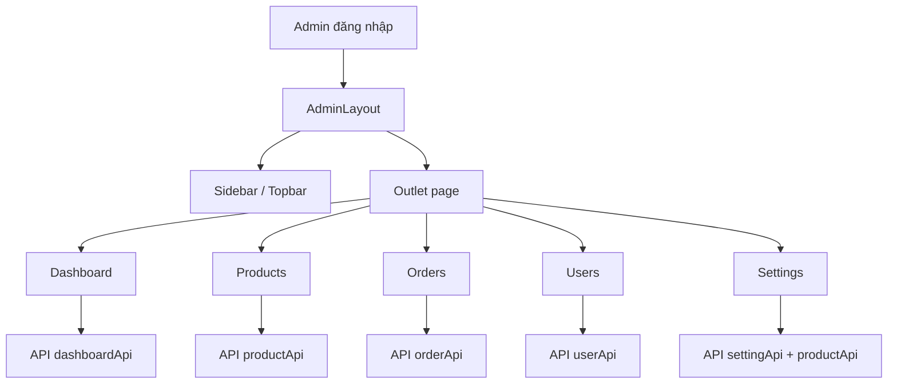

# Phân tích giao diện Admin Han Sports v2 để lập kế hoạch nâng cấp

Tài liệu này mô tả hiện trạng giao diện quản trị của Han Sports v2 dựa trên source code frontend hiện tại. Mục tiêu là cung cấp đầu vào rõ ràng để yêu cầu ChatGPT hoặc một công cụ AI khác viết kế hoạch nâng cấp UI/UX admin.

Phạm vi phân tích tập trung vào frontend admin:

- `hansport_v2fe/src/layouts/AdminLayout.jsx`
- `hansport_v2fe/src/pages/admin/DashboardPage.jsx`
- `hansport_v2fe/src/pages/admin/ProductsPage.jsx`
- `hansport_v2fe/src/pages/admin/OrdersAdminPage.jsx`
- `hansport_v2fe/src/pages/admin/UsersPage.jsx`
- `hansport_v2fe/src/pages/admin/SettingsPage.jsx`
- `hansport_v2fe/src/components/admin/*`

## 1. Tổng quan hiện trạng

Admin UI hiện tại đã đạt mức MVP/portfolio khá tốt về mặt chức năng. Hệ thống có layout riêng cho admin, sidebar, topbar, route guard, dashboard, quản lý sản phẩm, đơn hàng, người dùng và cấu hình website.

Tuy nhiên, UI vẫn chưa đạt cảm giác của một hệ thống quản trị thương mại điện tử hiện đại vì còn nhiều thao tác thủ công, form dài, bảng dữ liệu dày, thiếu bộ lọc nâng cao, thiếu flow theo tác vụ, thiếu trạng thái hướng dẫn rõ ràng, và design system chưa được áp dụng đồng nhất trên toàn admin.

Đánh giá tổng thể:

| Khu vực | Mức hiện tại | Nhận xét |
|---|---|---|
| Admin layout | Khá | Có desktop sidebar và mobile drawer, nhưng visual còn đơn giản, chưa có app shell hiện đại |
| Dashboard | Khá | Có metric, chart SVG tự viết, recent orders, quick actions |
| Products | Khá tốt về chức năng | Có CRUD, bulk delete, upload nhiều ảnh, import Excel/CSV, nhưng form quá dài và còn nhiều logic tự động/random chưa phù hợp sản phẩm thực tế |
| Orders | Khá | Có filter status, bảng, panel chi tiết, update trạng thái, gửi email khi processing |
| Users | Khá | Có CRUD, phân quyền, chặn xóa tài khoản đang đăng nhập ở UI |
| Settings | Trung bình-khá | Có tab, preview, upload banner, sync catalog, validation; nhưng vẫn rất thủ công và khó dùng nếu dữ liệu lớn |
| Component dùng chung | Trung bình | Có `DataTable`, `FormModal`, `AdminToolbar`, `AdminMetricCard`, nhưng chưa đủ mạnh như một admin design system thực thụ |
| Responsive | Có nhưng chưa sâu | Layout tránh vỡ cơ bản, nhưng table/mobile UX chưa tối ưu |
| Accessibility | Có nền tảng | Modal có `role="dialog"`, icon button có label, nhưng focus trap, keyboard flow, aria states còn thiếu |

## 2. Kiến trúc UI Admin hiện tại

Admin được tổ chức theo kiến trúc page-based React:

```text
hansport_v2fe/src/
├── layouts/
│   └── AdminLayout.jsx
├── pages/admin/
│   ├── DashboardPage.jsx
│   ├── ProductsPage.jsx
│   ├── OrdersAdminPage.jsx
│   ├── UsersPage.jsx
│   └── SettingsPage.jsx
└── components/admin/
    ├── AdminMetricCard.jsx
    ├── AdminPageHeader.jsx
    ├── AdminToolbar.jsx
    ├── DataTable.jsx
    ├── EmptyState.jsx
    ├── FormModal.jsx
    ├── IconButton.jsx
    ├── Pagination.jsx
    ├── ProductImportPanel.jsx
    └── StatusBadge.jsx
```

Luồng tổng quát:



Điểm tốt:

- Tách admin khỏi client bằng `AdminLayout`.
- Các trang admin có cấu trúc tương đối nhất quán: page header, metric cards, toolbar, data table, modal.
- Đã bắt đầu có component dùng chung.
- Đã có responsive drawer cho admin trên màn hình nhỏ.

Điểm chưa tốt:

- Mỗi page vẫn tự xử lý nhiều logic UI riêng, chưa có pattern nhất quán cho filter, sort, column visibility, drawer detail, modal form, batch action.
- `SettingsPage.jsx` rất lớn, chứa nhiều component con và logic validation trong cùng một file.
- UI vẫn thiên về “form CRUD” hơn là “workflow quản trị e-commerce”.

## 3. Phân tích AdminLayout

File: `hansport_v2fe/src/layouts/AdminLayout.jsx`

Thành phần chính:

- `NAV_ITEMS`
- `AdminLayout`
- `DesktopSidebar`
- `SidebarContent`

Chức năng hiện tại:

- Kiểm tra user đã đăng nhập.
- Kiểm tra quyền admin bằng `isAdmin()`.
- Điều hướng người không đủ quyền về `/` hoặc `/login`.
- Desktop có sidebar trái cố định.
- Mobile/tablet có drawer menu mở bằng nút hamburger.
- Topbar hiển thị tên trang hiện tại, ngày hiện tại và link xem trang khách.

Điểm tốt:

- Có route guard rõ ràng.
- Sidebar có trạng thái active theo route.
- Drawer mobile có `role="dialog"` và `aria-modal`.
- Có thông tin user ở cuối sidebar.

Hạn chế:

- Sidebar đang dùng nền đậm đơn giản, chưa ăn nhập với phong cách glassmorphism/client mới.
- Topbar khá basic, chưa có breadcrumb, search command, notification, hoặc quick action.
- Drawer chưa thể hiện focus trap và close bằng ESC trong chính layout.
- Không có trạng thái thu gọn sidebar ở desktop.
- Không có badge thông báo như số đơn chờ xử lý, sản phẩm hết hàng.

Gợi ý nâng cấp:

- Biến admin thành app shell hiện đại: sidebar có collapsed mode, topbar có breadcrumb, quick search, notification, profile menu.
- Thêm badge động cho nav: đơn chờ xử lý, sản phẩm sắp hết hàng.
- Thêm page-level command palette hoặc quick action search.
- Đồng bộ visual với brand mới nhưng giữ admin gọn, ít hiệu ứng hơn client.

## 4. Phân tích Dashboard

File: `hansport_v2fe/src/pages/admin/DashboardPage.jsx`

Thành phần chính:

- `DashboardPage`
- `StatCard`
- `DailyOrdersChart`
- `MonthlyRevenueChart`
- `TopProductsChart`
- `OrderStatusChart`

Chức năng hiện tại:

- Gọi `dashboardApi.getSummary()`.
- Hiển thị tổng sản phẩm, tổng đơn, tổng user, doanh thu, low stock.
- Hiển thị trạng thái vận hành.
- Có chart đơn theo ngày, doanh thu theo tháng, top sản phẩm, phân bổ trạng thái đơn hàng.
- Có bảng đơn hàng gần đây.
- Có quick actions sang products/orders/users.

Điểm tốt:

- Dashboard đã dùng API tổng hợp từ backend, không còn tự tính hoàn toàn ở frontend.
- Có nhiều tín hiệu vận hành cần thiết cho admin.
- Chart tự viết bằng SVG, không cần thêm dependency.
- Có loading skeleton.

Hạn chế:

- Chart tự viết giúp nhẹ dependency nhưng khó maintain, khó tooltip/legend/interaction chuẩn.
- Metric cards chưa cho phép drill-down trực tiếp theo bộ lọc, ví dụ click “Sắp hết hàng” để sang products với filter tồn kho thấp.
- Chưa có khoảng thời gian lựa chọn: hôm nay, 7 ngày, 30 ngày, tháng này.
- Chưa có alert/action list kiểu “cần xử lý ngay”.
- Chưa có so sánh tăng/giảm so với kỳ trước.
- Một số status label đang group chưa thật rõ, ví dụ `SHIPPING` được dịch cùng nhóm với “Đang xử lý” trong chart.

Gợi ý nâng cấp:

- Chuyển dashboard thành operational dashboard:
  - hàng đầu: alert cards cần xử lý ngay;
  - hàng hai: KPI có trend;
  - hàng ba: charts;
  - hàng bốn: recent activity.
- Cho phép chọn date range.
- Cho metric click-through sang module tương ứng với filter sẵn.
- Chuẩn hóa trạng thái đơn hàng trong chart.

## 5. Phân tích Products Admin

File: `hansport_v2fe/src/pages/admin/ProductsPage.jsx`

Thành phần chính:

- `ProductsPage`
- form thêm/sửa sản phẩm trong `FormModal`
- upload ảnh nhiều file
- import Excel/CSV bằng `ProductImportPanel`
- bulk delete

Chức năng hiện tại:

- Gọi `productApi.getAll({ page, size, includeInactive, q })`.
- Hiển thị danh sách sản phẩm dạng table.
- Search theo keyword.
- Thêm/sửa/xóa sản phẩm.
- Chọn nhiều sản phẩm để xóa hàng loạt.
- Upload nhiều ảnh, giới hạn `MAX_PRODUCT_IMAGES = 8`.
- Đặt ảnh chính bằng cách đưa ảnh lên đầu mảng.
- Import Excel/CSV có dry run và apply.
- Nhập mô tả chi tiết từ file TXT/Markdown.
- Cho nhập màu sắc và size dạng text tách bằng dấu phẩy.

Điểm tốt:

- Chức năng sản phẩm nhiều hơn mức CRUD cơ bản.
- Có quản lý ảnh nhiều ảnh.
- Có import dữ liệu sản phẩm, rất phù hợp project e-commerce.
- Có hiển thị giá gốc bị gạch nếu `originalPrice > price`.
- Có hỗ trợ `active` để ẩn/hiện sản phẩm.
- Có trạng thái sản phẩm hết hàng/sắp hết hàng ở metric.

Hạn chế lớn:

- Form sản phẩm quá dài, dễ gây mệt cho admin.
- Màu sắc và size đang là text input, không đủ chuẩn cho sản phẩm có biến thể thật.
- Gallery ảnh chưa được quản lý theo biến thể màu. Hiện ảnh là một danh sách chung, UI client phải suy luận bằng tên file để lọc theo màu.
- Logic tự sinh SKU, giá gốc, màu, size bằng random nằm trong `handleSave`. Điều này không phù hợp dự án thực tế vì dữ liệu sản phẩm phải minh bạch, có kiểm soát.
- Table chưa có filter nâng cao theo category, brand, active, stock status, price range.
- Chưa có sort columns.
- Chưa có column density hoặc column visibility.
- Bulk action mới chỉ có delete, chưa có bulk active/inactive, bulk category, bulk stock.
- Không có form validation hiển thị gần input; chủ yếu dựa vào HTML required và toast.
- Không có autosave draft.
- Không có preview sản phẩm trước khi lưu.

Gợi ý nâng cấp:

- Tách form sản phẩm thành tabs:
  - Thông tin cơ bản;
  - Giá & tồn kho;
  - Phân loại/biến thể;
  - Hình ảnh;
  - Mô tả;
  - SEO/hiển thị.
- Thay text input màu/size bằng variant editor:
  - màu có tên, thumbnail, giá, tồn kho;
  - size có danh sách riêng;
  - gallery ảnh gắn theo màu.
- Bỏ logic random khỏi UI admin. Nếu cần auto-generate SKU thì dùng nút rõ ràng “Tạo SKU”.
- Thêm filter panel.
- Thêm quick edit trong table cho active, stock, price.
- Thêm preview drawer hoặc preview route.

## 6. Phân tích ProductImportPanel

File: `hansport_v2fe/src/components/admin/ProductImportPanel.jsx`

Chức năng hiện tại:

- Chọn file `.xlsx` hoặc `.csv`.
- Gọi `productApi.importProducts(file, dryRun)`.
- Dry run hiển thị báo cáo.
- Nếu không lỗi thì cho import thật.
- Hiển thị summary: tổng dòng, hợp lệ, lỗi, tạo mới, cập nhật.
- Hiển thị 8 dòng preview đầu.

Điểm tốt:

- Có dry run trước khi ghi database.
- Có report lỗi/cảnh báo.
- Quy trình kiểm tra rồi mới import là đúng hướng.

Hạn chế:

- Chưa có tải file template mẫu.
- Chưa có mapping cột nếu file khác tên cột.
- Preview chỉ 8 dòng, chưa có phân trang report.
- Error/warning hiển thị ngắn, chưa hỗ trợ export report lỗi.
- Chưa có hướng dẫn format dữ liệu ngay trong modal.
- Chưa có kiểm tra ảnh theo biến thể/màu/size ở UI.

Gợi ý nâng cấp:

- Thêm bước wizard 3 bước: Upload file → Kiểm tra/mapping → Import.
- Có nút tải template.
- Cho export lỗi ra CSV.
- Hiển thị rõ các cột bắt buộc.
- Nếu hỗ trợ biến thể, template cần có sheet riêng cho variants/images.

## 7. Phân tích Orders Admin

File: `hansport_v2fe/src/pages/admin/OrdersAdminPage.jsx`

Chức năng hiện tại:

- Gọi `orderApi.getAllOrders({ page, size, filter })`.
- Filter theo status.
- Table đơn hàng.
- Click row để mở panel chi tiết bên phải.
- Update trạng thái đơn hàng.
- Khi trạng thái chuyển sang `PROCESSING`, gọi `orderApi.sendOrderEmail(order.id)`.
- Xóa đơn hàng bằng confirm dialog.
- Hiển thị sản phẩm trong đơn, màu, size, số lượng, giá.

Điểm tốt:

- Có master-detail layout: table + panel chi tiết.
- Có trạng thái đơn hàng rõ.
- Có quick metric đầu trang.
- Có xử lý gửi email sau khi đổi trạng thái.
- Có confirm khi xóa.

Hạn chế:

- Luồng trạng thái chưa được ràng buộc theo workflow thực tế. Admin có thể chọn trực tiếp các trạng thái bất kỳ.
- Gửi email bị gắn trực tiếp với status `PROCESSING`, chưa có UI rõ là email nào sẽ được gửi.
- Không có timeline đơn hàng.
- Không có filter theo ngày, khách hàng, số điện thoại, tổng tiền.
- Không có search mã đơn.
- Không có in hóa đơn, xuất đơn, ghi chú nội bộ.
- Xóa đơn hàng trong admin thực tế thường không nên là xóa cứng; nên chuyển thành cancel/archive.
- Panel chi tiết nhỏ, nếu đơn có nhiều sản phẩm sẽ khó xem.

Gợi ý nâng cấp:

- Thêm order workflow:
  - PENDING → CONFIRMED → PROCESSING → SHIPPING → COMPLETED;
  - CANCELLED chỉ ở một số bước.
- Hiển thị timeline/trạng thái lịch sử.
- Thêm search/filter nâng cao.
- Thêm action rõ: xác nhận, in hóa đơn, gửi lại email, hủy đơn.
- Thay delete bằng archive/cancel nếu backend hỗ trợ.

## 8. Phân tích Users Admin

File: `hansport_v2fe/src/pages/admin/UsersPage.jsx`

Chức năng hiện tại:

- Gọi `userApi.getAll({ page, size, filter })`.
- Search theo tên/email.
- Thêm/sửa/xóa user.
- Chọn role USER/ADMIN.
- Chặn xóa tài khoản đang đăng nhập ở UI.
- Hiển thị metric: tổng tài khoản, admin trang này, user trang này, tài khoản hiện tại.

Điểm tốt:

- Có self-delete guard ở UI.
- Có form thêm/sửa.
- Có badge role.
- Có avatar chữ cái.

Hạn chế:

- Search filter đang build string trực tiếp ở frontend, cần chắc backend xử lý an toàn.
- Chưa có filter theo role.
- Chưa có trạng thái active/locked.
- Chưa có reset password flow riêng.
- Chưa có audit/log hoạt động admin.
- Chưa có phân quyền chi tiết hơn ADMIN/USER.
- Form user khá đơn giản, chưa có validate rõ từng field.

Gợi ý nâng cấp:

- Thêm role filter.
- Thêm trạng thái tài khoản: active, locked, banned nếu backend hỗ trợ.
- Tách “đổi role” thành action có confirm.
- Thêm reset password hoặc force logout nếu cần.
- Thêm audit trail cho các hành động nhạy cảm.

## 9. Phân tích Settings Admin

File: `hansport_v2fe/src/pages/admin/SettingsPage.jsx`

Đây là trang cần nâng cấp nhiều nhất về UX.

Chức năng hiện tại:

- Quản lý các nhóm cấu hình:
  - Banner;
  - Menu;
  - Catalog;
  - Vận chuyển;
  - Liên hệ.
- Đọc settings từ `useSettingStore`.
- Gọi `refreshAdminSettings()`.
- Đồng bộ catalog từ `productApi.getNavigation()`.
- Có dirty state cho toàn form và từng tab.
- Có cảnh báo rời trang khi chưa lưu.
- Có lưu toàn bộ hoặc lưu tab hiện tại.
- Banner có upload ảnh, preview ảnh, bật/tắt, sắp xếp, xóa.
- Navigation tách menu hệ thống và liên kết bổ sung.
- Catalog có sync từ database, chỉnh brand, target, category, icon, màu, path.
- Shipping chỉnh phí ship và mức freeship.
- Contact chỉnh hotline.
- Có validation trước khi lưu.

Điểm tốt:

- Đã có tab/section rõ ràng.
- Có preview side panel.
- Có dirty indicator.
- Có save current tab và save all.
- Có sync catalog từ sản phẩm.
- Có upload banner thật.
- Có validation cho path, banner, shipping, hotline.

Vì sao vẫn cảm giác thủ công:

- Admin vẫn phải nhập thủ công nhiều thông tin route, icon, color class.
- Color picker đang chọn class Tailwind chứ không phải semantic theme token dễ hiểu.
- Icon picker hiển thị tên icon text, chưa có preview trực quan đủ tốt.
- Banner chỉ quản lý danh sách ảnh và route, chưa có drag/drop thật, crop/ratio hint, schedule, device-specific image.
- Menu đang bị chia giữa menu hệ thống và menu bổ sung, nhưng UX chưa giải thích đủ rõ “cái gì sửa được, cái gì không”.
- Catalog vừa lấy từ database vừa cho cấu hình thủ công, dễ gây nhầm giữa “danh mục thật” và “danh mục hiển thị”.
- Không có revision history, preview full page, hoặc publish/draft mode.
- Không có cấu hình SEO, social links, footer links, policy links, store info.
- File `SettingsPage.jsx` chứa quá nhiều component và helper trong một file, khó mở rộng.

Gợi ý nâng cấp:

- Chuyển Settings thành “Site Builder nhẹ”:
  - Banner manager;
  - Header/menu manager;
  - Home category shortcuts;
  - Shipping/contact;
  - Footer/store info.
- Tách `SettingsPage.jsx` thành nhiều file:
  - `settings/BannerSettings.jsx`;
  - `settings/NavigationSettings.jsx`;
  - `settings/CatalogSettings.jsx`;
  - `settings/ShippingSettings.jsx`;
  - `settings/ContactSettings.jsx`;
  - `settings/components/*`.
- Với banner:
  - chỉ giữ ảnh + click URL nếu client không còn overlay text;
  - thêm drag/drop reorder;
  - thêm preview desktop/mobile;
  - thêm validation kích thước ảnh khuyến nghị;
  - thêm fallback khi ảnh mất trong Docker volume.
- Với catalog:
  - phân biệt rõ `Product categories from database` và `Homepage category shortcuts`;
  - category shortcut nên chọn từ dropdown category thật thay vì gõ tên/path;
  - route tự sinh theo category.
- Với navigation:
  - menu chính nên có preset, ít nhập thủ công;
  - brand mega dropdown lấy từ database.
- Thêm “Preview site” mở trang khách ở route tương ứng.

## 10. Phân tích component dùng chung

### DataTable

File: `hansport_v2fe/src/components/admin/DataTable.jsx`

Điểm tốt:

- Có loading skeleton.
- Có empty state.
- Có pagination.
- Có frame tùy chọn.
- Bọc table bằng `overflow-x-auto`.

Hạn chế:

- Chưa có column sorting.
- Chưa có sticky header.
- Chưa có row density.
- Chưa có column visibility.
- Chưa có mobile card fallback.
- Chưa có row selection pattern tích hợp.
- Chưa có server-side filter/sort contract rõ.

### FormModal

File: `hansport_v2fe/src/components/admin/FormModal.jsx`

Điểm tốt:

- Có dialog role, aria modal, aria labelledby.
- Có close button.
- Có ESC handler.
- Có sticky header.

Hạn chế:

- ESC chỉ hoạt động khi focus đang nằm trong modal; chưa có global key listener.
- Chưa có focus trap.
- Chưa restore focus về nút mở modal.
- Chưa click overlay để đóng.
- Nội dung modal form sản phẩm dài, scroll trong modal gây mệt.

### AdminMetricCard, AdminToolbar, AdminPageHeader

Điểm tốt:

- Giúp các page có pattern thống nhất.
- Dễ scan số liệu.

Hạn chế:

- Chưa có variant đủ phong phú cho warning/actionable metric.
- Chưa có click-through behavior.
- Toolbar còn là container đơn giản, chưa chuẩn hóa filter/search/action layout.

## 11. Đánh giá mức độ hiện đại của Admin UI

| Tiêu chí | Hiện trạng | Mức đạt |
|---|---|---|
| CRUD cơ bản | Có đầy đủ ở products/users/orders | Tốt |
| Dashboard vận hành | Có summary, charts, recent orders | Khá |
| Data table chuyên nghiệp | Có bảng, skeleton, pagination | Trung bình |
| Filter/search nâng cao | Có search/status đơn giản | Trung bình-thấp |
| Form UX | Có modal form nhưng dài | Trung bình |
| Media management | Có upload nhiều ảnh, banner upload | Khá nhưng thiếu quản lý theo biến thể |
| Settings/site management | Có tab/preview/validation | Khá nhưng thủ công |
| Responsive admin | Có drawer/table overflow | Trung bình |
| Accessibility | Có nhãn cơ bản | Trung bình-thấp |
| Design system | Có component nền | Trung bình |
| Workflow thực tế | Chưa đầy đủ | Trung bình-thấp |
| Tính “production admin” | Chưa đạt | Cần nâng cấp |

Kết luận: Admin UI hiện tại phù hợp mức MVP/portfolio, nhưng để giống một project e-commerce thực thụ cần nâng cấp theo hướng workflow, design system, data table nâng cao và media/product variant management.

## 12. Vấn đề ưu tiên khi nâng cấp

### P0 - Làm sạch và ổn định trải nghiệm admin

- Sửa triệt để text encoding/mojibake nếu còn xuất hiện trong UI thực tế.
- Chuẩn hóa app shell admin: sidebar, topbar, page spacing, typography.
- Chuẩn hóa table, empty state, loading state, button, modal.
- Loại bỏ logic random dữ liệu khỏi `ProductsPage`.
- Đảm bảo upload ảnh/banner có feedback rõ và fallback khi file mất.

### P1 - Nâng cấp workflow sản phẩm

- Tách form sản phẩm thành nhiều tab/step.
- Thêm filter nâng cao cho product table.
- Thêm variant editor cho màu/size/ảnh.
- Thêm preview sản phẩm trước khi lưu.
- Thêm bulk active/inactive và bulk category.

### P2 - Nâng cấp settings thành site manager

- Tách `SettingsPage.jsx` thành module nhỏ.
- Banner manager: ảnh + link, preview desktop/mobile, drag/drop reorder.
- Catalog manager: chọn từ danh mục thật thay vì nhập route thủ công.
- Navigation manager: preset menu, brand/category dropdown tự sinh.
- Thêm footer/store info/social/policy nếu client có dùng.

### P3 - Nâng cấp dashboard và orders

- Dashboard có date range, trend, action cards.
- Orders có workflow ràng buộc, timeline, search mã đơn/sđt, filter ngày.
- Thêm export/invoice/print nếu cần.

### P4 - Nâng cấp accessibility và maintainability

- Focus trap modal.
- Keyboard navigation tốt hơn.
- `aria-live` cho toast/status nếu cần.
- Tách page lớn thành component nhỏ.
- Chuẩn hóa hook fetch/pagination/filter.

## 13. Đề xuất cấu trúc admin UI sau nâng cấp

```text
src/
├── layouts/
│   └── AdminLayout.jsx
├── components/admin/
│   ├── shell/
│   │   ├── AdminSidebar.jsx
│   │   ├── AdminTopbar.jsx
│   │   └── AdminBreadcrumb.jsx
│   ├── table/
│   │   ├── AdminDataTable.jsx
│   │   ├── TableToolbar.jsx
│   │   ├── TableFilters.jsx
│   │   └── BulkActionBar.jsx
│   ├── form/
│   │   ├── AdminModal.jsx
│   │   ├── FormSection.jsx
│   │   ├── FieldError.jsx
│   │   └── ImageUploader.jsx
│   └── feedback/
│       ├── EmptyState.jsx
│       ├── LoadingState.jsx
│       └── ConfirmDialog.jsx
├── pages/admin/
│   ├── dashboard/
│   ├── products/
│   ├── orders/
│   ├── users/
│   └── settings/
```

Không nên làm kiến trúc quá phức tạp. Mục tiêu là tách theo vùng UI đang phình to, không rewrite toàn bộ.

## 14. Prompt mẫu để đưa cho ChatGPT viết plan nâng cấp

Bạn có thể copy nguyên đoạn dưới đây:

```text
Bạn là Senior Frontend Engineer và Product UI/UX Designer. Hãy đọc bản phân tích hiện trạng Admin UI Han Sports v2 dưới đây và viết một implementation plan chi tiết để nâng cấp giao diện admin thành một dashboard e-commerce hiện đại.

Yêu cầu:
- Không rewrite toàn bộ project.
- Không đổi framework: vẫn dùng React, Vite, Tailwind CSS.
- Ưu tiên nâng cấp UI/UX và maintainability frontend.
- Không thêm backend mới trừ khi thật sự cần, nếu cần thì ghi rõ API nào cần bổ sung.
- Không làm quá phức tạp so với quy mô portfolio/MVP.
- Chia task theo phase P0/P1/P2/P3.
- Mỗi task phải có:
  - mục tiêu;
  - file cần chỉnh;
  - bước triển khai;
  - acceptance criteria;
  - test/QA cần chạy;
  - suggested commit message.
- Ưu tiên trước:
  1. Chuẩn hóa admin shell và design system.
  2. Nâng ProductsPage vì đây là module phức tạp nhất.
  3. Nâng SettingsPage vì hiện còn thủ công.
  4. Nâng Orders workflow.
  5. Nâng Dashboard analytics.

Bối cảnh source code:
- Admin layout: `hansport_v2fe/src/layouts/AdminLayout.jsx`
- Dashboard: `hansport_v2fe/src/pages/admin/DashboardPage.jsx`
- Products: `hansport_v2fe/src/pages/admin/ProductsPage.jsx`
- Orders: `hansport_v2fe/src/pages/admin/OrdersAdminPage.jsx`
- Users: `hansport_v2fe/src/pages/admin/UsersPage.jsx`
- Settings: `hansport_v2fe/src/pages/admin/SettingsPage.jsx`
- Admin components: `hansport_v2fe/src/components/admin/*`

Hiện trạng chính:
- Admin đã có sidebar, mobile drawer, dashboard, CRUD products/users/orders, import sản phẩm, upload ảnh, settings tab có preview.
- ProductsPage có form dài, nhập màu/size bằng text, ảnh chưa quản lý theo biến thể, còn logic random SKU/giá/màu/size trong UI.
- SettingsPage có nhiều logic trong một file, vẫn thủ công ở route/icon/color/category, cần tách thành site manager nhẹ.
- DataTable chưa có sort/filter nâng cao, sticky header, mobile card fallback, column visibility.
- FormModal chưa có focus trap/restore focus.
- Dashboard có charts tự viết nhưng thiếu date range, trend, drill-down.
- Orders có update status nhưng chưa có workflow/timeline/search/filter nâng cao.

Hãy viết plan nâng cấp thực tế, chia PR nhỏ, có thứ tự phụ thuộc rõ ràng và không đề xuất thư viện nặng nếu không cần.
```

## 15. Kết luận ngắn

Admin UI Han Sports v2 hiện đã có nền chức năng tốt cho portfolio, nhưng để “trông như project thật” cần chuyển từ CRUD form rời rạc sang admin console có design system và workflow rõ ràng.

Nên ưu tiên nâng:

1. Admin shell và component system.
2. Products management.
3. Settings/site manager.
4. Orders workflow.
5. Dashboard analytics.

Không nên ưu tiên thêm nhiều tính năng mới trước khi làm sạch trải nghiệm quản trị hiện tại.
