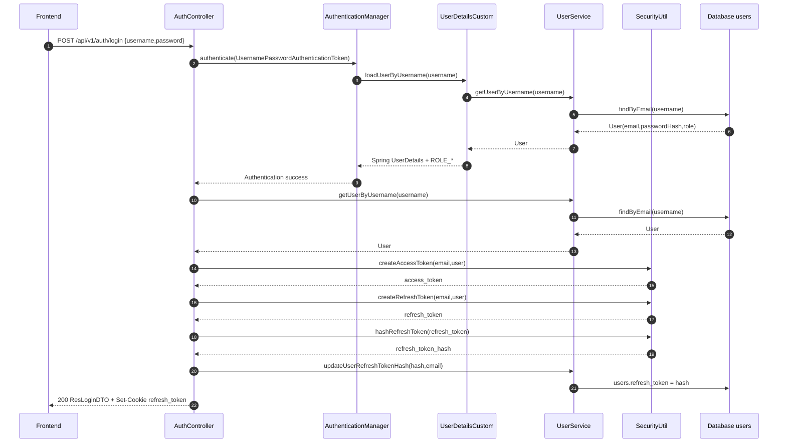
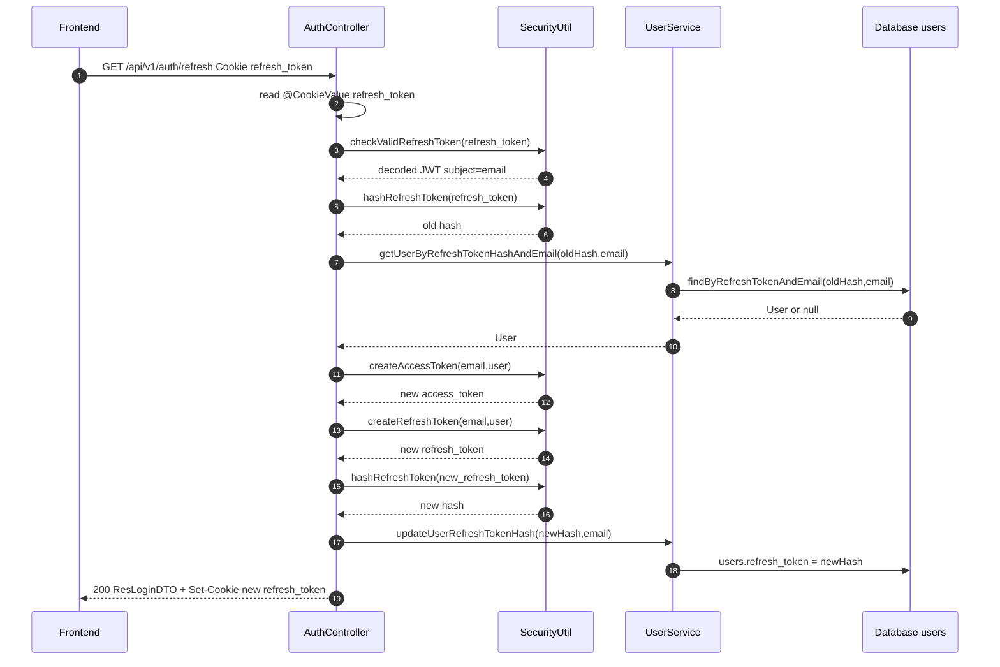

# Phân tích authentication và authorization - Han Sports v2

Tài liệu này phân tích chức năng authentication/authorization trong backend Spring Boot `hansport_v2be`.
Nguồn code đã đọc:

- `hansport_v2be/src/main/java/com/javaweb/controller/AuthController.java`
- `hansport_v2be/src/main/java/com/javaweb/config/SecurityConfiguration.java`
- `hansport_v2be/src/main/java/com/javaweb/util/SecurityUtil.java`
- `hansport_v2be/src/main/java/com/javaweb/service/UserService.java`
- `hansport_v2be/src/main/java/com/javaweb/config/UserDetailsCustom.java`
- `hansport_v2be/src/main/java/com/javaweb/config/AuthRateLimitFilter.java`
- `hansport_v2be/src/main/java/com/javaweb/config/CorsConfig.java`
- `hansport_v2be/src/main/java/com/javaweb/config/CustomAuthenticationEntryPoint.java`
- `hansport_v2be/src/main/java/com/javaweb/service/GoogleTokenVerifierService.java`
- Các DTO trong `hansport_v2be/src/main/java/com/javaweb/domain/request` và `domain/response`

## 1. Tổng quan cơ chế auth

Backend dùng Spring Security theo kiểu stateless REST API:

- đăng nhập local bằng email/password qua `AuthenticationManagerBuilder`.
- Password được hash bằng `BCryptPasswordEncoder`.
- Access token là JWT HS512, trả về trong response body.
- Refresh token cũng là JWT HS512, đặt trong cookie `refresh_token`.
- Refresh token chỉ được lưu trong DB dưới dạng HMAC hash, không lưu raw token.
- Authorization dựa trên claim `roles` trong JWT, ví dụ `ROLE_ADMIN`, `ROLE_USER`.
- Spring OAuth2 Resource Server decode bearer token từ header `Authorization: Bearer <token>`.
- Session server-side bị tắt: `SessionCreationPolicy.STATELESS`.
- Form login bị tắt.

Trích security config:

```java
http
        .csrf(c -> c.disable())
        .cors(Customizer.withDefaults())
        .authorizeHttpRequests(authz -> authz
                ...
                .anyRequest().authenticated())
        .oauth2ResourceServer((oauth2) -> oauth2.jwt(jwt -> jwt.jwtAuthenticationConverter(jwtAuthenticationConverter()))
                .authenticationEntryPoint(customAuthenticationEntryPoint))
        .formLogin(f -> f.disable())
        .sessionManagement(session -> session.sessionCreationPolicy(SessionCreationPolicy.STATELESS))
        .addFilterBefore(authRateLimitFilter, UsernamePasswordAuthenticationFilter.class);
```

File: `hansport_v2be/src/main/java/com/javaweb/config/SecurityConfiguration.java`

## 2. Luồng đăng ký

Endpoint:

| Method | Endpoint | Quyền |
|---|---|---|
| POST | `/api/v1/auth/register` | Public |

Input DTO:

```java
public class ReqRegisterDTO {
    @NotBlank
    @Email
    private String email;

    @NotBlank
    @StrongPassword
    private String password;

    @NotBlank
    @Size(min = 3)
    private String fullName;

    private String address;
    private String phone;
}
```

File: `hansport_v2be/src/main/java/com/javaweb/domain/request/ReqRegisterDTO.java`

Chính sách password:

```java
return value.matches("^(?=.*\\d)(?=.*[a-z])(?=.*[A-Z])(?=.*[@#$%^&+=!*()]).{8,}$");
```

File: `hansport_v2be/src/main/java/com/javaweb/util/validator/StrongPasswordValidator.java`

Flow trong code:

1. `AuthController.register()` nhận `ReqRegisterDTO` vì `@Valid`.
2. Gửi `UserService.register(registerDTO)`.
3. `UserService.register()` tạo `ReqUserCreateDTO` nội bộ, gán `roleName = "USER"`.
4. Gửi `createUser()`.
5. `createUser()` check email đã tồn tại chưa.
6. Encode password bằng `passwordEncoder.encode(...)`.
7. Lấy role `USER` qua `RoleRepository.findByName`.
8. Save `User`.
9. Trả `ResCreateUserDTO`.

Trích code:

```java
@PostMapping("/auth/register")
public ResponseEntity<ResCreateUserDTO> register(@RequestBody @Valid ReqRegisterDTO registerDTO)
        throws IdInvalidException {
    return ResponseEntity.status(HttpStatus.CREATED).body(this.userService.register(registerDTO));
}
```

File: `hansport_v2be/src/main/java/com/javaweb/controller/AuthController.java`

```java
@Transactional
public ResCreateUserDTO register(ReqRegisterDTO req) throws IdInvalidException {
    ReqUserCreateDTO createDTO = new ReqUserCreateDTO();
    createDTO.setEmail(req.getEmail());
    createDTO.setPassword(req.getPassword());
    createDTO.setFullName(req.getFullName());
    createDTO.setAddress(req.getAddress());
    createDTO.setPhone(req.getPhone());
    createDTO.setRoleName("USER");
    return this.createUser(createDTO);
}
```

File: `hansport_v2be/src/main/java/com/javaweb/service/UserService.java`

```java
user.setPassword(this.passwordEncoder.encode(req.getPassword()));
user.setRole(this.getRoleOrThrow(normalizeRoleName(req.getRoleName(), "USER")));
```

File: `hansport_v2be/src/main/java/com/javaweb/service/UserService.java`

Role `USER` và `ADMIN` được seed trong `DataSeeder`:

```java
private static final String ADMIN_ROLE = "ADMIN";
private static final String USER_ROLE = "USER";
...
findOrCreateRole(roleRepository, ADMIN_ROLE, "System administrator");
findOrCreateRole(roleRepository, USER_ROLE, "Customer user");
```

File: `hansport_v2be/src/main/java/com/javaweb/config/DataSeeder.java`

## 3. Luồng đăng nhập local

Endpoint:

| Method | Endpoint | Quyền |
|---|---|---|
| POST | `/api/v1/auth/login` | Public |

Input DTO:

```java
public class ReqLoginDTO {
    @NotBlank
    private String username;

    @NotBlank
    private String password;
}
```

File: `hansport_v2be/src/main/java/com/javaweb/domain/request/ReqLoginDTO.java`

Flow trong code:

1. Client gửi email/password lên `/api/v1/auth/login`.
2. Controller tạo `UsernamePasswordAuthenticationToken`.
3. `AuthenticationManager` gửi `UserDetailsCustom.loadUserByUsername`.
4. `UserDetailsCustom` lấy user bằng email từ `UserService.getUserByUsername`.
5. Trả Spring Security `UserDetails` gồm email, hashed password, authority `ROLE_<role>`.
6. Spring Security số khớp password bằng `PasswordEncoder`.
7. Nếu hợp lệ, controller build `ResLoginDTO.UserLogin`.
8. Tạo access token bằng `SecurityUtil.createAccessToken`.
9. Tạo refresh token bằng `SecurityUtil.createRefreshToken`.
10. Hash refresh token bằng `SecurityUtil.hashRefreshToken`.
11. Lưu refresh token hash vào `users.refresh_token`.
12. Set cookie `refresh_token` với `HttpOnly`, `SameSite=Lax`, `Secure` theo config.
13. Trả `ResLoginDTO` có `access_token` vì user.

Trích code controller:

```java
UsernamePasswordAuthenticationToken authenticationToken =
        new UsernamePasswordAuthenticationToken(loginDTO.getUsername(), loginDTO.getPassword());

Authentication authentication = authenticationManagerBuilder.getObject()
        .authenticate(authenticationToken);

SecurityContextHolder.getContext().setAuthentication(authentication);
```

File: `hansport_v2be/src/main/java/com/javaweb/controller/AuthController.java`

```java
String access_token = this.securityUtil.createAccessToken(authentication.getName(), resLoginDTO);
resLoginDTO.setAccessToken(access_token);

String refresh_token = this.securityUtil.createRefreshToken(loginDTO.getUsername(), resLoginDTO);

this.userService.updateUserRefreshTokenHash(
        this.securityUtil.hashRefreshToken(refresh_token),
        loginDTO.getUsername()
);
```

File: `hansport_v2be/src/main/java/com/javaweb/controller/AuthController.java`

Trích code load user:

```java
com.javaweb.domain.User user = this.userService.getUserByUsername(username);
if(user == null){
    throw new UsernameNotFoundException("Username/password khong hop le");
}
String roleName = user.getRole() != null ? user.getRole().getName() : "USER";
String authority = roleName.startsWith("ROLE_") ? roleName : "ROLE_" + roleName;
return new User(user.getEmail(),
        user.getPassword(),
        Collections.singletonList(new SimpleGrantedAuthority(authority)));
```

File: `hansport_v2be/src/main/java/com/javaweb/config/UserDetailsCustom.java`

Cookie refresh token:

```java
ResponseCookie resCookies = ResponseCookie
        .from("refresh_token", refresh_token)
        .httpOnly(true)
        .secure(secureCookie)
        .path("/")
        .sameSite("Lax")
        .maxAge(refreshTokenExpiration)
        .build();
```

File: `hansport_v2be/src/main/java/com/javaweb/controller/AuthController.java`

## 4. JWT access token

Access token được tạo trong `SecurityUtil.createAccessToken`.

Config:

```properties
hansport.jwt.base64-secret=${JWT_BASE64_SECRET}
hansport.jwt.access-token-validity-in-seconds=${JWT_ACCESS_TOKEN_VALIDITY:86400}
```

File: `hansport_v2be/src/main/resources/application.properties`

Thông tin token:

| Thành phần | Giá trị trong code |
|---|---|
| Algorithm | `HS512` |
| Secret | `hansport.jwt.base64-secret` |
| Expiry default | `86400` giây, tức 24 giờ |
| Subject | email user |
| Claim `user` | id, email, name |
| Claim `roles` | List gồm 1 role, ví dụ `ROLE_USER` hoặc `ROLE_ADMIN` |
| JWT ID | UUID random |

Trích code:

```java
public static final MacAlgorithm JWT_ALGORITHM = MacAlgorithm.HS512;
...
JwtClaimsSet claims = JwtClaimsSet.builder()
        .id(UUID.randomUUID().toString())
        .issuedAt(now)
        .expiresAt(validity)
        .subject(email)
        .claim("user", userToken)
        .claim("roles", List.of(role))
        .build();
```

File: `hansport_v2be/src/main/java/com/javaweb/util/SecurityUtil.java`

Spring Security decode JWT vì lấy authorities từ claim `roles`:

```java
JwtGrantedAuthoritiesConverter grantedAuthoritiesConverter = new JwtGrantedAuthoritiesConverter();
grantedAuthoritiesConverter.setAuthorityPrefix("");
grantedAuthoritiesConverter.setAuthoritiesClaimName("roles");
```

File: `hansport_v2be/src/main/java/com/javaweb/config/SecurityConfiguration.java`

Giải thích:

- Mặc định Spring thường thêm prefix `SCOPE_` cho scope claim. Code này đặt prefix rỗng vì dùng claim `roles`.
- `hasRole("ADMIN")` trong Spring Security cần authority `ROLE_ADMIN`.
- `SecurityUtil.normalizeRole()` tạo dùng format `ROLE_ADMIN`/`ROLE_USER`, nên matcher `hasRole("ADMIN")` khớp.

Trích code normalize role:

```java
private String normalizeRole(String roleName) {
    if (roleName == null || roleName.isBlank()) {
        return "ROLE_USER";
    }
    String value = roleName.trim().toUpperCase();
    return value.startsWith("ROLE_") ? value : "ROLE_" + value;
}
```

File: `hansport_v2be/src/main/java/com/javaweb/util/SecurityUtil.java`

## 5. Refresh token

Endpoint:

| Method | Endpoint | Quyền |
|---|---|---|
| GET | `/api/v1/auth/refresh` | Public, nhưng còn cookie `refresh_token` hợp lệ |

Config:

```properties
hansport.jwt.refreshtoken-validity-in-seconds=${JWT_REFRESH_TOKEN_VALIDITY:604800}
```

Default là 604800 giây, tức 7 ngày.

Refresh token có cấu trúc JWT gán giống access token:

- HS512.
- Subject là email.
- Cũ `jti`, `iat`, `exp`.
- Có claim `user`.
- Có claim `roles`.

Khác bịệt quan trọng: refresh token raw không lưu DB. DB chỉ lưu hash:

```java
public String hashRefreshToken(String rawToken) {
    if (rawToken == null) {
        return null;
    }
    Mac mac = Mac.getInstance("HmacSHA256");
    mac.init(new SecretKeySpec(keyBytes, "HmacSHA256"));
    byte[] digest = mac.doFinal(rawToken.getBytes(StandardCharsets.UTF_8));
    return java.util.Base64.getEncoder().encodeToString(digest);
}
```

File: `hansport_v2be/src/main/java/com/javaweb/util/SecurityUtil.java`

Flow refresh:

1. Client gửi `GET /api/v1/auth/refresh`.
2. Browser từ gửi cookie `refresh_token` đó `withCredentials`.
3. Controller đọc cookie bằng `@CookieValue`.
4. Nếu cookie không có thể throw `IdInvalidException`.
5. `SecurityUtil.checkValidRefreshToken(refresh_token)` decode và verify signature/expiry.
6. Lấy email từ `decodedToken.getSubject()`.
7. Hash raw refresh token vì query DB bằng `findByRefreshTokenAndEmail`.
8. Nếu không tìm thấy user -> refresh token không hợp lệ.
9. Tạo access token mới.
10. Tạo refresh token mới.
11. Lưu hash refresh token mới vào DB.
12. Set cookie refresh token mới.
13. Trả `ResLoginDTO` có access token mới.

Trích code:

```java
Jwt decodedToken = this.securityUtil.checkValidRefreshToken(refresh_token);
String email = decodedToken.getSubject();

User currentUser = this.userService.getUserByRefreshTokenHashAndEmail(
        this.securityUtil.hashRefreshToken(refresh_token),
        email
);
if (currentUser == null) {
    throw new IdInvalidException("Refresh Token khong hop le");
}
```

File: `hansport_v2be/src/main/java/com/javaweb/controller/AuthController.java`

```java
String new_refresh_token = this.securityUtil.createRefreshToken(email, res);

this.userService.updateUserRefreshTokenHash(
        this.securityUtil.hashRefreshToken(new_refresh_token),
        email
);
```

File: `hansport_v2be/src/main/java/com/javaweb/controller/AuthController.java`

Hanh vì thiết kế:

- Mỗi user chỉ có một `users.refresh_token`, nên login/refresh mới sẽ làm token cũ mất hiệu lực.
- Refresh token được rotate mới lan refresh.
- Logout/change password set `users.refresh_token = null`, làm refresh token hiện tại mất hiệu lực.

## 6. Logout

Endpoint:

| Method | Endpoint | Quyền |
|---|---|---|
| POST | `/api/v1/auth/logout` | Authenticated |

Flow:

1. Security filter xác thực access token từ header `Authorization`.
2. Controller lấy email hiện tại từ `SecurityUtil.getCurrentUserLogin()`.
3. Nếu không có email -> lỗi token invalid.
4. Gửi `userService.updateUserRefreshTokenHash(null, email)`.
5. Set cookie `refresh_token` với `maxAge(0)` để browser xóa cookie.
6. Tra `200 OK`.

Trích code:

```java
String email = SecurityUtil.getCurrentUserLogin().isPresent()
        ? SecurityUtil.getCurrentUserLogin().get()
        : "";

if (email.equals("")) {
    throw new IdInvalidException("Access Token khong hop le");
}

this.userService.updateUserRefreshTokenHash(null, email);
```

File: `hansport_v2be/src/main/java/com/javaweb/controller/AuthController.java`

```java
ResponseCookie deleteSpringCookie = ResponseCookie
        .from("refresh_token", null)
        .httpOnly(true)
        .secure(secureCookie)
        .path("/")
        .sameSite("Lax")
        .maxAge(0)
        .build();
```

File: `hansport_v2be/src/main/java/com/javaweb/controller/AuthController.java`

Ghi chú bảo mật: logout không thu hồi access token đã cấp. Access token cũ vẫn hợp lệ tới khi hết hạn nếu bên nắm giữ.

## 7. đổi mật khẩu

Endpoint:

| Method | Endpoint | Quyền |
|---|---|---|
| POST | `/api/v1/auth/change-password` | Authenticated |

Input DTO:

```java
public class ReqChangePasswordDTO {
    @NotBlank
    private String currentPassword;

    @NotBlank
    @StrongPassword
    private String newPassword;

    @NotBlank
    private String confirmPassword;
}
```

File: `hansport_v2be/src/main/java/com/javaweb/domain/request/ReqChangePasswordDTO.java`

Flow:

1. Client gửi access token trong Authorization header.
2. Controller lấy current email từ JWT subject.
3. Gửi `UserService.changePassword(email, req)`.
4. Service lấy user theo email.
5. Nếu user không có password local thứ báo lỗi.
6. Check `currentPassword` với BCrypt hash bảng `passwordEncoder.matches`.
7. Check `newPassword` vì `confirmPassword` trung nhau.
8. Encode password mới.
9. Set `refreshToken = null`.
10. Save user.
11. Controller xóa cookie refresh token.

Trích code:

```java
if (!this.passwordEncoder.matches(req.getCurrentPassword(), currentUser.getPassword())) {
    throw new IdInvalidException("Mat khau hien tai khong chinh xac");
}

if (!req.getNewPassword().equals(req.getConfirmPassword())) {
    throw new IdInvalidException("Mat khau xac nhan khong khop");
}

currentUser.setPassword(this.passwordEncoder.encode(req.getNewPassword()));
currentUser.setRefreshToken(null);
this.userRepository.save(currentUser);
```

File: `hansport_v2be/src/main/java/com/javaweb/service/UserService.java`

Ghi chú:

- đổi mật khẩu revoke refresh token.
- Access token đã cấp trước đó vẫn hợp lệ tới khi hết hạn.
- Google-only user có `password` null/blank sẽ không đổi mật khẩu local được theo logic hiện tại.

## 8. Google login

Endpoint:

| Method | Endpoint | Quyền |
|---|---|---|
| POST | `/api/v1/auth/google` | Public |

Input DTO:

```java
public class ReqGoogleLoginDTO {
    private String idToken;
}
```

File: `hansport_v2be/src/main/java/com/javaweb/domain/request/ReqGoogleLoginDTO.java`

Flow:

1. Frontend lấy Google ID token từ Google Identity Services.
2. Backend nhận `idToken`.
3. `GoogleTokenVerifierService.verify(idToken)` verify token bằng Google verifier.
4. Verifier dùng audience là `spring.security.oauth2.client.registration.google.client-id`.
5. Lấy `email` vì `name` từ payload.
6. `UserService.googleUser(email, name)` tạo user mới nếu email chưa tồn tại.
7. Lấy user từ DB.
8. Tạo access token vì refresh token như login local.
9. Lưu hash refresh token vào DB.
10. Set cookie `refresh_token`.
11. Trả `ResLoginDTO`.

Trích verify:

```java
GoogleIdTokenVerifier verifier =
        new GoogleIdTokenVerifier.Builder(
                new NetHttpTransport(),
                JacksonFactory.getDefaultInstance()
        )
                .setAudience(Collections.singletonList(clientId))
                .build();

GoogleIdToken idToken = verifier.verify(idTokenString);

if (idToken == null) {
    throw new RuntimeException("Invalid Google Token");
}
```

File: `hansport_v2be/src/main/java/com/javaweb/service/GoogleTokenVerifierService.java`

Trích controller:

```java
GoogleIdToken.Payload payload = googleTokenVerifierService.verify(reqGoogleLoginDTO.getIdToken());

String email = payload.getEmail();
String name = (String) payload.get("name");

this.userService.googleUser(email, name);
```

File: `hansport_v2be/src/main/java/com/javaweb/controller/AuthController.java`

Trích tạo Google user:

```java
if(this.userRepository.existsByEmail(email)){
    return;
}
User user = new User();
user.setEmail(email);
user.setFullName(name);
user.setRole(this.roleRepository.findByName("USER").isPresent()
        ? this.roleRepository.findByName("USER").get()
        : null);
this.userRepository.save(user);
```

File: `hansport_v2be/src/main/java/com/javaweb/service/UserService.java`

## 9. SecurityConfiguration chi tiết

File: `hansport_v2be/src/main/java/com/javaweb/config/SecurityConfiguration.java`

### Public endpoints

| Method | Endpoint/pattern | Lý do |
|---|---|---|
| Any | `/` | Permit all |
| POST | `/api/v1/auth/login` | đăng nhập |
| POST | `/api/v1/auth/register` | đăng ký |
| GET | `/api/v1/auth/refresh` | Refresh token bằng cookie |
| Any | `/api/v1/auth/google` | Google login |
| Any | `/storage/**` | Static storage |
| GET | `/actuator/health`, `/actuator/health/**` | Health check |
| GET | `/api/v1/products`, `/api/v1/products/**` | Public catalog |
| GET | `/api/v1/files` | Public file đównload |
| GET | `/api/v1/settings` | Public settings |

Trích code:

```java
.requestMatchers("/", "/api/v1/auth/login", "/api/v1/auth/register",
        "/api/v1/auth/refresh", "/storage/**", "/api/v1/auth/google").permitAll()
.requestMatchers(HttpMethod.GET, "/actuator/health", "/actuator/health/**").permitAll()
.requestMatchers(HttpMethod.GET, "/api/v1/products", "/api/v1/products/**",
        "/api/v1/files", "/api/v1/settings").permitAll()
```

File: `hansport_v2be/src/main/java/com/javaweb/config/SecurityConfiguration.java`

### ADMIN endpoints

| Method | Endpoint/pattern | Ghi chú |
|---|---|---|
| POST | `/api/v1/products` | Tạo product |
| POST | `/api/v1/products/import` | Import product |
| POST | `/api/v1/files` | Upload file |
| PUT | `/api/v1/products` | Update product |
| DELETE | `/api/v1/products/**` | Xóa product |
| Any | `/api/v1/users`, `/api/v1/users/**` | Admin user CRUD |
| Any | `/api/v1/admin`, `/api/v1/admin/**` | Admin namespace, gồm dashboard/settings admin |
| GET | `/api/v1/orders` | Admin xem tất cả order |
| PUT | `/api/v1/orders` | Admin update order status |
| POST | `/api/v1/orders/*/send-email` | Admin gửi email order |

Trích code:

```java
.requestMatchers(HttpMethod.POST, "/api/v1/products", "/api/v1/products/import", "/api/v1/files").hasRole("ADMIN")
.requestMatchers(HttpMethod.PUT, "/api/v1/products").hasRole("ADMIN")
.requestMatchers(HttpMethod.DELETE, "/api/v1/products/**").hasRole("ADMIN")
.requestMatchers("/api/v1/users", "/api/v1/users/**").hasRole("ADMIN")
.requestMatchers("/api/v1/admin", "/api/v1/admin/**").hasRole("ADMIN")
.requestMatchers(HttpMethod.GET, "/api/v1/orders").hasRole("ADMIN")
.requestMatchers(HttpMethod.PUT, "/api/v1/orders").hasRole("ADMIN")
.requestMatchers(HttpMethod.POST, "/api/v1/orders/*/send-email").hasRole("ADMIN")
```

File: `hansport_v2be/src/main/java/com/javaweb/config/SecurityConfiguration.java`

Ngoai URL matcher, `AppSettingController` còn dùng method security:

```java
@PreAuthorize("hasRole('ADMIN')")
```

File: `hansport_v2be/src/main/java/com/javaweb/controller/AppSettingController.java`

### Authenticated endpoints

Tắt cả request còn lỗi cần authenticated đó rule cuoi:

```java
.anyRequest().authenticated()
```

File: `hansport_v2be/src/main/java/com/javaweb/config/SecurityConfiguration.java`

Vì đã authenticated endpoints:

| Method | Endpoint | Ghi chú |
|---|---|---|
| GET | `/api/v1/auth/account` | Lấy account |
| PUT | `/api/v1/auth/account` | Update profile |
| POST | `/api/v1/auth/logout` | Logout |
| POST | `/api/v1/auth/change-password` | đổi mật khẩu |
| POST | `/api/v1/carts/add` | Thêm vào giỏ |
| GET | `/api/v1/carts` | Xem giỏ hàng |
| PUT/DELETE | `/api/v1/carts/{id}` | Sửa/xóa cart detail |
| POST | `/api/v1/orders` | đặt hàng |
| GET | `/api/v1/orders/my` | Xem order của mình |
| DELETE | `/api/v1/orders/{id}` | Authenticated; service check admin/owner |

## 10. Rate limit vì CORS liên quan auth

### AuthRateLimitFilter

Backend có filter giới hạn request theo IP vì endpoint trong 60 giây:

```java
private static final Map<String, Integer> LIMITS = Map.of(
        "POST /api/v1/auth/login", 5,
        "POST /api/v1/auth/register", 3,
        "POST /api/v1/auth/google", 5,
        "GET /api/v1/auth/refresh", 30
);
```

File: `hansport_v2be/src/main/java/com/javaweb/config/AuthRateLimitFilter.java`

Filter lấy IP từ `X-Forwarded-For` nếu có, nếu không thứ `request.getRemoteAddr()`.

### CORS

Backend cho phép credential cookie:

```java
configuration.setAllowedOriginPatterns(allowedOriginPatterns);
configuration.setAllowedMethods(Arrays.asList("GET", "POST", "PUT", "DELETE", "OPTIONS"));
configuration.setAllowedHeaders(Arrays.asList("Authorization", "Content-Type", "Accept", "x-no-retry", "Cookie"));
configuration.setExposedHeaders(Arrays.asList("Set-Cookie", "Authorization"));
configuration.setAllowCredentials(true);
```

File: `hansport_v2be/src/main/java/com/javaweb/config/CorsConfig.java`

Config default:

```properties
app.frontend.url=${FRONTEND_URL:http://localhost:5173}
app.cors.allow-localhost=${CORS_ALLOW_LOCALHOST:true}
app.cookie.secure=${COOKIE_SECURE:false}
```

File: `hansport_v2be/src/main/resources/application.properties`

## 11. Mermaid sẽquence diagram - login



## 12. Mermaid sẽquence diagram - refresh token



## 13. Rủi ro bảo mật còn lỗi vì đề xuất cải thiện

| Rủi ro/còn thìếu | Bằng chứng trong code | đề xuất |
|---|---|---|
| Access token default 24h hơi dài cho token bearer. Logout/change-password chỉ revoke refresh token, không revoke access token cũ. | `JWT_ACCESS_TOKEN_VALIDITY:86400`, logout chỉ `updateUserRefreshTokenHash(null, email)`. | Giảm access token xuong 5-15 phút, thêm token version/session version trong DB hoặc denylist theo `jti` nếu cần revoke nhanh. |
| Refresh endpoint là `GET` vì dùng cookie. CSRF dạng disable. | `.csrf(c -> c.disable())`, `GET /api/v1/auth/refresh` permitAll, cookie `SameSite=Lax`. | Đổi refresh thành `POST`, cân nhắc CSRF token/double-submit cho cookie-based endpoint, hoặc `SameSite=Strict` nếu UX cho phép. |
| Cookie `secure` mặc định false. | `app.cookie.secure=${COOKIE_SECURE:false}`. | Production bắt buộc set `COOKIE_SECURE=true`, chạy HTTPS. |
| Refresh cookie chưa set domain/same-site theo mới mới truong. | Cookie set `.path("/")`, `.sameSite("Lax")`, `.secure(secureCookie)`. | Cấu hình SameSite/Domain theo environment; nếu frontend/backend cross-site thật sự thứ cần chọn `SameSite=None; Secure`. |
| Rate limit dùng in-memory map vì tin `X-Forwarded-For`. | `AuthRateLimitFilter` dùng `ConcurrentHashMap`, `clientIp()` lấy header. | Dùng Redis/distributed rate limit khi scale nhiều instance; chỉ tin `X-Forwarded-For` khi sau trusted proxy; thêm cleanup counter. |
| Google login không thấy check `email_verified`. | `GoogleTokenVerifierService.verify()` verify audience, controller lấy `payload.getEmail()` vì `name`. | Check `Boolean.TRUE.equals(payload.getEmailVerified())` trước khi tạo/login user. |
| `ReqGoogleLoginDTO.idToken` không có `@NotBlank`. | DTO chỉ có `private String idToken;`. | Thêm `@NotBlank` vì `@Valid` trong controller. |
| Google user nếu role `USER` không tồn tại sẽ có role null, token vẫn fallback `ROLE_USER`. | `googleUser()` gán role null nếu không find được; `normalizeRole(null)` tra `ROLE_USER`. | Bắt buộc role `USER` tồn tại vì throw lỗi nếu không có; tránh user DB không role nhưng token có role fallback. |
| Role/permission nằm trong JWT nên user bị đổi role vẫn giữ quyền cũ tới khi token hết hạn. | Token claim `roles` được tạo lúc login/refresh. | Giảm access token TTL; thêm user token version/role version để invalidate khi role thay đổi. |
| `updateUserRefreshTokenHash` ghi DB nhưng không có `@Transactional`. | Method trong `UserService` không có annotation. | Thêm `@Transactional` để rõ ràng boundary ghi dữ liệu. |
| Error login có thể trả 400 thay vì 401 cho BadCredentials/UsernameNotFound. | `GlobalException` map `BadCredentialsException`, `UsernameNotFoundException` thành BAD_REQUEST. | Còn nhắc trả 401 cho credential invalid, giữ message chung để tránh user enumeration. |
| CORS allow localhost wildcard mặc định true. | `app.cors.allow-localhost=${CORS_ALLOW_LOCALHOST:true}`. | Production set `CORS_ALLOW_LOCALHOST=false`, chỉ allow frontend domain thực. |
| CSRF tắt toàn cuc. | `.csrf(c -> c.disable())`. | Nếu API chỉ dùng bearer token thì hợp là; riêng endpoint dùng cookie refresh còn có chiến lược CSRF riêng. |
| Secret HS512 là shared secret cho encode/decode. | `NimbusJwtEncoder` vì `NimbusJwtDecoder` cùng dùng `hansport.jwt.base64-secret`. | Đảm bảo secret đã dài, lưu trong secret manager, rotate theo lịch; cân nhắc asymmetric key nếu có nhiều service verify token. |

Ghi chú tốt:

- Password local được BCrypt.
- Register/change-password có `@StrongPassword`.
- Refresh token được lưu hash trong DB, không lưu raw token.
- Refresh token được rotate khi refresh.
- Cookie refresh token có `HttpOnly`.
- Access token không được frontend persist vào localStorage theo `useAuthStore`, chỉ persist user:

```java
// Chi persist user, KHONG persist accessToken
partialize: (state) => ({ user: state.user })
```

File: `hansport_v2fe/src/store/useAuthStore.js`

## 14. Kết luận

Authentication của Han Sports v2 được thiết kế theo mo hình REST stateless:

- Local login/register với BCrypt password.
- Google login qua Google ID token verifier.
- JWT access token cho API authorization.
- Refresh token nằm trong HttpOnly cookie vì được verify thêm bằng hash trong DB.
- Authorization dùng claim `roles` vì Spring Security `hasRole("ADMIN")`.

Phần thiết kế đã có nền tảng khá tốt: token signed HS512, refresh token rotate, hash refresh token trong DB, rate-limit auth endpoints, API admin được bảo vệ. Các ưu tiên cải thiện bảo mật tiếp theo là rút rút rút rút rút rút rút ngắn access token TTL, xử lý revoke access token, đổi refresh sang POST/có CSRF strategy, bắt `COOKIE_SECURE` trong production, check `email_verified` khi Google login, và làm chac role/user invalidation khi quyền thay đổi.
