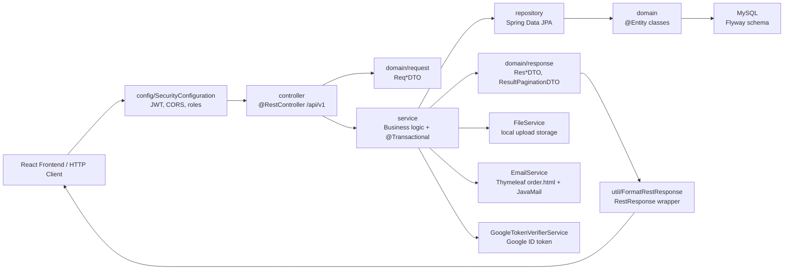

# Phân tích backend Spring Boot - Han Sports v2

Tài liệu này phân tích riêng backend `hansport_v2be` của Han Sports v2. Nội dung chỉ dựa trên source code hiện có trong project.

## 1. Backend dùng kiến trúc gì

Backend hiện tại là một ứng dụng Spring Boot monolith theo layered architecture, expose REST API cho frontend React.

Nhận diện từ source:

- Entry point Spring Boot nằm tại `hansport_v2be/src/main/java/com/javaweb/HansportApplication.java`.
- API HTTP được khai báo trong package `controller`.
- Business logic nằm trong package `service`.
- Truy cập database thông qua Spring Data JPA trong package `repository`.
- Entity JPA và DTO nằm trong package `domain`.
- Cross-cutting concerns như security, CORS, static resources, seed data nằm trong package `config`.
- Helper, response wrapper, exception, validator nằm trong package `util`.

Kiến trúc có thể mô tả ngắn gọn:

```text
Client React
   -> REST Controller
      -> Service
         -> Repository
            -> Entity/JPA
               -> MySQL database
```

Backend không phải microservices vì toàn bộ module auth, product, cart, order, user, dashboard, settings, file upload, email đều nằm trong một Spring Boot app.

Backend cũng là REST API và các controller dùng `@RestController`, các endpoint nằm dưới `/api/v1`, ví dụ:

```java
@RestController
@RequestMapping("/api/v1")
public class ProductController {
    @GetMapping("/products")
    public ResponseEntity<ResultPaginationDTO> getAllProducts(...) {
        ...
    }
}
```

Đường dẫn file: `hansport_v2be/src/main/java/com/javaweb/controller/ProductController.java`

## 2. Luồng Controller -> Service -> Repository -> Entity -> Database

### 2.1 Vai trò tổng tầng

| Tầng | Vai trò | Ví dụ trong source |
|---|---|---|
| Controller | Nhận HTTP request, lấy path/query/body, validate request, gửi service | `OrderController`, `ProductController`, `AuthController` |
| Service | Chứa business logic, transaction, validate nghiệp vụ, convert entity sang DTO | `OrderService`, `ProductService`, `CartService`, `UserService` |
| Repository | Truy cập database bằng Spring Data JPA | `ProductRepository`, `OrderRepository`, `UserRepository` |
| Entity | Mapping object Java với bảng database | `Product`, `User`, `Order`, `Cart` |
| Database | MySQL schema được quản lý bằng Flyway migration | `src/main/resources/db/migration/*.sql` |

### 2.2 Ví dụ luồng đặt hàng

Frontend gửi:

```text
POST /api/v1/orders
```

Controller nhận request:

```java
@PostMapping("/orders")
public ResponseEntity<ResOrderDTO> placeOrder(@RequestBody @Valid ReqOrderDTO redOrderDTO)
        throws IdInvalidException {
    String email = SecurityUtil.getCurrentUserLogin().isPresent() ?
            SecurityUtil.getCurrentUserLogin().get() : "";

    ResOrderDTO order = this.orderService.placeOrder(email, redOrderDTO);
    return ResponseEntity.ok(order);
}
```

Đường dẫn file: `hansport_v2be/src/main/java/com/javaweb/controller/OrderController.java`

Service xử lý nghiệp vụ:

```java
@Transactional
public ResOrderDTO placeOrder(String email, ReqOrderDTO reqOrder) throws IdInvalidException {
    User currentUser = this.userRepository.findByEmail(email)
            .orElseThrow(() -> new IdInvalidException("Nguoi dung khong ton tai"));
    Cart cart = this.cartRepository.findByUser(currentUser)
            .orElseThrow(() -> new IdInvalidException("Gio hang dang trong"));

    List<CartDetail> orderItems = allCartDetails.stream()
            .filter(cd -> reqOrder.getCartDetailIds().contains(cd.getId()))
            .collect(Collectors.toList());

    Order order = new Order();
    order.setUser(currentUser);
    order.setStatus("PENDING");
    order.setTotalPrice(sum);
    order = this.orderRepository.save(order);

    for (CartDetail cartDetail : orderItems) {
        int affectedRows = this.productRepository.decrementStockIfAvailable(
                product.getId(), cartDetail.getQuantity());
        if (affectedRows == 0) {
            throw new IdInvalidException("San pham khong du ton kho");
        }

        OrderDetail orderDetail = new OrderDetail();
        orderDetail.setOrder(order);
        orderDetail.setProduct(product);
        orderDetail.setQuantity(cartDetail.getQuantity());
        this.orderDetailRepository.save(orderDetail);
    }

    return this.convertToResOrderDTO(order);
}
```

Đường dẫn file: `hansport_v2be/src/main/java/com/javaweb/service/OrderService.java`

Repository thao tác database:

```java
@Modifying(flushAutomatically = true)
@Query("update Product p set p.quantity = p.quantity - :quantity, p.sold = p.sold + :quantity where p.id = :productId and p.quantity >= :quantity")
int decrementStockIfAvailable(@Param("productId") long productId, @Param("quantity") long quantity);
```

Đường dẫn file: `hansport_v2be/src/main/java/com/javaweb/repository/ProductRepository.java`

Entity map bảng database:

```java
@Entity
@Table(name = "orders")
public class Order {
    @Id
    @GeneratedValue(strategy = GenerationType.IDENTITY)
    private long id;

    private long totalPrice;
    private String receiverName;
    private String receiverAddress;
    private String receiverPhone;
    private String status;

    @ManyToOne
    @JoinColumn(name = "user_id")
    private User user;
}
```

Đường dẫn file: `hansport_v2be/src/main/java/com/javaweb/domain/Order.java`

Database schema tạo bằng Flyway:

```sql
CREATE TABLE IF NOT EXISTS orders (
    id BIGINT NOT NULL AUTO_INCREMENT,
    total_price BIGINT NOT NULL,
    receiver_name VARCHAR(255),
    receiver_address VARCHAR(255),
    receiver_phone VARCHAR(255),
    status VARCHAR(255),
    user_id BIGINT,
    PRIMARY KEY (id),
    CONSTRAINT fk_orders_user FOREIGN KEY (user_id) REFERENCES users (id)
);
```

Đường dẫn file: `hansport_v2be/src/main/resources/db/migration/V1__baseline_schema.sql`

### 2.3 Điều xảy ra trong transaction đặt hàng

1. Controller lấy email user hiện tại từ JWT.
2. `OrderService.placeOrder` mo transaction bảng `@Transactional`.
3. Service tìm `User` theo email.
4. Service tìm `Cart` của user.
5. Service lọc các `CartDetail` được frontend chọn qua `cartDetailIds`.
6. Service tính tổng tiền từ `price * quantity`.
7. Service tạo `Order` với status `PENDING`.
8. Service trừ tồn kho bằng `ProductRepository.decrementStockIfAvailable`.
9. Service tạo các `OrderDetail`.
10. Service xóa item đã checkout khỏi cart hoặc xóa cart nếu rỗng.
11. Service convert entity thành `ResOrderDTO` để trả về frontend.

Đây là luồng layered rõ ràng: controller không chứa nghiệp vụ đặt hàng, repository không chứa rule nghiệp vụ, entity chỉ map dữ liệu.

## 3. Phân tích tổng package

## 3.1 Package `config`

Đường dẫn: `hansport_v2be/src/main/java/com/javaweb/config`

Vai trò: cấu hình hạ tầng backend và các cross-cutting concerns.

| File | Trách nhiệm |
|---|---|
| `SecurityConfiguration.java` | Cấu hình Spring Security, JWT resource server, role authorization, stateless session |
| `CorsConfig.java` | Cấu hình CORS cho frontend URL vì localhost |
| `StaticResourcesWebConfiguration.java` | Map `/storage/**` đến upload folder local |
| `UserDetailsCustom.java` | Load user theo email cho Spring Security |
| `CustomAuthenticationEntryPoint.java` | Response khi request bị lỗi authentication |
| `AuthRateLimitFilter.java` | Giới hạn tan suat auth endpoints |
| `DataSeeder.java` | Seed role `ADMIN`, `USER`, optional local admin |
| `AppSettingSeeder.java` | Seed settings/site content mặc định |

Trích code security:

```java
@Bean
public SecurityFilterChain filterChain(HttpSecurity http,
        CustomAuthenticationEntryPoint customAuthenticationEntryPoint,
        AuthRateLimitFilter authRateLimitFilter) throws Exception {
    http
        .csrf(c -> c.disable())
        .cors(Customizer.withDefaults())
        .authorizeHttpRequests(
            authz -> authz
                .requestMatchers("/", "/api/v1/auth/login", "/api/v1/auth/register",
                        "/api/v1/auth/refresh", "/storage/**", "/api/v1/auth/google").permitAll()
                .requestMatchers(HttpMethod.GET, "/api/v1/products", "/api/v1/products/**",
                        "/api/v1/files", "/api/v1/settings").permitAll()
                .requestMatchers(HttpMethod.POST, "/api/v1/products", "/api/v1/products/import",
                        "/api/v1/files").hasRole("ADMIN")
                .requestMatchers("/api/v1/users", "/api/v1/users/**").hasRole("ADMIN")
                .requestMatchers("/api/v1/admin", "/api/v1/admin/**").hasRole("ADMIN")
                .anyRequest().authenticated())
        .oauth2ResourceServer((oauth2) -> oauth2.jwt(jwt -> jwt.jwtAuthenticationConverter(jwtAuthenticationConverter())))
        .sessionManagement(session -> session.sessionCreationPolicy(SessionCreationPolicy.STATELESS));

    return http.build();
}
```

Logic:

- Public endpoint: login/register/refresh/google, product GET, file GET, public settings.
- Admin endpoint: create/update/delete product, import, upload, users, admin dashboard/settings, admin order list/update/email.
- Các endpoint còn lại phải authenticated.
- Backend là stateless JWT, không dùng session server-side.

Trích code role claim:

```java
JwtGrantedAuthoritiesConverter grantedAuthoritiesConverter = new JwtGrantedAuthoritiesConverter();
grantedAuthoritiesConverter.setAuthorityPrefix("");
grantedAuthoritiesConverter.setAuthoritiesClaimName("roles");
```

Logic:

- JWT được đọc claim `roles`.
- Prefix để rỗng, trong khi code tạo token phải đảm bảo authority khớp với `ROLE_ADMIN`/`ROLE_USER` nếu dùng `hasRole`.

Trích code static resources:

```java
Path uploadPath = Paths.get(basePath).toAbsolutePath().normalize();
registry.addResourceHandler("/storage/**")
        .addResourceLocations(uploadPath.toUri().toString());
```

Đường dẫn file: `hansport_v2be/src/main/java/com/javaweb/config/StaticResourcesWebConfiguration.java`

Logic:

- Backend expose upload folder qua `/storage/**`.
- `basePath` lấy từ property `hansport.upload-file.base-path`.

## 3.2 Package `controller`

Đường dẫn: `hansport_v2be/src/main/java/com/javaweb/controller`

Vai trò: định nghĩa REST API layer.

| File | Endpoint chính | Trách nhiệm |
|---|---|---|
| `AuthController.java` | `/auth/login`, `/auth/google`, `/auth/register`, `/auth/account`, `/auth/refresh`, `/auth/logout`, `/auth/change-password` | đăng nhập, đăng ký, Google login, refresh token, account |
| `ProductController.java` | `/products`, `/products/{id}`, `/products/import`, `/products/navigation` | CRUD product, list/filter, import |
| `CartController.java` | `/carts`, `/carts/add`, `/carts/{id}` | Xem/thêm/xóa/cập nhật giỏ hàng |
| `OrderController.java` | `/orders`, `/orders/my`, `/orders/{id}` | đặt hàng, lịch sử đơn, admin order |
| `UserController.java` | `/users`, `/users/{id}` | Admin CRUD user |
| `DashboardController.java` | `/admin/dashboard/summary` | Admin dashboard summary |
| `AppSettingController.java` | `/settings`, `/settings/bulk`, `/admin/settings`, `/admin/settings/site` | Public/admin settings |
| `FileController.java` | `/files` | Upload/download file |
| `EmailController.java` | `/orders/{id}/send-email` | Gửi email đơn hàng |

Trích code product list:

```java
@GetMapping("/products")
public ResponseEntity<ResultPaginationDTO> getAllProducts(@Filter Specification<Product> spec,
                                                          Pageable pageable,
                                                          @RequestParam(name = "includeInactive", defaultValue = "false") boolean includeInactive,
                                                          @RequestParam(name = "q", required = false) String query,
                                                          @RequestParam(name = "brand", required = false) String brand,
                                                          @RequestParam(name = "target", required = false) String target,
                                                          @RequestParam(name = "category", required = false) String category,
                                                          @RequestParam(name = "minPrice", required = false) Long minPrice,
                                                          @RequestParam(name = "maxPrice", required = false) Long maxPrice,
                                                          Authentication authentication) {
    boolean canIncludeInactive = includeInactive && isAdmin(authentication);
    return ResponseEntity.status(HttpStatus.OK)
            .body(this.productService.fetchAllProducts(
                    spec, pageable, canIncludeInactive, query, brand, target, category, minPrice, maxPrice));
}
```

Logic:

- Controller nhận filter, pagination, query params.
- `includeInactive` chỉ có hiệu lực nếu user là admin.
- Search/filter thực tế đẩy xuống `ProductService`.

## 3.3 Package `domain`

Đường dẫn: `hansport_v2be/src/main/java/com/javaweb/domain`

Vai trò: chưa domain entity JPA, mỗi entity map với bảng database.

| Entity | Bảng database | Quan hệ chính |
|---|---|---|
| `User` | `users` | Many-to-one `Role`, one-to-one `Cart` |
| `Role` | `roles` | One-to-many `User` |
| `Product` | `products` | One-to-many `ProductImage` |
| `ProductImage` | `product_images` | Many-to-one `Product` |
| `Cart` | `carts` | One-to-one `User`, one-to-many `CartDetail` |
| `CartDetail` | `cart_detail` | Many-to-one `Cart`, many-to-one `Product` |
| `Order` | `orders` | Many-to-one `User`, one-to-many `OrderDetail` |
| `OrderDetail` | `order_detail` | Many-to-one `Order`, many-to-one `Product` |
| `AppSetting` | `settings` | Key-value settings |
| `SiteBanner` | `site_banners` | Structured homepage banner |
| `SiteCategory` | `site_categories` | Structured category |
| `SiteNavigationItem` | `site_navigation_items` | Structured header nav |

Trích code `Product`:

```java
@Entity
@Table(name = "products")
public class Product {
    @Id
    @GeneratedValue(strategy = GenerationType.IDENTITY)
    private long id;

    @Column(unique = true, length = 100)
    private String sku;

    private long price;
    private Long originalPrice;
    private long quantity;
    private long sold;
    private String brand;
    private String target;
    private String category;
    private boolean active = true;

    @OneToMany(mappedBy = "product", fetch = FetchType.LAZY,
            cascade = CascadeType.ALL, orphanRemoval = true)
    @OrderColumn(name = "sort_order")
    private List<ProductImage> images = new ArrayList<>();
}
```

Logic:

- `Product` chưa thông tin catalog vì tồn kho.
- `images` được quản lý cascade theo product.
- `@OrderColumn` lưu thứ tự ảnh vào `product_images.sort_order`.

Trích code audit dạng lặp lại:

```java
@PrePersist
public void handleBeforeCreated() {
    this.createdAt = Instant.now();
    this.createdBy = SecurityUtil.getCurrentUserLogin().isPresent() ?
            SecurityUtil.getCurrentUserLogin().get() : "";
}
```

Logic:

- Entity từ set `createdAt`, `createdBy` trước khi insert.
- Mẫu code này lặp lại ở nhiều entity, có thể gồm vì base entity sau này.

## 3.4 Package `domain/request`

Đường dẫn: `hansport_v2be/src/main/java/com/javaweb/domain/request`

Vai trò: DTO cho request body từ frontend vào backend. Lớp request giúp không expose entity trực tiếp ra API input.

| File | Dùng cho |
|---|---|
| `ReqLoginDTO.java` | Login bằng username/password |
| `ReqGoogleLoginDTO.java` | Google login ID token |
| `ReqRegisterDTO.java` | đăng ký user |
| `ReqAccountUpdateDTO.java` | User cập nhật profile |
| `ReqChangePasswordDTO.java` | đổi mật khẩu |
| `ReqUserCreateDTO.java` | Admin tạo user |
| `ReqUserUpdateDTO.java` | Admin sửa user |
| `ReqProductDTO.java` | Tạo/sửa product |
| `ReqAddProductToCartDTO.java` | Thêm product vào cart |
| `ReqUpdateCartDetailDTO.java` | Cập nhật quantity cart detail |
| `ReqOrderDTO.java` | Checkout/đặt hàng |
| `ReqUpdateOrderStatusDTO.java` | Admin cập nhật status order |
| `ReqSettingUpdateDTO.java` | Cập nhật sẽtting key-value |
| `ReqSiteSettingsDTO.java` | Cập nhật structured site settings |

Vì đã `ReqOrderDTO` được `OrderController` nhận vào:

```java
@PostMapping("/orders")
public ResponseEntity<ResOrderDTO> placeOrder(@RequestBody @Valid ReqOrderDTO redOrderDTO)
```

Logic:

- `@RequestBody` map JSON request vào DTO.
- `@Valid` kich hoat validation annotation trong DTO nếu có.
- Service nhận DTO và chuyen thành entity phù hợp.

## 3.5 Package `domain/response`

Đường dẫn: `hansport_v2be/src/main/java/com/javaweb/domain/response`

Vai trò: DTO response trả về frontend và response wrapper chung.

| Nhóm | File tiêu biểu | Dùng cho |
|---|---|---|
| Common | `RestResponse.java`, `ResultPaginationDTO.java`, `ResLoginDTO.java` | API wrapper, pagination, login response |
| Product | `ResProductDTO.java`, `ResCreateProductDTO.java`, `ResUpdateProductDTO.java`, `ResProductImportDTO.java`, `ResProductNavigationDTO.java` | Product API |
| Cart | `ResCartDTO.java`, `ResCartDetailDTO.java` | Cart API |
| Order | `ResOrderDTO.java`, `ResOrderDetailDTO.java` | Order API |
| User/Role | `ResUserDTO.java`, `ResCreateUserDTO.java`, `ResUpdateUserDTO.java`, `ResRoleDTO.java` | User/admin/auth API |
| Dashboard | `ResDashboardSummaryDTO.java` | Admin dashboard |
| File/Email | `ResUploadFileDTO.java`, `OrderEmailDTO.java` | Upload, email template data |

Trích code `RestResponse`:

```java
public class RestResponse<T> {
    private int statusCode;
    private String error;
    private Object message;
    private T data;
}
```

Đường dẫn file: `hansport_v2be/src/main/java/com/javaweb/domain/response/RestResponse.java`

Logic:

- Backend có wrapper response thông nhất.
- `FormatRestResponse` tự động bọc response thành công vào `RestResponse`.

Trích code wrapper:

```java
RestResponse<Object> res = new RestResponse<>();
res.setStatusCode(status);
res.setData(body);
ApiMessage message = returnType.getMethodAnnotation(ApiMessage.class);
res.setMessage(message != null ? message.value() : "Call API success");
return res;
```

Đường dẫn file: `hansport_v2be/src/main/java/com/javaweb/util/FormatRestResponse.java`

## 3.6 Package `repository`

Đường dẫn: `hansport_v2be/src/main/java/com/javaweb/repository`

Vai trò: persistence layer. Các interface repository ke thua `JpaRepository` để CRUD vì `JpaSpecificationExecutor` để hỗ trợ filter động.

| File | Entity | Trách nhiệm/Query đáng chú ý |
|---|---|---|
| `UserRepository.java` | `User` | Find by email, check email exists, find refresh token hash |
| `RoleRepository.java` | `Role` | Find role by name |
| `ProductRepository.java` | `Product` | Find by name/SKU, catalog navigation, atomic decrement stock |
| `ProductImageRepository.java` | `ProductImage` | Find/count product images |
| `CartRepository.java` | `Cart` | Find cart by user |
| `CartDetailRepository.java` | `CartDetail` | Find cart item by product/color/size |
| `OrderRepository.java` | `Order` | Find my orders, recent orders, revenue sum, status/date query |
| `OrderDetailRepository.java` | `OrderDetail` | Order detail CRUD/filter |
| `AppSettingRepository.java` | `AppSetting` | Find sẽtting by key |
| `SiteBannerRepository.java` | `SiteBanner` | Find banners sorted/active |
| `SiteCategoryRepository.java` | `SiteCategory` | Find categories sorted/active |
| `SiteNavigationItemRepository.java` | `SiteNavigationItem` | Find nav items sorted/active |

Trích code `OrderRepository`:

```java
public interface OrderRepository extends JpaRepository<Order,Long>, JpaSpecificationExecutor<Order> {
    Optional<Order> findByUserAndId(User user, Long id);
    Page<Order> findByUser(User user, Pageable pageable);
    List<Order> findTop5ByOrderByCreatedAtDesc();

    @Query("select coalesce(sum(o.totalPrice), 0) from Order o where o.status = 'COMPLETED'")
    long sumTotalPrice();
}
```

Logic:

- `findByUserAndId` dùng để user thường chỉ xóa/xem đơn của mình.
- `findByUser` dùng cho `/orders/my`.
- `sumTotalPrice` dùng dashboard tính doanh thu order `COMPLETED`.

## 3.7 Package `service`

Đường dẫn: `hansport_v2be/src/main/java/com/javaweb/service`

Vai trò: business layer. Đây là nội dạng có nhiều logic quan trọng nhất của backend.

| File | Trách nhiệm |
|---|---|
| `UserService.java` | Tạo user, register, Google user, update/delete user, profile, refresh token hash, change password |
| `ProductService.java` | CRUD product, validate SKU/name, search/filter, image replace/delete, DTO conversion |
| `ProductImportService.java` | Parse `.xlsx`/`.csv`, validate import rows, dry-run/apply product import |
| `CartService.java` | Lấy cart, thêm product, validate option màu/size, update quantity, xóa item |
| `OrderService.java` | Checkout, tạo order/order detail, trừ tồn kho, update status, send email, DTO conversion |
| `DashboardService.java` | KPI dashboard, revenue, daily/monthly stats, top products, status distribution |
| `AppSettingService.java` | Public/admin settings, validate JSON/list/path, replace banner/category/nav |
| `FileService.java` | Validate folder/type/signature, store/download/delete image files |
| `EmailService.java` | Render Thymeleaf template và gửi email bằng JavaMail |
| `GoogleTokenVerifierService.java` | Verify Google ID token theo client ID |

Trích code product filter:

```java
Specification<Product> activeSpec = (root, criteriaQuery, criteriaBuilder) ->
        criteriaBuilder.isTrue(root.get("active"));
Specification<Product> finalSpec = includeInactive ? spec : combine(spec, activeSpec);
Specification<Product> searchSpec = productSearch(query);
finalSpec = combine(finalSpec, searchSpec);
finalSpec = combine(finalSpec, productFilters(brand, target, category, minPrice, maxPrice));
Page<Product> products = this.productRepository.findAll(finalSpec, pageable);
```

Đường dẫn file: `hansport_v2be/src/main/java/com/javaweb/service/ProductService.java`

Logic:

- Public product list mặc định chỉ lấy active products.
- Search gồm name, SKU, brand, category.
- Filter gồm brand, target, category, min/max price.
- `Page<Product>` được convert sang `ResultPaginationDTO`.

Trích code file validation:

```java
private static final Set<String> ALLOWED_FOLDERS = Set.of("product", "logo", "banner", "avatar");
private static final Set<String> ALLOWED_IMAGE_EXTENSIONS = Set.of("jpg", "jpeg", "png", "webp");
private static final long MAX_IMAGE_BYTES = 5L * 1024 * 1024;
```

Đường dẫn file: `hansport_v2be/src/main/java/com/javaweb/service/FileService.java`

Logic:

- Backend chỉ cho upload vào folder hợp lệ.
- Chỉ chấp nhận image extension hợp lệ.
- Có validate content type vì file signature trong `validateImageFile`.

## 3.8 Package `util`

Đường dẫn: `hansport_v2be/src/main/java/com/javaweb/util`

Vai trò: helper dùng chung.

| File | Trách nhiệm |
|---|---|
| `SecurityUtil.java` | Tạo access/refresh token, validate refresh token, lấy current login, hash refresh token |
| `FormatRestResponse.java` | Bọc response thành công vào `RestResponse` |
| `annotation/ApiMessage.java` | Annotation gán message cho response wrapper |
| `error/GlobalException.java` | Centralized exception handler |
| `error/IdInvalidException.java` | Exception nghiệp vụ/id invalid |
| `error/StorageException.java` | Exception upload/storage |
| `validator/StrongPassword.java` | Annotation validate password manh |
| `validator/StrongPasswordValidator.java` | Logic validate password manh |

Trích code `GlobalException`:

```java
@RestControllerAdvice
public class GlobalException {
    @ExceptionHandler(value = {
            IdInvalidException.class,
            UsernameNotFoundException.class,
            BadCredentialsException.class,
            IllegalArgumentException.class,
            ConstraintViolationException.class})
    public ResponseEntity<RestResponse<Object>> handleIdException(Exception ex) {
        RestResponse<Object> res = new RestResponse<Object>();
        res.setStatusCode(HttpStatus.BAD_REQUEST.value());
        res.setMessage(ex.getMessage());
        res.setError("Exception occurs...");
        return ResponseEntity.status(HttpStatus.BAD_REQUEST).body(res);
    }
}
```

Logic:

- Lỗi validate/nghiệp vụ/auth basic được trả về HTTP 400 với body `RestResponse`.
- `AccessDeniedException` được xử lý riêng thành HTTP 403.
- `StorageException` được xử lý riêng cho upload.

## 4. Backend architecture Mermaid



## 5. Điểm mạnh của kiến trúc backend

### 5.1 Tách layer khá rõ

Controller, service, repository, entity được tách package riêng. Vì đã `OrderController` chỉ nhận request và gửi `OrderService`, còn transaction đặt hàng nằm trong `OrderService`.

Lỗi ich:

- Để đọc luồng API.
- Để unit/integration test tổng layer.
- Để thêm feature mới theo module hiện có.

### 5.2 Dùng DTO request/response thay vì expose entity trực tiếp

Project có `domain/request` và `domain/response`. Ví dụ:

- `ReqProductDTO` cho create/update product.
- `ResProductDTO` cho product response.
- `ReqOrderDTO` cho checkout.
- `ResOrderDTO` cho order response.

Lỗi ich:

- API contract rõ hơn.
- Giảm việc expose field entity nhạy cảm như password/refresh token.
- Để validate input riêng.

### 5.3 Có transaction cho nghiệp vụ ghi dữ liệu

Nhiều service method dùng `@Transactional`, ví dụ:

- `OrderService.placeOrder`
- `ProductService.handleSaveProduct`
- `CartService.addProductToCart`
- `UserService.createUser`

Lỗi ich:

- Đảm bảo các buoc trong mất nghiệp vụ cùng commit/rollback.
- Quan trọng với checkout vì tạo order, tạo order detail, trừ stock, cập nhật cart phải nhất quán.

### 5.4 Có security layer rõ ràng

`SecurityConfiguration.java` cấu hình:

- JWT resource server.
- Stateless session.
- Public endpoint.
- Admin-only endpoint.
- CORS.
- Rate limit filter cho auth.

Lỗi ich:

- Backend không phụ thuộc vào frontend để bảo vệ admin API.
- Endpoint quản trị product/user/order/settings được chặn bằng role.

### 5.5 Có migration database bằng Flyway

`application.properties` bắt Flyway:

```properties
spring.flyway.enabled=${FLYWAY_ENABLED:true}
```

Thư mục migration có `V1` đến `V7`.

Lỗi ich:

- Schema có version.
- Deploy mới có thứ tự dòng tạo/cập nhật bằng.
- Giảm rủi ro lệch schema giữa local/Docker.

### 5.6 Upload file có validation khá ky

`FileService` validate folder, extension, MIME type, file signature, max size.

Lỗi ich:

- Giảm rủi ro path traversal.
- Giảm rủi ro upload file giá mao extension.
- Tách upload logic khỏi controller.

## 6. Điểm cần cải thiện

### 6.1 Nên tách mapper riêng thay vì convert DTO trong service

Hiện tại service vừa xử lý business logic vừa convert entity sang DTO, ví dụ `ProductService.convertToResProductDTO`, `OrderService.convertToResOrderDTO`, `UserService.convertToResUserDTO`.

Tác động:

- Service dài hon vì khó đọc hon.
- Logic mapping lặp lại giữa create/update/get response.

Hướng cải thiện:

- Tạo package `mapper`.
- Dùng mapper class thủ công hoặc MapStruct.
- Service chỉ tập trung vào business flow.

### 6.2 Nên gồm audit fields vào base entity

Nhiều entity lặp lại:

- `createdAt`
- `updatedAt`
- `createdBy`
- `updatedBy`
- `@PrePersist`
- `@PreUpdate`

Tác động:

- Lap code.
- Để sửa lỗi không đồng nhất giữa entity.

Hướng cải thiện:

- Tạo `BaseEntity`.
- Cho các entity extend `BaseEntity`.
- Có thể dùng Spring Data JPA auditing với `@CreatedDate`, `@LastModifiedDate`, `@CreatedBy`, `@LastModifiedBy`.

### 6.3 Nên tách AuthService khỏi AuthController

`AuthController` hiện đang xử lý nhiều logic:

- Authenticate username/password.
- Tạo access token.
- Tạo refresh token.
- Set cookie.
- Google login.
- Refresh token.
- Logout/change password.

Tác động:

- Controller phình to.
- Kho test logic auth riêng.

Hướng cải thiện:

- Tạo `AuthService`.
- Controller chỉ nhận request và trả response.
- Cookie helper có thể tách riêng để tránh lặp code tạo/delete refresh cookie.

### 6.4 DashboardService có fallback mock data

Trong `DashboardService.getSummary`, khi `allOrders.isEmpty()`, service tạo mock daily orders, monthly revenue, top products, status distribution.

Tác động:

- Dashboard có thể hiện số liệu không phải dữ liệu thật khi database chưa có order.
- Để gây nham lan trong production.

Hướng cải thiện:

- Chỉ bắt mock data bằng config dev/demo.
- Production nên tra empty arrays/zero values.
- Tách mock/demo data ra class riêng.

### 6.5 Nên chuẩn hóa error code vì HTTP status

`GlobalException` dạng map nhiều exception vì HTTP 400, bảo gồm `BadCredentialsException`, `UsernameNotFoundException`, `IllegalArgumentException`.

Tác động:

- Client khó phân biệt lỗi auth, validation, not found, business conflict.

Hướng cải thiện:

- Dùng status phù hợp hon:
  - 401 cho unauthorized/bad credentials.
  - 403 cho access denied.
  - 404 cho resource not found.
  - 409 cho conflict như duplicate SKU/email.
  - 400 cho validation input.

### 6.6 Nên cân nhắc soft delete/status cho product/order thay vì hard delete

`ProductService.deleteProductById` vì một số delete API dạng xóa record.

Tác động:

- Lich sự order có foreign key đến product; hard delete product có thể gap ràng buộc DB nếu product đã được tham chiếu.
- Mất lịch sử quản trị.

Hướng cải thiện:

- Product đã có `active`; có thể ưu tiên deactivate thay vì delete.
- Order nên còn rule rõ ràng: user cancel, admin archive, hay hard delete.

### 6.7 Package theo layer tốt, nhưng khi project lớn có thể chuyen sang package theo feature

Hiện tại package theo layer:

```text
controller/
service/
repository/
domain/
```

Phù hợp với project vừa/nhỏ. Khi lớn hơn, có thể cần chia theo feature:

```text
product/
  ProductController
  ProductService
  ProductRepository
  dto/
order/
  OrderController
  OrderService
  OrderRepository
  dto/
```

Lỗi ich:

- Mỗi feature có code gán nhau.
- Giảm việc một package `service`/`controller` qua động.
- Để tách module hoặc service riêng trong tương lai nếu cần.

## 7. Kết luận

Backend Han Sports v2 là Spring Boot REST API monolith có layered architecture rõ ràng. Luồng chính là:

```text
Controller -> Service -> Repository -> Entity -> MySQL
```

Các package hiện tại đã có sẽparation of concerns khá tốt:

- `config`: hạ tầng vì security.
- `controller`: REST boundary.
- `domain`: entity và API model.
- `domain/request`: input DTO.
- `domain/response`: output DTO.
- `repository`: persistence access.
- `service`: business logic.
- `util`: helper/cross-cutting.

Nhưng để sẵn sàng production hon, nên ưu tiên cải thiện mapper layer, base entity auditing, tách AuthService, bỏ/tách mock dashboard data, chuẩn hóa HTTP error status và xem lỗi chiến lược hard delete.
