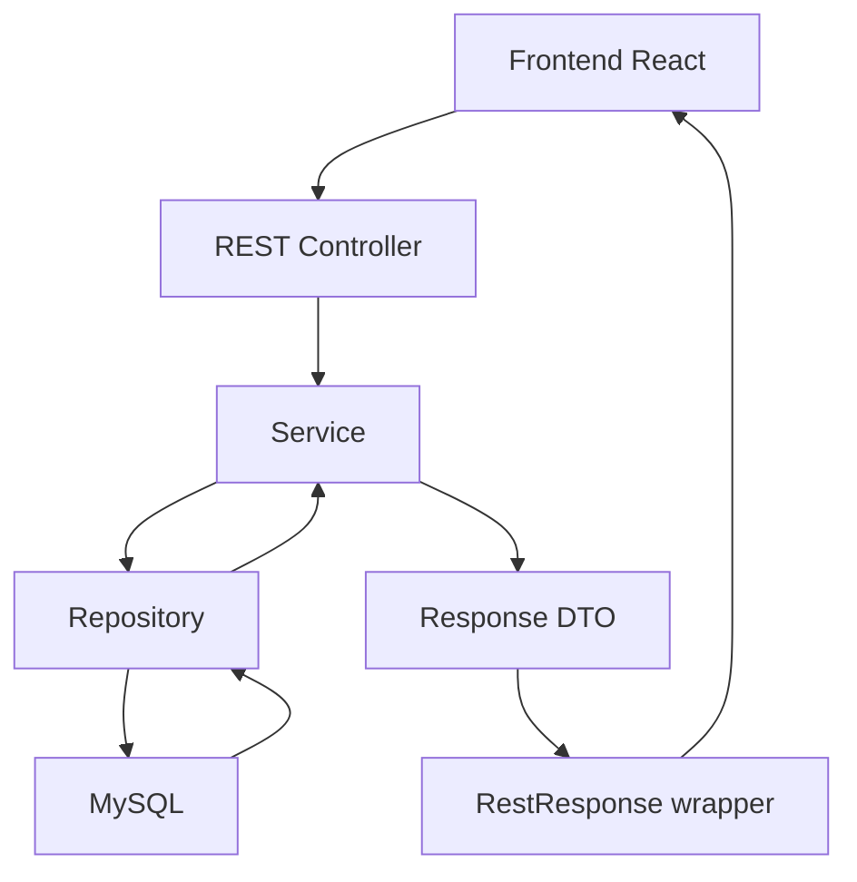
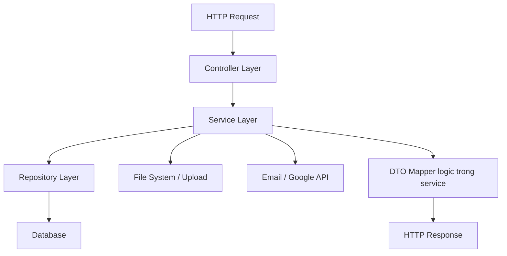
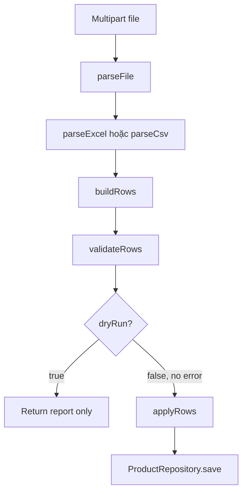
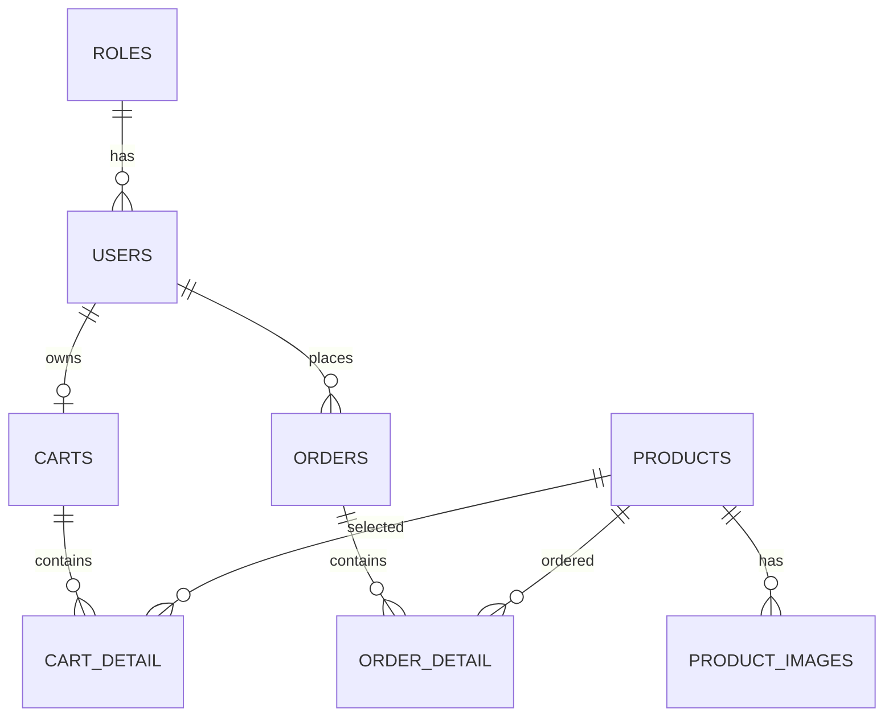
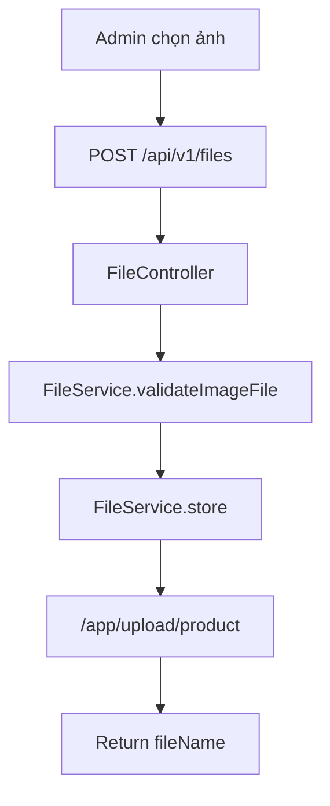
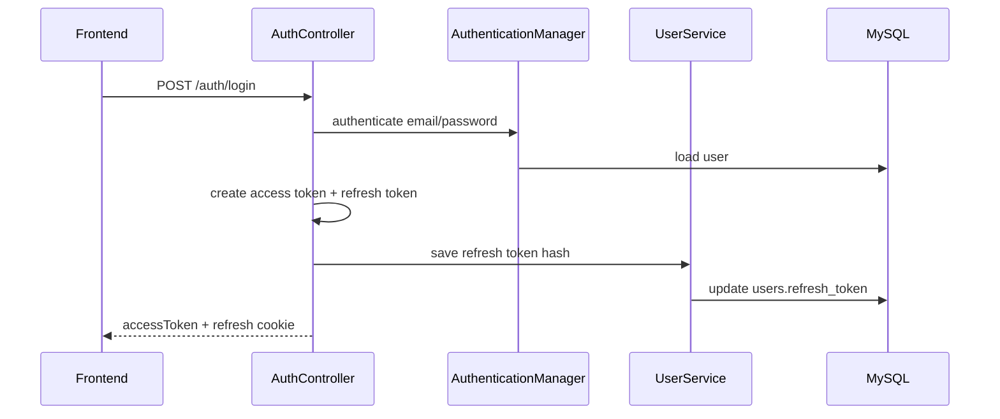
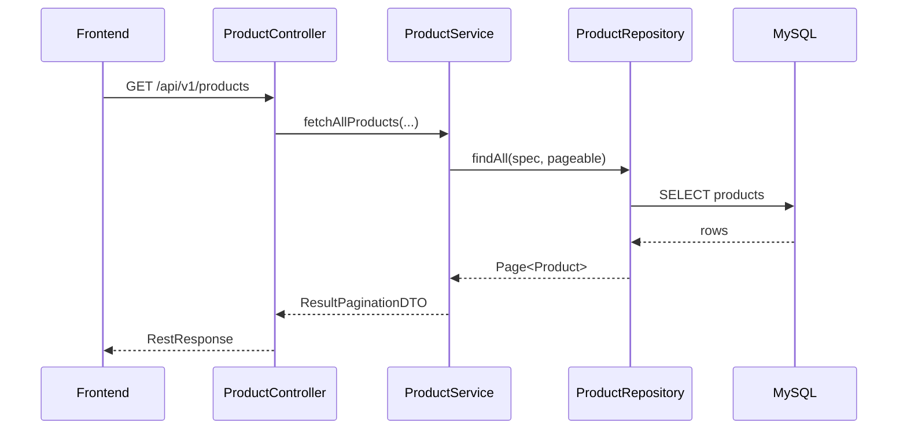
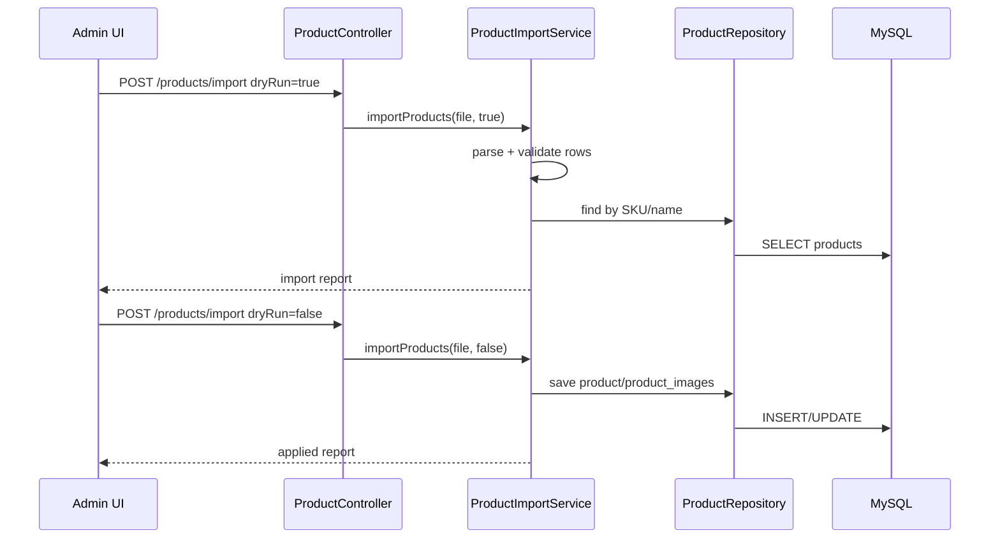
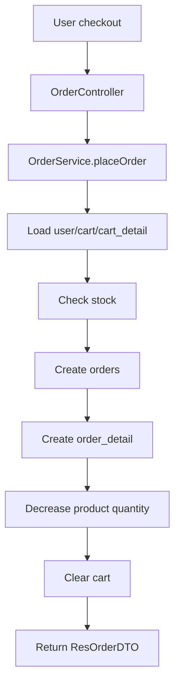

# Phân Tích Cấu Trúc Backend Han Sports v2

Tài liệu này mô tả chi tiết cấu trúc backend của project **Han Sports v2** để một người hoặc một phiên ChatGPT khác có thể đọc và hiểu nhanh cách backend được tổ chức, các module chính làm gì, request đi qua những tầng nào, dữ liệu được lưu ở đâu và những điểm cần lưu ý khi tiếp tục phát triển.

Phạm vi phân tích dựa trên backend hiện tại trong workspace:

```text
hansport_v2be/
```

Backend là một ứng dụng **Spring Boot REST API monolith** theo kiến trúc phân tầng:

```text
Controller -> Service -> Repository -> Entity -> Database
```

Không phải microservices. Không phải kiến trúc DDD phức tạp. Đây là một backend monolith khá phù hợp cho project portfolio, demo và MVP nhỏ.

## 1. Tóm Tắt Nhanh Cho ChatGPT

Nếu cần hiểu cực nhanh backend này:

- Backend dùng Java 17, Spring Boot 3.2.2, Maven.
- API chính nằm dưới prefix `/api/v1`.
- Database là MySQL, truy cập qua Spring Data JPA/Hibernate.
- Schema DB được quản lý bằng Flyway migration trong `src/main/resources/db/migration`.
- Auth dùng Spring Security + JWT Bearer token.
- Password dùng BCrypt.
- Refresh token đang được hash và lưu trong bảng `users`.
- Upload ảnh đi qua `FileController` và `FileService`, lưu file trong thư mục cấu hình bởi `UPLOAD_FILE_BASE_PATH`.
- Docker backend chạy bằng multi-stage Dockerfile, port `8080`.
- Các tầng chính:
  - `controller`: nhận HTTP request.
  - `service`: xử lý nghiệp vụ.
  - `repository`: truy cập database.
  - `domain`: entity JPA, request DTO, response DTO.
  - `config`: security, CORS, seed data, static resources.
  - `util`: response wrapper, security utility, exception, validator.

Luồng phổ biến:



## 2. Công Nghệ Backend

| Thành phần | Công nghệ | File liên quan | Vai trò |
| --- | --- | --- | --- |
| Ngôn ngữ | Java 17 | `pom.xml` | Ngôn ngữ chính của backend |
| Framework | Spring Boot 3.2.2 | `pom.xml`, `HansportApplication.java` | Khởi động app, dependency injection, web server |
| REST API | Spring Web | `controller/*` | Nhận request từ frontend |
| ORM | Spring Data JPA, Hibernate | `repository/*`, `domain/*` | Mapping entity với database |
| Database | MySQL | `application.properties`, `docker-compose.yml` | Lưu user, product, order, settings |
| Migration | Flyway | `db/migration/*` | Quản lý version schema |
| Security | Spring Security | `SecurityConfiguration.java` | Phân quyền, JWT resource server |
| JWT | Spring OAuth2 Resource Server + Nimbus | `SecurityUtil.java`, `SecurityConfiguration.java` | Access token, refresh token |
| Password hash | BCrypt | `SecurityConfiguration.java`, `UserService.java` | Hash mật khẩu |
| Validation | Jakarta Validation, Hibernate Validator | DTO/entity, validator | Validate request/body |
| Upload file | MultipartFile + local file system | `FileController.java`, `FileService.java` | Upload/download ảnh |
| Excel import | Apache POI | `ProductImportService.java`, `pom.xml` | Import sản phẩm từ `.xlsx` |
| Email | Spring Mail + Thymeleaf | `EmailService.java`, `templates/order.html` | Gửi email đơn hàng |
| Filter query | `springfilter-jpa` | `ProductController`, `UserController`, `OrderController` | Hỗ trợ filter động |
| Test | Spring Boot Test + H2 | `HansportApplicationTests.java`, `pom.xml` | Test backend |
| Deploy local | Docker | `Dockerfile`, `docker-compose.yml` | Build và chạy backend trong container |

## 3. Entry Point Và Cấu Hình Khởi Động

### 3.1. Entry point

File:

```text
hansport_v2be/src/main/java/com/javaweb/HansportApplication.java
```

Vai trò:

```java
@SpringBootApplication
public class HansportApplication {
    public static void main(String[] args) {
        SpringApplication.run(HansportApplication.class, args);
    }
}
```

Đây là điểm Spring Boot bắt đầu:

- Scan các bean trong package `com.javaweb`.
- Tạo controller, service, repository.
- Load config từ `application.properties` và biến môi trường.
- Khởi động embedded Tomcat.
- Kết nối database.
- Chạy Flyway migration.
- Đăng ký security filter chain.

### 3.2. Cấu hình runtime

File:

```text
hansport_v2be/src/main/resources/application.properties
```

Các nhóm cấu hình chính:

| Nhóm | Key quan trọng | Ý nghĩa |
| --- | --- | --- |
| JPA | `spring.jpa.hibernate.ddl-auto` | Hiện mặc định dùng `validate`, tức schema phải khớp entity |
| Datasource | `DB_URL`, `DB_USERNAME`, `DB_PASSWORD` | Kết nối MySQL |
| Flyway | `FLYWAY_ENABLED`, `FLYWAY_BASELINE_ON_MIGRATE` | Bật/tắt migration |
| Multipart | `spring.servlet.multipart.max-file-size`, `max-request-size` | Giới hạn upload request |
| JWT | `JWT_BASE64_SECRET`, token validity | Ký và verify JWT |
| Upload | `UPLOAD_FILE_BASE_PATH` | Thư mục lưu file upload |
| OAuth2 Google | `GOOGLE_CLIENT_ID`, `GOOGLE_CLIENT_SECRET` | Google login |
| CORS/Cookie | `FRONTEND_URL`, `CORS_ALLOW_LOCALHOST`, `COOKIE_SECURE` | Tích hợp frontend |
| Seed | `SEED_REQUIRED_ENABLED`, `SEED_ADMIN_ENABLED`, `SEED_SETTINGS_ENABLED` | Điều khiển seeder |
| Actuator | `MANAGEMENT_ENDPOINTS` | Health/info |
| Mail | `YOUR_EMAIL`, `YOUR_APP_PASSWORD` | Gửi email |

Không nên hard-code secret trong source. Secret thật phải nằm trong `.env` local hoặc secret manager khi deploy.

## 4. Cấu Trúc Thư Mục Backend

```text
hansport_v2be/
|-- Dockerfile
|-- pom.xml
`-- src/
    |-- main/
    |   |-- java/com/javaweb/
    |   |   |-- HansportApplication.java
    |   |   |-- config/
    |   |   |-- controller/
    |   |   |-- domain/
    |   |   |   |-- request/
    |   |   |   `-- response/
    |   |   |-- repository/
    |   |   |-- service/
    |   |   `-- util/
    |   |-- resources/
    |   |   |-- application.properties
    |   |   |-- db/migration/
    |   |   `-- templates/
    `-- test/
        `-- java/com/javaweb/HansportApplicationTests.java
```

| Thư mục/file | Vai trò |
| --- | --- |
| `config/` | Security, CORS, rate limit, static resource, seed data |
| `controller/` | REST API endpoint |
| `domain/` | Entity JPA và data model |
| `domain/request/` | DTO nhận input từ frontend |
| `domain/response/` | DTO trả output về frontend |
| `repository/` | Interface truy vấn database qua Spring Data JPA |
| `service/` | Nghiệp vụ chính |
| `util/` | Response wrapper, security helper, exception, validator |
| `resources/db/migration/` | Flyway SQL migration |
| `resources/templates/` | Template email Thymeleaf |
| `Dockerfile` | Build backend container |
| `pom.xml` | Dependency Maven |

## 5. Kiến Trúc Phân Tầng

Backend đang đi theo kiểu layered architecture:



### 5.1. Controller layer

Controller nhận request, đọc param/body/authentication rồi gọi service. Controller không nên chứa quá nhiều logic nghiệp vụ.

Ví dụ:

```text
ProductController
-> nhận request /api/v1/products
-> gọi ProductService hoặc ProductImportService
-> trả DTO
```

### 5.2. Service layer

Service xử lý nghiệp vụ:

- Validate logic nghiệp vụ.
- Kiểm tra trùng email/SKU/name.
- Tạo/cập nhật entity.
- Gọi repository.
- Chuyển entity sang response DTO.
- Gọi FileService/EmailService khi cần.

### 5.3. Repository layer

Repository là interface Spring Data JPA:

```text
ProductRepository extends JpaRepository<Product, Long>, JpaSpecificationExecutor<Product>
```

Nó cung cấp CRUD, paging, filter, query custom.

### 5.4. Entity/DTO layer

Entity mapping với database. DTO dùng để không trả thẳng entity ra frontend.

Điểm hiện tại:

- Entity, request DTO và response DTO cùng nằm dưới package `domain`.
- Cách này chạy được, dễ hiểu.
- Nếu muốn clean hơn, sau này có thể tách thành `entity`, `dto/request`, `dto/response`, `mapper`.

## 6. Controller Layer Chi Tiết

Tất cả controller chính đều là REST controller. Nhiều controller dùng base path:

```text
/api/v1
```

### 6.1. `AuthController`

File:

```text
hansport_v2be/src/main/java/com/javaweb/controller/AuthController.java
```

Vai trò:

- Đăng nhập.
- Đăng ký.
- Google login.
- Refresh token.
- Logout.
- Lấy account hiện tại.
- Cập nhật profile.
- Đổi mật khẩu.

Endpoint chính:

| Method | Endpoint | Vai trò | Quyền |
| --- | --- | --- | --- |
| POST | `/api/v1/auth/login` | Đăng nhập | Public |
| POST | `/api/v1/auth/google` | Đăng nhập Google | Public |
| POST | `/api/v1/auth/register` | Đăng ký | Public |
| GET | `/api/v1/auth/account` | Lấy thông tin user hiện tại | Authenticated |
| PUT | `/api/v1/auth/account` | Cập nhật profile | Authenticated |
| GET | `/api/v1/auth/refresh` | Refresh access token | Public nhưng cần refresh cookie |
| POST | `/api/v1/auth/logout` | Logout | Authenticated |
| POST | `/api/v1/auth/change-password` | Đổi mật khẩu | Authenticated |

### 6.2. `ProductController`

File:

```text
hansport_v2be/src/main/java/com/javaweb/controller/ProductController.java
```

Vai trò:

- CRUD sản phẩm.
- Import sản phẩm từ Excel/CSV.
- Lấy danh sách sản phẩm public/admin.
- Lấy product navigation.

Endpoint chính:

| Method | Endpoint | Vai trò | Quyền |
| --- | --- | --- | --- |
| POST | `/api/v1/products` | Tạo sản phẩm | ADMIN |
| PUT | `/api/v1/products` | Cập nhật sản phẩm | ADMIN |
| POST | `/api/v1/products/import` | Import Excel/CSV | ADMIN |
| DELETE | `/api/v1/products/{id}` | Xóa sản phẩm | ADMIN |
| GET | `/api/v1/products/{id}` | Chi tiết sản phẩm | Public |
| GET | `/api/v1/products/navigation` | Navigation category/brand | Public |
| GET | `/api/v1/products` | Danh sách sản phẩm | Public, admin có thể include inactive |

Luồng import:

```text
ProductController.importProducts()
-> ProductImportService.importProducts(file, dryRun)
-> parse Excel/CSV
-> validate rows
-> create/update products + product_images nếu dryRun=false
```

### 6.3. `CartController`

File:

```text
hansport_v2be/src/main/java/com/javaweb/controller/CartController.java
```

Vai trò:

- Thêm sản phẩm vào giỏ.
- Lấy giỏ hàng của user hiện tại.
- Xóa cart detail.
- Cập nhật số lượng cart detail.

Endpoint:

| Method | Endpoint | Vai trò |
| --- | --- | --- |
| POST | `/api/v1/carts/add` | Thêm sản phẩm vào giỏ |
| GET | `/api/v1/carts` | Lấy giỏ hàng user hiện tại |
| DELETE | `/api/v1/carts/{id}` | Xóa item trong giỏ |
| PUT | `/api/v1/carts/{id}` | Cập nhật số lượng item |

### 6.4. `OrderController`

File:

```text
hansport_v2be/src/main/java/com/javaweb/controller/OrderController.java
```

Vai trò:

- Đặt hàng.
- Admin cập nhật trạng thái đơn.
- Admin xem tất cả đơn.
- User xem đơn của mình.
- Xóa/hủy đơn.

Endpoint:

| Method | Endpoint | Vai trò |
| --- | --- | --- |
| POST | `/api/v1/orders` | Checkout/đặt hàng |
| PUT | `/api/v1/orders` | Cập nhật trạng thái đơn |
| GET | `/api/v1/orders` | Admin lấy tất cả đơn |
| GET | `/api/v1/orders/my` | User lấy đơn của mình |
| DELETE | `/api/v1/orders/{id}` | Xóa/hủy đơn |

### 6.5. `UserController`

File:

```text
hansport_v2be/src/main/java/com/javaweb/controller/UserController.java
```

Vai trò admin:

- Tạo user.
- Cập nhật user.
- Xóa user.
- Lấy danh sách user có phân trang/filter.
- Lấy chi tiết user.

Endpoint:

| Method | Endpoint | Vai trò |
| --- | --- | --- |
| POST | `/api/v1/users` | Tạo user |
| PUT | `/api/v1/users` | Cập nhật user |
| DELETE | `/api/v1/users/{id}` | Xóa user |
| GET | `/api/v1/users` | Danh sách user |
| GET | `/api/v1/users/{id}` | Chi tiết user |

### 6.6. `FileController`

File:

```text
hansport_v2be/src/main/java/com/javaweb/controller/FileController.java
```

Vai trò:

- Upload ảnh.
- Download/serve ảnh qua API.

Endpoint:

| Method | Endpoint | Vai trò | Quyền |
| --- | --- | --- | --- |
| POST | `/api/v1/files` | Upload file ảnh | ADMIN |
| GET | `/api/v1/files` | Lấy file ảnh | Public |

File thật được lưu bởi `FileService` trong thư mục cấu hình:

```text
UPLOAD_FILE_BASE_PATH
```

Trong Docker hiện thường là:

```text
/app/upload
```

### 6.7. `AppSettingController`

File:

```text
hansport_v2be/src/main/java/com/javaweb/controller/AppSettingController.java
```

Vai trò:

- Lấy settings public cho frontend.
- Admin cập nhật settings bulk.
- Admin lấy/cập nhật site settings dạng có cấu trúc.

Endpoint:

| Method | Endpoint | Vai trò |
| --- | --- | --- |
| GET | `/api/v1/settings` | Public settings |
| PUT | `/api/v1/settings/bulk` | Cập nhật nhiều settings |
| GET | `/api/v1/admin/settings` | Admin lấy full settings |
| PUT | `/api/v1/admin/settings/site` | Admin cập nhật site banners/categories/nav |

### 6.8. `DashboardController`

File:

```text
hansport_v2be/src/main/java/com/javaweb/controller/DashboardController.java
```

Endpoint:

```text
GET /api/v1/admin/dashboard/summary
```

Vai trò:

- Tổng hợp số liệu dashboard admin: sản phẩm, đơn hàng, user, doanh thu, đơn gần đây, tồn kho thấp.

### 6.9. `EmailController`

File:

```text
hansport_v2be/src/main/java/com/javaweb/controller/EmailController.java
```

Endpoint:

```text
POST /api/v1/orders/{id}/send-email
```

Vai trò:

- Admin gửi email đơn hàng.
- Logic gửi nằm trong `OrderService` và `EmailService`.

## 7. Service Layer Chi Tiết

### 7.1. `UserService`

Vai trò:

- Tạo user.
- Register.
- Tạo user Google.
- Cập nhật user/admin.
- Xóa user.
- Lấy danh sách user.
- Cập nhật account profile.
- Lưu refresh token hash.
- Đổi mật khẩu.
- Convert entity `User` sang `ResUserDTO`.

Điểm đáng chú ý:

- Dùng `PasswordEncoder` để hash password.
- Có logic không cho xóa chính tài khoản đang đăng nhập.
- Refresh token được xử lý qua hash, không nên lưu token raw.

### 7.2. `ProductService`

Vai trò:

- Tạo/cập nhật/xóa sản phẩm.
- Check trùng SKU/name.
- Tìm kiếm/lọc/pagination sản phẩm.
- Xử lý active/inactive.
- Xử lý `originalPrice`, `colorOptions`, `sizeOptions`.
- Quản lý metadata ảnh trong `product_images`.
- Xóa file ảnh local nếu ảnh không còn được tham chiếu.
- Convert product sang response DTO.

Luồng xóa ảnh:

```text
ProductService.replaceImages()
-> so sánh ảnh cũ và ảnh mới
-> ảnh cũ không còn dùng nữa
-> deleteProductImageFileIfUnused()
-> FileService.deleteIfExists()
```

Nếu ảnh là external URL, `FileService.deleteIfExists()` bỏ qua.

### 7.3. `ProductImportService`

Vai trò:

- Đọc file `.xlsx` bằng Apache POI.
- Đọc file `.csv`.
- Ưu tiên sheet `SanPham_ChuanHoa`.
- Map nhiều tên cột khác nhau về field product.
- Validate dữ liệu từng dòng.
- Dry-run để xem dòng nào CREATE/UPDATE/SKIP.
- Apply import để create/update product.

Luồng:



### 7.4. `CartService`

Vai trò:

- Lấy cart theo user email.
- Thêm sản phẩm vào cart.
- Nếu chưa có cart thì tạo cart.
- Nếu sản phẩm đã có trong cart thì tăng quantity.
- Cập nhật số lượng item.
- Xóa item khỏi cart.
- Convert cart sang `ResCartDTO`.

Dữ liệu liên quan:

```text
users -> carts -> cart_detail -> products
```

### 7.5. `OrderService`

Vai trò:

- Checkout giỏ hàng.
- Tạo order và order_detail.
- Trừ tồn kho sản phẩm.
- Xóa cart sau khi đặt hàng.
- Admin cập nhật trạng thái đơn.
- User xem đơn của mình.
- Gửi email đơn hàng.

Dữ liệu liên quan:

```text
orders
order_detail
products
cart_detail
carts
users
```

Điểm tốt:

- `order_detail.price` lưu snapshot giá tại thời điểm đặt hàng.
- Có `selectedColor`, `selectedSize` cho variant.

### 7.6. `FileService`

Vai trò:

- Validate file ảnh upload.
- Tạo folder upload.
- Lưu file với tên an toàn.
- Đọc file để trả về browser.
- Xóa file local nếu không còn dùng.

Rule upload hiện tại:

| Rule | Giá trị |
| --- | --- |
| Folder hợp lệ | `product`, `logo`, `banner` |
| Extension | `jpg`, `jpeg`, `png`, `webp` |
| MIME | `image/jpeg`, `image/png`, `image/webp` |
| Max size | 5MB mỗi file |
| Signature check | Có |
| Chống path traversal | Có |

### 7.7. `AppSettingService`

Vai trò:

- Đọc public settings.
- Đọc admin settings.
- Cập nhật settings dạng key-value.
- Cập nhật site settings dạng structured table:
  - `site_banners`
  - `site_categories`
  - `site_navigation_items`

Điểm cần lưu ý:

- Project hiện có cả bảng `settings` kiểu key-value và bảng `site_*` có cấu trúc.
- Khi phát triển tiếp cần xác định rõ nguồn nào là source of truth.

### 7.8. `DashboardService`

Vai trò:

- Tổng hợp số liệu dashboard admin.
- Đọc từ product, user, order, order detail repositories.
- Trả `ResDashboardSummaryDTO`.

### 7.9. `EmailService`

Vai trò:

- Gửi email text/html.
- Gửi email từ template Thymeleaf.
- Template liên quan:

```text
hansport_v2be/src/main/resources/templates/order.html
```

### 7.10. `GoogleTokenVerifierService`

Vai trò:

- Verify Google ID token.
- Phục vụ endpoint Google login.

## 8. Repository Layer

Repository dùng Spring Data JPA:

```text
JpaRepository<Entity, Long>
JpaSpecificationExecutor<Entity>
```

Danh sách chính:

| Repository | Entity | Vai trò |
| --- | --- | --- |
| `UserRepository` | `User` | User CRUD, tìm email, refresh token |
| `RoleRepository` | `Role` | Tìm role theo name |
| `ProductRepository` | `Product` | Product CRUD, SKU/name, filter, stock update |
| `ProductImageRepository` | `ProductImage` | Ảnh sản phẩm |
| `CartRepository` | `Cart` | Giỏ hàng |
| `CartDetailRepository` | `CartDetail` | Dòng giỏ hàng |
| `OrderRepository` | `Order` | Đơn hàng |
| `OrderDetailRepository` | `OrderDetail` | Dòng đơn hàng |
| `AppSettingRepository` | `AppSetting` | Settings key-value |
| `SiteBannerRepository` | `SiteBanner` | Banner có cấu trúc |
| `SiteCategoryRepository` | `SiteCategory` | Danh mục trang chủ |
| `SiteNavigationItemRepository` | `SiteNavigationItem` | Menu/nav |

`ProductRepository` có query đáng chú ý:

- Tìm navigation catalog active.
- Atomic update tồn kho:

```text
update Product
set quantity = quantity - :quantity,
    sold = sold + :quantity
where id = :productId
  and quantity >= :quantity
```

Đây là hướng tốt hơn việc đọc product rồi trừ thủ công trong memory.

## 9. Domain Layer

### 9.1. Entity chính

| Entity | Bảng DB | Ghi chú |
| --- | --- | --- |
| `Role` | `roles` | Role ADMIN/USER |
| `User` | `users` | User, password, refresh token, role |
| `Product` | `products` | Product, SKU, price, stock, active, options |
| `ProductImage` | `product_images` | Ảnh sản phẩm |
| `Cart` | `carts` | Giỏ hàng user |
| `CartDetail` | `cart_detail` | Dòng giỏ hàng |
| `Order` | `orders` | Đơn hàng |
| `OrderDetail` | `order_detail` | Dòng đơn hàng |
| `AppSetting` | `settings` | Key-value settings |
| `SiteBanner` | `site_banners` | Banner trang chủ |
| `SiteCategory` | `site_categories` | Danh mục trang chủ |
| `SiteNavigationItem` | `site_navigation_items` | Menu/header |

### 9.2. Request DTO

Nằm trong:

```text
domain/request/
```

Ví dụ:

| DTO | Vai trò |
| --- | --- |
| `ReqLoginDTO` | Login |
| `ReqRegisterDTO` | Register |
| `ReqGoogleLoginDTO` | Google login |
| `ReqProductDTO` | Tạo/cập nhật product |
| `ReqOrderDTO` | Checkout |
| `ReqAddProductToCartDTO` | Add to cart |
| `ReqUpdateCartDetailDTO` | Update cart quantity |
| `ReqUpdateOrderStatusDTO` | Admin update order |
| `ReqSettingUpdateDTO` | Update settings |
| `ReqSiteSettingsDTO` | Update structured site settings |
| `ReqChangePasswordDTO` | Đổi mật khẩu |

### 9.3. Response DTO

Nằm trong:

```text
domain/response/
```

Ví dụ:

| DTO | Vai trò |
| --- | --- |
| `RestResponse<T>` | Format response chuẩn |
| `ResultPaginationDTO` | Metadata phân trang |
| `ResLoginDTO` | Login response |
| `ResProductDTO` | Product response |
| `ResProductImportDTO` | Import summary |
| `ResProductImportRowDTO` | Kết quả từng dòng import |
| `ResCartDTO` | Cart response |
| `ResOrderDTO` | Order response |
| `ResDashboardSummaryDTO` | Dashboard summary |
| `ResUserDTO` | User response |
| `ResUploadFileDTO` | Upload response |

## 10. Security Và Authorization

Security config nằm ở:

```text
config/SecurityConfiguration.java
```

### 10.1. Cơ chế auth

Backend dùng JWT stateless:

```text
Authorization: Bearer <access_token>
```

Spring Security decode JWT bằng secret:

```text
hansport.jwt.base64-secret=${JWT_BASE64_SECRET}
```

Role lấy từ claim:

```text
roles
```

Authority prefix được set rỗng:

```java
grantedAuthoritiesConverter.setAuthorityPrefix("");
grantedAuthoritiesConverter.setAuthoritiesClaimName("roles");
```

### 10.2. Quyền endpoint chính

| Endpoint | Quyền |
| --- | --- |
| `/api/v1/auth/login` | Public |
| `/api/v1/auth/register` | Public |
| `/api/v1/auth/refresh` | Public, cần refresh cookie/token |
| `GET /api/v1/products/**` | Public |
| `GET /api/v1/files` | Public |
| `GET /api/v1/settings` | Public |
| `POST /api/v1/products` | ADMIN |
| `POST /api/v1/products/import` | ADMIN |
| `POST /api/v1/files` | ADMIN |
| `/api/v1/users/**` | ADMIN |
| `/api/v1/admin/**` | ADMIN |
| `GET /api/v1/orders` | ADMIN |
| `PUT /api/v1/orders` | ADMIN |
| `POST /api/v1/orders/*/send-email` | ADMIN |
| Còn lại | Authenticated |

### 10.3. Rate limiting

File:

```text
config/AuthRateLimitFilter.java
```

Giới hạn hiện tại:

| Endpoint | Limit / 60 giây |
| --- | ---: |
| `POST /api/v1/auth/login` | 5 |
| `POST /api/v1/auth/register` | 3 |
| `POST /api/v1/auth/google` | 5 |
| `GET /api/v1/auth/refresh` | 30 |

Cơ chế hiện tại dùng in-memory `ConcurrentHashMap`. Hợp demo/local. Nếu deploy nhiều instance thì nên chuyển Redis hoặc gateway rate limit.

## 11. Response Format Và Exception Handling

### 11.1. Response wrapper

File:

```text
util/FormatRestResponse.java
```

Response JSON thường có dạng:

```json
{
  "statusCode": 200,
  "error": null,
  "message": "get all products",
  "data": {}
}
```

Logic:

- Nếu response là JSON bình thường, wrap vào `RestResponse`.
- Nếu response là `Resource` hoặc non-JSON, không wrap.
- Nếu controller có `@ApiMessage`, dùng message đó.

### 11.2. Exception handling

File:

```text
util/error/GlobalException.java
```

Xử lý:

| Exception | HTTP |
| --- | --- |
| `IdInvalidException` | 400 |
| `BadCredentialsException` | 400 |
| `IllegalArgumentException` | 400 |
| `ConstraintViolationException` | 400 |
| `MethodArgumentNotValidException` | 400 |
| `AccessDeniedException` | 403 |
| `StorageException` | 400 |
| Exception còn lại | 500 |

Điểm cần cải thiện:

- `handleAllException()` hiện trả `ex.getMessage()`. Production nên trả message chung và log chi tiết ở server để tránh lộ thông tin nội bộ.

## 12. Database Và Migration

Migration nằm ở:

```text
hansport_v2be/src/main/resources/db/migration/
```

Danh sách hiện tại:

```text
|-- V1__baseline_schema.sql
|-- V2__money_fields_to_bigint.sql
|-- V3__site_content_tables.sql
|-- V4__product_sku_and_active.sql
|-- V5__product_image_order.sql
`-- V6__product_sale_options.sql
```

Schema chính:

| Bảng | Vai trò |
| --- | --- |
| `roles` | Role |
| `users` | User/account |
| `products` | Sản phẩm |
| `product_images` | Ảnh sản phẩm |
| `carts` | Giỏ hàng |
| `cart_detail` | Dòng giỏ hàng |
| `orders` | Đơn hàng |
| `order_detail` | Dòng đơn hàng |
| `settings` | Settings key-value |
| `site_banners` | Banner có cấu trúc |
| `site_categories` | Category trang chủ |
| `site_navigation_items` | Menu/header |
| `flyway_schema_history` | Lịch sử migration |

Sơ đồ quan hệ chính:



## 13. Upload Và Media

Upload đi qua:

```text
FileController -> FileService -> file system
```

Folder hợp lệ:

```text
product
logo
banner
```

Khi chạy Docker, upload path thường là:

```text
/app/upload
```

Trong Docker Compose, path này được map vào volume:

```text
backend-upload:/app/upload
```

Luồng upload:



Luồng hiển thị:

```text
Frontend nhận image filename
-> gọi GET /api/v1/files?fileName=...&folder=product
-> backend đọc file
-> trả binary image
```

## 14. Seeder

Seeder nằm trong:

```text
config/DataSeeder.java
config/AppSettingSeeder.java
```

### 14.1. `DataSeeder`

Tạo:

- Role `ADMIN`
- Role `USER`
- Admin local nếu bật `SEED_ADMIN_ENABLED`

Biến môi trường:

```text
SEED_REQUIRED_ENABLED
SEED_ADMIN_ENABLED
SEED_ADMIN_PASSWORD
```

### 14.2. `AppSettingSeeder`

Tạo nếu thiếu:

- `HERO_SLIDES`
- `CATEGORIES`
- `HEADER_NAV`
- `BRANDS`
- `TARGETS`
- `HOTLINE`
- `SHIPPING_FEE`
- `FREE_SHIP_LIMIT`
- `site_banners`
- `site_categories`
- `site_navigation_items`

Biến môi trường:

```text
SEED_SETTINGS_ENABLED
```

## 15. Các Luồng Nghiệp Vụ Chính

### 15.1. Đăng nhập



### 15.2. Lấy danh sách sản phẩm



### 15.3. Import Excel/CSV



### 15.4. Checkout



## 16. Docker Backend

File:

```text
hansport_v2be/Dockerfile
```

Đặc điểm:

- Multi-stage build.
- Stage 1 dùng Maven image để build jar.
- Stage 2 dùng JRE Alpine để chạy jar.
- Tạo user `app`, không chạy bằng root.
- Tạo `/app/upload`.
- Expose port `8080`.

Luồng build:

```text
COPY pom.xml
RUN mvn dependency:go-offline
COPY src
RUN mvn package -DskipTests
COPY target jar sang runtime image
ENTRYPOINT java -jar /app/hansport-api.jar
```

Trong Docker Compose, backend phụ thuộc MySQL healthy rồi mới start.

## 17. Test

Test chính hiện nằm ở:

```text
hansport_v2be/src/test/java/com/javaweb/HansportApplicationTests.java
```

Dependency test:

- `spring-boot-starter-test`
- H2 database

Test đã có cho nhiều luồng quan trọng, trong đó có auth/product/import/permission tùy trạng thái source hiện tại.

Lệnh chạy:

```powershell
cd hansport_v2be
mvn test
```

## 18. Điểm Mạnh Của Cấu Trúc Backend

| Điểm mạnh | Giải thích |
| --- | --- |
| Tách tầng rõ | Controller, service, repository, domain tương đối dễ đọc |
| Có DTO request/response | Không trả entity thẳng ra frontend ở đa số luồng |
| Có Flyway | Quản lý schema chuyên nghiệp hơn `ddl-auto=update` |
| Có JWT + BCrypt | Auth không còn quá sơ sài |
| Có rate limit auth | Giảm brute-force cơ bản |
| Có upload validation tốt | Kiểm tra extension, MIME, file signature, size |
| Có Dockerfile | Dễ chạy bằng Docker |
| Có ProductImportService riêng | Import Excel/CSV không trộn vào ProductService |
| Có structured settings | Admin có thể quản lý banner/category/nav |
| Có response wrapper | Frontend nhận format API tương đối thống nhất |

## 19. Điểm Cần Cải Thiện

| Vấn đề | Mức độ | Gợi ý |
| --- | --- | --- |
| Một số text trong source bị lỗi encoding | Trung bình | Chuẩn hóa UTF-8 toàn repo |
| `domain` chứa cả entity/request/response | Thấp/Trung bình | Tách `entity`, `dto`, `mapper` nếu muốn clean hơn |
| Mapper đang nằm trong service | Trung bình | Tạo mapper class riêng cho Product/User/Order |
| `GlobalException` trả message nội bộ | Cao nếu production | Log nội bộ, trả error code/message an toàn |
| Rate limit in-memory | Trung bình | Dùng Redis nếu deploy nhiều instance |
| Settings key-value và `site_*` cùng tồn tại | Trung bình | Xác định source of truth |
| Refresh token vẫn gắn trong `users` | Trung bình | Có thể tách bảng `refresh_tokens` khi cần multi-session |
| Test chưa nên dừng ở smoke/integration cơ bản | Trung bình | Thêm test cart/order/upload/security |
| Chưa có API documentation | Thấp/Trung bình | Thêm OpenAPI/Swagger nếu public portfolio |

## 20. Gợi Ý Khi ChatGPT Khác Cần Sửa Backend

Khi yêu cầu ChatGPT khác sửa backend, nên cung cấp thông tin này:

```text
Backend là Spring Boot 3.2.2, Java 17.
Kiến trúc hiện tại: Controller -> Service -> Repository -> Entity.
Không tự ý bỏ Flyway. Nếu đổi schema, tạo migration mới trong db/migration.
Không sửa DB bằng tay mà không có migration.
Không ghi secret thật vào docs/code.
API prefix là /api/v1.
Response được wrap bởi FormatRestResponse.
Security dùng JWT roles claim, ADMIN endpoint nằm trong SecurityConfiguration.
Nếu sửa upload, đọc FileService trước.
Nếu sửa product, đọc ProductController, ProductService, ProductImportService, ProductRepository, Product entity.
Nếu sửa order, đọc OrderController, OrderService, Order/OrderDetail entity.
Nếu sửa auth, đọc AuthController, UserService, SecurityConfiguration, SecurityUtil, AuthRateLimitFilter.
```

## 21. File Quan Trọng Nhất Nên Đọc Theo Thứ Tự

Nếu người mới vào project chỉ có 30 phút, nên đọc theo thứ tự:

1. `pom.xml`
2. `application.properties`
3. `HansportApplication.java`
4. `SecurityConfiguration.java`
5. `FormatRestResponse.java`
6. `GlobalException.java`
7. `ProductController.java`
8. `ProductService.java`
9. `ProductImportService.java`
10. `OrderService.java`
11. `UserService.java`
12. `FileService.java`
13. `db/migration/V1__baseline_schema.sql`
14. Các migration `V2` đến `V6`
15. `HansportApplicationTests.java`

## 22. Kết Luận

Backend Han Sports v2 hiện là một backend Spring Boot monolith có cấu trúc tương đối rõ, phù hợp với project portfolio hoặc MVP nhỏ. Điểm đáng giá nhất là đã có:

- Layered architecture rõ.
- JWT security.
- Flyway migration.
- DTO request/response.
- Upload validation.
- Import Excel/CSV.
- Docker runtime.
- Seeder có điều khiển bằng env.

Hướng cải thiện tiếp theo không nên là làm kiến trúc quá lớn. Nên ưu tiên:

```text
1. Chuẩn hóa UTF-8.
2. Tăng test cho nghiệp vụ chính.
3. Tách mapper khỏi service.
4. Chuẩn hóa exception response.
5. Làm rõ settings source of truth.
6. Hoàn thiện backup/restore data và upload.
```

Nói ngắn gọn: backend này đã có khung xương ổn. Việc tiếp theo là dọn encoding, tăng test và làm rõ vài ranh giới trách nhiệm để nó trông sạch và đáng tin hơn khi đưa vào portfolio.
