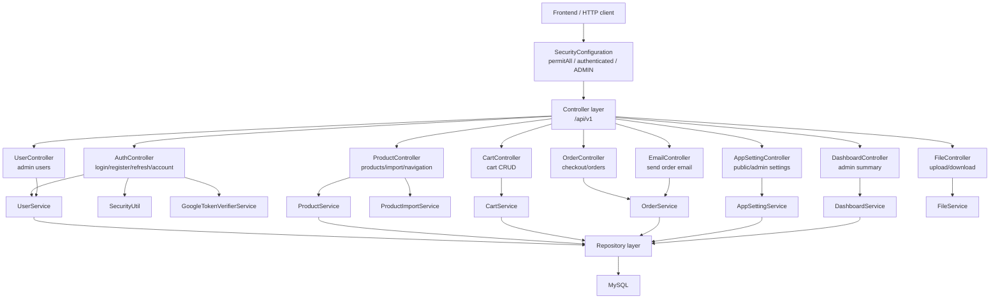

# Phân tích controller layer backend - Han Sports v2

Tài liệu này phân tích toàn bộ controller layer trong backend Spring Boot `hansport_v2be`. Nội dung dựa trên source code hiện có, đặc biệt các file trong:

- `hansport_v2be/src/main/java/com/javaweb/controller`
- `hansport_v2be/src/main/java/com/javaweb/config/SecurityConfiguration.java`

Lưu ý vì output: hau het response JSON thành công sẽ được `FormatRestResponse` bọc vào `RestResponse` gồm `statusCode`, `message`, `data`. Trong bằng dưới đây, cột output ghi body type mà controller trả về trước khi bộ wrapper bọc. Riêng file đównload `Resource` không bộ wrapper bọc.

## 1. Danh sách tất cả controller

| Controller | File | Base path | Service/Dependency chính |
|---|---|---|---|
| `AuthController` | `hansport_v2be/src/main/java/com/javaweb/controller/AuthController.java` | `/api/v1` | `UserService`, `GoogleTokenVerifierService`, `SecurityUtil`, `AuthenticationManagerBuilder` |
| `ProductController` | `hansport_v2be/src/main/java/com/javaweb/controller/ProductController.java` | `/api/v1` | `ProductService`, `ProductImportService` |
| `CartController` | `hansport_v2be/src/main/java/com/javaweb/controller/CartController.java` | `/api/v1` | `CartService` |
| `OrderController` | `hansport_v2be/src/main/java/com/javaweb/controller/OrderController.java` | `/api/v1` | `OrderService` |
| `UserController` | `hansport_v2be/src/main/java/com/javaweb/controller/UserController.java` | `/api/v1` | `UserService` |
| `AppSettingController` | `hansport_v2be/src/main/java/com/javaweb/controller/AppSettingController.java` | `/api/v1` | `AppSettingService` |
| `DashboardController` | `hansport_v2be/src/main/java/com/javaweb/controller/DashboardController.java` | `/api/v1/admin/dashboard` | `DashboardService` |
| `FileController` | `hansport_v2be/src/main/java/com/javaweb/controller/FileController.java` | `/api/v1` | `FileService` |
| `EmailController` | `hansport_v2be/src/main/java/com/javaweb/controller/EmailController.java` | `/api/v1` | `OrderService` |

## 2. Nguồn xác định quyền gửi endpoint

Quyền endpoint được xác định từ 2 nội:

1. `SecurityConfiguration.java`: cấu hình URL matcher.
2. `@PreAuthorize` trên một số method trong `AppSettingController`.

Trích code chính:

```java
.authorizeHttpRequests(
    authz -> authz
        .requestMatchers("/", "/api/v1/auth/login", "/api/v1/auth/register",
                "/api/v1/auth/refresh", "/storage/**", "/api/v1/auth/google").permitAll()
        .requestMatchers(HttpMethod.GET, "/actuator/health", "/actuator/health/**").permitAll()
        .requestMatchers(HttpMethod.GET, "/api/v1/products", "/api/v1/products/**",
                "/api/v1/files", "/api/v1/settings").permitAll()
        .requestMatchers(HttpMethod.POST, "/api/v1/products", "/api/v1/products/import",
                "/api/v1/files").hasRole("ADMIN")
        .requestMatchers(HttpMethod.PUT, "/api/v1/products").hasRole("ADMIN")
        .requestMatchers(HttpMethod.DELETE, "/api/v1/products/**").hasRole("ADMIN")
        .requestMatchers("/api/v1/users", "/api/v1/users/**").hasRole("ADMIN")
        .requestMatchers("/api/v1/admin", "/api/v1/admin/**").hasRole("ADMIN")
        .requestMatchers(HttpMethod.GET, "/api/v1/orders").hasRole("ADMIN")
        .requestMatchers(HttpMethod.PUT, "/api/v1/orders").hasRole("ADMIN")
        .requestMatchers(HttpMethod.POST, "/api/v1/orders/*/send-email").hasRole("ADMIN")
        .anyRequest().authenticated())
```

File: `hansport_v2be/src/main/java/com/javaweb/config/SecurityConfiguration.java`

Kết luận quyền:

- `permitAll`: login, register, refresh, google login, GET product, GET file, GET public settings.
- `ADMIN`: product write/import/upload, user CRUD, admin paths, order list/update/send email.
- `authenticated`: các endpoint còn lỗi, vì `.anyRequest().authenticated()`.
- Một số endpoint có check thêm ở service, ví dụ `DELETE /orders/{id}` cho authenticated user, nhưng service chỉ cho user xóa đơn của mình hoặc admin xóa bất kỳ đơn.

## 3. Bằng tổng hợp tất cả endpoint

### 3.1 AuthController

File: `hansport_v2be/src/main/java/com/javaweb/controller/AuthController.java`

| Method | Endpoint | Quyền gửi | Input | Gửi service/dependency | Output |
|---|---|---|---|---|---|
| POST | `/api/v1/auth/login` | Public | `@RequestBody @Valid ReqLoginDTO` | `AuthenticationManagerBuilder`, `UserService`, `SecurityUtil` | `ResLoginDTO`, `Set-Cookie refresh_token` |
| POST | `/api/v1/auth/google` | Public | `@RequestBody ReqGoogleLoginDTO` | `GoogleTokenVerifierService`, `UserService`, `SecurityUtil` | `ResLoginDTO`, `Set-Cookie refresh_token` |
| POST | `/api/v1/auth/register` | Public | `@RequestBody @Valid ReqRegisterDTO` | `UserService.register` | `ResCreateUserDTO` |
| GET | `/api/v1/auth/account` | Authenticated | Current login từ JWT qua `SecurityUtil` | `UserService.getUserByUsername`, `UserService.convertToResUserDTO` | `ResLoginDTO.UserGetAccount` |
| PUT | `/api/v1/auth/account` | Authenticated | `@RequestBody @Valid ReqAccountUpdateDTO`, current login | `UserService.updateAccountProfile` | `ResUserDTO` |
| GET | `/api/v1/auth/refresh` | Public, nhưng còn cookie hợp lệ | `@CookieValue refresh_token` | `SecurityUtil.checkValidRefreshToken`, `UserService.getUserByRefreshTokenHashAndEmail` | `ResLoginDTO`, new `Set-Cookie refresh_token` |
| POST | `/api/v1/auth/logout` | Authenticated | Current login từ JWT | `UserService.updateUserRefreshTokenHash` | `Void`, delete refresh cookie |
| POST | `/api/v1/auth/change-password` | Authenticated | `@RequestBody @Valid ReqChangePasswordDTO`, current login | `UserService.changePassword` | `Void`, delete refresh cookie |

Trích code ngắn:

```java
@PostMapping("/auth/login")
public ResponseEntity<ResLoginDTO> login(@RequestBody @Valid ReqLoginDTO loginDTO) {
    UsernamePasswordAuthenticationToken authenticationToken =
            new UsernamePasswordAuthenticationToken(loginDTO.getUsername(), loginDTO.getPassword());

    Authentication authentication = authenticationManagerBuilder.getObject()
            .authenticate(authenticationToken);

    String access_token = this.securityUtil.createAccessToken(authentication.getName(), resLoginDTO);
    String refresh_token = this.securityUtil.createRefreshToken(loginDTO.getUsername(), resLoginDTO);

    this.userService.updateUserRefreshTokenHash(
            this.securityUtil.hashRefreshToken(refresh_token), loginDTO.getUsername());
}
```

### 3.2 ProductController

File: `hansport_v2be/src/main/java/com/javaweb/controller/ProductController.java`

| Method | Endpoint | Quyền gửi | Input | Gửi service | Output |
|---|---|---|---|---|---|
| POST | `/api/v1/products` | ADMIN | `@RequestBody @Valid ReqProductDTO` | `ProductService.handleSaveProduct` | `ResCreateProductDTO` |
| PUT | `/api/v1/products` | ADMIN | `@RequestBody @Valid ReqProductDTO` | `ProductService.existsById`, `ProductService.handleUpdateProduct` | `ResUpdateProductDTO` |
| POST | `/api/v1/products/import` | ADMIN | `@RequestParam MultipartFile file`, `@RequestParam dryRun` | `ProductImportService.importProducts` | `ResProductImportDTO` |
| DELETE | `/api/v1/products/{id}` | ADMIN | `@PathVariable id` | `ProductService.existsById`, `ProductService.deleteProductById` | `Void` |
| GET | `/api/v1/products/{id}` | Public | `@PathVariable id` | `ProductService.existsById`, `ProductService.fetchProductById` | `ResProductDTO` |
| GET | `/api/v1/products/navigation` | Public | None | `ProductService.fetchProductNavigation` | `ResProductNavigationDTO` |
| GET | `/api/v1/products` | Public; `includeInactive` chỉ có tác dụng với ADMIN | `@Filter Specification<Product>`, `Pageable`, request params `includeInactive`, `q`, `brand`, `target`, `category`, `minPrice`, `maxPrice`, optional `Authentication` | `ProductService.fetchAllProducts` | `ResultPaginationDTO` |

Trích code ngắn:

```java
@GetMapping("/products")
public ResponseEntity<ResultPaginationDTO> getAllProducts(@Filter Specification<Product> spec,
                                                          Pageable pageable,
                                                          @RequestParam(name = "includeInactive", defaultValue = "false") boolean includeInactive,
                                                          @RequestParam(name = "q", required = false) String query,
                                                          Authentication authentication) {
    boolean canIncludeInactive = includeInactive && isAdmin(authentication);
    return ResponseEntity.status(HttpStatus.OK)
            .body(this.productService.fetchAllProducts(
                    spec, pageable, canIncludeInactive, query, brand, target, category, minPrice, maxPrice));
}
```

### 3.3 CartController

File: `hansport_v2be/src/main/java/com/javaweb/controller/CartController.java`

| Method | Endpoint | Quyền gửi | Input | Gửi service | Output |
|---|---|---|---|---|---|
| POST | `/api/v1/carts/add` | Authenticated | `@RequestBody @Valid ReqAddProductToCartDTO`, current login từ JWT | `CartService.addProductToCart` | `ResCartDTO` |
| GET | `/api/v1/carts` | Authenticated | Current login từ JWT | `CartService.getCart` | `ResCartDTO` |
| DELETE | `/api/v1/carts/{id}` | Authenticated; service check owner cart | `@PathVariable id`, current login từ JWT | `CartService.isCartDetailExist`, `CartService.deleteCartDetail` | `Void` |
| PUT | `/api/v1/carts/{id}` | Authenticated; service check owner cart | `@PathVariable id`, `@RequestBody @Valid ReqUpdateCartDetailDTO`, current login từ JWT | `CartService.updateCartDetailQuantity` | `ResCartDTO` |

Trích code ngắn:

```java
@PostMapping("/carts/add")
public ResponseEntity<ResCartDTO> addToCart(@RequestBody @Valid ReqAddProductToCartDTO req)
        throws IdInvalidException {
    String email = SecurityUtil.getCurrentUserLogin().isPresent() ?
            SecurityUtil.getCurrentUserLogin().get() : "";
    ResCartDTO cart = this.cartService.addProductToCart(email, req);
    return ResponseEntity.ok().body(cart);
}
```

### 3.4 OrderController

File: `hansport_v2be/src/main/java/com/javaweb/controller/OrderController.java`

| Method | Endpoint | Quyền gửi | Input | Gửi service | Output |
|---|---|---|---|---|---|
| POST | `/api/v1/orders` | Authenticated | `@RequestBody @Valid ReqOrderDTO`, current login từ JWT | `OrderService.placeOrder` | `ResOrderDTO` |
| PUT | `/api/v1/orders` | ADMIN | `@RequestBody @Valid ReqUpdateOrderStatusDTO` | `OrderService.updateOrderStatus` | `ResOrderDTO` |
| GET | `/api/v1/orders` | ADMIN | `@Filter Specification<Order>`, `Pageable` | `OrderService.fetchAllOrders` | `ResultPaginationDTO` |
| GET | `/api/v1/orders/my` | Authenticated | `Pageable`, current login từ JWT | `OrderService.fetchMyOrders` | `ResultPaginationDTO` |
| DELETE | `/api/v1/orders/{id}` | Authenticated; service cho admin xóa bất kỳ, user thường chỉ xóa đơn của mình | `@PathVariable id`, current login từ JWT | `OrderService.deleteOrder` | `Void` |

Trích code ngắn:

```java
@PostMapping("/orders")
public ResponseEntity<ResOrderDTO> placeOrder(@RequestBody @Valid ReqOrderDTO redOrderDTO)
        throws IdInvalidException {
    String email = SecurityUtil.getCurrentUserLogin().isPresent() ?
            SecurityUtil.getCurrentUserLogin().get() : "";

    ResOrderDTO order = this.orderService.placeOrder(email, redOrderDTO);
    return ResponseEntity.ok(order);
}
```

### 3.5 UserController

File: `hansport_v2be/src/main/java/com/javaweb/controller/UserController.java`

| Method | Endpoint | Quyền gửi | Input | Gửi service | Output |
|---|---|---|---|---|---|
| POST | `/api/v1/users` | ADMIN | `@RequestBody @Valid ReqUserCreateDTO` | `UserService.createUser` | `ResCreateUserDTO` |
| PUT | `/api/v1/users` | ADMIN | `@RequestBody @Valid ReqUserUpdateDTO` | `UserService.updateUser` | `ResUpdateUserDTO` |
| DELETE | `/api/v1/users/{id}` | ADMIN; service chặn xóa account dạng login | `@PathVariable id`, current login từ JWT | `UserService.isUserExists`, `UserService.deleteUserById` | `Void` |
| GET | `/api/v1/users` | ADMIN | `@Filter Specification<User>`, `Pageable` | `UserService.fetchAllUsers` | `ResultPaginationDTO` |
| GET | `/api/v1/users/{id}` | ADMIN | `@PathVariable id` | `UserService.isUserExists`, `UserService.getuserById` | `ResUserDTO` |

Trích code ngắn:

```java
@DeleteMapping("/users/{id}")
public ResponseEntity<Void> deleteUser(@PathVariable long id) throws IdInvalidException {
    if (!this.userService.isUserExists(id)) {
        throw new IdInvalidException("User khong ton tai");
    }
    String email = SecurityUtil.getCurrentUserLogin().orElse("");
    this.userService.deleteUserById(id, email);
    return ResponseEntity.ok(null);
}
```

### 3.6 AppSettingController

File: `hansport_v2be/src/main/java/com/javaweb/controller/AppSettingController.java`

| Method | Endpoint | Quyền gửi | Input | Gửi service | Output |
|---|---|---|---|---|---|
| GET | `/api/v1/settings` | Public | None | `AppSettingService.getPublicSettings` | `Map<String, String>` |
| PUT | `/api/v1/settings/bulk` | ADMIN via `@PreAuthorize("hasRole('ADMIN')")` | `@RequestBody @Valid List<ReqSettingUpdateDTO>` | `AppSettingService.updateBulkSettings` | `Void` |
| GET | `/api/v1/admin/settings` | ADMIN via security `/api/v1/admin/**` vì `@PreAuthorize` | None | `AppSettingService.getAllSettings` | `Map<String, String>` |
| PUT | `/api/v1/admin/settings/site` | ADMIN via security `/api/v1/admin/**` vì `@PreAuthorize` | `@RequestBody @Valid ReqSiteSettingsDTO` | `AppSettingService.updateSiteSettings` | `Void` |

Trích code ngắn:

```java
@PutMapping("/admin/settings/site")
@PreAuthorize("hasRole('ADMIN')")
public ResponseEntity<Void> updateSiteSettings(@RequestBody @Valid ReqSiteSettingsDTO settings)
        throws IdInvalidException {
    appSettingService.updateSiteSettings(settings);
    return ResponseEntity.ok().build();
}
```

### 3.7 DashboardController

File: `hansport_v2be/src/main/java/com/javaweb/controller/DashboardController.java`

| Method | Endpoint | Quyền gửi | Input | Gửi service | Output |
|---|---|---|---|---|---|
| GET | `/api/v1/admin/dashboard/summary` | ADMIN | None | `DashboardService.getSummary` | `ResDashboardSummaryDTO` |

Trích code ngắn:

```java
@GetMapping("/summary")
public ResponseEntity<ResDashboardSummaryDTO> getSummary() {
    return ResponseEntity.ok(this.dashboardService.getSummary());
}
```

### 3.8 FileController

File: `hansport_v2be/src/main/java/com/javaweb/controller/FileController.java`

| Method | Endpoint | Quyền gửi | Input | Gửi service | Output |
|---|---|---|---|---|---|
| POST | `/api/v1/files` | ADMIN | `@RequestParam files`, `@RequestParam folder`, multipart form data | `FileService.validateImageFile`, `createDirectory`, `store` | `ResUploadFileDTO` |
| GET | `/api/v1/files` | Public | `@RequestParam fileName`, `@RequestParam folder` | `FileService.getFileLength`, `FileService.getResource` | `Resource` / binary response |

Trích code ngắn:

```java
@PostMapping("/files")
public ResponseEntity<ResUploadFileDTO> upload(@RequestParam(name = "files", required = false) List<MultipartFile> files,
                                               @RequestParam("folder") String folder)
        throws IOException, StorageException {
    for (MultipartFile file : files) {
        this.fileService.validateImageFile(file, folder);
        this.fileService.createDirectory(folder);
        String uploadedFile = this.fileService.store(file, folder);
        fileNames.add(uploadedFile);
    }
    return ResponseEntity.ok().body(new ResUploadFileDTO(fileNames, Instant.now()));
}
```

### 3.9 EmailController

File: `hansport_v2be/src/main/java/com/javaweb/controller/EmailController.java`

| Method | Endpoint | Quyền gửi | Input | Gửi service | Output |
|---|---|---|---|---|---|
| POST | `/api/v1/orders/{id}/send-email` | ADMIN | `@PathVariable id` | `OrderService.sendOrderEmail` | `void` |

Trích code ngắn:

```java
@PostMapping("/orders/{id}/send-email")
public void sendOrderEmail(@PathVariable long id) throws IdInvalidException {
    this.orderService.sendOrderEmail(id);
}
```

## 4. Ba controller quan trọng nhất

## 4.1 AuthController

Lý do quan trọng:

- Là của vào của hệ thống auth.
- Tạo access token vì refresh token.
- Set refresh token vào cookie.
- Cập nhật refresh token hash trong database.
- Xử lý Google login, refresh token, logout, change password.

### Login flow

File: `hansport_v2be/src/main/java/com/javaweb/controller/AuthController.java`

```java
UsernamePasswordAuthenticationToken authenticationToken =
        new UsernamePasswordAuthenticationToken(loginDTO.getUsername(), loginDTO.getPassword());

Authentication authentication = authenticationManagerBuilder.getObject()
        .authenticate(authenticationToken);

SecurityContextHolder.getContext().setAuthentication(authentication);
```

Giải thích:

- Controller tạo `UsernamePasswordAuthenticationToken` từ request body `ReqLoginDTO`.
- `AuthenticationManagerBuilder` gửi Spring Security để xác thực username/password.
- Nếu sai credentials, Spring nem exception vì `GlobalException` xử lý response lỗi.

```java
User currentUserDB = this.userService.getUserByUsername(loginDTO.getUsername());
ResRoleDTO role = this.convertToRoleDTO(currentUserDB);
ResLoginDTO.UserLogin userLogin = new ResLoginDTO.UserLogin(
        currentUserDB.getId(),
        currentUserDB.getEmail(),
        currentUserDB.getFullName(),
        currentUserDB.getAvatar(),
        role);
resLoginDTO.setUser(userLogin);
```

Giải thích:

- Sau khi authenticate, controller lấy user từ database.
- Convert role sang `ResRoleDTO`.
- Tạo object user login để frontend biết id/email/name/avatar/role.

```java
String access_token = this.securityUtil.createAccessToken(authentication.getName(), resLoginDTO);
resLoginDTO.setAccessToken(access_token);

String refresh_token = this.securityUtil.createRefreshToken(loginDTO.getUsername(), resLoginDTO);
this.userService.updateUserRefreshTokenHash(
        this.securityUtil.hashRefreshToken(refresh_token), loginDTO.getUsername());
```

Giải thích:

- Access token trả trong JSON response.
- Refresh token tạo riêng, hash rồi lưu vào user record.
- Source không lưu raw refresh token vào DB, chỉ lưu hash.

```java
ResponseCookie resCookies = ResponseCookie
        .from("refresh_token", refresh_token)
        .httpOnly(true)
        .secure(secureCookie)
        .path("/")
        .sameSite("Lax")
        .maxAge(refreshTokenExpiration)
        .build();
```

Giải thích:

- Refresh token được set cookie `httpOnly`, frontend JS không đọc trực tiếp.
- `secure` lấy từ property `app.cookie.secure`.
- Khi access token hết hạn, frontend gửi `/auth/refresh`, cookie tự động gửi theo request.

### Refresh flow

```java
@GetMapping("/auth/refresh")
public ResponseEntity<ResLoginDTO> getRefeshToken(
        @CookieValue(name = "refresh_token", defaultValue = "abc") String refresh_token)
        throws IdInvalidException {
    Jwt decodedToken = this.securityUtil.checkValidRefreshToken(refresh_token);
    String email = decodedToken.getSubject();

    User currentUser = this.userService.getUserByRefreshTokenHashAndEmail(
            this.securityUtil.hashRefreshToken(refresh_token), email);
}
```

Giải thích:

- Refresh endpoint public theo security config, nhưng bắt buộc có cookie hợp lệ.
- Backend decode refresh token lấy email.
- Backend hash refresh token vì số với hash trong DB.
- Nếu hợp lệ, backend tạo access token mới vì rotate refresh token mới.

### Điểm cần chú ý

`AuthController` dạng chưa nhiều business logic token/cookie. Nếu refactor, có thể tách `AuthService` để controller mỏng hơn.

## 4.2 ProductController

Lý do quan trọng:

- Là API catalog public cho storefront.
- Là API quản trị product cho admin.
- Điều phối import product Excel/CSV.
- Điều kiện `includeInactive` phụ thuộc role admin.

### Public product list flow

File: `hansport_v2be/src/main/java/com/javaweb/controller/ProductController.java`

```java
@GetMapping("/products")
public ResponseEntity<ResultPaginationDTO> getAllProducts(@Filter Specification<Product> spec,
                                                          Pageable pageable,
                                                          @RequestParam(name = "includeInactive", defaultValue = "false") boolean includeInactive,
                                                          @RequestParam(name = "q", required = false) String query,
                                                          @RequestParam(name = "brand", required = false) String brand,
                                                          @RequestParam(name = "target", required = false) String target,
                                                          @RequestParam(name = "category", required = false) String category,
                                                          @RequestParam(name = "minPrice", required = false) Long minPrice,
                                                          @RequestParam(name = "maxPrice", required = false) Long maxPrice,
                                                          Authentication authentication) {
    boolean canIncludeInactive = includeInactive && isAdmin(authentication);
    return ResponseEntity.status(HttpStatus.OK)
            .body(this.productService.fetchAllProducts(
                    spec, pageable, canIncludeInactive, query, brand, target, category, minPrice, maxPrice));
}
```

Giải thích:

- Input đến từ query string vì Pageable.
- `@Filter Specification<Product>` đến từ thư viện `springfilter`, hỗ trợ filter động.
- `Authentication` có thể null với public request.
- Nếu user không admin, `includeInactive=true` bộ bỏ qua vì `canIncludeInactive=false`.
- Output là `ResultPaginationDTO` gồm `meta` vì `result`.

### Admin create/update/delete/import

```java
@PostMapping("/products")
public ResponseEntity<ResCreateProductDTO> createProduct(@RequestBody @Valid ReqProductDTO product)
        throws IdInvalidException {
    return ResponseEntity.status(HttpStatus.CREATED)
            .body(this.productService.handleSaveProduct(product));
}
```

```java
@PostMapping(value = "/products/import", consumes = MediaType.MULTIPART_FORM_DATA_VALUE)
public ResponseEntity<ResProductImportDTO> importProducts(@RequestParam("file") MultipartFile file,
                                                          @RequestParam(name = "dryRun", defaultValue = "true") boolean dryRun)
        throws IOException {
    return ResponseEntity.ok(this.productImportService.importProducts(file, dryRun));
}
```

Giải thích:

- Create/update/delete/import đều bị chặn ADMIN trong `SecurityConfiguration`.
- Create/update nhận JSON body `ReqProductDTO`.
- Import nhận multipart form data, field `file` vì `dryRun`.
- Controller không parse Excel/CSV; việc đó giao cho `ProductImportService`.

### Service được gửi

- `ProductService`: CRUD, fetch, navigation, filter.
- `ProductImportService`: import Excel/CSV.

### Điểm cần chú ý

`GET /api/v1/products/{id}` vì `GET /api/v1/products/navigation` đều match `/api/v1/products/**` vì public. Thứ tự method trong controller không gây vấn đề vì Spring route theo pattern cũ thứ.

## 4.3 OrderController

Lý do quan trọng:

- Xử lý checkout COD.
- Xử lý admin order list/update.
- Xử lý lịch sử đơn hàng user.
- Liên quan trực tiếp đến stock, cart, order, order detail.

### Place order flow

File: `hansport_v2be/src/main/java/com/javaweb/controller/OrderController.java`

```java
@PostMapping("/orders")
public ResponseEntity<ResOrderDTO> placeOrder(@RequestBody @Valid ReqOrderDTO redOrderDTO)
        throws IdInvalidException {
    String email = SecurityUtil.getCurrentUserLogin().isPresent() ?
            SecurityUtil.getCurrentUserLogin().get() : "";

    ResOrderDTO order = this.orderService.placeOrder(email, redOrderDTO);
    return ResponseEntity.ok(order);
}
```

Giải thích:

- Endpoint cần authenticated đó `.anyRequest().authenticated()`.
- Input body là `ReqOrderDTO`, trong đó có thông tin giao hàng vì `cartDetailIds`.
- Email user lấy từ JWT/current security context.
- Controller giao toàn bộ transaction checkout cho `OrderService.placeOrder`.

### Admin order list/update

```java
@GetMapping("/orders")
public ResponseEntity<ResultPaginationDTO> getAllOrders(@Filter Specification<Order> spec,
                                                        Pageable pageable) {
    return ResponseEntity.status(HttpStatus.OK)
            .body(this.orderService.fetchAllOrders(spec, pageable));
}
```

```java
@PutMapping("/orders")
public ResponseEntity<ResOrderDTO> updateOrder(@RequestBody @Valid ReqUpdateOrderStatusDTO order)
        throws IdInvalidException {
    return ResponseEntity.ok().body(this.orderService.updateOrderStatus(order));
}
```

Giải thích:

- `GET /api/v1/orders` vì `PUT /api/v1/orders` bị chặn ADMIN trong security config.
- GET hỗ trợ filter vì pagination.
- PUT nhận `ReqUpdateOrderStatusDTO` để update status.

### My orders vì delete order

```java
@GetMapping("/orders/my")
public ResponseEntity<ResultPaginationDTO> getMyOrders(Pageable pageable)
        throws IdInvalidException {
    String email = SecurityUtil.getCurrentUserLogin().isPresent() ?
            SecurityUtil.getCurrentUserLogin().get() : "";
    return ResponseEntity.status(HttpStatus.OK)
            .body(this.orderService.fetchMyOrders(email, pageable));
}
```

```java
@DeleteMapping("/orders/{id}")
public ResponseEntity<Void> deleteOrder(@PathVariable long id)
        throws IdInvalidException {
    String email = SecurityUtil.getCurrentUserLogin().isPresent() ?
            SecurityUtil.getCurrentUserLogin().get() : "";
    this.orderService.deleteOrder(email, id);
    return ResponseEntity.status(HttpStatus.OK).body(null);
}
```

Giải thích:

- `/orders/my` là authenticated user endpoint.
- `DELETE /orders/{id}` không có matcher ADMIN riêng, nên authenticated; service quyết định user có được xóa đơn hay không.

Service check owner/admin:

```java
boolean isAdmin = currentUser.getRole() != null
        && "ADMIN".equalsIgnoreCase(currentUser.getRole().getName());
if (isAdmin) {
    order = this.orderRepository.findById(id)
            .orElseThrow(() -> new IdInvalidException("Don hang khong ton tai"));
} else {
    order = this.orderRepository.findByUserAndId(currentUser, id)
            .orElseThrow(() -> new IdInvalidException("Don hang khong ton tai"));
}
```

File: `hansport_v2be/src/main/java/com/javaweb/service/OrderService.java`

## 5. Nhận xét controller layer

### Điểm tốt

- Controller layer tách rõ khỏi service layer.
- Các controller dùng `@RestController` vì base path `/api/v1` nhất quán.
- Input có dùng DTO request và `@Valid` ở nhiều endpoint.
- Quyền endpoint được cấu hình tập trung trong `SecurityConfiguration`, riêng settings có thêm `@PreAuthorize`.
- Controller không trực tiếp gửi repository, ngoại lệ không thấy trong controller layer hiện tại.

### Điểm cần cải thiện

- `AuthController` dạng chưa nhiều logic token/cookie; nên tách `AuthService` vì cookie helper.
- Một số controller check existence trước khi gửi service, ví dụ `ProductController.existsById`, `UserController.isUserExists`; có thể gồm vào service để controller mỏng hơn.
- `EmailController.sendOrderEmail` tra `void`; có thể trả `ResponseEntity<Void>` nhất quán hon.
- Permission của `DELETE /api/v1/orders/{id}` nam một phần trong service, một phần trong security. Nên document rõ rule hoặc tách endpoint admin/user riêng nếu cần.
- Lỗi tiếng Vìệt trong source bị mojibake ở một số message, nên chuẩn hóa encoding UTF-8.

## 6. Mermaid controller layer



## 7. Kết luận

Controller layer của Han Sports v2 có 9 controller và 37 endpoint chính. Controller layer dạng thực hiện dùng vai trò request boundary: nhận input, lấy authentication/current user khi còn, gửi service, trả DTO. Quyền gửi endpoint chú ýếu nằm trong `SecurityConfiguration`; một số settings endpoint dùng thêm `@PreAuthorize`.

Ba controller quan trọng nhất vì nghiệp vụ là:

1. `AuthController`: quản lý login/token/session-cookie.
2. `ProductController`: public catalog và admin product management.
3. `OrderController`: checkout, my orders, admin order management.

Controller layer hiện khá rõ ràng, nhưng nên tiếp tục làm mỏng controller bằng cách đẩy bớt auth/token/cookie logic vì existence checks xuong service layer.
