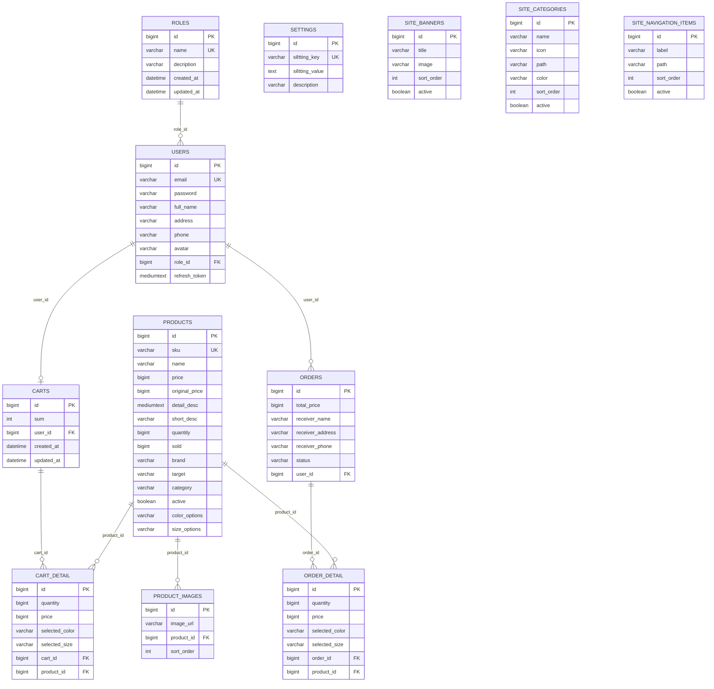

# Phân tích database và JPA entity - Han Sports v2

Tài liệu này phân tích schema database và JPA entity của backend `hansport_v2be`.
Nguồn dữ liệu đã đọc:

- `hansport_v2be/src/main/resources/db/migration/V1__baseline_schema.sql`
- `hansport_v2be/src/main/resources/db/migration/V2__money_fields_to_bigint.sql`
- `hansport_v2be/src/main/resources/db/migration/V3__site_content_tables.sql`
- `hansport_v2be/src/main/resources/db/migration/V4__product_sku_and_active.sql`
- `hansport_v2be/src/main/resources/db/migration/V5__product_image_order.sql`
- `hansport_v2be/src/main/resources/db/migration/V6__product_sale_options.sql`
- `hansport_v2be/src/main/resources/db/migration/V7__add_user_avatar.sql`
- `hansport_v2be/src/main/java/com/javaweb/domain/*.java`

Theo `application.properties`, backend dùng MySQL, Flyway bắt mặc định vì Hibernate chỉ validate schema:

```properties
spring.jpa.hibernate.ddl-auto=${JPA_DDL_AUTO:validate}
spring.datasource.url=${DB_URL:jdbc:mysql://localhost:3306/hansport_v2?createDatabaseIfNotExist=true&useSSL=false&allowPublicKeyRetrieval=true&serverTimezone=UTC}
spring.flyway.enabled=${FLYWAY_ENABLED:true}
```

File: `hansport_v2be/src/main/resources/application.properties`

Ghi chú: Flyway khi chạy có thể tạo bằng metadata runtime `flyway_schema_history`, nhưng bảng đó không được project khai báo trong migration ứng dụng. Tài liệu này liet ke các bảng ứng dụng được khai báo trong Flyway migration/JPA entity.

## 1. Tổng quan Flyway migrations

| Migration | Vai trò schema |
|---|---|
| `V1__baseline_schema.sql` | Tạo các bảng nên: `roles`, `users`, `products`, `product_images`, `carts`, `cart_detail`, `orders`, `order_detail`, `settings`. |
| `V2__money_fields_to_bigint.sql` | Đảm bảo các cột tiền `products.price`, `cart_detail.price`, `orders.total_price`, `order_detail.price` là `BIGINT NOT NULL`. |
| `V3__site_content_tables.sql` | Tạo các bảng nội dung giao diện: `site_banners`, `site_categories`, `site_navigation_items`. |
| `V4__product_sku_and_active.sql` | Thêm `products.sku`, `products.active`, unique index SKU và index active. |
| `V5__product_image_order.sql` | Thêm `product_images.sort_order` và index `(product_id, sort_order)`. |
| `V6__product_sale_options.sql` | Thêm `products.original_price`, `products.color_options`, `products.size_options`; thêm selected color/size cho cart/order detail. |
| `V7__add_user_avatar.sql` | Thêm `users.avatar`. |

Trích migration nên:

```sql
CREATE TABLE IF NOT EXISTS users (
    id BIGINT NOT NULL AUTO_INCREMENT,
    email VARCHAR(255) NOT NULL,
    password VARCHAR(255),
    full_name VARCHAR(255) NOT NULL,
    address VARCHAR(255),
    phone VARCHAR(255),
    role_id BIGINT,
    refresh_token MEDIUMTEXT,
    created_at DATETIME(6),
    updated_at DATETIME(6),
    created_by VARCHAR(255),
    updated_by VARCHAR(255),
    PRIMARY KEY (id),
    UNIQUE KEY uk_users_email (email),
    KEY idx_users_role_id (role_id),
    CONSTRAINT fk_users_role FOREIGN KEY (role_id) REFERENCES roles (id)
);
```

File: `hansport_v2be/src/main/resources/db/migration/V1__baseline_schema.sql`

Trích migration bổ sung product option:

```sql
ALTER TABLE products
    ADD COLUMN original_price BIGINT NULL AFTER price,
    ADD COLUMN color_options VARCHAR(500) NULL AFTER active,
    ADD COLUMN size_options VARCHAR(255) NULL AFTER color_options;

ALTER TABLE cart_detail
    ADD COLUMN selected_color VARCHAR(100) NULL AFTER price,
    ADD COLUMN selected_size VARCHAR(50) NULL AFTER selected_color;
```

File: `hansport_v2be/src/main/resources/db/migration/V6__product_sale_options.sql`

## 2. Danh sách toàn bộ bảng database ứng dụng

Project có 12 bảng ứng dụng:

| Nhóm | Bảng |
|---|---|
| User/Auth | `roles`, `users` |
| Product/Catalog | `products`, `product_images` |
| Cart | `carts`, `cart_detail` |
| Order | `orders`, `order_detail` |
| Settings/Site content | `settings`, `site_banners`, `site_categories`, `site_navigation_items` |

## 3. Bằng users vì roles

## 3.1 `roles`

| Thuộc tính | Giá trị |
|---|---|
| Mục đích | Lưu vai trò user, vì đã role admin/user. |
| Primary key | `id` |
| Foreign key | Không có |
| Unique/index | `uk_roles_name (name)` |
| Entity | `Role` |
| File entity | `hansport_v2be/src/main/java/com/javaweb/domain/Role.java` |

Cột quan trọng:

| Cột | Kiểu | Ghi chú |
|---|---|---|
| `id` | `BIGINT AUTO_INCREMENT` | PK |
| `name` | `VARCHAR(255) NOT NULL` | Tên role, unique |
| `decription` | `VARCHAR(255)` | Mô tả role; tên cột/source dạng viet sai chính tả là `decription` |
| `created_at`, `updated_at` | `DATETIME(6)` | Audit time |
| `created_by`, `updated_by` | `VARCHAR(255)` | Audit user |

Quan hệ:

- `roles` 1 - N `users` qua `users.role_id`.
- Trong JPA: `Role.users` dùng `@OneToMany(mappedBy = "role")`.

Trích entity:

```java
@Entity
@Table(name = "roles")
public class Role {
    @Id
    @GeneratedValue(strategy = GenerationType.IDENTITY)
    private long id;

    @Column(nullable = false, unique = true)
    private String name;
    private String decription;

    @OneToMany(mappedBy = "role", fetch = FetchType.LAZY)
    private List<User> users;
}
```

File: `hansport_v2be/src/main/java/com/javaweb/domain/Role.java`

## 3.2 `users`

| Thuộc tính | Giá trị |
|---|---|
| Mục đích | Lưu tài khoản khách hàng/admin, thông tin profile, refresh token hash và role. |
| Primary key | `id` |
| Foreign key | `role_id` -> `roles.id` |
| Unique/index | `uk_users_email (email)`, `idx_users_role_id (role_id)` |
| Entity | `User` |
| File entity | `hansport_v2be/src/main/java/com/javaweb/domain/User.java` |

Cột quan trọng:

| Cột | Kiểu | Ghi chú |
|---|---|---|
| `id` | `BIGINT AUTO_INCREMENT` | PK |
| `email` | `VARCHAR(255) NOT NULL` | Unique, dùng để login |
| `password` | `VARCHAR(255)` | Có thể null với Google user theo service hiện có |
| `full_name` | `VARCHAR(255) NOT NULL` | Tên hiển thị |
| `address`, `phone` | `VARCHAR(255)` | Thông tin liên hệ |
| `avatar` | `VARCHAR(255)` | Thêm từ V7 |
| `role_id` | `BIGINT` | FK tới `roles.id` |
| `refresh_token` | `MEDIUMTEXT` | Lưu refresh token hash |
| `created_at`, `updated_at`, `created_by`, `updated_by` | Audit | Gần qua `@PrePersist`, `@PreUpdate` |

Quan hệ:

- N `users` - 1 `roles`.
- 1 `users` - 0/1 `carts` qua `carts.user_id` unique.
- 1 `users` - N `orders` qua `orders.user_id`. Entity `Order` có `@ManyToOne User`, nhưng `User` không khai báo list orders.

Trích entity:

```java
@Entity
@Table(name = "users")
public class User {
    @Id
    @GeneratedValue(strategy = GenerationType.IDENTITY)
    private long id;

    @Column(nullable = false, unique = true)
    private String email;

    private String password;
    private String fullName;
    private String address;
    private String phone;
    private String avatar;

    @ManyToOne
    @JoinColumn(name = "role_id")
    private Role role;

    @OneToOne(mappedBy = "user")
    private Cart cart;
}
```

File: `hansport_v2be/src/main/java/com/javaweb/domain/User.java`

## 4. Bằng products vì product_images

## 4.1 `products`

| Thuộc tính | Giá trị |
|---|---|
| Mục đích | Lưu thông tin sản phẩm, giá, tồn kho, catalog filter, option màu/size vì trạng thái active. |
| Primary key | `id` |
| Foreign key | Không có |
| Unique/index | `uk_products_sku (sku)`, `idx_products_active (active)` |
| Entity | `Product` |
| File entity | `hansport_v2be/src/main/java/com/javaweb/domain/Product.java` |

Cột quan trọng:

| Cột | Kiểu | Ghi chú |
|---|---|---|
| `id` | `BIGINT AUTO_INCREMENT` | PK |
| `sku` | `VARCHAR(100) NULL` | Unique index, thêm từ V4 |
| `name` | `VARCHAR(255) NOT NULL` | Tên sản phẩm |
| `price` | `BIGINT NOT NULL` | Giá hiện tại |
| `original_price` | `BIGINT NULL` | Giá gốc/giá trước sale, thêm từ V6 |
| `detail_desc` | `MEDIUMTEXT NOT NULL` | Mô tả chi tiết |
| `short_desc` | `VARCHAR(255) NOT NULL` | Mô tả ngắn |
| `quantity` | `BIGINT NOT NULL` | Tồn kho |
| `sold` | `BIGINT NOT NULL` | Số lượng đã ban |
| `brand`, `target`, `category` | `VARCHAR(255)` | Phần lộại catalog |
| `active` | `TINYINT(1) NOT NULL DEFAULT 1` | Sản phẩm hiện/bộ an |
| `color_options` | `VARCHAR(500)` | Chuỗi option màu, service dạng join bảng `|` |
| `size_options` | `VARCHAR(255)` | Chuỗi option size, service dạng join bảng `|` |
| Audit columns | `created_at`, `updated_at`, `created_by`, `updated_by` | Audit |

Quan hệ:

- 1 `products` - N `product_images`.
- 1 `products` - N `cart_detail`.
- 1 `products` - N `order_detail`.

Trích migration V4/V6:

```sql
ALTER TABLE products
    ADD COLUMN sku VARCHAR(100) NULL AFTER id,
    ADD COLUMN active TINYINT(1) NOT NULL DEFAULT 1 AFTER category;

CREATE UNIQUE INDEX uk_products_sku ON products (sku);
CREATE INDEX idx_products_active ON products (active);
```

File: `hansport_v2be/src/main/resources/db/migration/V4__product_sku_and_active.sql`

Trích entity:

```java
@Entity
@Table(name = "products")
public class Product {
    @Id
    @GeneratedValue(strategy = GenerationType.IDENTITY)
    private long id;

    @Column(unique = true, length = 100)
    private String sku;

    private String name;
    private long price;
    private Long originalPrice;
    private long quantity;
    private long sold;
    private String brand;
    private String target;
    private String category;
    private boolean active = true;
    private String colorOptions;
    private String sizeOptions;

    @OneToMany(mappedBy = "product", fetch = FetchType.LAZY, cascade = CascadeType.ALL, orphanRemoval = true)
    @OrderColumn(name = "sort_order")
    private List<ProductImage> images = new ArrayList<>();
}
```

File: `hansport_v2be/src/main/java/com/javaweb/domain/Product.java`

## 4.2 `product_images`

| Thuộc tính | Giá trị |
|---|---|
| Mục đích | Lưu danh sách ảnh của sản phẩm. |
| Primary key | `id` |
| Foreign key | `product_id` -> `products.id` |
| Unique/index | `idx_product_images_product_id`, `idx_product_images_product_order (product_id, sort_order)` |
| Entity | `ProductImage` |
| File entity | `hansport_v2be/src/main/java/com/javaweb/domain/ProductImage.java` |

Cột quan trọng:

| Cột | Kiểu | Ghi chú |
|---|---|---|
| `id` | `BIGINT AUTO_INCREMENT` | PK |
| `image_url` | `VARCHAR(255)` | Tên file/URL ảnh |
| `product_id` | `BIGINT` | FK tới `products.id` |
| `sort_order` | `INT NOT NULL DEFAULT 0` | Thứ tự ảnh, thêm từ V5 |

Quan hệ:

- N `product_images` - 1 `products`.
- Trong JPA, `Product.images` là list có `@OrderColumn(name = "sort_order")`.
- `ProductImage` entity không khai báo field `sortOrder`; cột `sort_order` được quản lý qua `@OrderColumn` trên list.

Trích migration:

```sql
ALTER TABLE product_images
    ADD COLUMN sort_order INT NOT NULL DEFAULT 0;

CREATE INDEX idx_product_images_product_order
    ON product_images (product_id, sort_order);
```

File: `hansport_v2be/src/main/resources/db/migration/V5__product_image_order.sql`

Trích entity:

```java
@Entity
@Table(name = "product_images")
public class ProductImage {
    @Id
    @GeneratedValue(strategy = GenerationType.IDENTITY)
    private long id;

    private String imageUrl;

    @ManyToOne(fetch = FetchType.LAZY)
    @JoinColumn(name = "product_id")
    private Product product;
}
```

File: `hansport_v2be/src/main/java/com/javaweb/domain/ProductImage.java`

## 5. Bằng carts vì cart_detail

## 5.1 `carts`

| Thuộc tính | Giá trị |
|---|---|
| Mục đích | Lưu giỏ hàng hiện tại của user. |
| Primary key | `id` |
| Foreign key | `user_id` -> `users.id` |
| Unique/index | `uk_carts_user_id (user_id)` |
| Entity | `Cart` |
| File entity | `hansport_v2be/src/main/java/com/javaweb/domain/Cart.java` |

Cột quan trọng:

| Cột | Kiểu | Ghi chú |
|---|---|---|
| `id` | `BIGINT AUTO_INCREMENT` | PK |
| `sum` | `INT NOT NULL` | Số dòng item trong cart, service cập nhật khi thêm/xóa |
| `user_id` | `BIGINT` | FK tới `users.id`, unique để mỗi user có tối đa 1 cart |
| Audit columns | `created_at`, `updated_at`, `created_by`, `updated_by` | Audit |

Quan hệ:

- 1 `users` - 0/1 `carts`.
- 1 `carts` - N `cart_detail`.

Trích SQL:

```sql
CREATE TABLE IF NOT EXISTS carts (
    id BIGINT NOT NULL AUTO_INCREMENT,
    sum INT NOT NULL,
    user_id BIGINT,
    PRIMARY KEY (id),
    UNIQUE KEY uk_carts_user_id (user_id),
    CONSTRAINT fk_carts_user FOREIGN KEY (user_id) REFERENCES users (id)
);
```

File: `hansport_v2be/src/main/resources/db/migration/V1__baseline_schema.sql`

## 5.2 `cart_detail`

| Thuộc tính | Giá trị |
|---|---|
| Mục đích | Lưu tổng dòng sản phẩm trong giỏ hàng, gồm số lượng, giá snapshot, màu/size đã chọn. |
| Primary key | `id` |
| Foreign key | `cart_id` -> `carts.id`, `product_id` -> `products.id` |
| Unique/index | `idx_cart_detail_cart_id`, `idx_cart_detail_product_id` |
| Entity | `CartDetail` |
| File entity | `hansport_v2be/src/main/java/com/javaweb/domain/CartDetail.java` |

Cột quan trọng:

| Cột | Kiểu | Ghi chú |
|---|---|---|
| `id` | `BIGINT AUTO_INCREMENT` | PK |
| `quantity` | `BIGINT NOT NULL` | Số lượng item |
| `price` | `BIGINT NOT NULL` | Giá snapshot khi thêm vào cart |
| `selected_color` | `VARCHAR(100)` | Thêm từ V6 |
| `selected_size` | `VARCHAR(50)` | Thêm từ V6 |
| `cart_id` | `BIGINT` | FK tới `carts.id` |
| `product_id` | `BIGINT` | FK tới `products.id` |
| Audit columns | `created_at`, `updated_at`, `created_by`, `updated_by` | Audit |

Quan hệ:

- N `cart_detail` - 1 `carts`.
- N `cart_detail` - 1 `products`.
- Service tìm item theo combination `cart + product + selectedColor + selectedSize`, nhưng DB chưa có unique constraint cho combination này.

Trích entity:

```java
@Entity
@Table(name = "cart_detail")
public class CartDetail {
    @Id
    @GeneratedValue(strategy = GenerationType.IDENTITY)
    private long id;

    private long quantity;
    private long price;
    private String selectedColor;
    private String selectedSize;

    @ManyToOne
    @JoinColumn(name = "cart_id")
    private Cart cart;

    @ManyToOne(fetch = FetchType.EAGER)
    @JoinColumn(name = "product_id")
    private Product product;
}
```

File: `hansport_v2be/src/main/java/com/javaweb/domain/CartDetail.java`

## 6. Bằng orders vì order_detail

## 6.1 `orders`

| Thuộc tính | Giá trị |
|---|---|
| Mục đích | Lưu đơn hàng, thông tin người nhận, tổng tiền vì trạng thái. |
| Primary key | `id` |
| Foreign key | `user_id` -> `users.id` |
| Unique/index | `idx_orders_user_id (user_id)` |
| Entity | `Order` |
| File entity | `hansport_v2be/src/main/java/com/javaweb/domain/Order.java` |

Cột quan trọng:

| Cột | Kiểu | Ghi chú |
|---|---|---|
| `id` | `BIGINT AUTO_INCREMENT` | PK |
| `total_price` | `BIGINT NOT NULL` | Tổng tiền đơn hàng |
| `receiver_name` | `VARCHAR(255)` | Tên người nhận |
| `receiver_address` | `VARCHAR(255)` | địa chỉ nhận |
| `receiver_phone` | `VARCHAR(255)` | SDT người nhận |
| `status` | `VARCHAR(255)` | Trạng thái, service cho: `PENDING`, `PROCESSING`, `SHIPPING`, `COMPLETED`, `CANCELLED` |
| `user_id` | `BIGINT` | FK tới `users.id` |
| Audit columns | `created_at`, `updated_at`, `created_by`, `updated_by` | Audit |

Quan hệ:

- N `orders` - 1 `users`.
- 1 `orders` - N `order_detail`.

Trích entity:

```java
@Entity
@Table(name = "orders")
public class Order {
    @Id
    @GeneratedValue(strategy = GenerationType.IDENTITY)
    private long id;

    private long totalPrice;
    private String receiverName;
    private String receiverAddress;
    private String receiverPhone;
    private String status;

    @ManyToOne
    @JoinColumn(name = "user_id")
    private User user;

    @OneToMany(mappedBy = "order", fetch = FetchType.LAZY, cascade = CascadeType.ALL, orphanRemoval = true)
    private List<OrderDetail> orderDetails;
}
```

File: `hansport_v2be/src/main/java/com/javaweb/domain/Order.java`

## 6.2 `order_detail`

| Thuộc tính | Giá trị |
|---|---|
| Mục đích | Lưu tổng dòng sản phẩm trong đơn hàng, giá/số lượng/màu/size snapshot tại thời điểm checkout. |
| Primary key | `id` |
| Foreign key | `order_id` -> `orders.id`, `product_id` -> `products.id` |
| Unique/index | `idx_order_detail_order_id`, `idx_order_detail_product_id` |
| Entity | `OrderDetail` |
| File entity | `hansport_v2be/src/main/java/com/javaweb/domain/OrderDetail.java` |

Cột quan trọng:

| Cột | Kiểu | Ghi chú |
|---|---|---|
| `id` | `BIGINT AUTO_INCREMENT` | PK |
| `quantity` | `BIGINT NOT NULL` | Số lượng mua |
| `price` | `BIGINT NOT NULL` | Giá snapshot |
| `selected_color` | `VARCHAR(100)` | Mẫu đã chọn, thêm từ V6 |
| `selected_size` | `VARCHAR(50)` | Size đã chọn, thêm từ V6 |
| `order_id` | `BIGINT` | FK tới `orders.id` |
| `product_id` | `BIGINT` | FK tới `products.id` |
| Audit columns | `created_at`, `updated_at`, `created_by`, `updated_by` | Audit |

Quan hệ:

- N `order_detail` - 1 `orders`.
- N `order_detail` - 1 `products`.

Trích entity:

```java
@Entity
@Table(name = "order_detail")
public class OrderDetail {
    @Id
    @GeneratedValue(strategy = GenerationType.IDENTITY)
    private long id;

    private long quantity;
    private long price;
    private String selectedColor;
    private String selectedSize;

    @ManyToOne
    @JoinColumn(name = "order_id")
    private Order order;

    @ManyToOne(fetch = FetchType.LAZY)
    @JoinColumn(name = "product_id")
    private Product product;
}
```

File: `hansport_v2be/src/main/java/com/javaweb/domain/OrderDetail.java`

## 7. Bằng settings và site content

## 7.1 `settings`

| Thuộc tính | Giá trị |
|---|---|
| Mục đích | Lưu cấu hình key-value của website/app. |
| Primary key | `id` |
| Foreign key | Không có |
| Unique/index | `uk_settings_setting_key (setting_key)` |
| Entity | `AppSetting` |
| File entity | `hansport_v2be/src/main/java/com/javaweb/domain/AppSetting.java` |

Cột quan trọng:

| Cột | Kiểu | Ghi chú |
|---|---|---|
| `id` | `BIGINT AUTO_INCREMENT` | PK |
| `setting_key` | `VARCHAR(255) NOT NULL` | Unique |
| `setting_value` | `TEXT` | Giá trị sẽtting |
| `description` | `VARCHAR(255)` | Mô tả |

Quan hệ:

- Không có FK.
- `AppSettingService` chỉ cho phép các key trong allowlist: `HOTLINE`, `SHIPPING_FEE`, `FREE_SHIP_LIMIT`, `BRANDS`, `TARGETS`, `HERO_SLIDES`, `CATEGORIES`, `HEADER_NAV`.

Trích entity:

```java
@Entity
@Table(name = "settings")
public class AppSetting {
    @Id
    @GeneratedValue(strategy = GenerationType.IDENTITY)
    private Long id;

    @Column(name = "setting_key", unique = true, nullable = false)
    private String settingKey;

    @Column(name = "setting_value", columnDefinition = "TEXT")
    private String settingValue;
}
```

File: `hansport_v2be/src/main/java/com/javaweb/domain/AppSetting.java`

## 7.2 `site_banners`

| Thuộc tính | Giá trị |
|---|---|
| Mục đích | Lưu hero/banner slides của homepage/site. |
| Primary key | `id` |
| Foreign key | Không có |
| Unique/index | `idx_site_banners_sort_order`, `idx_site_banners_active_sort_order` |
| Entity | `SiteBanner` |
| File entity | `hansport_v2be/src/main/java/com/javaweb/domain/SiteBanner.java` |

Cột quan trọng:

| Cột | Kiểu | Ghi chú |
|---|---|---|
| `id` | `BIGINT AUTO_INCREMENT` | PK |
| `title` | `VARCHAR(255) NOT NULL` | Tiêu đề banner |
| `subtitle` | `VARCHAR(500)` | Mô tả phụ |
| `cta` | `VARCHAR(100)` | Text nut CTA |
| `cta_link` | `VARCHAR(255)` | Link CTA |
| `image` | `VARCHAR(255)` | Ảnh banner |
| `image_folder` | `VARCHAR(100)` | Folder ảnh |
| `alt_text` | `VARCHAR(255)` | Alt text |
| `bg` | `VARCHAR(255)` | Background/color metadata |
| `sort_order` | `INT NOT NULL DEFAULT 0` | Thứ tự hiển thị |
| `active` | `TINYINT(1) NOT NULL DEFAULT 1` | Trạng thái public |
| `created_at`, `updated_at` | `DATETIME(6)` | Audit time |

Quan hệ:

- Không có FK.
- `AppSettingService` replace toàn bộ records khi update site settings.

## 7.3 `site_categories`

| Thuộc tính | Giá trị |
|---|---|
| Mục đích | Lưu category tile/menu content hiện trên site. |
| Primary key | `id` |
| Foreign key | Không có |
| Unique/index | `idx_site_categories_sort_order`, `idx_site_categories_active_sort_order` |
| Entity | `SiteCategory` |
| File entity | `hansport_v2be/src/main/java/com/javaweb/domain/SiteCategory.java` |

Cột quan trọng:

| Cột | Kiểu | Ghi chú |
|---|---|---|
| `id` | `BIGINT AUTO_INCREMENT` | PK |
| `name` | `VARCHAR(255) NOT NULL` | Tên category hiển thị |
| `icon` | `VARCHAR(100) NOT NULL` | Icon key/name |
| `path` | `VARCHAR(255) NOT NULL` | Link nội bộ |
| `color` | `VARCHAR(255) NOT NULL` | Mẫu hiển thị |
| `sort_order` | `INT NOT NULL DEFAULT 0` | Thứ tự |
| `active` | `TINYINT(1) NOT NULL DEFAULT 1` | Trạng thái public |
| `created_at`, `updated_at` | `DATETIME(6)` | Audit time |

Quan hệ:

- Không có FK.
- AppSettingService đọc active-only cho public settings.

## 7.4 `site_navigation_items`

| Thuộc tính | Giá trị |
|---|---|
| Mục đích | Lưu item điều hướng header/menu. |
| Primary key | `id` |
| Foreign key | Không có |
| Unique/index | `idx_site_navigation_items_sort_order`, `idx_site_navigation_items_active_sort_order` |
| Entity | `SiteNavigationItem` |
| File entity | `hansport_v2be/src/main/java/com/javaweb/domain/SiteNavigationItem.java` |

Cột quan trọng:

| Cột | Kiểu | Ghi chú |
|---|---|---|
| `id` | `BIGINT AUTO_INCREMENT` | PK |
| `label` | `VARCHAR(255) NOT NULL` | Text menu |
| `path` | `VARCHAR(255) NOT NULL` | Link nội bộ |
| `sort_order` | `INT NOT NULL DEFAULT 0` | Thứ tự |
| `active` | `TINYINT(1) NOT NULL DEFAULT 1` | Trạng thái public |
| `created_at`, `updated_at` | `DATETIME(6)` | Audit time |

Quan hệ:

- Không có FK.

Trích migration site content:

```sql
CREATE TABLE IF NOT EXISTS site_navigation_items (
    id BIGINT NOT NULL AUTO_INCREMENT,
    label VARCHAR(255) NOT NULL,
    path VARCHAR(255) NOT NULL,
    sort_order INT NOT NULL DEFAULT 0,
    active TINYINT(1) NOT NULL DEFAULT 1,
    created_at DATETIME(6),
    updated_at DATETIME(6),
    PRIMARY KEY (id),
    KEY idx_site_navigation_items_sort_order (sort_order),
    KEY idx_site_navigation_items_active_sort_order (active, sort_order)
);
```

File: `hansport_v2be/src/main/resources/db/migration/V3__site_content_tables.sql`

## 8. Entity tương ứng với bảng nao

| Entity | Table | Quan hệ JPA chính |
|---|---|---|
| `Role` | `roles` | `@OneToMany(mappedBy = "role") List<User>` |
| `User` | `users` | `@ManyToOne Role`, `@OneToOne(mappedBy = "user") Cart` |
| `Product` | `products` | `@OneToMany(mappedBy = "product", cascade = ALL, orphanRemoval = true) List<ProductImage>` |
| `ProductImage` | `product_images` | `@ManyToOne Product` |
| `Cart` | `carts` | `@OneToOne User`, `@OneToMany(mappedBy = "cart", cascade = ALL, orphanRemoval = true) List<CartDetail>` |
| `CartDetail` | `cart_detail` | `@ManyToOne Cart`, `@ManyToOne Product` |
| `Order` | `orders` | `@ManyToOne User`, `@OneToMany(mappedBy = "order", cascade = ALL, orphanRemoval = true) List<OrderDetail>` |
| `OrderDetail` | `order_detail` | `@ManyToOne Order`, `@ManyToOne Product` |
| `AppSetting` | `settings` | Không có relationship |
| `SiteBanner` | `site_banners` | Không có relationship |
| `SiteCategory` | `site_categories` | Không có relationship |
| `SiteNavigationItem` | `site_navigation_items` | Không có relationship |

## 9. ERD Mermaid



Ghi chú ERD:

- `settings`, `site_banners`, `site_categories`, `site_navigation_items` không có FK với các bảng khác trong migration.
- Quan hệ `users` - `orders` có FK ở DB qua `orders.user_id`, đã entity `User` không khai báo list orders.

## 10. Điểm thiết kế tốt

- Flyway migration được bắt mặc định vì Hibernate `ddl-auto=validate`, giúp schema được quản lý bằng migration thay vì để Hibernate từ sinh bằng.
- Các bảng nghiệp vụ chính có primary key auto increment rõ ràng.
- Email user, role name, sẽtting key, product SKU có unique constraint/index.
- `carts.user_id` unique phù hợp với rule mỗi user chỉ có một giỏ hàng hiện tại.
- Các quan hệ chính có FK: user-role, cart-user, cart-detail-product, order-user, order-detail-product.
- Các cột tiền đã dùng `BIGINT`, phù hợp với VND vì tránh lỗi floating-point.
- `orders` vì `order_detail` lưu snapshot `price`, `selected_color`, `selected_size`, giúp đơn hàng không phụ thuộc hoàn toàn vào giá/option hiện tại của product.
- `ProductRepository.decrementStockIfAvailable` có query update điều kiện `quantity >= :quantity`, tốt cho luồng checkout còn tránh trừ khó qua mục.
- Bảng site content có `active` vì `sort_order`, có index phục vụ truy vấn public sorted list.

## 11. Điểm cần cải thiện

- Nhiều FK trong migration không khai báo `ON DELETE CASCADE`. Trong JPA có `orphanRemoval`, nhưng nếu xóa trực tiếp DB hoặc gap thứ tự xóa khác có thể bị chặn bởi FK.
- `cart_detail` chưa có unique constraint cho combination `(cart_id, product_id, selected_color, selected_size)`, trong khi service dạng tìm item theo combination này. Nên thêm unique index nếu nghiệp vụ muộn tránh duplicate item.
- `orders.status` là `VARCHAR(255)` không có check constraint/reference table. Nên cân nhắc enum/check constraint hoặc lookup table nếu muộn đảm bảo DB-level integrity.
- `products.color_options` vì `products.size_options` dạng lưu chuỗi phân tích bảng `|`; cách này đơn gian nhưng khó query/filter/chuẩn hóa. Nếu option phức tạp hon, nên tách bằng product options.
- `roles.decription` bộ sai chính tả trong schema/entity. Sửa sẽ còn migration rename column vì code update.
- Một số FK nullable (`role_id`, `user_id`, `product_id`, `cart_id`, `order_id`) trong SQL. Nếu nghiệp vụ bắt buộc có owner/product/order, nên thêm `NOT NULL`.
- `product_images.sort_order` có trong DB vì được JPA quản lý qua `@OrderColumn`, nhưng `ProductImage` không có field `sortOrder`. Cách này hợp lệ với ordered list, nhưng nếu API/admin còn đọc/sửa thứ tự trực tiếp thứ nên cân nhắc field riêng.
- `settings` vừa lưu JSON strings cho site content, vừa có bảng normalized `site_banners/site_categories/site_navigation_items`. Đây là thiết kế lỗi/cáching song song; còn đảm bảo service sync luon nhất quán.
- Các bảng audit không đồng nhất: bảng site content chỉ có `created_at`, `updated_at`; các bảng nghiệp vụ chính có thêm `created_by`, `updated_by`; `settings` không có audit.
- Chưa thấy index riêng cho `orders.status`, `orders.created_at`, `products.category/brand/target`. Nếu dashboard/list/filter lớn hơn, nên cân nhắc thêm index.

## 12. Kết luận

Database Han Sports v2 gồm 12 bảng ứng dụng, được quản lý bằng Flyway migration và map bởi 12 JPA entity trong package `com.javaweb.domain`.

Trực dữ liệu chính là:

- `roles` -> `users`
- `users` -> `carts` -> `cart_detail` -> `products`
- `users` -> `orders` -> `order_detail` -> `products`
- `products` -> `product_images`
- `settings` và các bảng `site_*` phục vụ cấu hình/nội dung giao diện

Thiết kế hiện tại phù hợp cho monolith Spring Boot + MySQL ở mục ecommerce có catalog, cart, order và admin settings. Các điểm nên ưu tiên cải thiện nếu project phát triển tiếp là ràng buộc DB-level cho cart item/status, chuẩn hóa product options, thông nhất audit columns và index cho các truy vấn filter/dashboard.
