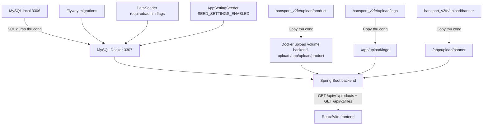
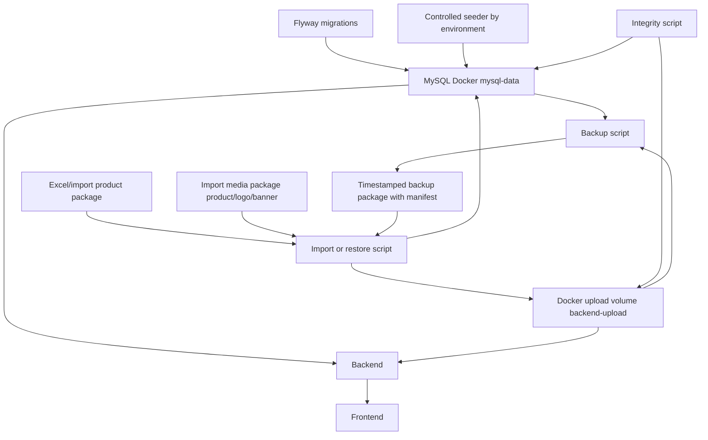

# Han Sports v2 - Data And Media Improvement Plan

## 1. Executive Summary

Han Sports v2 hien da co Docker Compose, MySQL Docker, Flyway migration, seeder va volume upload. Tuy nhien quy trinh chuyen du lieu tu MySQL local `3306` sang MySQL Docker `3307`, cung nhu dong bo file anh vao volume `/app/upload`, van phu thuoc vao thao tac thu cong. Rui ro lon nhat la mat du lieu khi reset Docker volume, import SQL sai encoding UTF-8, hoac restore database nhung quen restore file upload.

Muc tieu portfolio la tao quy trinh demo co the lap lai: schema do Flyway quan ly, demo data duoc kiem soat theo environment, file upload di kem database trong mot backup/restore package ro rang. Muc tieu production ve sau la tach moi truong, backup dinh ky, restore test va chuyen media sang Cloudinary hoac S3-compatible storage khi can deploy that.

Nhung viec chua can lam ngay: Kubernetes, microservices, distributed storage phuc tap, pipeline data staging day du. Project hien phu hop voi local development, demo, portfolio va chuyen moi truong ban dau.

Repo facts da xac minh:

| Noi dung | Trang thai hien tai |
| --- | --- |
| Docker MySQL | `mysql:8.0`, container `hansport-mysql`, host port mac dinh `3307` |
| Database volume | `mysql-data:/var/lib/mysql` |
| Upload volume | `backend-upload:/app/upload` |
| Flyway | Co `V1__baseline_schema.sql`, `V2__money_fields_to_bigint.sql` |
| Seeder role/admin | `DataSeeder` chi seed required roles va local admin optional qua `SEED_REQUIRED_ENABLED`, `SEED_ADMIN_ENABLED`, `SEED_ADMIN_PASSWORD` |
| Seeder settings | `AppSettingSeeder` co environment gate rieng qua `SEED_SETTINGS_ENABLED` |
| Product data | Khong con seed tu Java; chuan bi di theo workflow Excel/import |
| Upload API | `FileController` serve file qua `GET /api/v1/files` |
| Static resource | `StaticResourcesWebConfiguration.java` map `/storage/**`, nhung frontend hien dung `/api/v1/files` |
| Allowed upload folders | `FileService` cho phep `product`, `logo`, `banner` |
| Backup script | Moi co `scripts/backup-mysql.ps1`, chua backup upload, manifest, checksum |
| Git ignore | `.env`, `.env.local`, `backups/` da duoc ignore |

## 2. Current Data Flow

Luong hien tai chua duoc script hoa day du. Database va anh co the bi lech nhau vi SQL dump chi mang metadata/filename, khong mang file anh that.



Diem can luu y:

| Thanh phan | Hien trang | Rui ro |
| --- | --- | --- |
| SQL dump thu cong | Da tung dung de chuyen DB cu sang Docker | De loi encoding neu pipe text qua PowerShell |
| Upload copy thu cong | Da can copy anh vao `/app/upload` | De quen product/logo/banner hoac copy sai folder |
| Seeder | `DataSeeder` va `AppSettingSeeder` co flag rieng | Can cau hinh dung khi restore/import DB that |
| Docker reset | `docker compose down -v` xoa ca DB va upload volume | Mat du lieu neu chua backup |

## 3. Target Data Flow

Muc tieu portfolio la co backup/restore package co manifest, script co confirmation, va demo data sach khong phu thuoc DB local ca nhan.



Nguyen tac:

| Loai du lieu | Nguon su that | Cach quan ly |
| --- | --- | --- |
| Schema database | Flyway migrations | Version trong Git, review qua PR |
| Business data | Database moi truong hien tai | Backup/restore package, khong commit backup that |
| Demo/import data | Excel/import package + controlled seeder | Duoc tao lai cho portfolio, khong phu thuoc DB ca nhan |
| File/media data | Upload storage | Docker volume trong demo, object storage khi production |

## 4. Environment Matrix

| Noi dung | Local dev | Test | Demo portfolio | Staging | Production |
| --- | --- | --- | --- | --- | --- |
| Database | MySQL local `3306` hoac Docker `3307` | H2/Testcontainers neu bo sung sau | MySQL Docker `3307` | DB rieng staging | DB managed rieng production |
| Flyway | Bat | Bat | Bat | Bat | Bat, co review migration |
| Seeder | Bat co chon loc cho role/settings/admin | Test fixture rieng | Controlled system seed + import package | Chi seed role/settings bat buoc khi duoc phe duyet | Khong seed product demo |
| Upload storage | Local folder hoac Docker `backend-upload` | Temp folder rieng | Docker `backend-upload` tu import media package | Storage rieng staging | Cloudinary/S3 hoac volume managed co backup |
| Secret | `.env` local, khong commit | Env test rieng | `.env.example` + placeholder | Secret store/staging env | Secret manager |
| Backup | Thu cong co script | Khong can hoac snapshot test | Script backup package | Scheduled backup | Scheduled backup + restore test |
| Import du lieu that | Chi khi can migrate local | Khong | Khong dung data ca nhan | Chi data staging da an danh | Khong import thu cong tu dev |

Seeder policy de xuat:

| Environment | Co chay migration? | Co chay seed role? | Co chay seed admin? | Co seed product demo? | Co import du lieu hang hoa? |
| --- | --- | --- | --- | --- | --- |
| Local dev | Co | Co neu `SEED_REQUIRED_ENABLED=true` | Co neu `SEED_ADMIN_ENABLED=true` va co `SEED_ADMIN_PASSWORD` | Khong | Chi khi lap trinh vien chu dong |
| Test | Co | Theo test fixture | Theo test fixture | Khong | Khong |
| Demo portfolio | Co | Co | Tuy chon demo account | Khong | Tu Excel/import package sach |
| Staging | Co | Co idempotent | Co neu duoc cau hinh | Khong | Chi restore staging backup |
| Production | Co | Co idempotent neu thieu | Khong tu tao admin mac dinh | Khong | Khong import thu cong |

## 5. Priority Roadmap

| Phase | Muc tieu | Task IDs | Dieu kien hoan thanh |
| --- | --- | --- | --- |
| Phase 0 - Protect existing data | Chan mat du lieu va sai encoding truoc khi lam tiep | DATA-01, DATA-03, DATA-05 | Co quy uoc backup package, canh bao lenh pha huy, integrity checklist ro rang |
| Phase 1 - Scripted backup and restore | Thay thao tac thu cong bang script PowerShell co guardrail | DATA-02 | Co thiet ke script, input/output, confirmation, backup truoc overwrite |
| Phase 2 - Controlled import dataset | Tao import data sach, lap lai duoc, khong phu thuoc DB ca nhan | DATA-04, DATA-06 | Seeder theo environment, Excel/import package co media |
| Phase 3 - Docker volume documentation | Lam ro volume DB/upload va hanh vi restart/rebuild/reset | DATA-09 | Docs noi ro volume nao mat khi nao, cach backup volume |
| Phase 4 - Portfolio onboarding | Nguoi khac clone repo co the chay demo | DATA-07, DATA-08, DATA-10 | Co docs setup, backup/restore, checklist sau restore |
| Phase 5 - Production-oriented storage and backup | Chuan bi duong nang cap gan production | DATA-11, DATA-12, DATA-13, DATA-14 | Co backlog staging/prod/storage/monitoring |

## 6. Detailed Task Cards

### DATA-01 - Standardize backup package

**Priority:** P0  
**Complexity:** M  
**Depends on:** None

**Problem**

Backup hien moi tap trung vao database SQL dump. File upload that nam ngoai DB, nen restore SQL co the lam UI vo anh. Chua co manifest de biet backup gom bao nhieu bang, bao nhieu product image va bao nhieu file media.

**Goal**

Chuan hoa mot backup package gom database dump, upload folders, metadata va timestamp de co the restore test lap lai.

**Relevant files**

- `scripts/backup-mysql.ps1`
- `.gitignore`
- `docker-compose.yml`
- `hansport_v2be/src/main/resources/db/migration/`
- `hansport_v2fe/upload/`

**Proposed changes**

1. Dinh nghia backup folder: `backups/YYYY-MM-DD_HHMMSS/`.
2. Dinh nghia database dump: `database/hansport-demo.sql`.
3. Dinh nghia media backup: `upload/product/`, `upload/logo/`, `upload/banner/`.
4. Dinh nghia `manifest.json` gom app name, timestamp, source environment, Docker project, Flyway version, table counts, product count, product image count, upload file counts va checksum.
5. Yeu cau SQL dump/import dung `--default-character-set=utf8mb4`.
6. Canh bao khong pipe SQL qua PowerShell text stream khi import vao Docker; dung binary-safe path nhu `docker cp` file vao container roi chay `mysql < file`.
7. Ghi ro `backups/` khong commit vao Git.

**Expected outputs**

- Tai lieu backup package format.
- Tieu chi backup hop le.
- Quy uoc ten folder/file.

**Safety rules**

- Khong backup vao thu muc tracked trong Git ngoai tru `backups/`.
- Khong in secret vao manifest.
- Backup phai tao manifest sau khi dump va copy media thanh cong.
- Restore test phai chay tren DB Docker demo, khong chay truc tiep len DB local cu neu khong co confirmation rieng.

**Acceptance criteria**

- [ ] Backup package co `manifest.json`, `database/hansport-demo.sql`, `upload/product`, `upload/logo`, `upload/banner`.
- [ ] Manifest co table counts, product count, product_images count, upload file counts.
- [ ] SQL dump giu dung UTF-8 tieng Viet.
- [ ] Backup package nam trong `backups/` va khong bi Git track.
- [ ] Tai lieu co cach restore test va verify sau restore.

**Verification commands**

```powershell
Test-Path backups
git check-ignore backups/
Get-ChildItem backups -Directory
```

Sau khi script duoc trien khai o task sau:

```powershell
.\scripts\backup-demo-data.ps1
Test-Path backups\<timestamp>\manifest.json
Test-Path backups\<timestamp>\database\hansport-demo.sql
Test-Path backups\<timestamp>\upload\product
```

**Rollback**

Vi day la chuan tai lieu, rollback la revert commit docs. Khi script da ton tai, rollback backup package khong xoa du lieu nguon; chi xoa backup package sai sau khi da tao backup thay the hop le.

**Suggested commit**

```text
docs(data): define backup package format
```

### DATA-02 - Design PowerShell data scripts

**Priority:** P0  
**Complexity:** L  
**Depends on:** DATA-01, DATA-03

**Problem**

Hien chi co `scripts/backup-mysql.ps1`, chua co import Docker, backup upload, restore full package hoac integrity check. Cac thao tac da tung phai lam thu cong nen de sai encoding hoac thieu anh.

**Goal**

Thiet ke bo script PowerShell co guardrail ro rang, chua viet code trong task nay.

**Relevant files**

- `scripts/backup-mysql.ps1`
- `docker-compose.yml`
- `.env.example`
- `hansport_v2be/src/main/resources/application.properties`

**Proposed changes**

1. Ke thua hoac refactor `backup-mysql.ps1` thanh backup DB binary-safe, khong dua password len command line neu co the.
2. Thiet ke `export-local-db.ps1` de doc DB local `3306`.
3. Thiet ke `import-db-to-docker.ps1` de import vao MySQL Docker `3307` qua container `hansport-mysql`.
4. Thiet ke `backup-demo-data.ps1` de backup DB Docker + upload volume.
5. Thiet ke `restore-demo-data.ps1` de restore full package co confirmation.
6. Thiet ke `sync-upload-to-docker.ps1` de copy upload tu local package vao `/app/upload`.
7. Thiet ke `verify-data-integrity.ps1` de check DB metadata va file media.

**Expected outputs**

- Script design table trong tai lieu.
- Danh sach input/output va safety mode cho tung script.
- Danh sach lenh noi bo du kien.

**Safety rules**

- Script ghi du lieu phai hoi confirmation.
- Script overwrite phai backup truoc.
- Script destructive khong duoc goi `docker compose down -v` truc tiep o ban dau.
- Script import SQL phai dung file binary-safe, khong dung `Get-Content -Raw | docker exec mysql`.

**Acceptance criteria**

- [ ] Co du 6 script duoc thiet ke.
- [ ] Moi script ghi ro doc/ghi/overwrite/confirmation/auto-backup.
- [ ] Restore script co yeu cau confirmation va backup truoc overwrite.
- [ ] Integrity script khong tu xoa orphan file trong v1.

**Verification commands**

```powershell
rg -n "export-local-db|import-db-to-docker|backup-demo-data|restore-demo-data|sync-upload-to-docker|verify-data-integrity" docs\DATA_AND_MEDIA_IMPROVEMENT_PLAN.md
```

**Rollback**

Revert tai lieu script design neu thiet ke chua dung. Khi trien khai script that, moi script phai duoc commit rieng de rollback doc lap.

**Suggested commit**

```text
docs(data): design backup restore scripts
```

### DATA-03 - Prevent accidental Docker volume deletion

**Priority:** P0  
**Complexity:** S  
**Depends on:** None

**Problem**

`docker compose down -v`, `docker volume rm` va `docker system prune` co the xoa MySQL volume hoac upload volume. Nguoi dung de nham lan giua restart, rebuild va reset.

**Goal**

Tai lieu hoa muc do rui ro cua tung lenh Docker va dat rule backup truoc reset volume.

**Relevant files**

- `docker-compose.yml`
- `docs/DEPLOYMENT.md`
- `.gitignore`

**Proposed changes**

1. Tao bang safety guide cho cac lenh Docker.
2. Ghi ro `docker compose down` chi dung container, khong xoa volume.
3. Ghi ro `docker compose down -v` xoa ca `mysql-data` va `backend-upload`.
4. Ghi ro reset volume chi duoc thuc hien qua script co confirmation sau khi backup ton tai.
5. De xuat docs warning trong `docs/BACKUP_AND_RESTORE.md` va `docs/DEMO_SETUP.md`.

**Expected outputs**

- Bang destructive command safety.
- Rule: khong khuyen khich chay lenh xoa volume truc tiep.

**Safety rules**

- Khong chay bat ky lenh reset nao trong task nay.
- Tat ca reset phai co backup truoc va confirmation typed phrase nhu `I_UNDERSTAND_THIS_WILL_DELETE_DOCKER_DATA`.

**Acceptance criteria**

- [ ] Tai lieu co `docker compose down`.
- [ ] Tai lieu co `docker compose down -v`.
- [ ] Tai lieu co `docker volume rm`.
- [ ] Tai lieu co `docker system prune`.
- [ ] Moi lenh co muc do rui ro va backup requirement.

**Verification commands**

```powershell
rg -n "docker compose down -v|docker volume rm|docker system prune" docs\DATA_AND_MEDIA_IMPROVEMENT_PLAN.md
```

**Rollback**

Revert docs. Khong co thay doi du lieu.

**Suggested commit**

```text
docs(data): add docker volume safety guide
```

### DATA-04 - Control seeders by environment

**Priority:** P0  
**Complexity:** M  
**Depends on:** DATA-03

**Problem**

`DataSeeder` va `AppSettingSeeder` da co gate rieng, nhung policy can duoc ghi ro de khong bat nham seed admin/settings tren database da import. Product data khong con seed tu Java, nen can tach rieng workflow import hang hoa.

**Goal**

Tach ro seed required roles, settings, local admin va product/business data theo environment.

**Relevant files**

- `hansport_v2be/src/main/java/com/javaweb/config/DataSeeder.java`
- `hansport_v2be/src/main/java/com/javaweb/config/AppSettingSeeder.java`
- `hansport_v2be/src/main/resources/application.properties`
- `.env.example`
- `docker-compose.yml`

**Proposed changes**

1. Dung seed flags hien co: `SEED_ENABLED`, `SEED_REQUIRED_ENABLED`, `SEED_ADMIN_ENABLED`, `SEED_ADMIN_PASSWORD`, `SEED_SETTINGS_ENABLED`.
2. Giu Flyway la nguon schema, khong dung seeder de thay schema.
3. Role/settings bat buoc phai idempotent.
4. Khong seed product demo tu Java.
5. Production/staging mac dinh tat local admin va settings seed neu DB da restore/import.
6. Product/business data di qua Excel/import workflow rieng.

**Expected outputs**

- Bang environment seeding policy.
- Checklist refactor seeder trong task implementation sau.

**Safety rules**

- Khong seed product demo vao DB da import.
- Khong tao admin demo trong production.
- Khong ghi secret/password that trong seed data.

**Acceptance criteria**

- [ ] Tai lieu phan biet role/settings/admin/product business data.
- [ ] Tai lieu chi ra `AppSettingSeeder` da co env gate.
- [ ] Co policy cho local/test/demo/staging/production.

**Verification commands**

```powershell
rg -n "AppSettingSeeder|SEED_REQUIRED_ENABLED|SEED_ADMIN_ENABLED|SEED_SETTINGS_ENABLED|production" docs\DATA_AND_MEDIA_IMPROVEMENT_PLAN.md
```

**Rollback**

Revert docs. Khi trien khai code sau nay, rollback bang cach dua flags ve mac dinh an toan `false`.

**Suggested commit**

```text
docs(data): define environment seeding policy
```

### DATA-05 - Synchronize upload files with database metadata

**Priority:** P0  
**Complexity:** M  
**Depends on:** DATA-01, DATA-02

**Problem**

DB luu filename trong `product_images.image_url`, nhung file that nam trong upload storage. Sau restore SQL, co the thieu file anh. Nguoc lai, upload folder co the chua orphan files khong con duoc DB tham chieu.

**Goal**

Dinh nghia quy trinh sync va integrity check giua DB metadata va upload files.

**Relevant files**

- `hansport_v2be/src/main/java/com/javaweb/service/FileService.java`
- `hansport_v2be/src/main/java/com/javaweb/controller/FileController.java`
- `hansport_v2be/src/main/java/com/javaweb/config/StaticResourcesWebConfiguration.java`
- `hansport_v2fe/upload/`
- `docker-compose.yml`

**Proposed changes**

1. `verify-data-integrity.ps1` lay danh sach filename tu `product_images`, settings hero/logo neu co.
2. Script check file ton tai trong `/app/upload/product`, `/app/upload/logo`, `/app/upload/banner`.
3. Script bao missing file, orphan file, missing folder, duplicate filename, HTTP failure.
4. Script khong tu dong xoa orphan file trong v1.
5. Script can xu ly `banner` nhu upload folder chinh thuc va van fallback du lieu cu neu setting chua co `imageFolder`.
6. HTTP check dung `GET`, khong dung `HEAD`, vi security hien chi permit `GET /api/v1/files`.

**Expected outputs**

- Integrity report design.
- Remediation guide cho missing/orphan/duplicate.

**Safety rules**

- Khong xoa orphan file tu dong.
- Khong sua DB metadata tu dong.
- Khi copy upload vao Docker, phai dung dung path `/app/upload/<folder>`.

**Acceptance criteria**

- [ ] Tai lieu co bang loi integrity.
- [ ] Tai lieu co missing file/orphan file/missing folder/duplicate filename.
- [ ] Tai lieu co HTTP check qua `/api/v1/files`.
- [ ] Tai lieu ghi ro `banner` folder la folder upload chinh thuc.

**Verification commands**

```powershell
rg -n "Missing file|Orphan file|Duplicate filename|/api/v1/files|banner" docs\DATA_AND_MEDIA_IMPROVEMENT_PLAN.md
```

**Rollback**

Revert docs. Neu sau nay script bao false positive, sua mapping folder thay vi xoa file.

**Suggested commit**

```text
docs(data): define upload integrity checks
```

### DATA-06 - Create clean product import dataset strategy

**Priority:** P1  
**Complexity:** L  
**Depends on:** DATA-04, DATA-05

**Problem**

Product demo/import hien co the phu thuoc vao DB local ca nhan va thu muc upload local. Nguoi khac clone repo kho tao duoc dataset hang hoa giong nhau.

**Goal**

Thiet ke dataset import sach, khong chua du lieu ca nhan, co Excel product data va media di kem.

**Relevant files**

- `hansport_v2be/src/main/java/com/javaweb/config/DataSeeder.java`
- `hansport_v2be/src/main/java/com/javaweb/config/AppSettingSeeder.java`
- `data/import/README.md`
- `docs/PRODUCT_EXCEL_IMPORT_WORKFLOW.md`

**Proposed changes**

1. Dung cau truc `data/import/products.xlsx` va `data/import/media/product`, `data/import/media/logo`, `data/import/media/banner`.
2. Excel gom 10-20 san pham portfolio, brand/category/target, gia, ton kho va danh sach file anh.
3. Khong dua email, dia chi, so dien thoai hoac customer/order data that vao Excel.
4. Media su dung anh minh hoa hop le, khong dung du lieu rieng tu may ca nhan neu public.
5. Product/media import qua workflow co validate, dry-run va backup truoc khi apply.

**Expected outputs**

- Product import package design.
- Quy tac khong dua data ca nhan vao portfolio.

**Safety rules**

- Khong commit backup that.
- Khong commit secret.
- Khong commit email/dia chi/phone that.

**Acceptance criteria**

- [ ] Co strategy Excel/import package.
- [ ] Co danh sach cot Excel toi thieu.
- [ ] Co rule media import phu hop portfolio.

**Verification commands**

```powershell
rg -n "products.xlsx|data/import|10-20|dry-run" docs\DATA_AND_MEDIA_IMPROVEMENT_PLAN.md
```

**Rollback**

Revert import package/docs. Khong anh huong DB production neu import workflow khong duoc chay.

**Suggested commit**

```text
docs(data): define portfolio product import dataset strategy
```

### DATA-07 - Plan demo setup documentation

**Priority:** P1  
**Complexity:** M  
**Depends on:** DATA-06

**Problem**

`docs/DEMO_SETUP.md` chua co trong project hien tai. Nguoi clone repo chua co mot quy trinh duy nhat de chay demo day du ca DB va anh.

**Goal**

Thiet ke tai lieu setup demo tung buoc.

**Relevant files**

- `docs/DEPLOYMENT.md`
- `.env.example`
- `docker-compose.yml`
- `docs/DEMO_SETUP.md` - Chua co trong project hien tai.

**Proposed changes**

1. Huong dan clone repo.
2. Copy `.env.example` thanh `.env`.
3. Chay `docker compose up -d --build`.
4. Giai thich Flyway migration tu dong.
5. Giai thich demo data/seed/package.
6. Giai thich upload media mount vao `backend-upload`.
7. Huong dan kiem tra anh hien thi.
8. Canh bao backup truoc reset.
9. Huong dan restore demo data.
10. Liet ke loi thuong gap: port 3306/3307, UTF-8, anh vo, 401 do endpoint can token.

**Expected outputs**

- Outline day du cho `docs/DEMO_SETUP.md`.

**Safety rules**

- Khong yeu cau `docker compose down -v` trong quick start.
- Neu can reset, link sang backup/restore docs.

**Acceptance criteria**

- [ ] Tai lieu setup demo co DB va upload media.
- [ ] Co verify commands sau setup.
- [ ] Co common issues.

**Verification commands**

```powershell
rg -n "DEMO_SETUP|Clone|Flyway|upload media|common issues" docs\DATA_AND_MEDIA_IMPROVEMENT_PLAN.md
```

**Rollback**

Revert docs.

**Suggested commit**

```text
docs(data): plan demo setup guide
```

### DATA-08 - Plan backup and restore documentation

**Priority:** P1  
**Complexity:** M  
**Depends on:** DATA-01, DATA-02, DATA-03

**Problem**

`docs/BACKUP_AND_RESTORE.md` chua co trong project hien tai. Quy trinh backup/restore hien nam rai rac va moi co DB backup co ban.

**Goal**

Thiet ke tai lieu backup/restore du ca database va upload folders.

**Relevant files**

- `scripts/backup-mysql.ps1`
- `docs/DEPLOYMENT.md`
- `docs/BACKUP_AND_RESTORE.md` - Chua co trong project hien tai.

**Proposed changes**

1. Backup database Docker.
2. Backup upload folder/volume.
3. Restore database vao MySQL Docker `3307`.
4. Restore upload vao `/app/upload`.
5. Kiem tra integrity.
6. Ghi rule UTF-8/binary-safe import.
7. Ghi naming convention.
8. Canh bao overwrite/reset volume.

**Expected outputs**

- Outline cho `docs/BACKUP_AND_RESTORE.md`.
- Danh sach lenh verify sau restore.

**Safety rules**

- Restore overwrite phai backup truoc.
- Restore vao Docker demo mac dinh, khong dung DB local `3306` neu khong co flag ro.

**Acceptance criteria**

- [ ] Tai lieu co backup DB.
- [ ] Tai lieu co backup upload.
- [ ] Tai lieu co restore DB/upload.
- [ ] Tai lieu co integrity check va UTF-8 warning.

**Verification commands**

```powershell
rg -n "BACKUP_AND_RESTORE|UTF-8|binary-safe|overwrite" docs\DATA_AND_MEDIA_IMPROVEMENT_PLAN.md
```

**Rollback**

Revert docs.

**Suggested commit**

```text
docs(data): plan backup and restore guide
```

### DATA-09 - Standardize Docker volume documentation

**Priority:** P1  
**Complexity:** S  
**Depends on:** DATA-03

**Problem**

Docker volume da co nhung ten `mysql-data`, `backend-upload` chua duoc giai thich day du trong docs backup/restore.

**Goal**

Lam ro volume nao chua DB, volume nao chua upload, va du lieu nao song sot sau restart/rebuild/reset.

**Relevant files**

- `docker-compose.yml`
- `docs/DEPLOYMENT.md`

**Proposed changes**

1. Ghi ro `mysql-data` chua `/var/lib/mysql`.
2. Ghi ro `backend-upload` chua `/app/upload`.
3. Giai thich restart container khong mat volume.
4. Giai thich rebuild image khong mat volume.
5. Giai thich `down -v` xoa volume.
6. De xuat khong doi ten volume trong sprint dau de tranh mat data.

**Expected outputs**

- Volume reference table.
- Backup command design cho tung volume.

**Safety rules**

- Neu doi ten volume sau nay, phai backup va restore chu dong.
- Khong rename volume trong task docs nay.

**Acceptance criteria**

- [ ] Tai lieu co `mysql-data`.
- [ ] Tai lieu co `backend-upload`.
- [ ] Tai lieu co `/var/lib/mysql` va `/app/upload`.
- [ ] Tai lieu noi ro restart/rebuild/down -v.

**Verification commands**

```powershell
rg -n "mysql-data|backend-upload|/var/lib/mysql|/app/upload" docs\DATA_AND_MEDIA_IMPROVEMENT_PLAN.md
```

**Rollback**

Revert docs.

**Suggested commit**

```text
docs(data): document docker data volumes
```

### DATA-10 - Define post-restore integrity checklist

**Priority:** P1  
**Complexity:** S  
**Depends on:** DATA-05, DATA-08

**Problem**

Sau restore chua co checklist chuan de biet DB, migration, anh, login va checkout co hoat dong khong.

**Goal**

Dinh nghia checklist kiem tra sau moi lan restore.

**Relevant files**

- `docs/BACKUP_AND_RESTORE.md` - Chua co trong project hien tai.
- `scripts/verify-data-integrity.ps1` - Chua co trong project hien tai.
- `docs/DEPLOYMENT.md`

**Proposed changes**

1. Tao checklist Flyway migration.
2. Tao checklist table/role/admin/product/product_images.
3. Tao checklist file product/logo/banner.
4. Tao checklist user flow: login admin, cart, checkout COD.
5. Tao checklist restart/rebuild container khong mat du lieu.

**Expected outputs**

- Checklist co the copy vao `docs/BACKUP_AND_RESTORE.md`.

**Safety rules**

- Checklist chi doc/kiem tra, khong sua du lieu.

**Acceptance criteria**

- [ ] Co Flyway check.
- [ ] Co DB table/count check.
- [ ] Co image metadata/file check.
- [ ] Co login/cart/checkout check.
- [ ] Co restart persistence check.

**Verification commands**

```powershell
rg -n "Flyway migration thanh cong|Logo hien thi|Checkout COD|Restart container" docs\DATA_AND_MEDIA_IMPROVEMENT_PLAN.md
```

**Rollback**

Revert docs.

**Suggested commit**

```text
docs(data): define restore integrity checklist
```

## 7. Proposed Scripts

| Script | Chuc nang | Doc du lieu | Ghi du lieu | Co the overwrite | Can confirmation | Tu dong backup truoc |
| --- | --- | --- | --- | --- | --- | --- |
| `scripts/export-local-db.ps1` | Export DB local `3306` ra SQL dump UTF-8 | Co, MySQL local | Co, file backup | Khong neu timestamp moi | Khong, vi chi doc DB | Khong |
| `scripts/import-db-to-docker.ps1` | Import SQL vao MySQL Docker `hansport-mysql` | Co, SQL file | Co, Docker DB | Co | Co | Co |
| `scripts/backup-demo-data.ps1` | Backup DB Docker + upload volume thanh package | Co, Docker DB/upload | Co, `backups/<timestamp>` | Khong neu timestamp moi | Khong | Khong |
| `scripts/restore-demo-data.ps1` | Restore full backup/demo package vao Docker | Co, package | Co, Docker DB/upload | Co | Co | Co |
| `scripts/sync-upload-to-docker.ps1` | Copy upload package/local upload vao `/app/upload` | Co, upload source | Co, Docker upload volume | Co neu file cung ten | Co | Co neu target khong rong |
| `scripts/verify-data-integrity.ps1` | So sanh DB metadata, file upload va HTTP response | Co, DB/upload/API | Khong | Khong | Khong | Khong |

| Script | Muc dich | Input | Output | Dieu kien an toan | Lenh noi bo du kien |
| --- | --- | --- | --- | --- | --- |
| `export-local-db.ps1` | Tao dump tu MySQL local cu | Host, port `3306`, DB name, user, output dir | `backups/<timestamp>/database/hansport-local.sql` | Chi doc DB, khong in password | `mysqldump --default-character-set=utf8mb4 --single-transaction --routines --triggers --result-file` |
| `import-db-to-docker.ps1` | Dua SQL dump vao MySQL Docker | SQL file, container, DB name | DB Docker duoc import | Backup Docker DB truoc, confirmation bat buoc | `docker cp`, `docker exec mysql < file`, Flyway baseline neu can |
| `backup-demo-data.ps1` | Backup demo DB/upload hien tai | Docker container, upload volume/path | Full backup package | Khong overwrite timestamp, tao manifest | `docker exec mysqldump`, `docker cp`, checksum |
| `restore-demo-data.ps1` | Restore package day du | Backup/demo package path | DB/upload Docker | Confirmation typed phrase, auto backup target truoc | `docker cp`, `mysql < file`, copy upload, verify integrity |
| `sync-upload-to-docker.ps1` | Dong bo media vao Docker upload | Source upload path, target container/path | `/app/upload` co file | Confirmation neu target co file, backup truoc overwrite | `docker cp`, `chown -R app:app /app/upload` |
| `verify-data-integrity.ps1` | Bao cao DB/media mismatch | DB connection/container, upload path, base URL | Report JSON/Markdown | Khong ghi/xoa du lieu | SQL query `product_images`, `find`, HTTP `GET /api/v1/files` |

## 8. Destructive Command Safety Guide

| Lenh | Container | Database volume | Upload volume | Muc do rui ro |
| --- | --- | --- | --- | --- |
| `docker compose up -d` | Tao/chay container neu chua chay | Giu nguyen | Giu nguyen | Thap |
| `docker compose up -d --build` | Rebuild image va recreate container neu can | Giu nguyen | Giu nguyen | Thap/Trung binh, co the thay app behavior |
| `docker compose down` | Dung va xoa container/network | Giu nguyen | Giu nguyen | Thap |
| `docker compose down -v` | Dung container va xoa volume Compose | Xoa `mysql-data` | Xoa `backend-upload` | Nghiem trong |
| `docker volume ls` | Khong anh huong | Khong anh huong | Khong anh huong | An toan |
| `docker volume inspect <volume>` | Khong anh huong | Khong anh huong | Khong anh huong | An toan |
| `docker volume rm <volume>` | Khong xoa container neu dang dung volume thi thuong fail | Xoa neu chon `mysql-data` | Xoa neu chon `backend-upload` | Nghiem trong |
| `docker system prune` | Co the xoa container/network/image khong dung | Thuong khong xoa named volumes neu khong dung `--volumes` | Thuong khong xoa named volumes neu khong dung `--volumes` | Trung binh/Cao |
| `docker system prune --volumes` | Xoa rong hon | Co the xoa volume khong dung | Co the xoa volume khong dung | Nghiem trong |

| Lenh | Co an toan khong? | Dieu gi bi anh huong? | Khi nao duoc dung? | Can backup truoc? |
| --- | --- | --- | --- | --- |
| `docker compose down` | Co | Container/network | Khi muon dung stack | Khong bat buoc |
| `docker compose down -v` | Khong an toan | DB va upload volume | Chi khi reset co chu dich va da backup | Co |
| `docker compose up -d` | Co | Start/recreate container | Chay app hang ngay | Khong |
| `docker compose up -d --build` | Tuong doi an toan | Rebuild image, giu volume | Sau khi doi Dockerfile/source | Nen backup neu sap test migration moi |
| `docker volume rm` | Khong an toan | Volume duoc chi dinh | Chi qua reset script co confirmation | Co |
| `docker system prune` | Can than | Images/container/network khong dung | Don rac Docker co kiem soat | Khong bat buoc, tru khi dung `--volumes` |

Quy tac bao ve:

- Khong khuyen khich chay lenh pha huy volume truc tiep.
- Reset volume phai di qua script co confirmation.
- Script reset phai kiem tra backup package ton tai va moi hon nguong cau hinh.
- Neu chua backup upload, khong duoc reset `backend-upload`.
- Neu chua backup DB, khong duoc reset `mysql-data`.

## 9. Backup Package Design

De xuat cau truc:

```text
data/import/
+-- README.md
+-- products.xlsx
+-- media/
    +-- product/
    +-- logo/
    +-- banner/
```

Noi dung import toi thieu:

| Loai | So luong/yeu cau |
| --- | --- |
| Product | 10-20 san pham the thao cho portfolio |
| Cot Excel | `sku`, `name`, `price`, `quantity`, `brand`, `target`, `category`, `short_desc`, `detail_desc`, `image_names`, `active` |
| Settings | Co the cau hinh rieng neu can logo/banner/hero |
| Media | Anh product/logo/banner hop le, khong lay tu data ca nhan neu public |
| Order | Khong dua order/customer data vao Excel product import |

## 11. First Sprint

Sprint dau tien chi bao ve du lieu hien co, khong lam object storage.

| Thu tu | Task ID | Cong viec | Co the lam song song? | Output | Commit de xuat |
| --- | --- | --- | --- | --- | --- |
| 1 | DATA-03 | Viet canh bao Docker reset volume va phan biet restart/rebuild/reset | Co | Safety guide | `docs(data): add docker volume safety guide` |
| 2 | DATA-01 | Chuan hoa backup package DB + upload + manifest | Khong, nen sau DATA-03 | Backup package spec | `docs(data): define backup package format` |
| 3 | DATA-02 | Thiet ke script backup DB/upload va restore DB/upload | Khong | Script design | `docs(data): design backup restore scripts` |
| 4 | DATA-05 | Thiet ke integrity check DB vs upload | Co sau DATA-01 | Integrity report spec | `docs(data): define upload integrity checks` |
| 5 | DATA-04 | Chuan hoa seed policy theo environment | Co | Seeder policy | `docs(data): define environment seeding policy` |
| 6 | DATA-09 | Ghi ro `mysql-data` va `backend-upload` | Co | Volume reference | `docs(data): document docker data volumes` |
| 7 | DATA-08 | Lap outline backup/restore docs | Sau DATA-01/02/03 | Backup docs outline | `docs(data): plan backup and restore guide` |
| 8 | DATA-10 | Lap checklist sau restore | Sau DATA-05/08 | Checklist | `docs(data): define restore integrity checklist` |

## 12. Portfolio Completion Checklist

- [ ] Co Flyway migration ro rang.
- [ ] Seeder co the bat/tat theo environment.
- [ ] `AppSettingSeeder` co gate rieng hoac policy ro de khong seed nham.
- [ ] Khong tu dong them product demo vao DB that.
- [ ] Co workflow import product sach bang Excel/media package.
- [ ] Co backup database script.
- [ ] Co backup upload script.
- [ ] Co restore database script.
- [ ] Co restore upload script.
- [ ] Co integrity check script.
- [ ] Co docs setup demo.
- [ ] Co docs backup va restore.
- [ ] Docker volume DB duoc ghi ro.
- [ ] Docker volume upload duoc ghi ro.
- [ ] Restart container khong mat DB.
- [ ] Restart container khong mat anh.
- [ ] Rebuild image khong mat DB/upload.
- [ ] Reset volume chi duoc thuc hien sau backup.
- [ ] Nguoi khac clone repo co the chay demo.
- [ ] Product images hien thi `200 image/*` qua `/api/v1/files`.
- [ ] Logo va banner hien thi.
- [ ] Known limitations ve local volume/object storage duoc ghi ro.

## 13. Production Backlog

| Task | Gia tri | Khi nao can lam | Do phuc tap |
| --- | --- | --- | --- |
| DATA-11 - Tach moi truong dev/test/demo/staging/prod | Giam nguy co seed/import nham | Truoc khi deploy public | M |
| Staging DB | Test migration/restore truoc production | Khi co server demo cong khai | M |
| Production DB managed | On dinh va backup tot hon MySQL local | Khi co user that | L |
| Scheduled database backup | Giam nguy co mat data | Truoc production | M |
| Scheduled upload backup | Giu media dong bo voi DB | Truoc production | M |
| Restore test dinh ky | Bao dam backup dung duoc | Truoc production | M |
| Cloudinary/S3-compatible storage | Tach media khoi container/VM | Khi deploy that hoac can CDN | L |
| CDN | Tang toc media public | Khi traffic tang | M |
| Storage health check | Phat hien upload/storage loi | Khi dung object storage | M |
| Structured backup logs | De audit backup/restore | Khi co scheduled backup | S |
| Monitoring/Actuator metrics | Quan sat DB/app | Truoc production | M |
| Alert backup failed | Phat hien backup hong som | Khi backup dinh ky | M |
| Secret manager | Bao ve DB password/API key | Khi deploy public | M |
| Disaster recovery workflow | Khoi phuc sau su co lon | Khi co production data | L |

### DATA-11 - Environment separation backlog

- Moi environment co database rieng.
- Moi environment co `.env`/secret rieng.
- Seeder flags rieng cho dev/test/demo/staging/prod.
- Upload storage rieng, khong share production media voi dev.
- CORS/logging level rieng.

### DATA-12 - Scheduled backup backlog

- Daily database backup.
- Daily/weekly upload backup tuy dung luong.
- Retention: 7 daily, 4 weekly, 3 monthly cho MVP.
- Restore test dinh ky, khong chi tao backup.

### DATA-13 - Object storage backlog

| Giai phap | Phu hop demo | Phu hop production | Uu diem | Han che |
| --- | --- | --- | --- | --- |
| Docker volume local | Tot | Han che | Don gian, chay local nhanh | Can tu backup, kho scale, mat neu reset volume |
| Cloudinary | Tot | Tot cho media web | De dung, co CDN/image transform | Phu thuoc third-party, can API key |
| S3-compatible storage | Trung binh | Tot | Chuan cong nghiep, linh hoat | Can cau hinh bucket, IAM, CDN |

Khuyen nghi: giu Docker volume cho demo/portfolio; chuyen sang Cloudinary hoac S3-compatible storage khi deploy that.

### DATA-14 - Logging, monitoring, alert backlog

- Log loi upload/download file.
- Log Flyway migration result.
- Log backup/restore result vao file rieng.
- Health check database.
- Health check storage path/object storage.
- Actuator health/info/metrics.
- Alert khi backup that bai.
- Alert khi storage gan day.

## 14. Recommended Next Prompt

```text
Hay trien khai DATA-01 trong docs/DATA_AND_MEDIA_IMPROVEMENT_PLAN.md.

Chi thuc hien mot task DATA-01. Khong chuyen sang task tiep theo.
Khong chay lenh pha huy du lieu, khong import/export DB that, khong copy upload that, khong sua .env.
Chi tao/cap nhat tai lieu can thiet de chuan hoa backup package database + upload + manifest.
Neu co ghi file, chi sua file docs lien quan.
Sau khi xong, chay cac lenh kiem tra doc-only lien quan, tom tat diff va noi ro file nao da tao/chinh sua.
```

