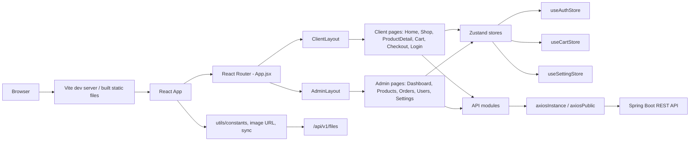

# Phân tích kiến trúc frontend React - Han Sports v2

Tài liệu này chỉ dựa trên source code trong project Han Sports v2.

## 1. Frontend dùng React/Vite như thế nào?

Frontend nằm trong thư mục `hansport_v2fe` và là một ứng dụng React chạy bằng Vite.

File entry point HTML:

```html
<!-- hansport_v2fe/index.html -->
<div id="root"></div>
<script type="module" src="/src/main.jsx"></script>
```

File entry point React:

```jsx
// hansport_v2fe/src/main.jsx
import { StrictMode } from 'react'
import { createRoot } from 'react-dom/client'
import './index.css'
import App from './App.jsx'

createRoot(document.getElementById('root')).render(
  <StrictMode>
    <App />
  </StrictMode>,
)
```

Dependencies chính trong `hansport_v2fe/package.json`:

```json
{
  "dependencies": {
    "axios": "^1.13.2",
    "react": "^19.2.5",
    "react-dom": "^19.2.5",
    "react-hot-toast": "^2.6.0",
    "react-router-dom": "^7.15.0",
    "zustand": "^5.0.13"
  },
  "devDependencies": {
    "@vitejs/plugin-react": "^6.0.1",
    "tailwindcss": "^3.4.19",
    "vite": "^7.2.7"
  }
}
```

Vite dev server được cấu hình ở port `5173`, proxy request `/api` vì backend Spring Boot port `8080`:

```js
// hansport_v2fe/vite.config.js
export default defineConfig({
  plugins: [react()],
  server: {
    port: 5173,
    proxy: {
      '/api': {
        target: 'http://localhost:8080',
        changeOrigin: true,
        secure: false,
      },
    },
  },
  build: {
    outDir: 'dist',
    sourcemap: false,
  },
})
```

Kết luận:

- Frontend là SPA React.
- Build/dev đó Vite quản lý.
- Routing nằm trong React Router.
- API gửi vì backend thông qua axios.
- State client dùng Zustand.
- UI style bằng Tailwind CSS vì CSS riêng trong `src/index.css`.

## 2. Routing trong App.jsx

File routing chính là `hansport_v2fe/src/App.jsx`.

```jsx
// hansport_v2fe/src/App.jsx
import { BrowserRouter, Routes, Route } from "react-router-dom";
import { Toaster } from "react-hot-toast";
import ClientLayout from "./layouts/ClientLayout";
import AdminLayout from "./layouts/AdminLayout";
```

`App` load settings toàn cuc khi ứng dụng khởi động:

```jsx
// hansport_v2fe/src/App.jsx
function App() {
  const { fetchSettings } = useSettingStore();

  useEffect(() => {
    fetchSettings();
  }, [fetchSettings]);
```

Routing client:

```jsx
// hansport_v2fe/src/App.jsx
<Route path="/" element={<ClientLayout />}>
  <Route index element={<HomePage />} />
  <Route path="shop" element={<ShopPage />} />
  <Route path="products/:id" element={<ProductDetailPage />} />
  <Route path="cart" element={<CartPage />} />
  <Route path="checkout" element={<CheckoutPage />} />
  <Route path="login" element={<LoginPage />} />
  <Route path="register" element={<RegisterPage />} />
  <Route path="orders" element={<MyOrdersPage />} />
  <Route path="profile" element={<ProfilePage />} />
  <Route path="*" element={<NotFoundPage />} />
</Route>
```

Routing admin:

```jsx
// hansport_v2fe/src/App.jsx
<Route path="/admin" element={<AdminLayout />}>
  <Route index element={<DashboardPage />} />
  <Route path="products" element={<ProductsPage />} />
  <Route path="orders" element={<OrdersAdminPage />} />
  <Route path="users" element={<UsersPage />} />
  <Route path="settings" element={<SettingsPage />} />
  <Route path="*" element={<NotFoundPage />} />
</Route>
```

Toast notification được gán global:

```jsx
// hansport_v2fe/src/App.jsx
<Toaster position="bottom-right" toastOptions={{ duration: 3000 }} />
```

## 3. Layout client và admin

### 3.1. ClientLayout

File: `hansport_v2fe/src/layouts/ClientLayout.jsx`

`ClientLayout` là layout cho phần khách hàng. Nó render:

- `Header`
- nội dung route còn qua `Outlet`
- `Footer`
- `MobileNav`

```jsx
// hansport_v2fe/src/layouts/ClientLayout.jsx
return (
  <>
    <Header />
    <main className="min-h-screen bg-slate-50">
      <Outlet />
    </main>
    <Footer />
    <MobileNav />
  </>
);
```

Layout này cũng xử lý khôi phục session và load giỏ hàng:

```jsx
// hansport_v2fe/src/layouts/ClientLayout.jsx
const tryRestoreSession = async () => {
  if (accessToken) return;
  if (!user) return;
  try {
    const res = await authApi.refresh();
    const newToken = res.data?.data?.access_token || res.data?.data?.accessToken;
    if (!newToken) return;
    const accountRes = await authApi.getAccount();
    const freshUser = accountRes.data?.data || user;
    setAuth(newToken, freshUser);
  } catch {
    clearAuth();
  }
};
```

Sau đó nếu có access token thứ load cart:

```jsx
// hansport_v2fe/src/layouts/ClientLayout.jsx
const loadCart = async () => {
  if (!accessToken) return;
  try {
    const res = await cartApi.getCart();
    const items = res.data?.data?.cartDetails || res.data?.data || [];
    setCart(items);
  } catch {
    // silent fail
  }
};
```

Lưu ý: `accessToken` không được persist xuong localStorage, nên layout phải gửi refresh token để lấy access token mới nếu browser refresh trang.

### 3.2. AdminLayout

File: `hansport_v2fe/src/layouts/AdminLayout.jsx`

`AdminLayout` bảo vệ khu vuc admin bằng state user trong auth store:

```jsx
// hansport_v2fe/src/layouts/AdminLayout.jsx
if (!user) {
  return <Navigate to="/login" replace />;
}

if (!isAdmin()) {
  return <Navigate to="/" replace />;
}
```

Sau khi pass guard, layout render admin shell:

```jsx
// hansport_v2fe/src/layouts/AdminLayout.jsx
<div className="min-h-screen bg-admin-bg text-slate-900">
  <AdminSidebar
    onLogout={handleLogout}
    user={user}
    activePath={location.pathname}
  />
  <AdminMobileDrawer ... />
  <div className="lg:pl-72">
    <AdminTopbar ... />
    <main className="px-4 pb-10 pt-5 sm:px-6 lg:px-8">
      <Outlet />
    </main>
  </div>
</div>
```

Menu admin nằm trong:

```jsx
// hansport_v2fe/src/components/admin/shell/navItems.js
export const NAV_ITEMS = [
  { label: "Dashboard", path: "/admin", icon: "dashboard" },
  { label: "San pham", path: "/admin/products", icon: "inventory_2" },
  { label: "Don hang", path: "/admin/orders", icon: "receipt_long" },
  { label: "Nguoi dung", path: "/admin/users", icon: "group" },
  { label: "Cau hinh", path: "/admin/settings", icon: "tune" },
];
```

Logout admin gửi backend rồi clear auth store:

```jsx
// hansport_v2fe/src/layouts/AdminLayout.jsx
const handleLogout = async () => {
  try {
    await authApi.logout();
  } finally {
    clearAuth();
    navigate("/login", { replace: true });
  }
};
```

## 4. Cách gửi API qua axios

Axios được cấu hình tập trung trong `hansport_v2fe/src/api/axiosSetup.js`.

```js
// hansport_v2fe/src/api/axiosSetup.js
const BASE_URL = API_BASE_URL;

export const axiosInstance = axios.create({
  baseURL: BASE_URL,
  withCredentials: true,
});

export const axiosPublic = axios.create({
  baseURL: BASE_URL,
  withCredentials: true,
});
```

`API_BASE_URL` lấy từ env `VITE_API_URL`; nếu không có thể request sẽ dùng same-origin, vì Vite proxy sẽ đây `/api` sang backend:

```js
// hansport_v2fe/src/utils/constants.js
export const API_BASE_URL = (import.meta.env.VITE_API_URL || "").replace(/\/$/, "");
```

Request interceptor tự động gán Bearer token:

```js
// hansport_v2fe/src/api/axiosSetup.js
axiosInstance.interceptors.request.use((config) => {
  const { accessToken } = useAuthStore.getState();
  if (accessToken) {
    config.headers.Authorization = `Bearer ${accessToken}`;
  }
  return config;
});
```

Response interceptor xử lý refresh token khi API trả `401`:

```js
// hansport_v2fe/src/api/axiosSetup.js
axiosInstance.interceptors.response.use(
  (response) => response,
  async (error) => {
    const originalRequest = error.config;

    if (error.response?.status === 401 && !originalRequest._retry) {
      originalRequest._retry = true;
      ...
      const response = await axiosPublic.get("/api/v1/auth/refresh");
      const responseData = response.data?.data || response.data;
      const newAccessToken = responseData?.access_token || responseData?.accessToken;
      ...
      useAuthStore.getState().setAccessToken(newAccessToken);
      return axiosInstance(originalRequest);
    }

    return Promise.reject(error);
  }
);
```

Các API module chính:

| File | Vai trò |
|---|---|
| `hansport_v2fe/src/api/authApi.js` | Login, register, refresh token, logout, get account, update profile, change password, Google login |
| `hansport_v2fe/src/api/productApi.js` | Public/admin product API, upload file, import product |
| `hansport_v2fe/src/api/cartApi.js` | Giỏ hàng: get, add, update quantity, remove |
| `hansport_v2fe/src/api/orderApi.js` | Tạo đơn, xem đơn user, admin quản lý đơn |
| `hansport_v2fe/src/api/dashboardApi.js` | Lấy số liệu dashboard admin |
| `hansport_v2fe/src/api/settingApi.js` | Lấy/cập nhật settings site |
| `hansport_v2fe/src/api/userApi.js` | Admin quản lý user |

Vì đã product API:

```js
// hansport_v2fe/src/api/productApi.js
export const productApi = {
  getAll: (params) => axiosInstance.get("/api/v1/products", { params }),
  getNavigation: () => axiosInstance.get("/api/v1/products/navigation"),
  getById: (id) => axiosInstance.get(`/api/v1/products/${id}`),
  create: (data) => axiosInstance.post("/api/v1/products", data),
  update: (id, data) => axiosInstance.put(`/api/v1/products/${id}`, data),
  remove: (id) => axiosInstance.delete(`/api/v1/products/${id}`),
  importProducts: (file, options = {}) => { ... },
  uploadFile: (file, folder = "product") => { ... },
};
```

## 5. State management bằng Zustand

Frontend có 3 store Zustand chính trong `hansport_v2fe/src/store`.

### 5.1. Auth store

File: `hansport_v2fe/src/store/useAuthStore.js`

Auth store lưu:

- `accessToken`
- `user`

```js
// hansport_v2fe/src/store/useAuthStore.js
export const useAuthStore = create(
  persist(
    (set, get) => ({
      accessToken: null,
      user: null,
      setAuth: (accessToken, user) =>
        set({ accessToken, user: normalizeUser(user) }),
      clearAuth: () => set({ accessToken: null, user: null }),
      isAuthenticated: () => !!get().user,
      isAdmin: () => get().user?.role?.name === "ADMIN",
    }),
    {
      name: "hansport-auth",
      partialize: (state) => ({ user: state.user }),
    }
  )
);
```

Điểm đáng chú ý:

- `user` được persist.
- `accessToken` không persist.
- Sau khi refresh browser, ứng dụng biết user có nhưng phải gửi `/auth/refresh` để có access token mới.

### 5.2. Cart store

File: `hansport_v2fe/src/store/useCartStore.js`

Cart store lưu giỏ hàng ở client:

```js
// hansport_v2fe/src/store/useCartStore.js
export const useCartStore = create((set, get) => ({
  cartItems: [],
  totalCount: 0,
  selectedIds: [],
  setCart: (items) =>
    set({
      cartItems: items,
      totalCount: items.reduce((sum, item) => sum + item.quantity, 0),
      selectedIds: items.map((item) => item.id),
    }),
  ...
}));
```

Tổng tiền tính trên nhưng cart item dạng được chọn:

```js
// hansport_v2fe/src/store/useCartStore.js
getTotal: () => {
  const { cartItems, selectedIds } = get();
  return cartItems
    .filter((item) => selectedIds.includes(item.id))
    .reduce((sum, item) => sum + item.price * item.quantity, 0);
},
```

### 5.3. Setting store

File: `hansport_v2fe/src/store/useSettingStore.js`

Setting store load public settings từ backend:

```js
// hansport_v2fe/src/store/useSettingStore.js
fetchSettings: async () => {
  if (get().settings && Object.keys(get().settings).length > 0) {
    return get().settings;
  }
  set({ loading: true });
  try {
    const res = await settingApi.getAllSettings();
    const settings = res.data?.data || {};
    set({ settings, loading: false });
    return settings;
  } catch (error) {
    set({ loading: false });
    return {};
  }
},
```

`getSetting` có logic parse JSON string:

```js
// hansport_v2fe/src/store/useSettingStore.js
getSetting: (key, defaultValue = null) => {
  const value = get().settings?.[key];
  if (value === undefined || value === null || value === "") {
    return defaultValue;
  }
  try {
    if (typeof value === "string" && (value.startsWith("[") || value.startsWith("{"))) {
      return JSON.parse(value);
    }
  } catch (error) {
    return defaultValue;
  }
  return value;
},
```

## 6. Cấu trúc pages/components

Tổng quan thư mục frontend:

| Đường dẫn | Vai trò |
|---|---|
| `hansport_v2fe/src/api` | Gồm các wrapper gửi backend API bằng axios |
| `hansport_v2fe/src/components/common` | Component dùng cho client: header, footer, card sản phẩm, ảnh an toàn |
| `hansport_v2fe/src/components/admin` | Component dùng cho admin: metric card, table, toolbar, modal, pagination, sidebar |
| `hansport_v2fe/src/components/ui` | UI component dùng chung, hiện có `ConfirmDialog` |
| `hansport_v2fe/src/layouts` | Layout client/admin vì route outlet |
| `hansport_v2fe/src/pages/client` | Các trang người dùng |
| `hansport_v2fe/src/pages/admin` | Các trang admin |
| `hansport_v2fe/src/store` | Zustand stores |
| `hansport_v2fe/src/utils` | Constants, format, image URL, sync event |

Component client quan trọng:

- `Header.jsx`: navigation, search, catalog menu, cart badge, login/admin/logout.
- `Footer.jsx`: footer vì thông tin liên hệ.
- `MobileNav.jsx`: bottom navigation trên mobile.
- `ProductCard.jsx`: card sản phẩm dùng ở home/shop/related products.
- `SafeImage.jsx`: image fallback.

Component admin quan trọng:

- `AdminSidebar.jsx`: menu admin desktop.
- `AdminMobileDrawer.jsx`: menu admin mobile.
- `AdminTopbar.jsx`: topbar admin.
- `DataTable.jsx`: table admin dùng chung.
- `FormModal.jsx`: modal form dùng chung.
- `ProductImportPanel.jsx`: UI import product Excel/CSV.
- `StatusBadge.jsx`: badge trạng thái.

## 7. Phân tích các trang chính

### 7.1. HomePage

File: `hansport_v2fe/src/pages/client/HomePage.jsx`

Home page lấy product mới nhất:

```jsx
// hansport_v2fe/src/pages/client/HomePage.jsx
const fetchProducts = useCallback(async () => {
  setLoading(true);
  try {
    const res = await productApi.getAll({ page: 0, size: 12, sort: "id,desc" });
    const data = res.data?.data;
    setProducts(data?.result || []);
  } catch {
    setProducts([]);
  } finally {
    setLoading(false);
  }
}, []);
```

Home page lấy navigation/category từ backend:

```jsx
// hansport_v2fe/src/pages/client/HomePage.jsx
const fetchNavigation = useCallback(async () => {
  try {
    const res = await productApi.getNavigation();
    const data = res.data?.data || [];
    setCategoryTabs(data);
  } catch {
    setCategoryTabs([]);
  }
}, []);
```

Khi click thêm vào giỏ, page kiểm tra login, chọn option mặc định, gửi cart API rồi reload cart:

```jsx
// hansport_v2fe/src/pages/client/HomePage.jsx
const handleAddCart = async (product) => {
  if (!user) {
    toast.error("Vui long dang nhap de them vao gio hang");
    navigate("/login");
    return;
  }

  const color = parseOptions(product.color)[0] || "";
  const size = parseOptions(product.size)[0] || "";
  await cartApi.addToCart(product.id, 1, { color, size });
  const res = await cartApi.getCart();
  setCart(res.data?.data?.cartDetails || res.data?.data || []);
  toast.success("Da them vao gio hang");
};
```

Home page cùng lang nghe sync event để reload product/settings khi admin cập nhật:

```jsx
// hansport_v2fe/src/pages/client/HomePage.jsx
const unsubscribe = onSync((event) => {
  if (event === syncEvent.PRODUCT_UPDATED) {
    fetchProducts();
    fetchNavigation();
  }
  if (event === syncEvent.SETTING_UPDATED) {
    refreshSettings();
  }
});
```

### 7.2. ProductDetailPage

File: `hansport_v2fe/src/pages/client/ProductDetailPage.jsx`

Trang chủ tiết sản phẩm đọc `id` từ route:

```jsx
// hansport_v2fe/src/pages/client/ProductDetailPage.jsx
const { id } = useParams();
```

Sau đó gửi backend:

```jsx
// hansport_v2fe/src/pages/client/ProductDetailPage.jsx
const res = await productApi.getById(id);
const productData = res.data?.data;
setProduct(productData);
```

Thêm vào giỏ hàng có kiểm tra đăng nhập và option:

```jsx
// hansport_v2fe/src/pages/client/ProductDetailPage.jsx
await cartApi.addToCart(product.id, quantity, {
  color: selectedColor || "",
  size: selectedSize || "",
});
const cartRes = await cartApi.getCart();
setCart(cartRes.data?.data?.cartDetails || cartRes.data?.data || []);
toast.success("Da them vao gio hang");
```

Trang này có nhiều logic UI: gallery ảnh, chọn màu/size, quantity, lightbox, related products, tab mô tả/thông số/danh giá.

### 7.3. CartPage

File: `hansport_v2fe/src/pages/client/CartPage.jsx`

Cart page bắt buộc user đăng nhập:

```jsx
// hansport_v2fe/src/pages/client/CartPage.jsx
useEffect(() => {
  if (!user) {
    navigate("/login");
    return;
  }
  loadCart();
}, [user, navigate, loadCart]);
```

Load giỏ hàng:

```jsx
// hansport_v2fe/src/pages/client/CartPage.jsx
const res = await cartApi.getCart();
setCart(res.data?.data?.cartDetails || res.data?.data || []);
```

Cập nhật số lượng:

```jsx
// hansport_v2fe/src/pages/client/CartPage.jsx
const handleQuantityChange = async (item, delta) => {
  const newQty = item.quantity + delta;
  if (newQty < 1 || newQty > maxQty) return;
  const res = await cartApi.updateQuantity(item.product.id, newQty, {
    color: item.color,
    size: item.size,
  });
  setCart(res.data?.data?.cartDetails || res.data?.data || []);
};
```

Xóa khỏi giỏ:

```jsx
// hansport_v2fe/src/pages/client/CartPage.jsx
await cartApi.removeFromCart(item.product.id, {
  color: item.color,
  size: item.size,
});
removeItem(item.id);
```

### 7.4. CheckoutPage

File: `hansport_v2fe/src/pages/client/CheckoutPage.jsx`

Checkout page tạo form từ thông tin user:

```jsx
// hansport_v2fe/src/pages/client/CheckoutPage.jsx
const [form, setForm] = useState({
  receiverName: user?.fullName || "",
  receiverPhone: user?.phone || "",
  receiverAddress: user?.address || "",
  note: "",
});
```

Khi submit, frontend gửi `cartDetailIds` sang backend:

```jsx
// hansport_v2fe/src/pages/client/CheckoutPage.jsx
await orderApi.createOrder({
  ...form,
  cartDetailIds: selectedIds,
});
removeSelectedItems();
```

Điểm đáng chú ý: frontend có field `note` và tính shipping fee trên UI, nhưng còn đổi chiểu backend để đảm bảo backend có lưu các thông tin này. Trong phần backend/order đã thấy request tạo order chỉ xử lý các field backend có khai báo.

### 7.5. LoginPage

File: `hansport_v2fe/src/pages/client/LoginPage.jsx`

Login thường:

```jsx
// hansport_v2fe/src/pages/client/LoginPage.jsx
const res = await authApi.login(form);
const data = res.data?.data;
const token = data?.access_token || data?.accessToken;
const user = data?.user;
finishLogin(token, user);
```

Sau login, role ADMIN di admin, user thường vì home:

```jsx
// hansport_v2fe/src/pages/client/LoginPage.jsx
const finishLogin = (token, user) => {
  setAuth(token, user);
  const target = user?.role?.name === "ADMIN" ? "/admin" : "/";
  navigate(target, { replace: true });
};
```

Google login chỉ khởi tạo nếu có `VITE_GOOGLE_CLIENT_ID`:

```jsx
// hansport_v2fe/src/pages/client/LoginPage.jsx
const GOOGLE_CLIENT_ID = import.meta.env.VITE_GOOGLE_CLIENT_ID;
...
setGoogleEnabled(Boolean(GOOGLE_CLIENT_ID));
```

Khi Google tra credential, frontend gửi backend:

```jsx
// hansport_v2fe/src/pages/client/LoginPage.jsx
const res = await authApi.googleLogin(response.credential);
const data = res.data?.data;
const token = data?.access_token || data?.accessToken;
finishLogin(token, data?.user);
```

### 7.6. Admin Dashboard

File: `hansport_v2fe/src/pages/admin/DashboardPage.jsx`

Dashboard gửi endpoint summary:

```jsx
// hansport_v2fe/src/pages/admin/DashboardPage.jsx
const res = await dashboardApi.getSummary();
setSummary({ ...DEFAULT_SUMMARY, ...(res.data?.data || {}) });
```

API wrapper:

```js
// hansport_v2fe/src/api/dashboardApi.js
export const dashboardApi = {
  getSummary: () => axiosInstance.get("/api/v1/admin/dashboard/summary"),
};
```

Dữ liệu dashboard gồm:

- `totalProducts`
- `totalUsers`
- `totalOrders`
- `revenueTotal`
- `revenueRecent`
- `lowStockCount`
- `recentOrders`

### 7.7. Admin Products

File: `hansport_v2fe/src/pages/admin/ProductsPage.jsx`

Trang product admin tách UI vì logic:

```jsx
// hansport_v2fe/src/pages/admin/ProductsPage.jsx
const admin = useProductsAdmin();
```

Page render metrics, filter, toolbar, table, modal form, import modal:

```jsx
// hansport_v2fe/src/pages/admin/ProductsPage.jsx
<ProductFilters ... />
<AdminToolbar ... />
<ProductTable ... />
<ProductFormModal ... />
<ProductImportModal ... />
```

Logic fetch product nằm trong hook:

```js
// hansport_v2fe/src/pages/admin/products/useProductsAdmin.js
const params = { page: currentPage, size: 10, includeInactive: true };
if (searchDebounced.trim()) params.q = searchDebounced.trim();
const res = await productApi.getAll(params);
```

Sau khi create/update/delete, frontend phat sync event:

```js
// hansport_v2fe/src/pages/admin/products/useProductsAdmin.js
notifySync(syncEvent.PRODUCT_UPDATED);
```

### 7.8. Admin Orders

File: `hansport_v2fe/src/pages/admin/OrdersAdminPage.jsx`

Orders admin cùng tách logic vào hook:

```jsx
// hansport_v2fe/src/pages/admin/OrdersAdminPage.jsx
const admin = useOrdersAdmin();
```

Fetch orders có filter status:

```js
// hansport_v2fe/src/pages/admin/orders/useOrdersAdmin.js
const params = { page: currentPage, size: 10 };
if (filterStatus !== "ALL") {
  params.filter = `status:'${filterStatus}'`;
}
const res = await orderApi.getAllOrders(params);
```

Update status:

```js
// hansport_v2fe/src/pages/admin/orders/useOrdersAdmin.js
await orderApi.updateOrder(order.id, { status: nextStatus });
if (nextStatus === "PROCESSING") {
  await orderApi.sendOrderEmail(order.id);
}
```

Trang admin order có workflow UI riêng trong `hansport_v2fe/src/pages/admin/orders/orderWorkflow.js`.

### 7.9. Admin Settings

File: `hansport_v2fe/src/pages/admin/SettingsPage.jsx`

Settings page tách logic vào hook:

```jsx
// hansport_v2fe/src/pages/admin/SettingsPage.jsx
const {
  activeTab,
  setActiveTab,
  form,
  ...
} = useAdminSettings();
```

Tabs cấu hình:

```js
// hansport_v2fe/src/pages/admin/settings/settingsUtils.js
export const TABS = [
  { key: "banner", label: "Banner", icon: "wallpaper" },
  { key: "navigation", label: "Dieu huong", icon: "account_tree" },
  { key: "catalog", label: "Danh muc", icon: "category" },
  { key: "shipping", label: "Van chuyen", icon: "local_shipping" },
  { key: "contact", label: "Lien he", icon: "support_agent" },
];
```

Hook load admin settings:

```js
// hansport_v2fe/src/pages/admin/settings/useAdminSettings.js
useEffect(() => {
  const load = async () => {
    setLoading(true);
    const settings = await refreshAdminSettings();
    const nextForm = defaultForm(settings || {});
    setForm(nextForm);
    setInitialForm(nextForm);
    ...
  };
  load();
}, [refreshAdminSettings]);
```

Upload banner dùng file API folder `banner`:

```js
// hansport_v2fe/src/pages/admin/settings/useAdminSettings.js
const res = await productApi.uploadFile(file, "banner");
const fileName = res.data?.data?.fileNames?.[0] || res.data?.data?.fileName;
updateSlide(index, {
  image: fileName,
  imageFolder: "banner",
});
```

Save settings:

```js
// hansport_v2fe/src/pages/admin/settings/useAdminSettings.js
await settingApi.updateSiteSettings(toSitePayload(form));
await refreshAdminSettings();
notifySync(syncEvent.SETTING_UPDATED);
```

## 8. Sơ đồ frontend architecture



## 9. Điểm mạnh frontend

| Điểm mạnh | Bằng chứng |
|---|---|
| Có phân tích client/admin layout rõ ràng | `hansport_v2fe/src/layouts/ClientLayout.jsx`, `hansport_v2fe/src/layouts/AdminLayout.jsx` |
| API được gồm trong các module riêng | `hansport_v2fe/src/api/*.js` |
| Axios có refresh token interceptor | `hansport_v2fe/src/api/axiosSetup.js` |
| Access token không persist trong localStorage | `partialize: (state) => ({ user: state.user })` trong `useAuthStore.js` |
| Admin page đã tách logic thành hook riêng | `useProductsAdmin.js`, `useOrdersAdmin.js`, `useAdminSettings.js` |
| Settings public có store riêng vì dùng lỗi ở Header/Home/Footer | `useSettingStore.js` |
| Có sync event giữa các tab/page sau khi admin cập nhật product/settings | `hansport_v2fe/src/utils/sync.js` |
| UI admin có component dùng chung | `DataTable.jsx`, `FormModal.jsx`, `AdminMetricCard.jsx`, `Pagination.jsx` |

## 10. Điểm cần cải thiện frontend

| Vấn đề | File liên quan | Phân tích | Gửi y cải thiện |
|---|---|---|---|
| Chưa có lazy loading route | `hansport_v2fe/src/App.jsx` | Tất cả page được import eager ngày từ đầu. Bundle ban đầu có thể lớn khi admin pages tăng. | Dùng `React.lazy` vì `Suspense` cho client/admin page. |
| Admin guard dựa vào persisted `user` | `hansport_v2fe/src/layouts/AdminLayout.jsx`, `useAuthStore.js` | `user` được persist nhưng access token không persist. Khi refresh trang admin, UI có thể đọc user có trước khi refresh token/account xong. Backend vẫn bảo vệ API, nhưng UX có thể bị redirect hoặc stale role. | Thêm trạng thái `authHydrated/authChecking`, refresh account trước khi quyết định admin route. |
| `productApi.getFile` không truyền folder | `hansport_v2fe/src/api/productApi.js` | Backend file API yêu cầu `fileName` vì `folder`, nhưng helper chỉ gửi `fileName`. Hiện UI đang dùng `getImageUrl` nên helper này có nguy cơ lỗi nếu được dùng. | Sửa thành `getFile: (fileName, folder = "product") => axiosInstance.get(..., { params: { fileName, folder } })`. |
| Nhiều business/UI logic nằm trực tiếp trong client pages | `HomePage.jsx`, `ProductDetailPage.jsx`, `CartPage.jsx`, `CheckoutPage.jsx` | Các page vừa fetch data, vừa normalize option/image, vừa xử lý form/cart/toast. | Tách thành hooks: `useHomeProducts`, `useProductDetail`, `useCartPage`, `useCheckout`. |
| Checkout frontend gửi `note` và tính shipping, còn đồng bộ backend | `CheckoutPage.jsx`, `orderApi.js` | Frontend có `note`, shipping fee UI; còn đảm bảo request/backend/entity có lưu dữ liệu này nếu đây là yêu cầu nghiệp vụ. | đồng bộ DTO/backend order hoặc bộ field khỏi UI nếu chưa hỗ trợ. |
| `CartPage` không chắc có stock thật trong cart item | `CartPage.jsx` | UI dùng `item.product?.quantity ?? 999`, nếu response không có quantity thì UI cho tăng đến 999. Backend có kiểm tra tồn kho, nhưng UX sẽ báo lỗi muộn. | Thêm `quantity/stock` vào cart response DTO hoặc lấy product detail khi còn. |
| My orders có nguy cơ chỉ lọc trên page đầu nếu API mặc định phân trang | `orderApi.js`, `MyOrdersPage.jsx` | `getMyOrders` không nhận params trong wrapper. Nếu backend trả page mặc định, frontend chỉ có một tập dữ liệu. | Cho `getMyOrders(params)` vì thêm pagination UI. |

## 11. Kết luận

Frontend Han Sports v2 là SPA React/Vite có kiến trúc client-server rõ ràng:

- React Router chia khu vuc client và admin.
- Axios module hoa việc gửi REST API.
- Zustand quản lý auth, cart vì settings.
- Tailwind CSS vì component admin/common tạo UI.
- Backend Spring Boot là source API vì source data.

Kiến trúc hiện tại phù hợp với quy mo monolith backend + SPA frontend. Các điểm nên ưu tiên cải thiện là lazy loading, auth route hydration, tách hook cho client pages lớn, vì đồng bộ contract frontend/backend ở checkout, cart stock, file API.
