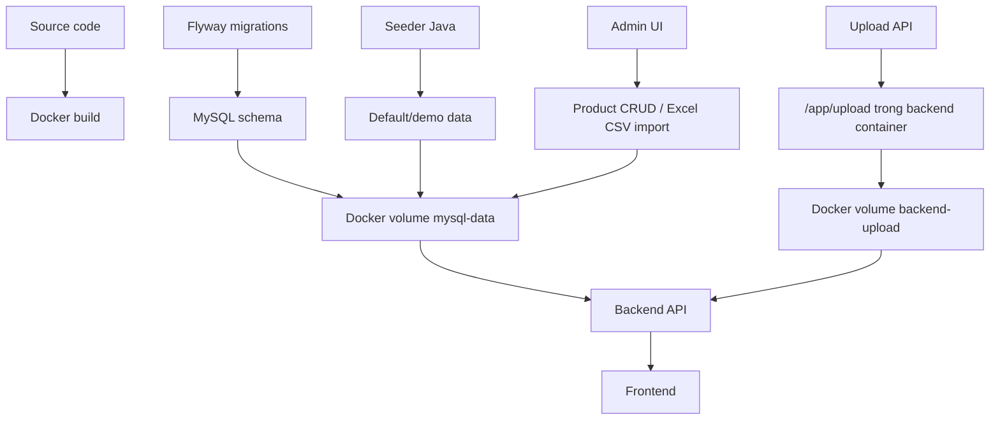
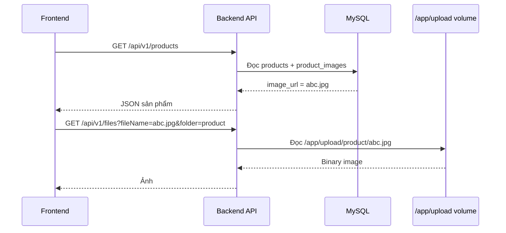
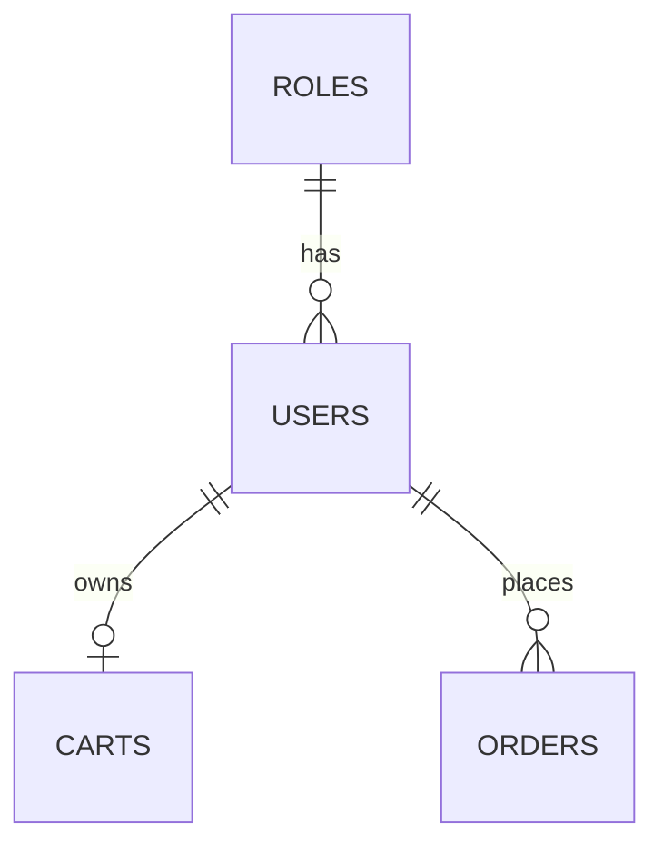
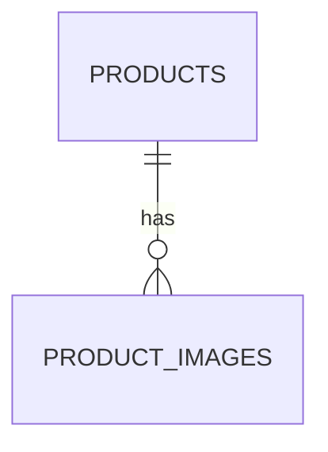
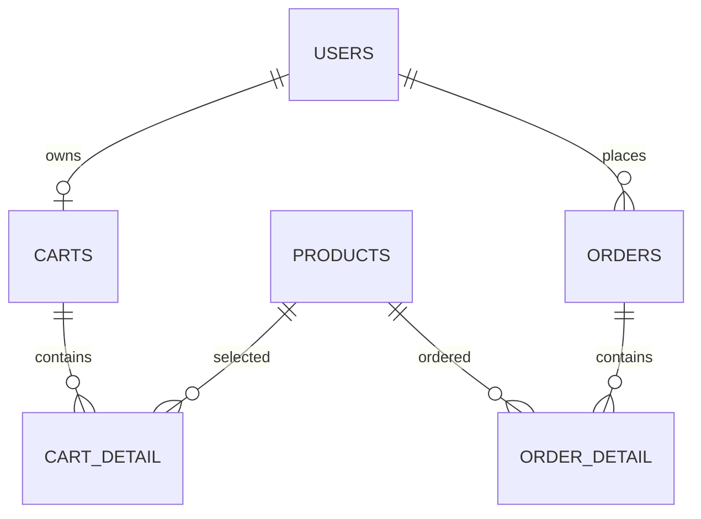
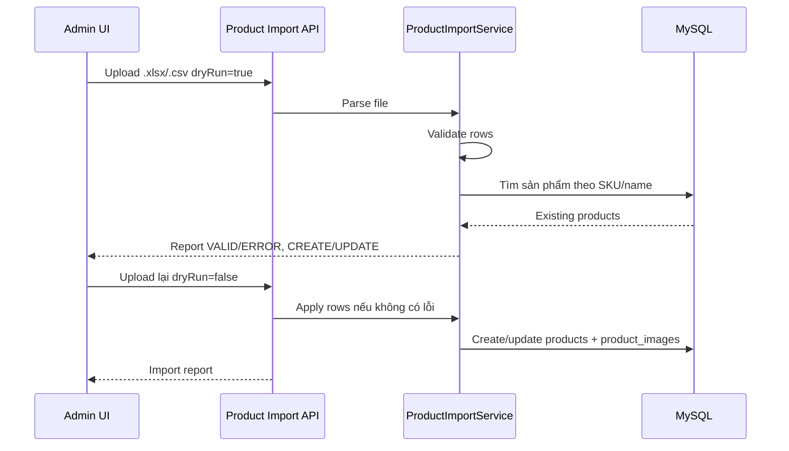
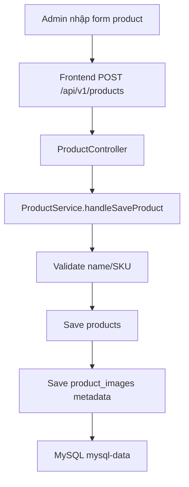
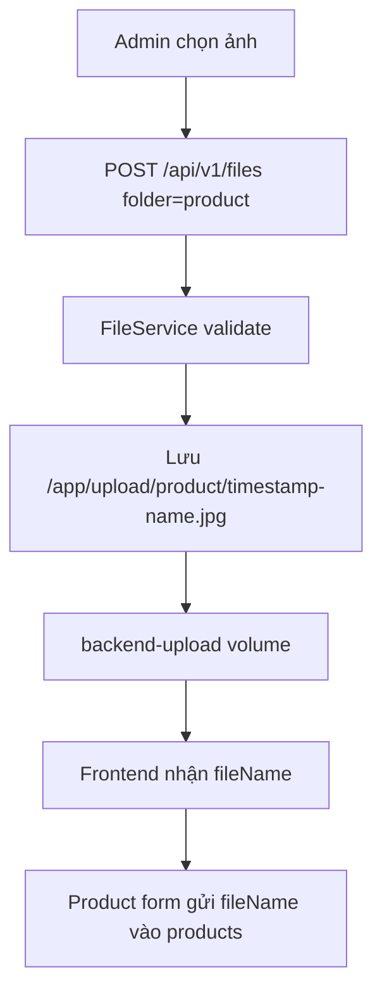

# Phân Tích Quản Lý Data Trong Han Sports v2

Tài liệu này giải thích riêng về **data** của project Han Sports v2: database, Docker volume, file upload, seed data, import Excel/CSV, backup/restore và những điểm cần lưu ý khi chia sẻ project cho người khác.

Phạm vi tài liệu dựa trên source code và database hiện tại trong workspace:

- Backend: `hansport_v2be`
- Frontend: `hansport_v2fe`
- Docker Compose: `docker-compose.yml`
- Flyway migrations: `hansport_v2be/src/main/resources/db/migration`
- Runtime database schema được kiểm tra qua DB MCP trên schema `hansport_v2`

## 1. Tóm Tắt Nhanh

Project không chỉ gồm source code. Data của project đang nằm ở nhiều lớp khác nhau:

| Lớp data | Mục đích | Nơi lưu hiện tại | Có nằm trong folder project không? |
| --- | --- | --- | --- |
| Source code | Code backend/frontend, Docker config, migration | Folder project | Có |
| Database schema | Cấu trúc bảng/cột/index | Flyway migration trong code | Có |
| Database runtime | User, product, order, cart, settings thật | Docker volume `mysql-data` | Không trực tiếp |
| Media/upload | Ảnh product/logo/banner | Docker volume `backend-upload`, map vào `/app/upload` | Không trực tiếp |
| Env/config local | Mật khẩu DB, JWT secret, port, seed flags | `.env` local | Có thể có, nhưng không nên chia sẻ |
| Backup SQL | Dump DB cũ/import demo | `backups/` nếu có | Bị `.gitignore` bỏ qua |

Công thức dễ nhớ:

```text
Code không chứa data runtime.
Database không chứa file ảnh thật.
Docker volume không nằm gọn trong folder project.
Muốn chạy giống máy gốc thì phải có cả DB dump + upload files.
```

## 2. Sơ Đồ Data Tổng Thể



Ý nghĩa:

- Flyway tạo/cập nhật cấu trúc database.
- Seeder tạo data bắt buộc hoặc data mặc định nếu được bật.
- Product CRUD và import Excel/CSV ghi vào MySQL.
- Upload API ghi file ảnh vào `/app/upload`, thực chất là Docker volume `backend-upload`.
- Frontend chỉ hiển thị data thông qua backend API.

## 3. Flyway - Lớp Quản Lý Cấu Trúc Database

Flyway là công cụ giúp quản lý version database. Khi backend start, Flyway đọc bảng `flyway_schema_history` trong database để biết schema đang ở version nào. Nếu code có migration mới, Flyway sẽ chạy migration còn thiếu.

Thư mục migration:

```text
hansport_v2be/src/main/resources/db/migration/
|-- V1__baseline_schema.sql
|-- V2__money_fields_to_bigint.sql
|-- V3__site_content_tables.sql
|-- V4__product_sku_and_active.sql
|-- V5__product_image_order.sql
`-- V6__product_sale_options.sql
```

Trạng thái database thực tế đã kiểm tra:

| Version | Mô tả | Trạng thái |
| --- | --- | --- |
| 1 | Flyway baseline | Thành công |
| 2 | Money fields to bigint | Thành công |
| 3 | Site content tables | Thành công |
| 4 | Product SKU and active | Thành công |
| 5 | Product image order | Thành công |
| 6 | Product sale options | Thành công |

### 3.1. Migration Đang Tạo/Cập Nhật Gì?

| Migration | Vai trò |
| --- | --- |
| `V1__baseline_schema.sql` | Tạo các bảng chính: roles, users, products, product_images, carts, cart_detail, orders, order_detail, settings |
| `V2__money_fields_to_bigint.sql` | Chuẩn hóa tiền sang `BIGINT` cho VND |
| `V3__site_content_tables.sql` | Tạo bảng nội dung trang: site_banners, site_categories, site_navigation_items |
| `V4__product_sku_and_active.sql` | Thêm `sku`, `active`, unique index SKU, index active cho products |
| `V5__product_image_order.sql` | Thêm `sort_order` cho product_images để sắp xếp ảnh |
| `V6__product_sale_options.sql` | Thêm giá gốc, màu/size cho product, cart detail và order detail |

Flyway trả lời câu hỏi:

> Database cần có bảng/cột/index nào để code hiện tại chạy đúng?

Flyway không phải nơi lưu dữ liệu bán hàng thật hằng ngày.

## 4. Database Runtime - MySQL Volume `mysql-data`

Trong `docker-compose.yml`, service MySQL cấu hình:

```yaml
mysql:
  image: mysql:8.0
  ports:
    - "${MYSQL_HOST_PORT:-3307}:3306"
  volumes:
    - mysql-data:/var/lib/mysql
    - ./backups/hansport_v2_old_20260605_175155.sql:/docker-entrypoint-initdb.d/init.sql

volumes:
  mysql-data:
```

Ý nghĩa:

- Bên trong container MySQL, data nằm ở `/var/lib/mysql`.
- Bên ngoài, Docker quản lý bằng named volume `mysql-data`.
- Trên máy bạn, volume thực tế có thể có tên đầy đủ dạng `han-sports-v2-main_mysql-data` vì Docker Compose thêm prefix theo tên project.
- `MYSQL_HOST_PORT=3307` chỉ là port để máy Windows kết nối vào MySQL Docker. Bên trong Docker network, backend vẫn kết nối `mysql:3306`.

### 4.1. Volume `mysql-data` Giữ Những Gì?

Trong database `hansport_v2`, schema hiện tại có 13 bảng:

| Bảng | Số dòng hiện tại | Vai trò |
| --- | ---: | --- |
| `roles` | 2 | Role người dùng: ADMIN, USER |
| `users` | 3 | Tài khoản, password hash, refresh token, thông tin cá nhân |
| `products` | 112 | Sản phẩm, giá, tồn kho, SKU, trạng thái hiển thị, màu/size |
| `product_images` | 124 | Metadata ảnh sản phẩm: tên file hoặc external URL |
| `carts` | 1 | Giỏ hàng theo user |
| `cart_detail` | 3 | Dòng sản phẩm trong giỏ, kèm màu/size đã chọn |
| `orders` | 4 | Đơn hàng |
| `order_detail` | 7 | Dòng sản phẩm trong đơn, snapshot giá/màu/size |
| `settings` | 8 | Cấu hình key-value của hệ thống |
| `site_banners` | 3 | Banner trang chủ đang quản lý bằng bảng riêng |
| `site_categories` | 3 | Danh mục hiển thị trang chủ |
| `site_navigation_items` | 0 | Menu/header navigation |
| `flyway_schema_history` | 6 | Lịch sử migration Flyway |

Số dòng là trạng thái database tại thời điểm kiểm tra, có thể thay đổi khi bạn import, tạo sản phẩm, đặt hàng.

### 4.2. Khi Nào Database Mất?

| Lệnh | Ảnh hưởng đến `mysql-data` |
| --- | --- |
| `docker compose stop` | Không mất DB |
| `docker compose start` | Không mất DB |
| `docker compose up -d` | Không mất DB |
| `docker compose up -d --build` | Không mất DB |
| `docker compose down` | Không mất DB nếu không có `-v` |
| `docker compose down -v` | Xóa volume, có thể mất DB |
| `docker volume rm ...mysql-data` | Xóa DB volume |

Lưu ý quan trọng:

```text
docker compose down -v
```

Đây là lệnh nguy hiểm nếu chưa backup. Nó xóa named volume, tức là xóa database runtime.

### 4.3. SQL Init Trong `docker-compose.yml`

Hiện tại `docker-compose.yml` có dòng:

```yaml
- ./backups/hansport_v2_old_20260605_175155.sql:/docker-entrypoint-initdb.d/init.sql
```

Điều này có nghĩa:

- Khi MySQL container khởi tạo lần đầu với volume rỗng, MySQL image có thể chạy file `/docker-entrypoint-initdb.d/init.sql`.
- File gốc nằm trong `./backups/...`.
- Thư mục `backups/` đang bị `.gitignore` bỏ qua.

Hệ quả khi chia sẻ project:

- Nếu người khác tải source mà không có file `backups/hansport_v2_old_20260605_175155.sql`, mount có thể gây lỗi hoặc không khởi tạo dữ liệu như máy bạn.
- Nếu volume MySQL đã có data, file init này không chạy lại.

Khuyến nghị:

- Không phụ thuộc vào `backups/` thật để setup demo.
- Nên tách một gói `demo-data/` sạch nếu muốn người khác chạy dữ liệu mẫu.

## 5. Upload/Media Runtime - Docker Volume `backend-upload`

Trong `docker-compose.yml`, backend cấu hình:

```yaml
backend:
  environment:
    UPLOAD_FILE_BASE_PATH: /app/upload
  volumes:
    - backend-upload:/app/upload

volumes:
  backend-upload:
```

Ý nghĩa:

- Backend container nhìn thấy thư mục upload tại `/app/upload`.
- Docker lưu file thật trong named volume `backend-upload`.
- Trên Windows, đây không phải folder bình thường trong project; Docker Desktop quản lý volume ở vùng nội bộ.

### 5.1. File Ảnh Nằm Ở Đâu?

Theo `FileService.java`, folder upload hợp lệ:

```text
product
logo
banner
```

Đường dẫn logic trong container:

```text
/app/upload/product
/app/upload/logo
/app/upload/banner
```

Database chỉ lưu metadata:

```text
product_images.image_url = "abc.jpg"
site_banners.image = "banner.jpg"
```

File thật phải tồn tại trong upload volume:

```text
/app/upload/product/abc.jpg
/app/upload/banner/banner.jpg
```

### 5.2. Luồng Hiển Thị Ảnh Sản Phẩm



Nếu DB có `image_url` nhưng file không tồn tại trong volume, UI sẽ bị lỗi ảnh.

### 5.3. Upload Validation Hiện Tại

`FileService.java` đang có các rule:

| Rule | Hiện tại |
| --- | --- |
| Folder hợp lệ | `product`, `logo`, `banner` |
| Extension hợp lệ | `jpg`, `jpeg`, `png`, `webp` |
| MIME hợp lệ | `image/jpeg`, `image/png`, `image/webp` |
| Signature check | Có kiểm tra header file |
| Giới hạn size mỗi file | 5MB |
| Tên file | Làm sạch ký tự lạ, thêm prefix timestamp |
| Chống path traversal | Chặn `..`, `/`, `\` |

Đây là phần đã tốt hơn mức demo cơ bản, vì không chỉ kiểm tra extension.

### 5.4. Static Resource Và API File

Project có hai cách liên quan đến file:

| File | Vai trò |
| --- | --- |
| `FileController.java` | API upload/download qua `/api/v1/files` |
| `StaticResourcesWebConfiguration.java` | Map static `/storage/**` vào thư mục upload |
| `hansport_v2fe/src/utils/constants.js` | Frontend đang tạo URL ảnh qua `/api/v1/files?fileName=...&folder=...` |

Trong frontend hiện tại, ảnh sản phẩm chủ yếu đi qua API `/api/v1/files`, không phải `/storage/**`.

## 6. Database Schema Theo Nghiệp Vụ

### 6.1. User Và Role

| Bảng | Cột quan trọng | Ghi chú |
| --- | --- | --- |
| `roles` | `id`, `name`, `decription` | `name` unique |
| `users` | `email`, `password`, `full_name`, `role_id`, `refresh_token` | `email` unique, liên kết role |

Quan hệ:



Lưu ý:

- `users.refresh_token` hiện lưu trong bảng users.
- Password trong code được encode khi tạo user/admin.
- `refresh_token` là dữ liệu nhạy cảm, cần backup cẩn thận và không đưa dump thật lên public.

### 6.2. Product Và Product Image

| Bảng | Cột quan trọng | Ghi chú |
| --- | --- | --- |
| `products` | `sku`, `name`, `price`, `original_price`, `quantity`, `sold`, `active`, `color_options`, `size_options` | `sku` unique, `active` dùng để ẩn/hiện |
| `product_images` | `image_url`, `product_id`, `sort_order` | Lưu tên file hoặc external URL |

Quan hệ:



Lưu ý data:

- `price`, `original_price`, `quantity`, `sold` là `BIGINT`.
- `color_options` được lưu dạng chuỗi ngăn cách bằng `|`.
- `size_options` được lưu dạng chuỗi ngăn cách bằng `|`.
- `product_images.sort_order` dùng để giữ thứ tự ảnh.
- `Product` entity dùng `@OrderColumn(name = "sort_order")`.

Ví dụ logic:

```text
products.id = 10
products.name = "Vợt cầu lông Yonex"
products.sku = "SHOPVNB-VNB026679"
products.active = 0

product_images.product_id = 10
product_images.image_url = "https://example.com/image.jpg"
```

Nếu `active = 0`, sản phẩm sẽ bị ẩn khỏi listing public, nhưng admin có thể xem nếu gọi `includeInactive=true`.

### 6.3. Cart Và Order

| Bảng | Cột quan trọng | Ghi chú |
| --- | --- | --- |
| `carts` | `user_id`, `sum` | 1 user có 1 cart |
| `cart_detail` | `cart_id`, `product_id`, `quantity`, `price`, `selected_color`, `selected_size` | Giỏ hàng lưu giá tại thời điểm add/update |
| `orders` | `user_id`, `total_price`, `receiver_*`, `status` | Thông tin đơn hàng |
| `order_detail` | `order_id`, `product_id`, `quantity`, `price`, `selected_color`, `selected_size` | Snapshot dòng đơn hàng |

Quan hệ:



Điểm đúng:

- `order_detail.price` là snapshot giá tại lúc đặt hàng, không phụ thuộc giá product thay đổi sau này.
- `selected_color`, `selected_size` giữ lựa chọn variant của người mua.

### 6.4. Settings Và Site Content

Có hai cách lưu cấu hình giao diện:

| Bảng | Kiểu lưu | Vai trò |
| --- | --- | --- |
| `settings` | Key-value text/JSON | Cấu hình tổng quát: HERO_SLIDES, CATEGORIES, BRANDS, TARGETS, HOTLINE, shipping |
| `site_banners` | Bảng có cấu trúc | Banner trang chủ |
| `site_categories` | Bảng có cấu trúc | Danh mục hiển thị trang chủ |
| `site_navigation_items` | Bảng có cấu trúc | Menu/header nav |

`AppSettingSeeder.java` hiện có thể seed cả key-value settings và các bảng site content nếu `app.seed.settings.enabled=true`.

Điểm cần cẩn thận:

- Data cấu hình có thể bị trùng ý nghĩa giữa `settings` và bảng `site_*`.
- Khi thay đổi UI cấu hình, cần xác định nguồn nào là source of truth.

## 7. Seeder - Dữ Liệu Mặc Định

Project có hai seeder chính:

| Seeder | File | Điều khiển bằng env | Vai trò |
| --- | --- | --- | --- |
| System data seeder | `DataSeeder.java` | `SEED_REQUIRED_ENABLED`, `SEED_ADMIN_ENABLED`, `SEED_ADMIN_PASSWORD` | Tạo role ADMIN/USER, tạo admin local nếu bật |
| App setting seeder | `AppSettingSeeder.java` | `SEED_SETTINGS_ENABLED` | Tạo settings, banner, category, nav mặc định nếu thiếu |

### 7.1. Seed Flags Trong Docker

Trong `.env.example` và `docker-compose.yml`:

```env
SEED_ENABLED=false
SEED_REQUIRED_ENABLED=true
SEED_ADMIN_ENABLED=false
SEED_SETTINGS_ENABLED=true
```

Ý nghĩa nên hiểu:

| Biến | Nên dùng để làm gì |
| --- | --- |
| `SEED_REQUIRED_ENABLED` | Tạo role bắt buộc, nên bật ở local/demo |
| `SEED_ADMIN_ENABLED` | Tạo admin local, chỉ bật khi cần và phải có password |
| `SEED_SETTINGS_ENABLED` | Tạo cấu hình giao diện mặc định nếu chưa có |
| `SEED_ENABLED` | Flag tổng cho local/dev, hiện không phải tất cả seeder đều phụ thuộc trực tiếp vào flag này |

Rủi ro nếu dùng sai:

- Import DB thật xong vẫn bật settings/admin seed có thể thêm data ngoài ý muốn.
- Demo data và business data có thể bị trộn.

Khuyến nghị:

- Demo/portfolio: bật seed role/settings, admin demo có password placeholder riêng.
- Production: tắt seed admin và demo product.
- Database đã import data thật: cần kiểm tra seed flags trước khi start backend.

## 8. Import Excel/CSV Sản Phẩm

Chức năng import nằm ở:

| Thành phần | File |
| --- | --- |
| API frontend | `hansport_v2fe/src/api/productApi.js` |
| UI import | `hansport_v2fe/src/components/admin/ProductImportPanel.jsx` |
| Trang admin products | `hansport_v2fe/src/pages/admin/ProductsPage.jsx` |
| Backend endpoint | `ProductController.java` |
| Logic import | `ProductImportService.java` |

Endpoint backend:

```text
POST /api/v1/products/import
Content-Type: multipart/form-data
Params:
  file=<xlsx/csv>
  dryRun=true|false
```

### 8.1. Luồng Import



### 8.2. Mapping Cột Import

`ProductImportService` chấp nhận nhiều tên cột để phù hợp file Excel/CSV:

| Dữ liệu product | Cột import được hỗ trợ |
| --- | --- |
| SKU | `sku`, `internal_sku_base`, `source_product_code` |
| Tên sản phẩm | `name`, `product_name` |
| Giá bán | `price`, `current_price_vnd` |
| Giá gốc | `original_price`, `original_price_vnd`, `list_price`, `list_price_vnd` |
| Số lượng | `quantity` |
| Mô tả ngắn | `short_desc`, `short_description` |
| Mô tả chi tiết | `detail_desc`, `detail_description`, `detail_description_draft` |
| Ảnh | `image_names`, `images`, `external_image_urls` |
| Màu | `color_options`, `colors`, `color` |
| Size | `size_options`, `sizes`, `size` |
| Trạng thái | `active`, `publish_status` |

### 8.3. Dry-run Là Gì?

Dry-run là chế độ kiểm tra file mà chưa ghi DB:

```text
dryRun=true
-> Đọc file
-> Validate từng dòng
-> Báo dòng nào CREATE/UPDATE/SKIP
-> Không save vào MySQL
```

Chỉ nên import thật khi report không có error:

```text
dryRun=false
-> Nếu report không có lỗi
-> Create/update products
-> Ghi product_images nếu file có image references
```

### 8.4. Ảnh Trong File Excel/CSV

Import có thể nhận:

- Tên file local, ví dụ `abc.jpg`
- URL ngoài, ví dụ `https://.../image.jpg`

Frontend `getImageUrl()` có logic:

```js
if (fileName.startsWith("http")) return fileName;
```

Nghĩa là external URL có thể hiển thị trực tiếp. Tuy nhiên, về lâu dài nên đưa ảnh về storage mình quản lý, vì URL ngoài có thể chết, bị chặn hotlink, hoặc thay đổi.

## 9. Data Flow Của Sản Phẩm

### 9.1. Thêm Sản Phẩm Thủ Công



Nếu admin upload ảnh trước:



### 9.2. Cập Nhật/Xóa Sản Phẩm Và Ảnh

`ProductService.replaceImages()` xử lý:

- Chuẩn hóa danh sách ảnh mới.
- Giữ lại ảnh còn được yêu cầu.
- Xóa metadata ảnh cũ khỏi product.
- Gọi `deleteProductImageFileIfUnused()` nếu ảnh cũ không còn được product nào tham chiếu.

`deleteProductImageFileIfUnused()` chỉ xóa file local nếu:

- Image URL không null.
- `productImageRepository.countByImageUrl(imageUrl) <= 1`.
- `FileService.deleteIfExists(imageUrl, "product")` chấp nhận tên file local.

Nếu image là external URL, `FileService.deleteIfExists()` bỏ qua vì có `://`.

## 10. Data Flow Của Giỏ Hàng Và Đơn Hàng

Giỏ hàng:

```text
users
-> carts
-> cart_detail
-> products
```

Đơn hàng:

```text
users
-> orders
-> order_detail
-> products
```

Ý nghĩa data:

- Cart là trạng thái tạm thời của user.
- Order là lịch sử giao dịch.
- `order_detail.price` nên được xem là snapshot giá tại thời điểm đặt hàng.
- `selected_color`, `selected_size` giữ variant đã chọn.

Cần lưu ý:

- Nếu product đổi giá sau khi order đã tạo, order cũ vẫn cần giữ giá cũ.
- Nếu product bị xóa, order detail đang FK đến product có thể bị ảnh hưởng. Hiện schema có FK `order_detail.product_id` đến `products.id`, chưa thấy có soft delete riêng cho product ngoài `active`.

## 11. Backup Và Restore Cần Giữ Những Gì?

Để clone/chia sẻ/chuyển máy mà data giống nhau, phải backup ít nhất:

```text
1. Database dump
2. Upload files
3. Thông tin version/migration
4. Hướng dẫn tạo .env từ .env.example
```

Không nên backup/chia sẻ:

```text
.env thật
JWT secret
DB password
Gmail app password
Google client secret
User/order thật nếu đưa lên public
```

### 11.1. Cấu Trúc Backup Nên Có

```text
backups/
`-- 2026-06-17_153000/
    |-- manifest.json
    |-- database/
    |   `-- hansport_v2.sql
    `-- upload/
        |-- product/
        |-- logo/
        `-- banner/
```

`backups/` đang được `.gitignore`, nên backup thật không bị commit lên Git nếu dùng đúng quy trình.

### 11.2. Vì Sao Chỉ Export SQL Là Chưa Đủ?

Vì DB chỉ lưu tên ảnh:

```text
product_images.image_url = "abc.jpg"
```

Còn file thật nằm ở:

```text
/app/upload/product/abc.jpg
```

Nếu chỉ import SQL:

```text
Có product
Có image_url
Không có file ảnh
-> UI bị broken image
```

### 11.3. Vì Sao Chỉ Copy Upload Là Chưa Đủ?

Nếu chỉ copy ảnh:

```text
Có /app/upload/product/abc.jpg
Không có product_images.image_url = abc.jpg
-> Không có sản phẩm nào tham chiếu ảnh
```

## 12. Chia Sẻ Project Qua Drive/GitHub

Nếu chỉ upload folder project:

| Thành phần | Người tải về có không? |
| --- | --- |
| Source code | Có |
| Flyway migration | Có |
| `.env.example` | Có |
| Database runtime trong `mysql-data` | Không |
| Upload runtime trong `backend-upload` | Không |
| File trong `backups/` | Thường không, vì đang ignore và không nên đưa lên public |

Nếu người khác chạy:

```powershell
docker compose up -d --build
```

Họ có thể chạy app, nhưng data sẽ không chắc giống máy bạn nếu không restore DB và upload.

### 12.1. Gói Demo Nên Có

Để người khác chạy demo giống nhau, nên tạo gói riêng:

```text
demo-data/
|-- README.md
|-- database/
|   `-- demo-data.sql
`-- upload/
    |-- product/
    |-- logo/
    `-- banner/
```

Khác nhau giữa `backups/` và `demo-data/`:

| Thư mục | Nên commit lên Git? | Mục đích |
| --- | --- | --- |
| `backups/` | Không | Backup data thật/local |
| `demo-data/` | Có thể, nếu đã sạch | Data demo công khai/portfolio |

## 13. Các Lệnh Kiểm Tra Data

### 13.1. Kiểm Tra Container

```powershell
docker compose ps
```

Cần thấy:

```text
hansport-mysql
hansport-backend
hansport-frontend
```

### 13.2. Kiểm Tra Volume

```powershell
docker volume ls
```

Tìm volume có tên gần giống:

```text
han-sports-v2-main_mysql-data
han-sports-v2-main_backend-upload
```

### 13.3. Kiểm Tra Upload Trong Backend Container

```powershell
docker compose exec backend sh -lc "find /app/upload -maxdepth 2 -type f | head -50"
```

### 13.4. Kiểm Tra Flyway

```powershell
docker compose logs --tail=120 backend
```

Tìm log:

```text
Successfully validated migrations
Current version of schema
Successfully applied migrations
```

### 13.5. Kiểm Tra API Product

```powershell
Invoke-RestMethod http://localhost:8080/api/v1/products
```

Hoặc mở trên browser:

```text
http://localhost:8080/api/v1/products
```

## 14. Những Điểm Cần Cải Thiện

| Vấn đề | Trạng thái hiện tại | Rủi ro | Hướng cải thiện |
| --- | --- | --- | --- |
| Data demo phụ thuộc backup local | `docker-compose.yml` đang mount file trong `backups/` | Người khác clone có thể thiếu file SQL | Tạo `demo-data/` sạch hoặc script restore demo |
| Chưa có script restore/upload chuẩn | Chưa thấy `scripts/` hiện tồn tại trong workspace | Copy DB/upload thủ công dễ sai | Tạo PowerShell scripts backup/restore/sync/verify |
| DB và upload backup chưa đồng bộ | DB có image_url, upload có file thật | Restore thiếu 1 trong 2 sẽ lỗi ảnh | Backup package gồm cả SQL và upload |
| Settings có 2 cách lưu | `settings` key-value và `site_*` tables | Dễ lệch source of truth | Quy định bảng nào là nguồn chính cho UI |
| Product category/brand/target là text | Lưu trực tiếp trong `products` | Dễ sai chính tả, khó thống kê | Sau này có thể chuẩn hóa thành bảng riêng nếu cần |
| Variant color/size lưu chuỗi `|` | Đơn giản, hợp demo | Khó query/báo cáo nâng cao | Nếu cần e-commerce lớn, tách product_variants |
| Refresh token trong users | Đơn giản | Backup DB chứa token nhạy cảm | Hash token hoặc tách bảng refresh_tokens |
| External image URL trong import | Hiển thị nhanh | Phụ thuộc bên ngoài | Tải về storage mình quản lý hoặc Cloudinary/S3 |

## 15. Quy Trình Đề Xuất Cho Project Hiện Tại

Với quy mô portfolio/local demo, nên theo quy trình này:

### 15.1. Khi Code Thay Đổi Schema

```text
1. Tạo file Flyway Vx__description.sql
2. Cập nhật entity/DTO/service
3. Chạy test backend
4. Start backend
5. Kiểm tra flyway_schema_history
```

Không nên sửa database bằng tay rồi quên tạo migration.

### 15.2. Khi Thêm Sản Phẩm Bằng Excel/CSV

```text
1. Admin vào /admin/products
2. Chọn Import Excel/CSV
3. Chạy dry-run
4. Sửa file nếu có error
5. Import thật khi errorRows = 0
6. Kiểm tra ảnh
7. Nếu product DRAFT, bật active khi muốn public
```

### 15.3. Khi Backup Data Local

```text
1. Export MySQL thành file .sql
2. Copy /app/upload ra backup
3. Tạo manifest gồm thời gian, app version, flyway version, số product, số file ảnh
4. Không commit backup thật
```

### 15.4. Khi Chia Sẻ Project

```text
1. Share source code
2. Share .env.example
3. Nếu cần data demo, share demo-data sạch
4. Không share .env thật
5. Không share backup có user/order thật
```

## 16. Checklist Hiểu Data Project

- [ ] Biết Flyway chỉ quản lý schema, không quản lý data hằng ngày.
- [ ] Biết MySQL data thật nằm trong Docker volume `mysql-data`.
- [ ] Biết file upload thật nằm trong Docker volume `backend-upload`.
- [ ] Biết DB chỉ lưu tên ảnh hoặc URL, không lưu binary ảnh.
- [ ] Biết muốn chạy giống máy gốc thì cần DB dump + upload files.
- [ ] Biết `docker compose down -v` có thể xóa DB/upload volume.
- [ ] Biết import Excel/CSV nên dry-run trước.
- [ ] Biết data demo nên tách khỏi backup thật.
- [ ] Biết `.env` thật không nên đưa lên Drive/GitHub public.

## 17. Kết Luận

Data của Han Sports v2 hiện đang được quản lý theo 4 lớp:

```text
Flyway         -> cấu trúc database
Seeder         -> data mặc định khi start backend
mysql-data     -> database runtime
backend-upload -> file/media runtime
```

Kiến trúc hiện tại đủ để local development, demo và portfolio. Điểm cần làm tiếp để gần quy trình chuyên nghiệp là:

1. Tạo `demo-data/` sạch thay vì phụ thuộc backup local.
2. Tạo script backup/restore cả database và upload.
3. Tạo script verify integrity giữa `product_images.image_url` và file trong upload.
4. Chuẩn hóa quy trình import Excel/CSV và quản lý ảnh ngoài.
5. Khi deploy thật, chuyển media sang Cloudinary/S3-compatible storage và có backup định kỳ.

Nói ngắn gọn: project đã có nền móng data khá tốt; phần còn lại là làm quy trình vận hành rõ ràng để không còn cần copy/import thủ công theo cảm giác.
