# Han Sports v2 Improvement Plan

Nguồn đầu vào chính: `PROJECT_TECHNICAL_REPORT.md`, đặc biệt các chương 10-17. Kế hoạch này không viết lại báo cáo kỹ thuật và không yêu cầu sửa code ngay trong tài liệu này. Một số file source liên quan trực tiếp đã được kiểm tra lại để xác nhận phạm vi task: `EmailController.java`, `SecurityConfiguration.java`, `AuthController.java`, `UserService.java`, `User.java`, `CheckoutPage.jsx`, `axiosSetup.js`, `CartController.java`, `CartService.java`, `CartPage.jsx`, `application.properties`, `.gitignore`.

Ghi chú khác biệt so với báo cáo: trong lần kiểm tra hiện tại, `docs/` chưa tồn tại; `.gitignore` root đã có rule ignore `.env` và `.env.local`; endpoint gửi email vẫn là `GET /api/v1/email/{id}` và security config vẫn chưa khóa endpoint này bằng role ADMIN rõ ràng. Không ghi hoặc sao chép bất kỳ giá trị secret thật nào trong kế hoạch này.

## 1. Executive Summary

Han Sports v2 hiện ở mức **MVP demo / portfolio project có cấu trúc**: backend Spring Boot có REST API, JWT, JPA, MySQL; frontend React/Vite có client shop và admin dashboard. Trước khi public GitHub portfolio, mục tiêu gần nhất là đưa project về trạng thái **an toàn, trung thực, kiểm chứng được**.

Cần ưu tiên P0 trước: bảo vệ secret, sửa endpoint email có side effect, hash refresh token, thêm rate limit auth mức MVP, làm sạch frontend lint, và không hiển thị VNPAY như chức năng đã hoạt động khi backend chưa có payment thật.

Sau P0, P1 tập trung vào portfolio-ready: migration, test nghiệp vụ, API update số lượng giỏ hàng, validation settings, API URL theo env, đổi mật khẩu nếu UI giữ chức năng này, upload an toàn hơn, README UTF-8, chống oversell và chuẩn hóa kiểu tiền.

Chưa cần làm ngay: Docker, CI/CD nâng cao, monitoring, object storage, OpenAPI, wishlist, coupon, dashboard nâng cao, notification, SEO, đa ngôn ngữ, VNPAY thật. Các phần này nằm ở P2/P3 để tránh làm phức tạp project trước khi xử lý nền tảng bảo mật và chất lượng.

## 2. Priority Roadmap

| Phase | Mục tiêu | Nhóm task | Điều kiện hoàn thành |
| ----- | -------- | --------- | -------------------- |
| Phase 0 - Git safety và baseline | Ngăn public secret và chốt baseline kiểm tra | `SEC-01`, `FE-01` baseline lint inventory | Có `.env.example`; `.gitignore` được xác nhận; không có secret thật trong file mới; lint failure được phân loại và bắt đầu sửa |
| Phase 1 - Security hotfix | Sửa rủi ro bảo mật trực tiếp | `SEC-02`, `SEC-03`, `SEC-04`, `SEC-05`, `CHECKOUT-01` | Email endpoint ADMIN-only; refresh token chỉ lưu hash; auth có rate limit MVP; VNPAY không còn được trình bày như đã hoạt động |
| Phase 2 - Portfolio-ready features | Hoàn thiện luồng hiện có, không thêm feature lớn | `CART-01`, `SETTINGS-01`, `FE-02`, `AUTH-01`, `FILE-01`, `DOC-01` | UI/API thống nhất; checkout/cart/settings/profile không gây hiểu nhầm; README setup rõ |
| Phase 3 - Test safety net | Bảo vệ nghiệp vụ cốt lõi bằng test | `TEST-01`, `TEST-02`, `TEST-03` | `mvn test` pass với test auth/cart/product/order; có test authorization và oversell |
| Phase 4 - Database reliability | Kiểm soát schema và dữ liệu tiền/tồn kho | `DB-01`, `ORDER-01`, `MONEY-01` | Có migration baseline; stock update an toàn hơn; kế hoạch/triển khai tiền tệ không dùng `double` |
| Phase 5 - Maintainability refactor | Refactor nhỏ sau khi lint/test sạch | Refactor React pages lớn, DTO mapping, logging nhẹ | Không đổi behavior; lint/test vẫn pass |
| Phase 6 - DevOps và deployment | Chuẩn bị demo deploy | Docker, GitHub Actions, HTTPS/CORS prod, Actuator | Có pipeline build/test/lint; demo chạy theo env an toàn |
| Phase 7 - Optional feature expansion | Tính năng mở rộng sau khi nền ổn | Wishlist, coupon, dashboard, notification, payment thật, SEO, i18n | Chỉ triển khai khi P0-P2 ổn và có test bảo vệ |

## 3. Dependency Map

```mermaid
flowchart TD
    A["SEC-01 Protect secrets + env examples"] --> B["Public GitHub safety"]
    A --> C["SEC-02 Remove unsafe fallback secrets"]
    C --> D["Secure config baseline"]
    E["SEC-03 Fix email endpoint/admin auth"] --> F["TEST-01 Auth/security tests"]
    G["SEC-04 Hash refresh token"] --> F
    H["SEC-05 Auth rate limiting"] --> F
    I["FE-01 Frontend lint clean"] --> J["FE-02 Env-driven API URL"]
    I --> K["Frontend refactor later"]
    L["CHECKOUT-01 Hide/disable VNPAY"] --> M["Portfolio honesty"]
    N["CART-01 Update cart quantity API"] --> O["TEST-02 Cart/product tests"]
    P["SETTINGS-01 Validate settings"] --> Q["Settings negative tests"]
    R["AUTH-01 Change password"] --> F
    S["FILE-01 Upload hardening"] --> T["Upload tests"]
    U["DB-01 Flyway baseline"] --> V["MONEY-01 Money type migration"]
    U --> W["ORDER-01 Stock concurrency fix"]
    W --> X["TEST-03 Order/concurrency tests"]
    Y["DOC-01 README UTF-8"] --> B
```



## 4. Decision Matrix

| Chủ đề | Các phương án | Phương án đề xuất | Lý do |
| ------ | ------------- | ----------------- | ----- |
| Flyway và Liquibase | Flyway; Liquibase | Flyway | Project nhỏ, schema hiện đơn giản, migration SQL tuyến tính dễ review hơn. |
| Refresh token storage | Hash token trong `users`; bảng `refresh_tokens` riêng | Hash token trong `users` cho giai đoạn này | Ít thay đổi schema/logic, đủ cho một phiên refresh token mỗi user như hiện tại. Bảng riêng để P2 nếu cần multi-device. |
| Kiểu tiền | `BigDecimal`; `long` VND | `long` VND | Project dùng VND không có phần thập phân; `long` đơn giản, tránh sai số `double`. Nếu hỗ trợ đa tiền tệ sau này cân nhắc `BigDecimal`. |
| Chống oversell | Optimistic locking; pessimistic locking; atomic update | Atomic update có điều kiện tồn kho | Ít lock lâu, phù hợp checkout: update stock khi `quantity >= requested`, kiểm tra affected rows. |
| VNPAY | Ẩn/disable; triển khai ngay | Ẩn hoặc disable và ghi "sắp ra mắt" nếu cần | Trung thực cho portfolio, tránh scope payment lớn trước khi bảo mật/test ổn. |
| Rate limit | Local memory; Redis/distributed | Local memory MVP, Redis cho production | Một instance demo dùng local memory đủ nhanh; Redis cần thêm infra và dependency, để P2. |
| Upload storage | Local upload hardening; object storage/CDN | Giữ local và harden ở P1; object storage P2 | Portfolio local demo chưa cần cloud storage; cần MIME/size/lifecycle trước. |

## 5. Detailed Task Cards

### SEC-01 - Protect secrets and create `.env.example`

**Priority:** P0  
**Complexity:** S  
**Depends on:** None

**Problem**  
Workspace hiện có `.env` backend/frontend chứa secret thật. Root `.gitignore` đã ignore `.env`, nhưng project thiếu `.env.example` an toàn để người khác setup local.

**Why it matters**  
Nếu public repo mà secret bị commit hoặc copy nhầm, có thể lộ Google OAuth client secret, email app password, JWT secret, DB credential.

**Relevant files**
- `.gitignore`
- `hansport_v2be/.env`
- `hansport_v2fe/.env`
- `hansport_v2be/src/main/resources/application.properties`
- `hansport_v2fe/src/api/axiosSetup.js`
- `README.md`

**Implementation steps**
1. Không mở rộng hoặc sao chép giá trị secret thật vào output.
2. Tạo `hansport_v2be/.env.example` với placeholder cho DB, JWT, Google OAuth, mail, upload, port, frontend URL, cookie secure, seed flag.
3. Tạo `hansport_v2fe/.env.example` với placeholder cho API URL, Google client ID, base URL.
4. Kiểm tra root `.gitignore` vẫn ignore `.env`, `.env.local`; nếu cần thêm rule cụ thể cho `hansport_v2be/.env` và `hansport_v2fe/.env`.
5. Thêm hướng dẫn rotate secret thủ công vào README hoặc docs security note: đổi Google OAuth secret, Gmail app password, JWT secret, DB password nếu từng chia sẻ workspace/repo.
6. Chạy grep để đảm bảo `.env.example` không chứa secret thật.

**Acceptance criteria**
- [ ] Có `hansport_v2be/.env.example`.
- [ ] Có `hansport_v2fe/.env.example`.
- [ ] `.env.example` chỉ chứa placeholder.
- [ ] `.gitignore` ignore `.env` và `.env.local`.
- [ ] Tài liệu hướng dẫn rotate secret không ghi secret thật.

**Tests and verification**

```bash
git status --short
rg -n --pcre2 "(password|secret|token).*(=|:).{20,}" hansport_v2be/.env.example hansport_v2fe/.env.example README.md
```

**Rollback**  
Xóa các file `.env.example` mới tạo và hoàn nguyên thay đổi README/.gitignore nếu cần.

**Suggested commit**

```text
chore(security): add safe environment templates
```

### SEC-02 - Remove unsafe fallback secrets from backend config

**Priority:** P0  
**Complexity:** S  
**Depends on:** `SEC-01`

**Problem**  
`application.properties` có fallback DB password, JWT secret và một số default config tiện cho local. Fallback secret khiến app có thể chạy production với secret mặc định nếu thiếu env.

**Why it matters**  
Secret mặc định là rủi ro nghiêm trọng khi deploy nhầm cấu hình. Portfolio public cũng nên thể hiện thói quen không để secret fallback trong config.

**Relevant files**
- `hansport_v2be/src/main/resources/application.properties`
- `hansport_v2be/.env.example`
- `README.md`

**Implementation steps**
1. Giữ fallback không nhạy cảm nếu cần, ví dụ `SERVER_PORT`, `FRONTEND_URL`.
2. Với `DB_PASSWORD`, `JWT_BASE64_SECRET`, `GOOGLE_CLIENT_SECRET`, `YOUR_APP_PASSWORD`, bỏ fallback secret thật; yêu cầu env bắt buộc.
3. Cập nhật `.env.example` tương ứng.
4. Cập nhật README ghi rõ app cần cấu hình env trước khi chạy.
5. Chạy backend test để xác nhận test profile có đủ property hoặc override cần thiết.

**Acceptance criteria**
- [ ] Không còn fallback secret nhạy cảm trong `application.properties`.
- [ ] Local setup vẫn có hướng dẫn qua `.env.example`.
- [ ] `mvn test` pass.

**Tests and verification**

```bash
cd hansport_v2be
mvn test
rg -n "JWT_BASE64_SECRET:|DB_PASSWORD:|GOOGLE_CLIENT_SECRET:|YOUR_APP_PASSWORD:" src/main/resources/application.properties
```

**Rollback**  
Khôi phục `application.properties` từ commit trước nếu app không boot được; không khôi phục secret thật vào repo.

**Suggested commit**

```text
chore(security): require explicit sensitive environment variables
```

### SEC-03 - Replace email side-effect GET with ADMIN-only POST

**Priority:** P0  
**Complexity:** M  
**Depends on:** None

**Problem**  
`EmailController.java` hiện có `GET /api/v1/email/{id}` để gửi email. `SecurityConfiguration.java` không khóa endpoint này bằng ADMIN rõ ràng; theo config hiện tại endpoint rơi vào `anyRequest().authenticated()`.

**Why it matters**  
GET không phù hợp cho hành động có side effect. User đăng nhập thường có thể trigger gửi email nếu biết order ID, gây rủi ro spam và sai quyền.

**Relevant files**
- `hansport_v2be/src/main/java/com/javaweb/controller/EmailController.java`
- `hansport_v2be/src/main/java/com/javaweb/config/SecurityConfiguration.java`
- `hansport_v2be/src/main/java/com/javaweb/service/OrderService.java`
- `hansport_v2fe/src/api/orderApi.js`
- `hansport_v2fe/src/pages/admin/OrdersAdminPage.jsx`
- `hansport_v2be/src/test/java/com/javaweb/...`

**Implementation steps**
1. Đổi endpoint thành `POST /api/v1/orders/{id}/send-email` hoặc `POST /api/v1/email/orders/{id}`. Đề xuất: `POST /api/v1/orders/{id}/send-email` vì email gắn với order.
2. Xóa hoặc deprecate endpoint GET cũ; nếu giữ tạm, phải khóa ADMIN và trả thông báo deprecation. Đề xuất cho portfolio: xóa GET cũ để tránh hiểu nhầm.
3. Thêm security matcher `requestMatchers(HttpMethod.POST, "/api/v1/orders/*/send-email").hasRole("ADMIN")`.
4. Cập nhật `orderApi.sendOrderEmail(id)` và `OrdersAdminPage.jsx`.
5. Thêm test: USER gọi endpoint bị 403; ADMIN gọi endpoint đi tới service. Nếu không muốn gửi mail thật trong test, mock `EmailService` hoặc kiểm tra authorization layer.

**Acceptance criteria**
- [ ] Không còn endpoint GET side-effect để gửi email.
- [ ] Endpoint gửi email chỉ ADMIN gọi được.
- [ ] Frontend admin gọi endpoint mới.
- [ ] USER bị từ chối trong test.

**Tests and verification**

```bash
cd hansport_v2be
mvn test
cd ../hansport_v2fe
npm run lint
```

**Rollback**  
Khôi phục endpoint cũ và API client nếu frontend admin không gửi được email, nhưng vẫn cần giữ rule ADMIN nếu rollback tạm.

**Suggested commit**

```text
fix(security): restrict order email sending to admins
```

### SEC-04 - Store only hashed refresh tokens in `users`

**Priority:** P0  
**Complexity:** M  
**Depends on:** `SEC-02`

**Problem**  
Refresh token đang lưu plaintext trong `users.refreshToken`. `AuthController` so sánh token cookie trực tiếp với giá trị DB qua `UserRepository.findByRefreshTokenAndEmail(...)`.

**Why it matters**  
Nếu DB bị lộ, attacker có thể dùng refresh token còn hạn để chiếm phiên.

**Relevant files**
- `hansport_v2be/src/main/java/com/javaweb/controller/AuthController.java`
- `hansport_v2be/src/main/java/com/javaweb/service/UserService.java`
- `hansport_v2be/src/main/java/com/javaweb/domain/User.java`
- `hansport_v2be/src/main/java/com/javaweb/repository/UserRepository.java`
- `hansport_v2be/src/main/java/com/javaweb/util/SecurityUtil.java`

**Implementation steps**
1. Chọn hướng vừa đủ: hash token và vẫn lưu trong `users.refreshToken`.
2. Thêm helper hash SHA-256 hoặc HMAC-SHA256 cho refresh token. Đề xuất HMAC-SHA256 nếu có secret riêng; nếu chưa muốn thêm secret, SHA-256 vẫn tốt hơn plaintext nhưng cần ghi rõ giới hạn.
3. Khi login/google login/refresh: tạo refresh token raw, lưu hash vào DB, set raw vào cookie.
4. Khi refresh: decode JWT raw để lấy email; hash raw token; tìm user theo `refreshTokenHash + email`.
5. Khi logout: set refresh token trong DB về null như hiện tại.
6. Đảm bảo rotation: mỗi lần refresh tạo token mới, lưu hash mới, cookie mới.
7. Không cần tạo bảng mới ở P0. Bảng `refresh_tokens` riêng để P2 nếu muốn multi-device/revoke theo thiết bị.

**Acceptance criteria**
- [ ] DB không lưu refresh token raw.
- [ ] Login, refresh, logout vẫn hoạt động.
- [ ] Refresh token cũ không còn hợp lệ sau rotation.
- [ ] Logout revoke token hiện tại.

**Tests and verification**

```bash
cd hansport_v2be
mvn test
```

**Rollback**  
Hoàn nguyên service/controller/repository. Nếu đã deploy migration hoặc dữ liệu hash, rollback cần buộc user đăng nhập lại và set `refreshToken=null`.

**Suggested commit**

```text
fix(auth): store hashed refresh tokens
```

### SEC-05 - Add MVP rate limiting for login and register

**Priority:** P0  
**Complexity:** M  
**Depends on:** None

**Problem**  
Chưa có rate limiting cho `/auth/login`, `/auth/register`, `/auth/google`, `/auth/refresh`.

**Why it matters**  
Login/register dễ bị brute-force hoặc spam tạo tài khoản.

**Relevant files**
- `hansport_v2be/src/main/java/com/javaweb/controller/AuthController.java`
- `hansport_v2be/src/main/java/com/javaweb/config/SecurityConfiguration.java`
- `hansport_v2be/src/main/java/com/javaweb/util/error/GlobalException.java`
- New module/class: `auth` hoặc `config/filter`

**Implementation steps**
1. MVP một instance: thêm in-memory rate limit filter hoặc service dùng `ConcurrentHashMap` theo IP + endpoint + email nếu có.
2. Giới hạn đề xuất: login 5 lần/phút theo email+IP; register 3 lần/phút theo IP; refresh 30 lần/phút theo IP.
3. Trả HTTP 429 với response format thống nhất.
4. Không thêm dependency ở lần triển khai đầu nếu có thể làm bằng JDK/Spring filter đơn giản.
5. Production nhiều instance: ghi backlog Redis/distributed rate limiting.

**Acceptance criteria**
- [ ] Request vượt giới hạn trả 429.
- [ ] Request hợp lệ dưới giới hạn không bị ảnh hưởng.
- [ ] Có test hoặc manual verification.
- [ ] Không thêm dependency nặng cho MVP.

**Tests and verification**

```bash
cd hansport_v2be
mvn test
# manual after running backend: send repeated POST /api/v1/auth/login and expect 429 after threshold
```

**Rollback**  
Disable filter/service rate limit bằng config flag hoặc revert commit nếu phát sinh false positive.

**Suggested commit**

```text
feat(auth): add basic rate limiting for authentication endpoints
```

### FE-01 - Fix frontend lint baseline

**Priority:** P0  
**Complexity:** M  
**Depends on:** None

**Problem**  
`npm run lint` hiện fail 32 errors và 11 warnings. Nhóm lỗi gồm unused imports/variables, empty catch blocks, hook dependencies, React 19 rules như `set-state-in-effect`, `purity`, `static-components`.

**Why it matters**  
Portfolio public nên có lint sạch. Lint fail cũng làm CI sau này khó bật.

**Relevant files**
- `hansport_v2fe/src/App.jsx`
- `hansport_v2fe/src/components/common/Header.jsx`
- `hansport_v2fe/src/components/common/ProductCard.jsx`
- `hansport_v2fe/src/layouts/AdminLayout.jsx`
- `hansport_v2fe/src/layouts/ClientLayout.jsx`
- `hansport_v2fe/src/pages/admin/*.jsx`
- `hansport_v2fe/src/pages/client/*.jsx`
- `hansport_v2fe/eslint.config.js`

**Implementation steps**
1. Sửa nhóm dễ trước: unused import/variable, empty catch block, biến `addRes` không dùng.
2. Sửa hook dependency warnings bằng `useCallback`, dependency array đúng, hoặc tách function ra ngoài effect.
3. Sửa React purity: không gọi `Date.now()` trực tiếp trong render initializer nếu rule báo; dùng lazy state phù hợp hoặc effect an toàn.
4. Sửa `static-components`: đưa component con như `Sidebar` ra ngoài render hoặc tách file.
5. Không tắt rule hàng loạt trong `eslint.config.js` trừ khi có lý do rất rõ.
6. Sau khi lint pass, chạy build để bắt lỗi bundling.

**Acceptance criteria**
- [ ] `npm run lint` pass.
- [ ] `npm run build` pass.
- [ ] Không có thay đổi behavior lớn.
- [ ] Không disable toàn bộ nhóm rule để che lỗi.

**Tests and verification**

```bash
cd hansport_v2fe
npm run lint
npm run build
```

**Rollback**  
Revert từng file frontend nếu UI bị lỗi; vì đây là lint cleanup, nên commit nhỏ theo nhóm file.

**Suggested commit**

```text
fix(frontend): resolve lint errors
```

### CHECKOUT-01 - Make VNPAY status honest in checkout UI

**Priority:** P0  
**Complexity:** S  
**Depends on:** None

**Problem**  
Checkout UI có lựa chọn `VNPAY`, nhưng backend order hiện chưa xử lý payment gateway thật.

**Why it matters**  
Portfolio cần trung thực: không nên hiển thị chức năng thanh toán online như đã hoạt động khi backend chỉ tạo order COD/PENDING.

**Relevant files**
- `hansport_v2fe/src/pages/client/CheckoutPage.jsx`
- `hansport_v2be/src/main/java/com/javaweb/domain/request/ReqOrderDTO.java`
- `hansport_v2be/src/main/java/com/javaweb/service/OrderService.java`

**Implementation steps**
1. Ưu tiên ẩn lựa chọn VNPAY hoặc disable với label "Sắp ra mắt".
2. Đảm bảo submit order chỉ gửi phương thức được backend hỗ trợ, hiện nên là COD.
3. Nếu giữ field `paymentMethod` trong frontend state, không gửi hoặc không dùng như payment thật.
4. Ghi VNPAY thật vào P3 backlog, không triển khai ngay.

**Acceptance criteria**
- [ ] Checkout không cho user chọn VNPAY như chức năng đang hoạt động.
- [ ] COD checkout vẫn hoạt động.
- [ ] UI text trung thực, không hứa thanh toán online đã xong.

**Tests and verification**

```bash
cd hansport_v2fe
npm run lint
npm run build
```

**Rollback**  
Khôi phục UI radio VNPAY nếu sau này triển khai payment backend thật.

**Suggested commit**

```text
fix(checkout): hide unavailable online payment option
```

### DB-01 - Introduce Flyway baseline migrations

**Priority:** P1  
**Complexity:** L  
**Depends on:** `SEC-01`, `SEC-02`

**Problem**  
Backend đang dùng `spring.jpa.hibernate.ddl-auto=update`. Chưa có migration versioned.

**Why it matters**  
Không có migration thì khó tái tạo DB, review thay đổi schema, hoặc deploy an toàn.

**Relevant files**
- `hansport_v2be/pom.xml`
- `hansport_v2be/src/main/resources/application.properties`
- New folder: `hansport_v2be/src/main/resources/db/migration`
- JPA entities trong `hansport_v2be/src/main/java/com/javaweb/domain`

**Implementation steps**
1. Chọn Flyway.
2. Thêm dependency Flyway vào `pom.xml`.
3. Tạo `V1__baseline_schema.sql` mô tả schema hiện tại từ entities.
4. Tạo `V2__seed_minimal_roles_settings.sql` chỉ nếu muốn chuyển seeder sang SQL; nếu chưa, giữ seeder và không seed trùng.
5. Cấu hình local dev có thể dùng `ddl-auto=validate` sau baseline.
6. Test với DB sạch hoặc H2/MySQL test profile.

**Acceptance criteria**
- [ ] Flyway chạy được trên database sạch.
- [ ] Hibernate không tự ý update schema ở profile production.
- [ ] README mô tả cách migration.
- [ ] `mvn test` pass.

**Tests and verification**

```bash
cd hansport_v2be
mvn test
```

**Rollback**  
Revert Flyway dependency/config/migration. Nếu DB local đã migrate, drop DB local demo và tạo lại.

**Suggested commit**

```text
feat(db): add flyway baseline migrations
```

### TEST-01 - Add auth and authorization integration tests

**Priority:** P1  
**Complexity:** M  
**Depends on:** `SEC-03`, `SEC-04`, `SEC-05`

**Problem**  
Backend chỉ có `contextLoads`, chưa test login/register/refresh/logout/authorization.

**Why it matters**  
Auth là phần rủi ro cao nhất; cần test để refactor an toàn.

**Relevant files**
- `hansport_v2be/src/test/java/com/javaweb/...`
- `AuthController.java`
- `SecurityConfiguration.java`
- `UserService.java`

**Implementation steps**
1. Thêm integration test với `MockMvc` hoặc `TestRestTemplate`.
2. Test đăng ký thành công và email trùng.
3. Test login đúng/sai mật khẩu.
4. Test refresh token rotation và logout revoke.
5. Test USER gọi endpoint ADMIN bị 403.
6. Test USER gọi endpoint gửi email bị 403 sau `SEC-03`.

**Acceptance criteria**
- [ ] Auth happy path và negative path được test.
- [ ] Authorization ADMIN/USER được test.
- [ ] `mvn test` pass.

**Tests and verification**

```bash
cd hansport_v2be
mvn test
```

**Rollback**  
Xóa test mới nếu test infrastructure gây lỗi không liên quan, nhưng không revert security fix.

**Suggested commit**

```text
test(auth): cover login refresh logout and authorization
```

### TEST-02 - Add product and cart integration tests

**Priority:** P1  
**Complexity:** M  
**Depends on:** `CART-01`

**Problem**  
Chưa có test nghiệp vụ sản phẩm và giỏ hàng.

**Why it matters**  
Cart/product là lõi e-commerce. Lỗi ở đây ảnh hưởng trực tiếp checkout.

**Relevant files**
- `ProductController.java`
- `ProductService.java`
- `CartController.java`
- `CartService.java`
- `hansport_v2be/src/test/java/com/javaweb/...`

**Implementation steps**
1. Test public xem product list/detail.
2. Test USER thêm sản phẩm vào cart.
3. Test thêm quá tồn kho bị từ chối.
4. Test update quantity cart sau `CART-01`.
5. Test USER không xóa được cart detail của user khác.
6. Test ADMIN create/update/delete product nếu có helper auth.

**Acceptance criteria**
- [ ] Product API cơ bản có test.
- [ ] Cart add/update/delete có test quyền và tồn kho.
- [ ] `mvn test` pass.

**Tests and verification**

```bash
cd hansport_v2be
mvn test
```

**Rollback**  
Revert test nếu dữ liệu fixture không ổn; giữ lại các helper test hữu ích nếu đã hoạt động.

**Suggested commit**

```text
test(cart): cover product listing and cart operations
```

### TEST-03 - Add order and stock concurrency tests

**Priority:** P1  
**Complexity:** L  
**Depends on:** `ORDER-01`

**Problem**  
Chưa có test checkout thành công, cart rỗng, hoặc hai user cùng checkout sản phẩm gần hết hàng.

**Why it matters**  
Order là nơi ghi tiền, tồn kho và lịch sử mua hàng; lỗi oversell là lỗi nghiêm trọng.

**Relevant files**
- `OrderController.java`
- `OrderService.java`
- `ProductRepository.java`
- `OrderRepository.java`
- `hansport_v2be/src/test/java/com/javaweb/...`

**Implementation steps**
1. Test checkout cart rỗng trả lỗi.
2. Test checkout thành công tạo order, order details, trừ tồn kho, tăng sold, xóa cart detail đã mua.
3. Test checkout một phần giỏ hàng.
4. Test hai user cùng checkout sản phẩm còn 1 item: chỉ một request thành công.
5. Test status update hợp lệ và status sai.

**Acceptance criteria**
- [ ] Checkout nghiệp vụ chính được test.
- [ ] Race condition tồn kho có test.
- [ ] `mvn test` pass ổn định.

**Tests and verification**

```bash
cd hansport_v2be
mvn test
```

**Rollback**  
Revert test concurrency nếu flaky; giữ test order deterministic và tạo lại task riêng để xử lý concurrency test.

**Suggested commit**

```text
test(order): cover checkout and stock concurrency
```

### CART-01 - Add cart detail quantity update API

**Priority:** P1  
**Complexity:** M  
**Depends on:** `TEST-02` can be added after, not before

**Problem**  
`CartPage.jsx` hiện tăng/giảm số lượng bằng cách xóa dòng giỏ hàng rồi thêm lại sản phẩm với quantity mới. Cách này làm đổi cart detail ID, dễ race condition và khó UX.

**Why it matters**  
Update quantity là chức năng phổ biến của cart, nên atomic và rõ ràng.

**Relevant files**
- `CartController.java`
- `CartService.java`
- `CartDetailRepository.java`
- New DTO: `ReqUpdateCartDetailDTO.java`
- `hansport_v2fe/src/api/cartApi.js`
- `hansport_v2fe/src/pages/client/CartPage.jsx`
- `useCartStore.js`

**Implementation steps**
1. Thêm `PUT /api/v1/carts/{cartDetailId}` với body `{ quantity }`.
2. Validate quantity `>= 1`.
3. Service kiểm tra cart detail thuộc user hiện tại.
4. Kiểm tra quantity không vượt tồn kho product.
5. Update quantity trực tiếp, không xóa/tạo lại.
6. Cập nhật `cartApi.updateQuantity`.
7. Cập nhật `CartPage.jsx` dùng endpoint mới.

**Acceptance criteria**
- [ ] Tăng/giảm quantity không đổi cart detail ID.
- [ ] Không vượt tồn kho.
- [ ] User không update cart detail của người khác.
- [ ] Frontend cart vẫn cập nhật tổng tiền đúng.

**Tests and verification**

```bash
cd hansport_v2be
mvn test
cd ../hansport_v2fe
npm run lint
npm run build
```

**Rollback**  
Revert API và frontend về cơ chế cũ nếu endpoint mới lỗi; tránh thay đổi schema nên rollback đơn giản.

**Suggested commit**

```text
feat(cart): update cart item quantity directly
```

### SETTINGS-01 - Validate settings bulk updates

**Priority:** P1  
**Complexity:** M  
**Depends on:** None

**Problem**  
`ReqSettingUpdateDTO` hiện chưa có validation rõ cho key/value. Settings lưu JSON string, nếu admin nhập sai có thể làm frontend lỗi.

**Why it matters**  
Settings ảnh hưởng homepage, category, fee, brand/target. Dữ liệu sai làm hỏng UI hoặc checkout fee.

**Relevant files**
- `AppSettingController.java`
- `AppSettingService.java`
- `ReqSettingUpdateDTO.java`
- `AppSettingSeeder.java`
- `SettingsPage.jsx`
- `useSettingStore.js`

**Implementation steps**
1. Thêm validation `settingKey` not blank, allowlist key nếu có thể: `HERO_SLIDES`, `CATEGORIES`, `BRANDS`, `TARGETS`, `HOTLINE`, `SHIPPING_FEE`, `FREE_SHIP_LIMIT`.
2. Validate numeric settings là số không âm.
3. Validate JSON settings parse được và đúng dạng array/object tối thiểu.
4. Trả lỗi 400 rõ ràng khi value sai.
5. Frontend admin hiển thị error từ backend.

**Acceptance criteria**
- [ ] Settings key lạ hoặc blank bị từ chối.
- [ ] JSON sai bị từ chối.
- [ ] Shipping/free ship không nhận số âm hoặc text.
- [ ] Settings hợp lệ vẫn cập nhật bình thường.

**Tests and verification**

```bash
cd hansport_v2be
mvn test
cd ../hansport_v2fe
npm run lint
```

**Rollback**  
Revert validation nếu admin update bị chặn nhầm; giữ lại test case để chỉnh rule.

**Suggested commit**

```text
fix(settings): validate configurable site settings
```

### FE-02 - Use environment-driven API base URL

**Priority:** P1  
**Complexity:** S  
**Depends on:** `SEC-01`, `FE-01`

**Problem**  
`axiosSetup.js` hard-code `http://localhost:8080`, dù frontend `.env` có `VITE_API_URL`.

**Why it matters**  
Deploy hoặc chạy ở môi trường khác sẽ phải sửa code. Portfolio nên dùng env config chuẩn.

**Relevant files**
- `hansport_v2fe/src/api/axiosSetup.js`
- `hansport_v2fe/src/utils/constants.js`
- `hansport_v2fe/.env.example`
- `hansport_v2fe/vite.config.js`

**Implementation steps**
1. Dùng `import.meta.env.VITE_API_BASE_URL` hoặc `VITE_BACKEND_URL` cho backend origin, ví dụ `http://localhost:8080`.
2. Nếu vẫn giữ `VITE_API_URL=http://localhost:8080/api/v1`, chuẩn hóa API clients để không lặp `/api/v1` sai. Đề xuất: dùng `VITE_BACKEND_URL` cho axios base `http://localhost:8080`; API clients giữ `/api/v1/...`.
3. Cập nhật `constants.js` để logo/file URL dùng env thay vì hard-code.
4. Cập nhật `.env.example` và README.

**Acceptance criteria**
- [ ] Không còn hard-code `http://localhost:8080` trong frontend source, trừ fallback dev được ghi rõ.
- [ ] Local dev vẫn gọi API đúng.
- [ ] Build pass.

**Tests and verification**

```bash
cd hansport_v2fe
npm run lint
npm run build
rg -n "http://localhost:8080" src
```

**Rollback**  
Khôi phục hard-code tạm thời nếu env config làm vỡ local dev, nhưng nên sửa `.env.example` thay vì rollback lâu dài.

**Suggested commit**

```text
chore(frontend): read backend url from vite environment
```

### AUTH-01 - Implement change password flow or remove UI

**Priority:** P1  
**Complexity:** M  
**Depends on:** `TEST-01`

**Problem**  
`ProfilePage.jsx` có UI đổi mật khẩu nhưng báo cáo chưa tìm thấy backend API tương ứng.

**Why it matters**  
UI không có backend làm portfolio thiếu trung thực và gây lỗi trải nghiệm.

**Relevant files**
- `hansport_v2fe/src/pages/client/ProfilePage.jsx`
- `hansport_v2fe/src/api/authApi.js` hoặc `userApi.js`
- `AuthController.java` hoặc `UserController.java`
- `UserService.java`
- DTO request mới

**Implementation steps**
1. Chọn một trong hai hướng: triển khai thật hoặc ẩn UI. Đề xuất triển khai thật vì đổi mật khẩu là chức năng tài khoản cơ bản.
2. Thêm endpoint authenticated `PUT /api/v1/auth/password`.
3. Body gồm `currentPassword`, `newPassword`, `confirmPassword`.
4. Validate current password bằng `PasswordEncoder.matches`.
5. Validate new password bằng `@StrongPassword` và confirm match.
6. Hash password mới; có thể revoke refresh token để user đăng nhập lại hoặc giữ phiên. Đề xuất revoke refresh token và clear cookie để an toàn.
7. Cập nhật frontend gọi API.

**Acceptance criteria**
- [ ] User đổi mật khẩu với current password đúng thành công.
- [ ] Current password sai bị từ chối.
- [ ] New password yếu bị từ chối.
- [ ] Sau đổi mật khẩu, policy session được xử lý rõ.

**Tests and verification**

```bash
cd hansport_v2be
mvn test
cd ../hansport_v2fe
npm run lint
npm run build
```

**Rollback**  
Ẩn UI đổi mật khẩu nếu backend chưa ổn; revert endpoint/service nếu có lỗi.

**Suggested commit**

```text
feat(auth): support changing account password
```

### FILE-01 - Harden upload validation and file lifecycle

**Priority:** P1  
**Complexity:** M  
**Depends on:** `SEC-01`

**Problem**  
Upload đang kiểm tra extension và path tương đối tốt, nhưng chưa kiểm tra MIME thật, vòng đời file cũ, và mục đích upload image vẫn cho phép document extensions.

**Why it matters**  
Upload là điểm rủi ro bảo mật. File cũ không dọn làm phình storage.

**Relevant files**
- `FileController.java`
- `FileService.java`
- `ProductService.java`
- `ProductsPage.jsx`
- `SettingsPage.jsx`

**Implementation steps**
1. Với folder `product` và `logo`, chỉ cho phép image: `jpg`, `jpeg`, `png`, có thể thêm `webp` nếu cần.
2. Kiểm tra `MultipartFile.getContentType()` và đọc magic bytes cơ bản nếu có thể.
3. Giữ giới hạn upload hiện có 50MB ở config, nhưng đặt limit app-level thấp hơn cho image, ví dụ 5MB mỗi file.
4. Khi update product images, xác định chính sách: không xóa physical file ngay nếu có thể được dùng lại; thêm cleanup job thủ công/backlog nếu chưa quản lý reference.
5. Trả lỗi upload rõ ràng.

**Acceptance criteria**
- [ ] File không phải ảnh bị từ chối cho product/logo.
- [ ] File quá dung lượng bị từ chối.
- [ ] Path traversal vẫn bị chặn.
- [ ] Frontend hiển thị upload error rõ.

**Tests and verification**

```bash
cd hansport_v2be
mvn test
```

**Rollback**  
Revert MIME/size validation nếu chặn nhầm file hợp lệ; không nới rộng extension quá mức.

**Suggested commit**

```text
fix(upload): validate image content and size
```

### DOC-01 - Normalize README UTF-8 and setup documentation

**Priority:** P1  
**Complexity:** S  
**Depends on:** `SEC-01`, `FE-02`

**Problem**  
README hiện có nội dung hữu ích nhưng terminal hiển thị lỗi encoding. Hướng dẫn setup cũng cần cập nhật theo `.env.example`, migration, known limitations.

**Why it matters**  
README là điểm đầu tiên người review portfolio nhìn thấy.

**Relevant files**
- `README.md`
- `hansport_v2fe/README.md`
- `.env.example` files
- `PROJECT_TECHNICAL_REPORT.md`
- `docs/HANSPORT_IMPROVEMENT_PLAN.md`

**Implementation steps**
1. Chuẩn hóa file README UTF-8.
2. Thêm quick start backend/frontend.
3. Thêm env setup từ `.env.example`.
4. Thêm tài khoản demo nếu seeder còn tạo.
5. Thêm known limitations trung thực: payment online chưa triển khai, local upload, no production deployment.
6. Thêm screenshots sau khi UI ổn.

**Acceptance criteria**
- [ ] README hiển thị tiếng Việt đúng.
- [ ] Người mới có thể chạy local theo README.
- [ ] Không có secret thật.
- [ ] Có known limitations.

**Tests and verification**

```bash
rg -n --pcre2 "(password|secret|token).*(=|:).{20,}" README.md
```

**Rollback**  
Revert README nếu nội dung sai; không ảnh hưởng runtime.

**Suggested commit**

```text
docs: refresh setup guide and known limitations
```

### ORDER-01 - Prevent oversell with atomic stock update

**Priority:** P1  
**Complexity:** L  
**Depends on:** `TEST-03`, preferably `DB-01`

**Problem**  
`OrderService.placeOrder()` kiểm tra tồn kho rồi trừ số lượng trong transaction, nhưng chưa có locking/atomic condition. Hai checkout đồng thời có thể cùng thấy đủ hàng.

**Why it matters**  
Oversell là lỗi e-commerce nghiêm trọng, gây sai tồn kho và phải hủy đơn thủ công.

**Relevant files**
- `OrderService.java`
- `ProductRepository.java`
- `Product.java`
- `OrderDetailRepository.java`

**Implementation steps**
1. Thêm repository method atomic update: trừ stock và tăng sold với điều kiện `quantity >= requested`.
2. Trong checkout, thay `product.setQuantity(...)` bằng gọi atomic update.
3. Nếu affected rows = 0, throw lỗi không đủ tồn kho.
4. Sau khi update, reload product nếu cần cho order detail response.
5. Thêm concurrency test hai user cùng mua sản phẩm còn 1 item.

**Acceptance criteria**
- [ ] Không thể oversell trong test đồng thời.
- [ ] Order thành công vẫn trừ tồn kho/tăng sold đúng.
- [ ] Khi không đủ tồn kho, không tạo order partial.

**Tests and verification**

```bash
cd hansport_v2be
mvn test
```

**Rollback**  
Revert repository update và service logic. Nếu rollback, giữ test concurrency disabled/commented không nên để fail main branch.

**Suggested commit**

```text
fix(order): prevent stock oversell during checkout
```

### MONEY-01 - Migrate money fields from `double` to `long` VND

**Priority:** P1  
**Complexity:** L  
**Depends on:** `DB-01`, `TEST-03`

**Problem**  
`price`, `totalPrice` đang dùng `double`. Tiền tệ không nên dùng floating point.

**Why it matters**  
Sai số tiền tệ dù nhỏ vẫn là lỗi nghiêm trọng khi tính tổng đơn hàng.

**Relevant files**
- `Product.java`
- `CartDetail.java`
- `Order.java`
- `OrderDetail.java`
- Product/order/cart DTOs
- `ProductService.java`, `CartService.java`, `OrderService.java`
- Frontend format/number handling
- Flyway migration files

**Implementation steps**
1. Chọn `long` VND.
2. Thêm migration đổi column numeric phù hợp, ví dụ BIGINT nếu dữ liệu hiện là VND integer.
3. Đổi entity/DTO từ `double/Double` sang `long/Long`.
4. Đổi frontend parse price từ `Number` nhưng đảm bảo gửi integer.
5. Cập nhật test tính tổng order/cart.

**Acceptance criteria**
- [ ] Không còn dùng `double` cho money fields.
- [ ] DB column tiền là integer hoặc decimal an toàn.
- [ ] Tổng tiền order/cart đúng trong test.
- [ ] Frontend format VND vẫn đúng.

**Tests and verification**

```bash
cd hansport_v2be
mvn test
cd ../hansport_v2fe
npm run lint
npm run build
```

**Rollback**  
Rollback migration khó nếu đã deploy. Trước production, có thể drop DB dev và restore. Khi production, cần migration down hoặc backup.

**Suggested commit**

```text
refactor(money): store VND amounts as integer values
```

## 6. PR Plan

| PR | Task IDs | Nội dung | Phụ thuộc | Lệnh kiểm tra |
|---|---|---|---|---|
| PR-01 | `SEC-01` | Env examples, gitignore check, rotate-secret docs | None | `rg` secret scan |
| PR-02 | `SEC-02` | Remove unsafe sensitive fallbacks | PR-01 | `cd hansport_v2be && mvn test` |
| PR-03 | `SEC-03` | Email endpoint POST + ADMIN-only + frontend API update | None | `mvn test`, `npm run lint` |
| PR-04 | `SEC-04` | Hash refresh token in `users` | PR-02 | `mvn test` |
| PR-05 | `SEC-05` | In-memory auth rate limiting | None | `mvn test`, manual 429 check |
| PR-06 | `FE-01` | Frontend lint cleanup only | None | `npm run lint`, `npm run build` |
| PR-07 | `CHECKOUT-01` | Hide/disable VNPAY until payment exists | PR-06 preferred | `npm run lint`, `npm run build` |
| PR-08 | `CART-01` | Direct update cart quantity API + UI | PR-06 preferred | `mvn test`, `npm run lint`, `npm run build` |
| PR-09 | `SETTINGS-01` | Validate settings updates | None | `mvn test`, `npm run lint` |
| PR-10 | `FE-02` | Env-driven frontend API URL | PR-01, PR-06 | `npm run lint`, `npm run build`, `rg localhost` |
| PR-11 | `AUTH-01` | Change password flow | `TEST-01` preferred | `mvn test`, `npm run lint`, `npm run build` |
| PR-12 | `FILE-01` | Upload MIME/size hardening | None | `mvn test` |
| PR-13 | `DOC-01` | README UTF-8/setup/limitations | PR-01, PR-10 | `rg` secret scan |
| PR-14 | `TEST-01`, `TEST-02` | Auth/cart/product test safety net | Security/cart PRs | `mvn test` |
| PR-15 | `DB-01` | Flyway baseline migration | P0 security stable | `mvn test` |
| PR-16 | `ORDER-01`, `TEST-03` | Oversell prevention + order tests | PR-15 preferred | `mvn test` |
| PR-17 | `MONEY-01` | Money type migration | PR-15, PR-16 | `mvn test`, `npm run lint`, `npm run build` |

Nguyên tắc PR:

- Không gộp migration với refactor frontend.
- Không gộp payment thật với checkout COD.
- Security hotfix chia PR nhỏ, dễ review.
- Refactor chỉ làm sau lint sạch và test bảo vệ.
- Mỗi PR nên có diff có thể review trong 15-30 phút.

## 7. Test Matrix

| Test ID | Module | Trường hợp cần kiểm tra | Loại test | Kết quả mong đợi | Phase |
|---|---|---|---|---|---|
| T-AUTH-01 | Auth | Đăng ký thành công | Integration | User role USER được tạo, password hash | Phase 3 |
| T-AUTH-02 | Auth | Email trùng | Integration | 400, không tạo user mới | Phase 3 |
| T-AUTH-03 | Auth | Đăng nhập đúng mật khẩu | Integration | Có access token, set refresh cookie | Phase 3 |
| T-AUTH-04 | Auth | Đăng nhập sai mật khẩu | Integration | 400/401, không cấp token | Phase 3 |
| T-AUTH-05 | Auth | Refresh token hợp lệ | Integration | Access token mới, refresh token rotate | Phase 3 |
| T-AUTH-06 | Auth | Logout | Integration | Refresh token bị revoke, cookie hết hạn | Phase 3 |
| T-AUTHZ-01 | Authorization | USER gọi endpoint ADMIN | Integration | 403 | Phase 3 |
| T-EMAIL-01 | Email | USER gọi endpoint gửi email | Integration | 403 | Phase 1/3 |
| T-EMAIL-02 | Email | ADMIN gọi endpoint gửi email | Integration/mock | 200/OK, service được gọi, không gửi mail thật trong test | Phase 1/3 |
| T-UPLOAD-01 | Upload | Upload file ảnh hợp lệ | Integration | Lưu file và trả filename | Phase 2/3 |
| T-UPLOAD-02 | Upload | Upload file không hợp lệ | Integration | 400 | Phase 2/3 |
| T-CART-01 | Cart | Thêm giỏ hàng | Integration | CartDetail được tạo, total cập nhật | Phase 3 |
| T-CART-02 | Cart | Thêm quá tồn kho | Integration | 400, không đổi cart | Phase 3 |
| T-CART-03 | Cart | Cập nhật số lượng giỏ hàng | Integration | Quantity đổi, cartDetail ID giữ nguyên | Phase 2/3 |
| T-CART-04 | Cart | User update/xóa cart detail của user khác | Integration | 400/403 | Phase 3 |
| T-ORDER-01 | Order | Checkout giỏ hàng rỗng | Integration | 400 | Phase 3 |
| T-ORDER-02 | Order | Checkout thành công | Integration | Order PENDING, trừ stock, tăng sold, xóa item khỏi cart | Phase 3 |
| T-ORDER-03 | Order | Checkout một phần giỏ | Integration | Chỉ item được chọn tạo order, item còn lại vẫn trong cart | Phase 3 |
| T-ORDER-04 | Order | Hai user cùng checkout sản phẩm gần hết hàng | Concurrency integration | Chỉ một request thành công, không oversell | Phase 4 |
| T-SET-01 | Settings | Settings JSON sai | Integration | 400, DB không cập nhật | Phase 2/3 |
| T-SET-02 | Settings | Settings hợp lệ | Integration | DB cập nhật, frontend đọc được | Phase 2/3 |
| T-PASS-01 | Profile/Auth | Đổi mật khẩu thành công | Integration | Password hash mới, policy session đúng | Phase 2/3 |
| T-PASS-02 | Profile/Auth | Đổi mật khẩu sai current password | Integration | 400/401 | Phase 2/3 |
| T-FE-01 | Frontend | Lint | Static | `npm run lint` pass | Phase 0 |
| T-FE-02 | Frontend | Build | Build | `npm run build` pass | Phase 0/2 |

## 8. Portfolio Checklist

- [ ] Không có secret thật trong Git.
- [ ] Có `hansport_v2be/.env.example`.
- [ ] Có `hansport_v2fe/.env.example`.
- [ ] `.gitignore` ignore `.env` và `.env.local`.
- [ ] Đã rotate secret thủ công nếu workspace/repo từng bị chia sẻ.
- [ ] Endpoint gửi email chỉ ADMIN được gọi.
- [ ] Endpoint gửi email không dùng GET cho side effect.
- [ ] Refresh token không lưu plaintext trong database.
- [ ] Login/register có rate limiting mức MVP.
- [ ] VNPAY chưa triển khai không còn được hiển thị như chức năng đang hoạt động.
- [ ] `mvn test` pass.
- [ ] `npm run lint` pass.
- [ ] `npm run build` pass.
- [ ] README hiển thị đúng UTF-8.
- [ ] Có hướng dẫn setup local.
- [ ] Có `.env.example` được mô tả trong README.
- [ ] Có screenshots.
- [ ] Có danh sách known limitations trung thực.
- [ ] Checkout COD hoạt động.
- [ ] Cart update quantity không dùng xóa rồi thêm lại.
- [ ] Settings sai format bị từ chối.
- [ ] Upload file có kiểm tra MIME/dung lượng.
- [ ] Có test auth/cart/order/product tối thiểu.
- [ ] Không còn hard-code backend URL trong frontend source.

## 9. Production Backlog

| Task | Giá trị mang lại | Khi nào nên làm | Độ phức tạp |
| ---- | ---------------- | --------------- | ----------- |
| Docker và Docker Compose | Chạy local/deploy đồng nhất | Sau P0/P1 ổn | M |
| GitHub Actions CI | Tự động `mvn test`, `npm run lint`, `npm run build` | Ngay sau lint/test pass | M |
| Structured logging | Debug production dễ hơn | Trước deploy demo public | M |
| Spring Boot Actuator | Health check/metrics cơ bản | Trước deploy demo public | S |
| Monitoring | Phát hiện lỗi/timeout | Khi có demo online | M |
| Backup database | Giảm rủi ro mất dữ liệu | Khi có user/data thật | M |
| HTTPS và CORS production | Bảo mật cookie/API | Khi deploy domain thật | M |
| Object storage hoặc CDN | Scale upload, cache ảnh | Khi upload nhiều hoặc nhiều instance | L |
| OpenAPI/Swagger | Tài liệu API dễ review | Sau API ổn định | S-M |
| Redis rate limiting | Rate limit nhiều instance | Khi scale hơn một backend instance | M |
| Refresh token table | Multi-device/revoke theo device | Khi cần nhiều phiên/user | M |

## 10. P3 Optional Feature Backlog

| Task | Giá trị mang lại | Khi nào nên làm | Độ phức tạp |
| ---- | ---------------- | --------------- | ----------- |
| Wishlist | Tăng trải nghiệm mua sắm | Sau portfolio-ready | M |
| Coupon/voucher | Hỗ trợ khuyến mãi | Sau order/payment ổn | L |
| Dashboard nâng cao | Admin insight tốt hơn | Sau có dữ liệu order đủ | M |
| Notification | Thông báo trạng thái đơn | Sau email/order ổn | M-L |
| Email async | Không block request khi gửi email | Sau logging/test tốt | M |
| Payment VNPAY thật | Thanh toán online | Sau bảo mật/test/order ổn | L |
| SEO | Public website dễ tìm kiếm | Khi deploy public | M |
| Đa ngôn ngữ | Mở rộng audience | Khi UI ổn định | M |

## 11. First Sprint

Sprint đầu tiên chỉ tập trung P0, không thêm tính năng mới, không refactor lớn, không triển khai payment thật.

| Thứ tự | Task ID | Công việc | Có thể làm song song? | Lệnh kiểm tra | Commit đề xuất |
| ------ | ------- | --------- | --------------------- | ------------- | -------------- |
| 1 | `SEC-01` | Tạo `.env.example`, kiểm tra `.gitignore`, hướng dẫn rotate secret | Không, nên làm đầu tiên | `rg` secret scan, `git status --short` | `chore(security): add safe environment templates` |
| 2 | `SEC-02` | Bỏ fallback secret nhạy cảm trong backend config | Sau `SEC-01` | `cd hansport_v2be && mvn test` | `chore(security): require explicit sensitive environment variables` |
| 3 | `SEC-03` | Đổi email endpoint sang POST ADMIN-only và cập nhật frontend API | Có thể song song với `FE-01` | `mvn test`, `npm run lint` | `fix(security): restrict order email sending to admins` |
| 4 | `CHECKOUT-01` | Ẩn/disable VNPAY chưa triển khai | Có thể song song với `SEC-03` | `npm run lint`, `npm run build` | `fix(checkout): hide unavailable online payment option` |
| 5 | `FE-01` | Sửa lint frontend theo nhóm lỗi | Có thể song song với backend security | `npm run lint`, `npm run build` | `fix(frontend): resolve lint errors` |
| 6 | `SEC-04` | Hash refresh token lưu trong `users` | Sau `SEC-02`; nên sau hoặc cùng test auth | `mvn test` | `fix(auth): store hashed refresh tokens` |
| 7 | `SEC-05` | Thêm rate limiting auth in-memory | Có thể sau `SEC-04` | `mvn test`, manual 429 check | `feat(auth): add basic rate limiting for authentication endpoints` |

## 12. Implementation Status After Follow-up Pass

Done in implementation:

- P0 security baseline: safe environment templates, no unsafe sensitive fallback for DB/JWT secrets, ADMIN-only email sending endpoint, hashed refresh token storage, refresh rotation/revoke, MVP auth rate limiting, and honest COD-only checkout.
- P1 portfolio baseline: Flyway migrations, business tests for auth/cart/order/product/settings/upload, cart quantity update API, settings validation, environment-driven frontend API URL, change password flow, upload validation and local image cleanup, README setup docs, oversell prevention, and money fields moved to integer VND.
- P2 baseline: Docker Compose, backend/frontend Dockerfiles, GitHub Actions CI, Actuator health/info configuration, production CORS toggle, backup script, OpenAPI starter file, and frontend lint warnings cleanup.

Still backlog by design:

- Centralized monitoring, object storage/CDN, Redis/distributed rate limiting, refresh token table for multi-device sessions, and all P3 optional feature work such as wishlist, coupon, notification, async email, real VNPAY payment, SEO, and i18n.

## 13. Recommended Next Prompt

```text
Hãy triển khai task SEC-01 trong docs/HANSPORT_IMPROVEMENT_PLAN.md.

Chỉ chỉnh các file liên quan:
- .gitignore nếu cần
- hansport_v2be/.env.example
- hansport_v2fe/.env.example
- README.md hoặc docs ghi chú setup/rotate secret nếu cần

Không mở hoặc sao chép giá trị secret thật từ .env vào output. Không tự động làm task SEC-02 hoặc task khác.

Sau khi sửa, hãy chạy:
- git status --short
- rg để kiểm tra các file .env.example/README không chứa secret thật hoặc giá trị nhạy cảm

Cuối cùng tóm tắt diff, lệnh đã chạy và phần nào cần tôi rotate thủ công.
```
