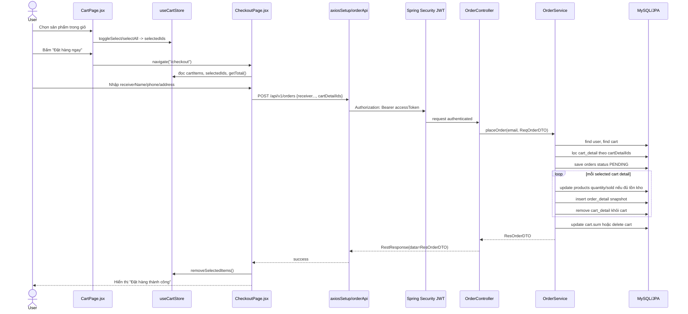

# Phân tích luồng hoạt động khi đặt hàng - Han Sports v2

Tài liệu này phân tích luồng code khi user đặt hàng trong Han Sports v2, từ frontend React đến backend Spring Boot và database. Nội dung chỉ dựa trên source code hiện có.

## 1. Các file tham gia luồng đặt hàng

| Lớp | File | Vai trò trong luồng |
|---|---|---|
| Route frontend | `hansport_v2fe/src/App.jsx` | Khai báo route `/checkout` trỏ tới `CheckoutPage`. |
| Trang giỏ hàng | `hansport_v2fe/src/pages/client/CartPage.jsx` | Load giỏ hàng, chọn cart item cần thanh toán, điều hướng sang `/checkout`. |
| Trang checkout | `hansport_v2fe/src/pages/client/CheckoutPage.jsx` | Nhập thông tin người nhận, tạo payload đặt hàng, gọi API tạo order. |
| Cart store | `hansport_v2fe/src/store/useCartStore.js` | Lưu `cartItems`, `selectedIds`, tính tổng tiền selected items, xóa local selected items sau khi đặt hàng thành công. |
| Order API | `hansport_v2fe/src/api/orderApi.js` | Gọi `POST /api/v1/orders`. |
| Axios setup | `hansport_v2fe/src/api/axiosSetup.js` | Tự gắn Bearer access token và refresh token khi gặp 401. |
| Security | `hansport_v2be/src/main/java/com/javaweb/config/SecurityConfiguration.java` | Bảo vệ `POST /api/v1/orders` bằng `.anyRequest().authenticated()`. |
| Controller | `hansport_v2be/src/main/java/com/javaweb/controller/OrderController.java` | Nhận request checkout, lấy email user hiện tại từ JWT, gọi `OrderService.placeOrder`. |
| Request DTO | `hansport_v2be/src/main/java/com/javaweb/domain/request/ReqOrderDTO.java` | Validate receiver info và `cartDetailIds`. |
| Service | `hansport_v2be/src/main/java/com/javaweb/service/OrderService.java` | Transaction chính: validate cart, tạo order, trừ tồn kho, tạo order detail, dọn cart, trả DTO. |
| Repository | `UserRepository`, `CartRepository`, `OrderRepository`, `OrderDetailRepository`, `ProductRepository` | Truy vấn user/cart, lưu order/order detail, update tồn kho product. |
| Entity | `Order`, `OrderDetail`, `Cart`, `CartDetail`, `Product` | Mapping dữ liệu sang bảng DB. |
| Response DTO | `ResOrderDTO`, `ResOrderDetailDTO` | Dữ liệu order trả về frontend. |
| Response wrapper | `FormatRestResponse`, `RestResponse` | Bọc response JSON thành `{ statusCode, message, data }`. |

## 2. Sơ đồ tổng quan



## 3. Bước 1 - User chọn sản phẩm trong giỏ hàng

Trong `CartPage.jsx`, khi user mở giỏ hàng, frontend gọi API lấy cart:

```jsx
// hansport_v2fe/src/pages/client/CartPage.jsx
cartApi.getCart()
  .then((res) => {
    const items = res.data?.data?.cartDetails || res.data?.data || [];
    setCart(items);
  })
```

`useCartStore.setCart` lưu danh sách cart detail và mặc định chọn tất cả item:

```js
// hansport_v2fe/src/store/useCartStore.js
setCart: (items) => {
  const totalCount = items.reduce((sum, item) => sum + (item.quantity || 0), 0);
  set({ cartItems: items, totalCount, selectedIds: items.map(i => i.id) });
},
```

Khi user tick/untick item, store cập nhật `selectedIds`:

```js
// hansport_v2fe/src/store/useCartStore.js
toggleSelect: (id) => {
  const selectedIds = get().selectedIds.includes(id)
    ? get().selectedIds.filter(i => i !== id)
    : [...get().selectedIds, id];
  set({ selectedIds });
},
```

Ý nghĩa: `selectedIds` chính là danh sách `cart_detail.id` sẽ được gửi lên backend khi checkout.

## 4. Bước 2 - User bấm đặt hàng và vào checkout

Trong `CartPage.jsx`, button checkout kiểm tra có item được chọn rồi điều hướng sang `/checkout`:

```jsx
// hansport_v2fe/src/pages/client/CartPage.jsx
if (selectedIds.length === 0) {
  toast.error("Vui lòng chọn ít nhất một sản phẩm để thanh toán.");
  return;
}
navigate("/checkout");
```

`CheckoutPage.jsx` tự điều hướng về `/login` nếu chưa đăng nhập, hoặc về `/cart` nếu cart rỗng:

```jsx
// hansport_v2fe/src/pages/client/CheckoutPage.jsx
useEffect(() => {
  if (!user) {
    navigate("/login");
    return;
  }

  if (cartItems.length === 0) {
    navigate("/cart");
  }
}, [user, cartItems.length, navigate]);
```

## 5. Bước 3 - CheckoutPage tạo payload đặt hàng

Checkout form có các field:

- `receiverName`
- `receiverPhone`
- `receiverAddress`
- `note`

Khi submit, frontend gửi thêm `cartDetailIds: selectedIds`:

```jsx
// hansport_v2fe/src/pages/client/CheckoutPage.jsx
const handleSubmit = async (e) => {
  e.preventDefault();
  setSubmitting(true);
  try {
    await orderApi.createOrder({ ...form, cartDetailIds: selectedIds });
    removeSelectedItems();
    setSuccess(true);
  } catch (err) {
    toast.error(err.response?.data?.message || "Đặt hàng thất bại, vui lòng thử lại.");
  } finally {
    setSubmitting(false);
  }
};
```

API wrapper:

```js
// hansport_v2fe/src/api/orderApi.js
createOrder: (data) => axiosInstance.post("/api/v1/orders", data),
```

Lưu ý có thật trong source: frontend gửi `note`, nhưng backend `ReqOrderDTO` không khai báo field `note`, `Order` entity cũng không có field note. Trong source hiện tại, note không được `OrderService.placeOrder` đọc/lưu.

## 6. Bước 4 - Axios gắn access token

`axiosSetup.js` lấy `accessToken` từ `useAuthStore` và gắn vào header:

```js
// hansport_v2fe/src/api/axiosSetup.js
axiosInstance.interceptors.request.use((config) => {
  const { accessToken } = useAuthStore.getState();
  if (accessToken) {
    config.headers.Authorization = `Bearer ${accessToken}`;
  }
  return config;
});
```

Nếu API trả 401, interceptor gọi `/api/v1/auth/refresh` để lấy access token mới rồi retry request cũ.

## 7. Bước 5 - Spring Security kiểm tra quyền gọi API

Trong `SecurityConfiguration.java`, chỉ một số endpoint public/admin được khai báo riêng. `POST /api/v1/orders` không nằm trong public matcher, nên rơi vào rule:

```java
// hansport_v2be/src/main/java/com/javaweb/config/SecurityConfiguration.java
.requestMatchers(HttpMethod.GET, "/api/v1/orders").hasRole("ADMIN")
.requestMatchers(HttpMethod.PUT, "/api/v1/orders").hasRole("ADMIN")
.requestMatchers(HttpMethod.POST, "/api/v1/orders/*/send-email").hasRole("ADMIN")
.anyRequest().authenticated()
```

Kết luận: tạo đơn hàng yêu cầu user đã authenticated bằng JWT.

## 8. Bước 6 - OrderController nhận request

Controller nhận body `ReqOrderDTO`, lấy email user hiện tại từ security context, rồi gọi service:

```java
// hansport_v2be/src/main/java/com/javaweb/controller/OrderController.java
@PostMapping("/orders")
public ResponseEntity<ResOrderDTO> placeOrder(@RequestBody @Valid ReqOrderDTO redOrderDTO)
        throws IdInvalidException {
    String email = SecurityUtil.getCurrentUserLogin().isPresent() ?
            SecurityUtil.getCurrentUserLogin().get() : "";

    ResOrderDTO order = this.orderService.placeOrder(email, redOrderDTO);
    return ResponseEntity.ok(order);
}
```

Request DTO validate dữ liệu đầu vào:

```java
// hansport_v2be/src/main/java/com/javaweb/domain/request/ReqOrderDTO.java
@NotBlank(message = "Tên không được để trống")
String receiverName;

@NotBlank(message = "Số điện thoại không được để trống")
String receiverPhone;

@NotBlank(message = "Địa chỉ không được để trống")
String receiverAddress;

@NotEmpty(message = "Danh sach san pham thanh toan khong duoc de trong")
List<Long> cartDetailIds;
```

## 9. Bước 7 - OrderService chạy transaction đặt hàng

`OrderService.placeOrder` là transaction chính:

```java
// hansport_v2be/src/main/java/com/javaweb/service/OrderService.java
@Transactional
public ResOrderDTO placeOrder(String email, ReqOrderDTO reqOrder) throws IdInvalidException {
```

### 9.1. Tìm user và cart

```java
User currentUser = this.userRepository.findByEmail(email)
        .orElseThrow(() -> new IdInvalidException("Người dùng không tồn tại"));
Cart cart = this.cartRepository.findByUser(currentUser)
        .orElseThrow(() -> new IdInvalidException("Giỏ hàng đang trống"));
```

Ý nghĩa:

- Email lấy từ JWT là nguồn xác định owner.
- Backend chỉ lấy cart của chính user hiện tại, không lấy cart theo id từ request.

### 9.2. Lọc các cart detail được chọn

```java
List<CartDetail> orderItems = allCartDetails.stream()
        .filter(cd -> reqOrder.getCartDetailIds().contains(cd.getId()))
        .collect(Collectors.toList());

if (orderItems.isEmpty()) {
    throw new IdInvalidException("Không có sản phẩm nào được chọn để thanh toán");
}
```

Ý nghĩa:

- Frontend gửi danh sách `cartDetailIds`.
- Backend chỉ nhận những id nằm trong cart của user hiện tại.
- Nếu user gửi id không thuộc cart của mình, các id đó không được chọn vào `orderItems`.

### 9.3. Kiểm tra tồn kho và tính tổng tiền

```java
long sum = 0;
for (CartDetail cd : orderItems) {
    Product product = cd.getProduct();
    if (product.getQuantity() < cd.getQuantity()) {
        throw new IdInvalidException("Sản phẩm " + product.getName() + " không đủ tồn kho");
    }
    sum += cd.getPrice() * cd.getQuantity();
}
```

Ý nghĩa:

- Tổng tiền backend dùng `cd.getPrice() * cd.getQuantity()`.
- `price` trong `CartDetail` là snapshot giá tại lúc add/update cart, không lấy trực tiếp từ UI.
- Shipping fee frontend có tính để hiển thị, nhưng backend `Order.totalPrice` hiện chỉ lưu tổng tiền hàng `sum`.

### 9.4. Tạo order trạng thái PENDING

```java
Order order = new Order();
order.setUser(currentUser);
order.setReceiverName(reqOrder.getReceiverName());
order.setReceiverAddress(reqOrder.getReceiverAddress());
order.setReceiverPhone(reqOrder.getReceiverPhone());
order.setStatus("PENDING");
order.setTotalPrice(sum);
order = this.orderRepository.save(order);
```

Entity `Order` map bảng `orders`:

```java
// hansport_v2be/src/main/java/com/javaweb/domain/Order.java
@Entity
@Table(name = "orders")
public class Order {
    private long totalPrice;
    private String receiverName;
    private String receiverAddress;
    private String receiverPhone;
    private String status;

    @ManyToOne
    @JoinColumn(name = "user_id")
    private User user;
}
```

### 9.5. Trừ tồn kho atomic và tạo order detail

Trong từng item được chọn:

```java
Product product = cartDetail.getProduct();
int affectedRows = this.productRepository.decrementStockIfAvailable(
        product.getId(),
        cartDetail.getQuantity()
);
if (affectedRows == 0) {
    throw new IdInvalidException("San pham " + product.getName() + " khong du ton kho");
}
```

Repository update tồn kho bằng query có điều kiện:

```java
// hansport_v2be/src/main/java/com/javaweb/repository/ProductRepository.java
@Modifying(flushAutomatically = true)
@Query("update Product p set p.quantity = p.quantity - :quantity, p.sold = p.sold + :quantity " +
       "where p.id = :productId and p.quantity >= :quantity")
int decrementStockIfAvailable(@Param("productId") long productId,
                              @Param("quantity") long quantity);
```

Ý nghĩa:

- Query chỉ update nếu `p.quantity >= :quantity`.
- Nếu không đủ tồn kho tại thời điểm ghi, `affectedRows = 0`, service throw exception.
- Vì method có `@Transactional`, exception sẽ rollback các thay đổi trong transaction.

Sau khi trừ kho thành công, service tạo order detail:

```java
OrderDetail orderDetail = new OrderDetail();
orderDetail.setOrder(order);
orderDetail.setProduct(product);
orderDetail.setPrice(cartDetail.getPrice());
orderDetail.setQuantity(cartDetail.getQuantity());
orderDetail.setSelectedColor(cartDetail.getSelectedColor());
orderDetail.setSelectedSize(cartDetail.getSelectedSize());
savedOrderDetails.add(this.orderDetailRepository.save(orderDetail));
```

Entity `OrderDetail` map bảng `order_detail` và lưu snapshot:

```java
// hansport_v2be/src/main/java/com/javaweb/domain/OrderDetail.java
@Entity
@Table(name = "order_detail")
public class OrderDetail {
    private long quantity;
    private long price;
    private String selectedColor;
    private String selectedSize;

    @ManyToOne
    @JoinColumn(name = "order_id")
    private Order order;

    @ManyToOne(fetch = FetchType.LAZY)
    @JoinColumn(name = "product_id")
    private Product product;
}
```

### 9.6. Dọn cart sau checkout

Sau khi tạo từng `OrderDetail`, service remove `CartDetail` khỏi collection:

```java
allCartDetails.remove(cartDetail);
```

Cuối transaction:

```java
if (!allCartDetails.isEmpty()) {
    cart.setSum(allCartDetails.size());
    this.cartRepository.save(cart);
} else {
    this.cartRepository.deleteById(cart.getId());
}
```

Entity `Cart` có quan hệ:

```java
// hansport_v2be/src/main/java/com/javaweb/domain/Cart.java
@OneToMany(mappedBy = "cart", fetch = FetchType.LAZY,
           cascade = CascadeType.ALL, orphanRemoval = true)
List<CartDetail> cartDetails;
```

Ý nghĩa:

- Nếu cart vẫn còn item chưa checkout, backend cập nhật lại `cart.sum`.
- Nếu cart không còn item, backend xóa cart.
- `orphanRemoval = true` thể hiện ý định xóa cart detail khi bị remove khỏi collection.

## 10. Bước 8 - Service tạo response DTO

Sau khi hoàn tất, service trả `ResOrderDTO`:

```java
return this.convertToResOrderDTO(order);
```

DTO gồm order info, user rút gọn và order details:

```java
// hansport_v2be/src/main/java/com/javaweb/domain/response/order/ResOrderDTO.java
public class ResOrderDTO {
    private long id;
    private long totalPrice;
    private String receiverName;
    private String receiverAddress;
    private String receiverPhone;
    private String status;
    private UserOrder user;
    private List<ResOrderDetailDTO> orderDetails;
}
```

`FormatRestResponse` bọc JSON thành `RestResponse`:

```java
// hansport_v2be/src/main/java/com/javaweb/util/FormatRestResponse.java
res.setData(body);
res.setMessage(message != null ? message.value() : "Call API success");
```

Response thực tế frontend nhận thường có dạng:

```json
{
  "statusCode": 200,
  "message": "Call API success",
  "data": {
    "id": 1,
    "totalPrice": 500000,
    "receiverName": "...",
    "status": "PENDING",
    "orderDetails": []
  }
}
```

## 11. Bước 9 - Frontend xử lý sau khi đặt hàng thành công

`CheckoutPage.jsx` không dùng dữ liệu order trả về để cập nhật UI chi tiết. Sau khi API success:

```jsx
await orderApi.createOrder({ ...form, cartDetailIds: selectedIds });
removeSelectedItems();
setSuccess(true);
```

`removeSelectedItems` chỉ cập nhật Zustand local:

```js
// hansport_v2fe/src/store/useCartStore.js
removeSelectedItems: () => {
  const items = get().cartItems.filter((item) => !get().selectedIds.includes(item.id));
  const totalCount = items.reduce((sum, i) => sum + (i.quantity || 0), 0);
  set({ cartItems: items, totalCount, selectedIds: [] });
},
```

Sau đó UI hiển thị màn hình thành công và cho user đi tới `/orders`.

## 12. Database thay đổi trong một lần đặt hàng

| Bảng | Thao tác | Nguồn code |
|---|---|---|
| `orders` | Insert một order mới với `status = PENDING`, `total_price = sum`. | `OrderService.placeOrder`, `Order.java` |
| `order_detail` | Insert nhiều dòng snapshot từ selected cart details. | `OrderService.placeOrder`, `OrderDetail.java` |
| `products` | Update `quantity = quantity - selectedQuantity`, `sold = sold + selectedQuantity`. | `ProductRepository.decrementStockIfAvailable` |
| `cart_detail` | Xóa các dòng đã checkout khỏi cart. | `allCartDetails.remove(cartDetail)`, `Cart.cartDetails orphanRemoval` |
| `carts` | Update `sum` nếu còn item, hoặc delete cart nếu hết item. | `cartRepository.save(cart)` / `cartRepository.deleteById(cart.getId())` |

Migration liên quan:

```sql
-- hansport_v2be/src/main/resources/db/migration/V1__baseline_schema.sql
CREATE TABLE IF NOT EXISTS orders (... total_price BIGINT NOT NULL, ...);
CREATE TABLE IF NOT EXISTS order_detail (... quantity BIGINT NOT NULL, price BIGINT NOT NULL, ...);
```

```sql
-- hansport_v2be/src/main/resources/db/migration/V6__product_sale_options.sql
ALTER TABLE cart_detail
    ADD COLUMN selected_color VARCHAR(100) NULL AFTER price,
    ADD COLUMN selected_size VARCHAR(50) NULL AFTER selected_color;

ALTER TABLE order_detail
    ADD COLUMN selected_color VARCHAR(100) NULL AFTER price,
    ADD COLUMN selected_size VARCHAR(50) NULL AFTER selected_color;
```

## 13. Những điểm đáng chú ý trong luồng hiện tại

### 13.1. Backend không tin giá/tổng tiền từ frontend

Frontend chỉ gửi receiver info và `cartDetailIds`. Backend tự lấy cart detail từ DB và tính:

```java
sum += cd.getPrice() * cd.getQuantity();
```

Đây là điểm tốt vì user không thể tự sửa tổng tiền trong payload checkout.

### 13.2. Có chống oversell ở mức update query

Backend kiểm tra tồn kho trước, sau đó vẫn gọi query update có điều kiện `p.quantity >= :quantity`. Query này giúp giảm rủi ro oversell khi có nhiều checkout đồng thời.

Nếu update không ảnh hưởng dòng nào, transaction throw exception và rollback:

```java
if (affectedRows == 0) {
    throw new IdInvalidException("San pham " + product.getName() + " khong du ton kho");
}
```

### 13.3. Shipping fee và note chưa được backend lưu

Frontend tính:

```jsx
const shipping = subtotal >= freeShipLimit ? 0 : baseShippingFee;
```

Nhưng backend:

- `ReqOrderDTO` không có `note`.
- `Order` không có `shippingFee` hoặc `note`.
- `OrderService.placeOrder` set `totalPrice(sum)` chỉ bằng tổng tiền hàng.

Vì vậy UI có hiển thị tổng cộng gồm shipping, nhưng database hiện chỉ lưu tổng tiền hàng.

### 13.4. Order tạo ra luôn bắt đầu ở `PENDING`

Source hard-code:

```java
order.setStatus("PENDING");
```

Admin có thể chuyển trạng thái sau đó qua `PUT /api/v1/orders`.

### 13.5. Checkout không restore tồn kho khi xóa/cancel order

Trong source `updateOrderStatus` chỉ đổi status, `deleteOrder` chỉ xóa order. Không thấy logic hoàn kho khi order bị `CANCELLED` hoặc bị xóa.

### 13.6. Product inactive vẫn có thể nằm trong cart cũ

`OrderService.placeOrder` kiểm tra tồn kho nhưng không thấy check `product.active`. Nếu sản phẩm đã có trong cart trước khi bị ẩn/inactive, checkout hiện dựa trên tồn kho và cart detail hiện có.

## 14. Tóm tắt một câu

Luồng đặt hàng của Han Sports v2 là: frontend chọn `cartDetailIds` trong Zustand -> `CheckoutPage` gửi `POST /api/v1/orders` kèm JWT -> `OrderController` lấy email từ security context -> `OrderService.placeOrder` chạy trong transaction để tạo order, trừ tồn kho, tạo order detail, dọn cart -> trả `ResOrderDTO` được bọc trong `RestResponse` -> frontend xóa selected items local và hiển thị đặt hàng thành công.
