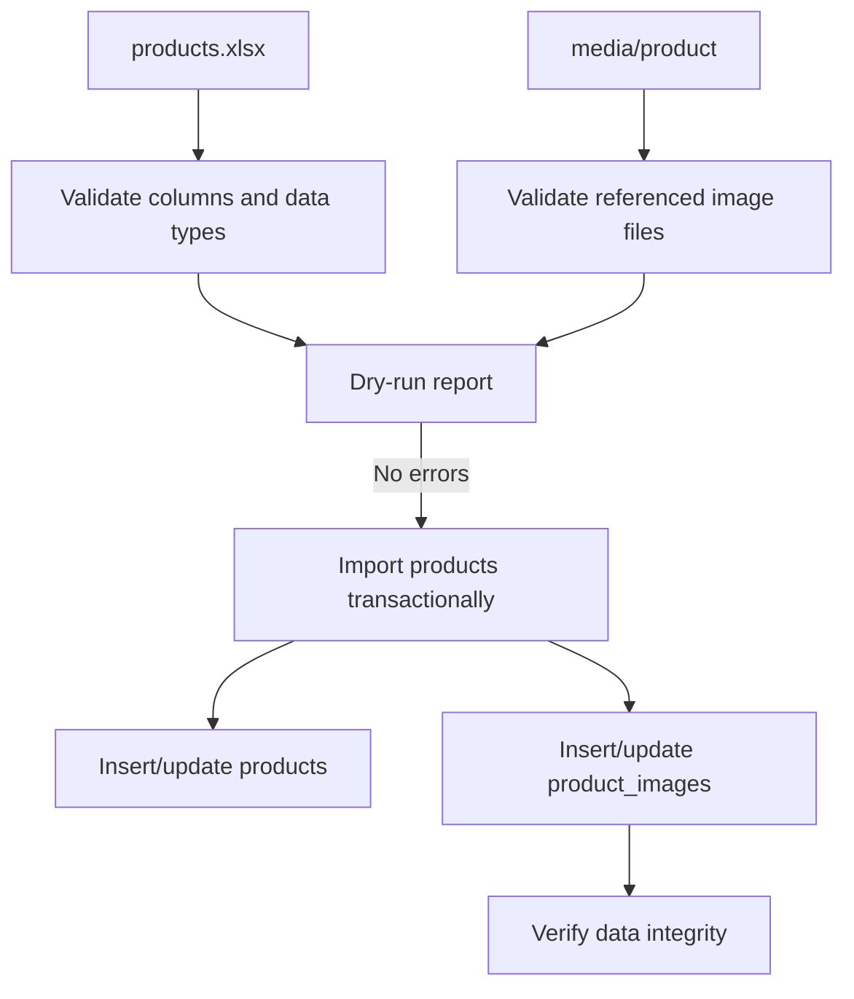

# Han Sports v2 Product Excel Import Workflow

Tai lieu nay dinh nghia huong quan ly du lieu hang hoa theo kieu chuyen nghiep hon: schema do Flyway quan ly, system data do seeder idempotent tao, con product/business data duoc import tu file du lieu co quy trinh.

## Muc Tieu

- Khong hard-code product demo trong Java seeder.
- Khong dua database dump ca nhan vao Git.
- Co the them file Excel hang hoa sau khi fix xong loi hien tai.
- Import product phai di kem media integrity check.
- Co the validate du lieu truoc khi ghi vao DB.

## Vi Tri File De Xuat

```text
data/
+-- import/
    +-- README.md
    +-- products.xlsx
    +-- media/
        +-- product/
        +-- logo/
        +-- banner/
```

Nguyen tac:

- `products.xlsx` chi nen commit neu la dataset public/demo/portfolio.
- File Excel chua du lieu that cua shop khong nen commit public.
- Anh product can nam trong `data/import/media/product` hoac upload storage, va ten file phai khop voi cot `image_names`.

## Cot Excel De Xuat

| Cot | Bat buoc | Kieu | Ghi chu |
| --- | --- | --- | --- |
| `sku` | Co | Text | Ma hang duy nhat, nen them vao DB sau nay neu can |
| `name` | Co | Text | Ten san pham |
| `price` | Co | Integer VND | Khong dung double |
| `quantity` | Co | Integer | Ton kho ban dau |
| `brand` | Khong | Text | Vi du `Yonex` |
| `target` | Khong | Text | `Nam`, `Nu`, `Unisex`, `Tre em` |
| `category` | Co | Text | Vi du `Vot cau long`, `Balo` |
| `short_desc` | Co | Text | Mo ta ngan |
| `detail_desc` | Co | Text | Mo ta chi tiet |
| `image_names` | Khong | Text | Danh sach ten file cach nhau bang dau phay |
| `active` | Khong | Boolean | De an/hien san pham neu bo sung sau |

## Luong Import De Xuat



## Validation Truoc Khi Ghi DB

- Ten san pham khong rong.
- Gia la so nguyen VND va >= 0.
- Quantity la so nguyen va >= 0.
- Category khong rong.
- `image_names` khong chua path traversal (`..`, `/`, `\`).
- Moi image trong Excel phai ton tai trong folder media tuong ung.
- Ten file anh khong trung nhau ngoai y muon.
- Bao loi thanh report truoc khi ghi DB.

## Import Script De Xuat

Chua can viet ngay neu chua co file Excel that. Khi trien khai, nen tao:

```text
scripts/import-products-from-excel.ps1
```

Script nen:

- Yeu cau tham so `-ExcelFile`.
- Mac dinh chay dry-run, khong ghi DB.
- Chi ghi DB khi co `-Apply`.
- Tao backup truoc khi ghi DB.
- Goi backend API admin hoac service import rieng, khong chen SQL ad hoc.
- Chay `scripts/verify-data-integrity.ps1` sau import.

## Backend Import Service De Xuat

Khi can lam that, nen them module rieng:

```text
hansport_v2be/src/main/java/com/javaweb/service/ProductImportService.java
hansport_v2be/src/main/java/com/javaweb/domain/request/ProductImportRowDTO.java
hansport_v2be/src/main/java/com/javaweb/controller/ProductImportController.java
```

Khong nen dua logic parse Excel vao `ProductService` hien tai vi se lam service nay phinh to. `ProductService` nen xu ly CRUD product, con import hang loat nen co service rieng.

## Viec Da Lam Sach

- Java seeder khong con seed product demo.
- Product/media data duoc chuyen sang workflow `data/import` va backup/restore package.
- Docker/Flyway/scripts backup-restore van giu de quan ly DB va upload volume.
