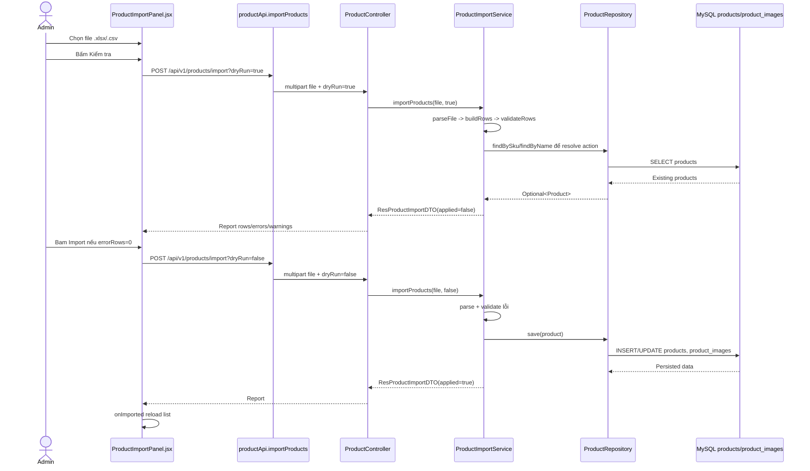

# Phân tích chức năng sản phẩm - Han Sports v2

Tài liệu này chỉ dựa trên source code hiện có trong workspace. Các file được đọc chính:

- `hansport_v2be/src/main/java/com/javaweb/controller/ProductController.java`
- `hansport_v2be/src/main/java/com/javaweb/service/ProductService.java`
- `hansport_v2be/src/main/java/com/javaweb/service/ProductImportService.java`
- `hansport_v2be/src/main/java/com/javaweb/repository/ProductRepository.java`
- `hansport_v2be/src/main/java/com/javaweb/repository/ProductImageRepository.java`
- `hansport_v2be/src/main/java/com/javaweb/domain/Product.java`
- `hansport_v2be/src/main/java/com/javaweb/domain/ProductImage.java`
- `hansport_v2be/src/main/java/com/javaweb/controller/FileController.java`
- `hansport_v2be/src/main/java/com/javaweb/service/FileService.java`
- `hansport_v2fe/src/api/productApi.js`
- `hansport_v2fe/src/pages/client/ShopPage.jsx`
- `hansport_v2fe/src/pages/client/ProductDetailPage.jsx`
- `hansport_v2fe/src/components/common/ProductCard.jsx`
- `hansport_v2fe/src/pages/admin/ProductsPage.jsx`
- `hansport_v2fe/src/pages/admin/products/useProductsAdmin.js`
- `hansport_v2fe/src/pages/admin/products/ProductFormModal.jsx`
- `hansport_v2fe/src/pages/admin/products/ProductGalleryManager.jsx`
- `hansport_v2fe/src/pages/admin/products/ProductImportModal.jsx`
- `hansport_v2fe/src/components/admin/ProductImportPanel.jsx`
- `hansport_v2fe/src/pages/admin/products/ProductTable.jsx`
- `hansport_v2fe/src/pages/admin/products/ProductFilters.jsx`
- `hansport_v2fe/src/pages/admin/products/productFormUtils.js`
- `hansport_v2fe/src/utils/constants.js`
- `hansport_v2be/src/main/java/com/javaweb/config/SecurityConfiguration.java`
- `hansport_v2be/src/main/resources/db/migration/V1__baseline_schema.sql`
- `hansport_v2be/src/main/resources/db/migration/V4__product_sku_and_active.sql`
- `hansport_v2be/src/main/resources/db/migration/V5__product_image_order.sql`
- `hansport_v2be/src/main/resources/db/migration/V6__product_sale_options.sql`

Ghi chú về snippet: một số doan code dùng `...` để rút gọn message text/UI copy, nhưng giữ nguyên logic, method, field, endpoint và luồng gửi thật trong source.

## 1. Tổng quan module sản phẩm

Module sản phẩm phụ trách:

- Hiển thị danh sách sản phẩm public trên trang shop vì trang chủ.
- Hiển thị chi tiết sản phẩm public.
- Quan tri sản phẩm cho ADMIN: thêm, sửa, xóa, xóa nhiều sản phẩm trên UI.
- Upload ảnh sản phẩm vào storage của backend.
- Import sản phẩm bằng file `.xlsx` hoặc `.csv`.
- Search, filter, pagination ở public shop vì search/pagination ở trang admin.
- Lưu sản phẩm vào bảng `products`, lưu thư viện ảnh vào bảng `product_images`.

Kiến trúc module đi theo luồng quen thuộc:

```text
React UI -> productApi/axios -> Spring Controller -> Service -> Repository -> JPA Entity -> MySQL
```

## 2. Endpoint vì quyền truy cập

Quyền truy cập được khai báo trong `hansport_v2be/src/main/java/com/javaweb/config/SecurityConfiguration.java`.

Snippet:

```java
.requestMatchers(HttpMethod.GET, "/api/v1/products", "/api/v1/products/**", "/api/v1/files", "/api/v1/settings").permitAll()
.requestMatchers(HttpMethod.POST, "/api/v1/products", "/api/v1/products/import", "/api/v1/files").hasRole("ADMIN")
.requestMatchers(HttpMethod.PUT, "/api/v1/products").hasRole("ADMIN")
.requestMatchers(HttpMethod.DELETE, "/api/v1/products/**").hasRole("ADMIN")
```

Bảng endpoint sản phẩm:

| Endpoint | Method | Quyền | Controller | Input | Output chính |
|---|---:|---|---|---|---|
| `/api/v1/products` | GET | Public | `ProductController` | `page`, `size`, `sort`, `q`, `brand`, `target`, `category`, `minPrice`, `maxPrice`, `includeInactive`, `Authentication` | `ResultPaginationDTO` gồm `ResProductDTO` |
| `/api/v1/products/{id}` | GET | Public | `ProductController` | `PathVariable id` | `ResProductDTO` |
| `/api/v1/products/navigation` | GET | Public | `ProductController` | Không có body | `ResProductNavigationDTO` |
| `/api/v1/products` | POST | ADMIN | `ProductController` | JSON `ReqProductDTO` | `ResCreateProductDTO` |
| `/api/v1/products` | PUT | ADMIN | `ProductController` | JSON `ReqProductDTO` có `id` | `ResUpdateProductDTO` |
| `/api/v1/products/{id}` | DELETE | ADMIN | `ProductController` | `PathVariable id` | `Void` |
| `/api/v1/products/import?dryRun=true/false` | POST multipart | ADMIN | `ProductController` | `file`, `dryRun` | `ResProductImportDTO` |
| `/api/v1/files?folder=product` | POST multipart | ADMIN | `FileController` | `files`, `folder` | `ResUploadFileDTO` |
| `/api/v1/files?fileName=...&folder=product` | GET | Public | `FileController` | `fileName`, `folder` | `Resource` image |

Lưu ý: GET `/api/v1/products/{id}` dạng public vì service chỉ lấy theo `id`, không lọc `active`. Vì vậy sản phẩm inactive vẫn có thể xem nếu biết id.

## 3. Database và entity liên quan

### 3.1 Bảng `products`

Bằng gốc được tạo trong `hansport_v2be/src/main/resources/db/migration/V1__baseline_schema.sql`:

```sql
CREATE TABLE IF NOT EXISTS products (
    id BIGINT NOT NULL AUTO_INCREMENT,
    name VARCHAR(255) NOT NULL,
    price BIGINT NOT NULL,
    detail_desc MEDIUMTEXT NOT NULL,
    short_desc VARCHAR(255) NOT NULL,
    quantity BIGINT NOT NULL,
    sold BIGINT NOT NULL,
    brand VARCHAR(255),
    target VARCHAR(255),
    category VARCHAR(255),
    PRIMARY KEY (id)
);
```

Các migration sau mo rỗng:

```sql
ALTER TABLE products
    ADD COLUMN sku VARCHAR(100) NULL AFTER id,
    ADD COLUMN active TINYINT(1) NOT NULL DEFAULT 1 AFTER category;

CREATE UNIQUE INDEX uk_products_sku ON products (sku);
CREATE INDEX idx_products_active ON products (active);
```

```sql
ALTER TABLE products
    ADD COLUMN original_price BIGINT NULL AFTER price,
    ADD COLUMN color_options VARCHAR(500) NULL AFTER active,
    ADD COLUMN size_options VARCHAR(255) NULL AFTER color_options;
```

Entity tương ứng trong `hansport_v2be/src/main/java/com/javaweb/domain/Product.java`:

```java
@Entity
@Table(name = "products")
public class Product {
    @Id
    @GeneratedValue(strategy = GenerationType.IDENTITY)
    private long id;

    @Column(unique = true, length = 100)
    private String sku;

    private String name;
    private long price;
    private Long originalPrice;
    private String detailDesc;
    private String shortDesc;
    private long quantity;
    private long sold;
    private String brand;
    private String target;
    private String category;
    private boolean active = true;
    private String colorOptions;
    private String sizeOptions;
}
```

### 3.2 Bảng `product_images`

Bảng được tạo trong `V1__baseline_schema.sql`:

```sql
CREATE TABLE IF NOT EXISTS product_images (
    id BIGINT NOT NULL AUTO_INCREMENT,
    image_url VARCHAR(255),
    product_id BIGINT,
    PRIMARY KEY (id),
    KEY idx_product_images_product_id (product_id),
    CONSTRAINT fk_product_images_product FOREIGN KEY (product_id) REFERENCES products (id)
);
```

Thứ tự ảnh được thêm trong `V5__product_image_order.sql`:

```sql
ALTER TABLE product_images
    ADD COLUMN sort_order INT NOT NULL DEFAULT 0;

CREATE INDEX idx_product_images_product_order
    ON product_images (product_id, sort_order);
```

Quan hệ trong `Product.java`:

```java
@OneToMany(mappedBy = "product", fetch = FetchType.LAZY, cascade = CascadeType.ALL, orphanRemoval = true)
@OrderColumn(name = "sort_order")
private List<ProductImage> images = new ArrayList<>();
```

Entity ảnh trong `hansport_v2be/src/main/java/com/javaweb/domain/ProductImage.java`:

```java
@Entity
@Table(name = "product_images")
public class ProductImage {
    @Id
    @GeneratedValue(strategy = GenerationType.IDENTITY)
    private long id;

    private String imageUrl;

    @ManyToOne(fetch = FetchType.LAZY)
    @JoinColumn(name = "product_id")
    @JsonIgnore
    private Product product;
}
```

Kết luận: ảnh đầu tiên trong list `Product.images` là ảnh dài điện trên frontend. Thứ tự được lưu bằng cột `sort_order`.

## 4. Phân tích danh sách sản phẩm public

### 4.1 Frontend public list

Trang public list nằm ở `hansport_v2fe/src/pages/client/ShopPage.jsx`.

State filter đọc từ URL:

```js
const page = parseInt(searchParams.get("page") || "0");
const q = searchParams.get("q") || "";
const category = searchParams.get("category") || "";
const brand = searchParams.get("brand") || "";
const target = searchParams.get("target") || "";
const priceKey = searchParams.get("price") || "";
```

Gửi API:

```js
const params = { page, size: 12, sort: "id,asc" };
if (q) params.q = q;
if (category) params.category = category;
if (brand) params.brand = brand;
if (target) params.target = target;
if (selectedPrice) {
  params.minPrice = selectedPrice.min;
  params.maxPrice = selectedPrice.max;
}
const res = await productApi.getAll(params);
const data = res.data?.data || res.data;
setProducts(data?.result || []);
setTotalPages(data?.meta?.pages || 1);
setTotalElements(data?.meta?.total || 0);
```

Trang shop còn gửi navigation để build filter category/brand:

```js
productApi.getNavigation()
  .then((response) => {
    const data = response.data?.data || response.data;
    if (active && Array.isArray(data?.categories)) {
      setCatalogCategories(data.categories);
    }
  });
```

Sản phẩm được render bảng `ProductCard` trong `hansport_v2fe/src/components/common/ProductCard.jsx`.

Snippet ảnh vì link detail:

```js
const imageSrc = getImageUrl(getFirstImage(product), "product", imageVersion);

<Link to={`/products/${id}`} className="block relative overflow-hidden">
  <SafeImage src={imageSrc} alt={name} />
</Link>
```

Trang chủ `hansport_v2fe/src/pages/client/HomePage.jsx` cùng dùng module sản phẩm:

```js
productApi.getAll({ page: 0, size: 12, sort: "id,desc" })
  .then((res) => setProducts(res.data?.data?.result || []));
```

Và lấy sản phẩm theo danh mục:

```js
productApi.getAll({ page: 0, size: 12, sort: "id,desc", category: activeTab })
```

### 4.2 API client

File `hansport_v2fe/src/api/productApi.js`:

```js
export const productApi = {
  getAll: (params) => axiosInstance.get("/api/v1/products", { params }),
  getNavigation: () => axiosInstance.get("/api/v1/products/navigation"),
  getById: (id) => axiosInstance.get(`/api/v1/products/${id}`),
};
```

### 4.3 Backend controller

File `hansport_v2be/src/main/java/com/javaweb/controller/ProductController.java`:

```java
@GetMapping("/products")
public ResponseEntity<ResultPaginationDTO> getAllProducts(@Filter Specification<Product> spec,
                                                          Pageable pageable,
                                                          @RequestParam(name = "includeInactive", defaultValue = "false") boolean includeInactive,
                                                          @RequestParam(name = "q", required = false) String query,
                                                          @RequestParam(name = "brand", required = false) String brand,
                                                          @RequestParam(name = "target", required = false) String target,
                                                          @RequestParam(name = "category", required = false) String category,
                                                          @RequestParam(name = "minPrice", required = false) Long minPrice,
                                                          @RequestParam(name = "maxPrice", required = false) Long maxPrice,
                                                          Authentication authentication) {
    boolean canIncludeInactive = includeInactive && isAdmin(authentication);
    return ResponseEntity.status(HttpStatus.OK)
            .body(this.productService.fetchAllProducts(
                    spec, pageable, canIncludeInactive, query, brand, target, category, minPrice, maxPrice));
}
```

Ý nghĩa:

- Public user có thể gửi GET `/products`.
- Nếu public gửi `includeInactive=true` thứ vẫn không có tác dụng vì `canIncludeInactive` chỉ true khi authentication có `ROLE_ADMIN`.
- `page`, `size`, `sort` được bind vào `Pageable`.
- `@Filter Specification<Product> spec` cho phép filter theo specification từ request nếu client dùng cú pháp của thư viện `rsql-parser`.
- Param riêng `q`, `brand`, `target`, `category`, `minPrice`, `maxPrice` được service ghep thêm vào specification.

### 4.4 Service search/filter/pagination

File `hansport_v2be/src/main/java/com/javaweb/service/ProductService.java`:

```java
Specification<Product> activeSpec = (root, criteriaQuery, criteriaBuilder) ->
        criteriaBuilder.isTrue(root.get("active"));
Specification<Product> finalSpec = includeInactive ? spec : combine(spec, activeSpec);
Specification<Product> searchSpec = productSearch(query);
finalSpec = combine(finalSpec, searchSpec);
finalSpec = combine(finalSpec, productFilters(brand, target, category, minPrice, maxPrice));
Page<Product> products = this.productRepository.findAll(finalSpec, pageable);
```

Tạo metadata pagination:

```java
meta.setPage(pageable.getPageNumber()+1);
meta.setPagesize(pageable.getPageSize());
meta.setPages(products.getTotalPages());
meta.setTotal(products.getTotalElements());
```

Map entity sang DTO:

```java
List<ResProductDTO> listProduct = products.getContent().
        stream().map(item -> this.convertToResProductDTO(item))
        .collect(Collectors.toList());
```

Search `q`:

```java
String escaped = query.trim().toLowerCase(Locale.ROOT)
        .replace("\\", "\\\\")
        .replace("%", "\\%")
        .replace("_", "\\_");
String pattern = "%" + escaped + "%";
return (root, criteriaQuery, criteriaBuilder) -> criteriaBuilder.or(
        criteriaBuilder.like(criteriaBuilder.lower(root.get("name")), pattern, '\\'),
        criteriaBuilder.like(criteriaBuilder.lower(root.get("sku")), pattern, '\\'),
        criteriaBuilder.like(criteriaBuilder.lower(root.get("brand")), pattern, '\\'),
        criteriaBuilder.like(criteriaBuilder.lower(root.get("category")), pattern, '\\')
);
```

Filter:

```java
if (brand != null && !brand.isBlank()) {
    result = combine(result, (root, criteriaQuery, criteriaBuilder) ->
            criteriaBuilder.equal(criteriaBuilder.lower(root.get("brand")), normalizedBrand));
}
if (target != null && !target.isBlank()) {
    result = combine(result, (root, criteriaQuery, criteriaBuilder) ->
            criteriaBuilder.equal(criteriaBuilder.lower(root.get("target")), normalizedTarget));
}
if (category != null && !category.isBlank()) {
    result = combine(result, (root, criteriaQuery, criteriaBuilder) ->
            criteriaBuilder.equal(criteriaBuilder.lower(root.get("category")), normalizedCategory));
}
if (minPrice != null && minPrice >= 0) {
    result = combine(result, (root, criteriaQuery, criteriaBuilder) ->
            criteriaBuilder.greaterThanOrEqualTo(root.get("price"), minPrice));
}
if (maxPrice != null && maxPrice >= 0) {
    result = combine(result, (root, criteriaQuery, criteriaBuilder) ->
            criteriaBuilder.lessThanOrEqualTo(root.get("price"), maxPrice));
}
```

### 4.5 Luồng end-to-end public list

```text
User mo /shop
-> ShopPage doc query string page/q/category/brand/target/price
-> productApi.getAll(params)
-> GET /api/v1/products
-> ProductController.getAllProducts
-> ProductService.fetchAllProducts
-> ProductRepository.findAll(finalSpec, pageable)
-> DB query bang products, lazy load images trong transaction khi map DTO
-> ResultPaginationDTO(meta, result)
-> ShopPage setProducts/setTotalPages/setTotalElements
-> ProductCard render anh, ten, gia, sold, nut them vao gio
```

## 5. Phân tích chi tiết sản phẩm

### 5.1 Frontend detail

Trang chủ tiết nằm ở `hansport_v2fe/src/pages/client/ProductDetailPage.jsx`.

Gửi API theo id từ route:

```js
const { id } = useParams();

productApi.getById(id)
  .then((res) => {
    const prod = res.data?.data || res.data;
    setProduct(prod);
    const brand = prod?.brand;
    if (brand) {
      return Promise.all([
        Promise.resolve(prod),
        productApi.getAll({ page: 0, size: 8, brand }),
        productApi.getAll({ page: 0, size: 8 })
      ]);
    }
  });
```

Sau khi lấy chi tiết:

- Set `product`.
- Lấy sản phẩm liên quan theo `brand`.
- Nếu còn thì lấy thêm sản phẩm general để đã tối đa 4 sản phẩm related.
- Chuyển `images`, `colorOptions`, `sizeOptions` thành list để hiển thị gallery, màu, size.

Gallery ảnh:

```js
const imagesArr = useMemo(() => {
  if (!product) return [];
  return Array.isArray(product.images)
    ? product.images.map((item) => (typeof item === "string" ? item : (item.imageUrl || item)))
    : (product.image ? [product.image] : []);
}, [product]);
```

Ảnh được convert sang URL qua `hansport_v2fe/src/utils/constants.js`:

```js
export function getImageUrl(fileName, folder = "product", version = null) {
  if (!fileName) return null;
  if (fileName.startsWith("http")) return fileName;
  const params = new URLSearchParams({
    fileName,
    folder,
  });
  if (version) params.set("v", String(version));
  return `${API_BASE_URL}/api/v1/files?${params.toString()}`;
}
```

### 5.2 Backend detail

Controller trong `ProductController.java`:

```java
@GetMapping("/products/{id}")
public ResponseEntity<ResProductDTO> getProductById(@PathVariable long id) throws IdInvalidException {
    if(!this.productService.existsById(id)){
        throw new IdInvalidException(...);
    }
    return ResponseEntity.ok(this.productService.fetchProductById(id));
}
```

Service trong `ProductService.java`:

```java
@Transactional(readOnly = true)
public ResProductDTO fetchProductById(long id) throws IdInvalidException {
    Product product = this.productRepository.findById(id)
            .orElseThrow(() -> new IdInvalidException(...));
    return convertToResProductDTO(product);
}
```

DTO response gồm đầy đủ thông tin hiển thị:

```java
public class ResProductDTO {
    private long id;
    private String sku;
    private String name;
    private long price;
    private Long originalPrice;
    private String detailDesc;
    private String shortDesc;
    private long quantity;
    private long sold;
    private String brand;
    private String target;
    private String category;
    private boolean active;
    private List<String> images;
    private List<String> colorOptions;
    private List<String> sizeOptions;
    private Instant createdAt;
    private Instant updatedAt;
}
```

### 5.3 Luồng end-to-end detail

```text
User bam ProductCard
-> React Router vao /products/:id
-> ProductDetailPage gọi productApi.getById(id)
-> GET /api/v1/products/{id}
-> ProductController kiểm tra existsById
-> ProductService.findById và convertToResProductDTO
-> ProductRepository.findById doc bang products
-> Product.images lazy load khi convert DTO trong @Transactional(readOnly = true)
-> Response ResProductDTO
-> ProductDetailPage render gallery, gia, stock, màu, size, mo ta, related products
```

## 6. Admin thêm, sửa, xóa sản phẩm

### 6.1 Man admin tổng

File `hansport_v2fe/src/pages/admin/ProductsPage.jsx` chỉ composẽ UI:

```js
const {
  products,
  loading,
  totalPages,
  totalElements,
  page,
  setPage,
  search,
  setSearch,
  selectedIds,
  modal,
  setModal,
  form,
  setForm,
  openAdd,
  openEdit,
  openDelete,
  handleSave,
  handleDelete,
  handleDeleteBulk,
  fetchProducts
} = useProductsAdmin();
```

Nó render các phần:

- `ProductFilters`: search, bulk delete, open import.
- `ProductTable`: bằng sản phẩm, checkbox, edit/delete.
- `ProductFormModal`: form thêm/sửa.
- `ProductImportModal`: import Excel/CSV.
- `ConfirmDialog`: confirm xóa.

Logic nằm chú ýếu trong `hansport_v2fe/src/pages/admin/products/useProductsAdmin.js`.

### 6.2 Admin list/search/pagination

`useProductsAdmin.js` gửi list admin:

```js
const params = { page, size: 10, includeInactive: true };
if (search) params.q = search;
const res = await productApi.getAll(params);
const data = res.data?.data;
setProducts(data?.result || []);
setTotalPages(data?.meta?.pages || 1);
setTotalElements(data?.meta?.total || 0);
```

Vì user admin có token `ROLE_ADMIN`, backend chấp nhận `includeInactive=true`, nên admin thấy được cả sản phẩm inactive.

`ProductFilters.jsx` chỉ có search text vì import/bulk delete:

```js
<input
  type="text"
  value={search}
  onChange={(e) => setSearch(e.target.value)}
/>
```

Không thấy UI filter brand/category/target/giá ở admin trong source hiện có.

### 6.3 Thêm sản phẩm

Mo form add:

```js
const openAdd = () => {
  setForm(EMPTY_FORM);
  setSelectedProduct(null);
  setModal("add");
};
```

`EMPTY_FORM` trong `productFormUtils.js`:

```js
export const EMPTY_FORM = {
  sku: "", name: "", price: "", originalPrice: "", quantity: "", brand: "", target: "", category: "",
  shortDesc: "", detailDesc: "", active: true, images: [],
  colorOptions: "", sizeOptions: "",
};
```

Submit form:

```js
const payload = {
  ...form,
  sku: skuVal,
  price: priceVal,
  originalPrice: originalPriceVal,
  quantity: Number(form.quantity),
  colorOptions: parseOptions(form.colorOptions),
  sizeOptions: parseOptions(form.sizeOptions),
};
if (modal === "add") {
  await productApi.create(payload);
} else {
  await productApi.update({ ...payload, id: selectedProduct.id });
}
```

API client:

```js
create: (data) => axiosInstance.post("/api/v1/products", data),
```

Controller:

```java
@PostMapping("/products")
public ResponseEntity<ResCreateProductDTO> createProduct(@RequestBody @Valid ReqProductDTO product)
        throws IdInvalidException {
    return ResponseEntity.status(HttpStatus.CREATED).body(this.productService.handleSaveProduct(product));
}
```

Service:

```java
@Transactional
public ResCreateProductDTO handleSaveProduct(ReqProductDTO req) throws IdInvalidException {
    String sku = normalizeSku(req.getSku());
    if (sku != null && this.productRepository.existsBySku(sku)) {
        throw new IdInvalidException(...);
    }
    if(this.productRepository.existsByName(req.getName())){
        throw new IdInvalidException(...);
    }
    Product currentProduct = new Product();
    this.applyProductRequest(currentProduct, req);
    currentProduct = this.productRepository.save(currentProduct);
    this.addImage(req.getImages(), currentProduct);
    return convertToResCreateProductDTO(currentProduct);
}
```

`applyProductRequest` map DTO vào entity:

```java
private void applyProductRequest(Product product, ReqProductDTO req) {
    product.setSku(normalizeSku(req.getSku()));
    product.setName(req.getName());
    product.setPrice(req.getPrice());
    product.setOriginalPrice(normalizeOriginalPrice(req.getOriginalPrice()));
    product.setShortDesc(req.getShortDesc());
    product.setDetailDesc(req.getDetailDesc());
    product.setBrand(req.getBrand());
    product.setTarget(req.getTarget());
    product.setCategory(req.getCategory());
    product.setQuantity(req.getQuantity());
    product.setSold(req.getSold());
    product.setActive(req.getActive() == null || req.getActive());
    product.setColorOptions(joinOptions(req.getColorOptions()));
    product.setSizeOptions(joinOptions(req.getSizeOptions()));
}
```

### 6.4 Sửa sản phẩm

Open edit map product hiện có sang form:

```js
const openEdit = (p) => {
  setSelectedProduct(p);
  setForm({
    sku: p.sku || "",
    name: p.name || "",
    price: String(p.price || ""),
    originalPrice: p.originalPrice ? String(p.originalPrice) : "",
    quantity: String(p.quantity || ""),
    brand: p.brand || "",
    target: p.target || "",
    category: p.category || "",
    shortDesc: p.shortDesc || "",
    detailDesc: p.detailDesc || "",
    active: p.active ?? true,
    images: p.images ? p.images.map((it) => (typeof it === "string" ? it : (it.imageUrl || it))) : [],
    colorOptions: optionText(p.colorOptions),
    sizeOptions: optionText(p.sizeOptions),
  });
  setModal("edit");
};
```

API client:

```js
update: (data) => axiosInstance.put("/api/v1/products", data),
```

Controller:

```java
@PutMapping("/products")
public ResponseEntity<ResUpdateProductDTO> updateProduct(@RequestBody @Valid ReqProductDTO product)
        throws IdInvalidException {
    if(!this.productService.existsById(product.getId())){
        throw new IdInvalidException(...);
    }
    return ResponseEntity.ok(this.productService.handleUpdateProduct(product));
}
```

Service:

```java
@Transactional
public ResUpdateProductDTO handleUpdateProduct(ReqProductDTO product) throws IdInvalidException {
    Product currentProduct = this.productRepository.findById(product.getId())
            .orElseThrow(() -> new IdInvalidException(...));

    Optional<Product> sameName = this.productRepository.findByName(product.getName());
    if (sameName.isPresent() && sameName.get().getId() != product.getId()) {
        throw new IdInvalidException(...);
    }

    String sku = normalizeSku(product.getSku());
    if (sku != null) {
        Optional<Product> sameSku = this.productRepository.findBySku(sku);
        if (sameSku.isPresent() && sameSku.get().getId() != product.getId()) {
            throw new IdInvalidException(...);
        }
    }

    this.applyProductRequest(currentProduct, product);
    this.replaceImages(product.getImages(), currentProduct);
    this.productRepository.save(currentProduct);
    return convertToResUpdateProductDTO(currentProduct);
}
```

### 6.5 Xóa sản phẩm

Frontend single delete:

```js
const handleDelete = async () => {
  await productApi.remove(selectedProduct.id);
  closeModal();
  fetchProducts();
};
```

Frontend bulk delete:

```js
await Promise.all(selectedIds.map((id) => productApi.remove(id)));
```

API client:

```js
remove: (id) => axiosInstance.delete(`/api/v1/products/${id}`),
```

Controller:

```java
@DeleteMapping("/products/{id}")
public ResponseEntity<Void> deleteProduct(@PathVariable long id) throws IdInvalidException {
    if(!this.productService.existsById(id)){
        throw new IdInvalidException(...);
    }
    this.productService.deleteProductById(id);
    return ResponseEntity.ok(null);
}
```

Service xóa entity và file ảnh nếu ảnh không được dùng bởi sản phẩm khác:

```java
@Transactional
public void deleteProductById(long id) {
    Product currentProduct = this.productRepository.findById(id).get();
    List<ProductImage> productImages = this.productImageRepository.findByProductId(id);
    for (ProductImage productImage : productImages) {
        this.deleteProductImageFileIfUnused(productImage.getImageUrl());
        this.productImageRepository.delete(productImage);
    }
    this.productRepository.delete(currentProduct);
}
```

```java
private void deleteProductImageFileIfUnused(String imageUrl) {
    if (imageUrl == null || this.productImageRepository.countByImageUrl(imageUrl) > 1) {
        return;
    }
    try {
        this.fileService.deleteIfExists(imageUrl, "product");
    } catch (IOException | IllegalArgumentException e) {
        log.warn("Could not delete product image file {}", imageUrl, e);
    }
}
```

### 6.6 Luồng end-to-end admin add/edit/delete

Thêm:

```text
ADMIN bấm Them san pham
-> ProductsPage set modal add
-> ProductFormModal nhap thông tin
-> useProductsAdmin.handleSave tạo payload
-> productApi.create
-> POST /api/v1/products
-> ProductController.createProduct
-> ProductService.handleSaveProduct
-> kiểm tra duplicate sku/name
-> applyProductRequest
-> productRepository.save(product)
-> addImage tạo ProductImage rows
-> ResCreateProductDTO
-> frontend fetchProducts và notifySync(PRODUCT_UPDATED)
```

Sửa:

```text
ADMIN bấm Sua
-> openEdit map ResProductDTO sang form
-> handleSave gọi productApi.update(payload có id)
-> PUT /api/v1/products
-> ProductController.updateProduct
-> ProductService.handleUpdateProduct
-> find product hiện có
-> kiểm tra duplicate name/sku khác id
-> applyProductRequest
-> replaceImages giữ/tạo/xóa ảnh theo list mới
-> productRepository.save
-> ResUpdateProductDTO
-> frontend reload list
```

Xóa:

```text
ADMIN bấm Xóa hoặc Xóa nhiều
-> ConfirmDialog
-> productApi.remove(id)
-> DELETE /api/v1/products/{id}
-> ProductController.deleteProduct
-> ProductService.deleteProductById
-> ProductImageRepository.findByProductId
-> FileService.deleteIfExists nếu ảnh không dùng chung
-> ProductImage delete
-> Product delete
-> frontend reload list
```

## 7. Upload ảnh sản phẩm

### 7.1 Frontend upload

`ProductGalleryManager.jsx` cho chọn nhiều ảnh:

```js
<input
  ref={fileRef}
  type="file"
  accept="image/jpeg,image/png,image/webp"
  multiple
  className="hidden"
  onChange={onUpload}
/>
```

Giới hạn số ảnh nằm trong `productFormUtils.js`:

```js
export const MAX_PRODUCT_IMAGES = 8;
```

`useProductsAdmin.js` handle upload:

```js
const files = Array.from(e.target.files || []);
if ((form.images?.length || 0) + files.length > MAX_PRODUCT_IMAGES) {
  showToast(..., "error");
  e.target.value = "";
  return;
}
const res = await productApi.uploadFiles(files);
const uploaded = res.data?.data?.fileName || res.data?.fileName || res.data?.data?.fileNames || res.data?.fileNames || [];
const uploadedList = Array.isArray(uploaded) ? uploaded : (uploaded ? [uploaded] : []);
setForm((f) => ({
  ...f,
  images: [...new Set([...(f.images || []), ...uploadedList])],
}));
```

API client trong `productApi.js`:

```js
uploadFiles: (files, folder = "product") => {
  const formData = new FormData();
  files.forEach((file) => formData.append("files", file));
  formData.append("folder", folder);

  return axiosInstance.post("/api/v1/files", formData);
},
```

### 7.2 Backend upload

`FileController.java`:

```java
@PostMapping("/files")
public ResponseEntity<ResUploadFileDTO> upload(@RequestParam(name = "files", required = false) List<MultipartFile> files,
                                               @RequestParam("folder") String folder)
        throws IOException, StorageException {
    if (files == null || files.isEmpty()) {
        throw new StorageException("file is empty. Please upload the file");
    }

    List<String> fileNames = new ArrayList<>();
    for(MultipartFile file : files) {
        this.fileService.validateImageFile(file, folder);
        this.fileService.createDirectory(folder);
        String uploadedFile = this.fileService.store(file, folder);
        fileNames.add(uploadedFile);
    }

    ResUploadFileDTO res = new ResUploadFileDTO(fileNames, Instant.now());
    return ResponseEntity.ok().body(res);
}
```

`FileService.java` giới hạn folder và định dạng:

```java
private static final Set<String> ALLOWED_FOLDERS = Set.of("product", "logo", "banner", "avatar");
private static final Set<String> ALLOWED_IMAGE_EXTENSIONS = Set.of("jpg", "jpeg", "png", "webp");
private static final long MAX_IMAGE_BYTES = 5L * 1024 * 1024;
```

Validate file:

```java
public void validateImageFile(MultipartFile file, String folder) throws IOException {
    resolveFolder(folder);
    if (file == null || file.isEmpty()) {
        throw new IllegalArgumentException("File must not be empty");
    }
    if (file.getSize() > MAX_IMAGE_BYTES) {
        throw new IllegalArgumentException("Image file must not exceed 5MB");
    }
    String extension = getExtension(file.getOriginalFilename());
    if (!ALLOWED_IMAGE_EXTENSIONS.contains(extension)) {
        throw new IllegalArgumentException("Only JPG, JPEG, PNG, or WebP images are allowed");
    }
    if (!hasValidImageSignature(file, extension)) {
        throw new IllegalArgumentException("Invalid image file content");
    }
}
```

Store file:

```java
String originalName = StringUtils.cleanPath(file.getOriginalFilename() == null ? "file" : file.getOriginalFilename());
String safeName = originalName.replaceAll("[^a-zA-Z0-9._-]", "_");
String finalName = System.currentTimeMillis() + "-" + safeName;
Path path = resolveFile(folder, finalName);
Files.copy(inputStream, path, StandardCopyOption.REPLACE_EXISTING);
return finalName;
```

Upload file chưa tạo `ProductImage` ngay. Backend chỉ trả về tên file. Khi admin bam lưu sản phẩm, danh sách `images` trong payload mới được `ProductService` ghi vào bảng `product_images`.

### 7.3 Render ảnh

Frontend render ảnh qua GET `/api/v1/files`:

```js
export function getImageUrl(fileName, folder = "product", version = null) {
  if (!fileName) return null;
  if (fileName.startsWith("http")) return fileName;
  const params = new URLSearchParams({ fileName, folder });
  if (version) params.set("v", String(version));
  return `${API_BASE_URL}/api/v1/files?${params.toString()}`;
}
```

Backend download:

```java
@GetMapping("/files")
public ResponseEntity<Resource> download(
        @RequestParam(name = "fileName", required = false) String fileName,
        @RequestParam(name = "folder", required = false) String folder) throws StorageException, FileNotFoundException {
    if (fileName == null || folder == null) {
        throw new StorageException("Missing required params");
    }
    long fileLength = this.fileService.getFileLength(fileName, folder);
    InputStreamResource resource = this.fileService.getResource(fileName, folder);
    return ResponseEntity.ok().contentLength(fileLength).contentType(mediaType).body(resource);
}
```

### 7.4 Luồng end-to-end upload ảnh

```text
ADMIN mo tab Hinh anh trong ProductFormModal
-> ProductGalleryManager chọn 1 hoặc nhiều file jpg/png/webp
-> useProductsAdmin.handleUpload kiểm tra tối đa 8 ảnh
-> productApi.uploadFiles(files, "product")
-> POST /api/v1/files multipart
-> FileController.upload
-> FileService.validateImageFile kiểm tra folder, size, extension, MIME, signature
-> FileService.store luu vao UPLOAD_FILE_BASE_PATH/product
-> ResUploadFileDTO.fileName trả về list ten file
-> frontend them ten file vao form.images
-> khi save san pham, ProductService.addImage/replaceImages tạo rows product_images
```

## 8. Import sản phẩm bằng Excel/CSV

### 8.1 Frontend import

Modal import được mo từ `ProductFilters.jsx`:

```js
<button type="button" onClick={onOpenImport} className="btn-outline py-2 px-4 text-sm">
  Import Excel/CSV
</button>
```

`ProductImportModal.jsx` chỉ bọc `ProductImportPanel`:

```js
<ProductImportPanel onImported={onImported} />
```

`ProductImportPanel.jsx`:

```js
const runImport = async (dryRun) => {
  if (!file) {
    toast.error(...);
    return;
  }

  const response = await productApi.importProducts(file, dryRun);
  const nextReport = response.data?.data;
  setReport(nextReport);

  if (!dryRun) {
    onImported?.();
  }
};
```

Nut import thật chỉ enable khi file đã dry run, không có error, chưa applied:

```js
const canApply = file && report && report.errorRows === 0 && !report.applied;
```

Preview chỉ hiển thị 8 dòng đầu:

```js
const previewRows = report?.rows?.slice(0, 8) || [];
```

API client:

```js
importProducts: (file, dryRun = true) => {
  const formData = new FormData();
  formData.append("file", file);

  return axiosInstance.post("/api/v1/products/import", formData, {
    params: { dryRun },
  });
},
```

### 8.2 Backend import

Controller:

```java
@PostMapping(value = "/products/import", consumes = MediaType.MULTIPART_FORM_DATA_VALUE)
public ResponseEntity<ResProductImportDTO> importProducts(@RequestParam("file") MultipartFile file,
                                                          @RequestParam(name = "dryRun", defaultValue = "true") boolean dryRun)
        throws IOException {
    return ResponseEntity.ok(this.productImportService.importProducts(file, dryRun));
}
```

Service import trong `ProductImportService.java`:

```java
private static final int MAX_IMPORT_ROWS = 1000;
private static final String PREFERRED_SHEET = "SanPham_ChuanHoa";
```

Entry point:

```java
@Transactional
public ResProductImportDTO importProducts(MultipartFile file, boolean dryRun) throws IOException {
    if (file == null || file.isEmpty()) {
        throw new IllegalArgumentException("Import file must not be empty");
    }

    String fileName = file.getOriginalFilename() == null ? "" : file.getOriginalFilename();
    ParsedImportFile parsedFile = parseFile(file);
    List<ImportProductRow> importRows = buildRows(parsedFile);

    ResProductImportDTO report = validateRows(importRows, dryRun, fileName, parsedFile.sheetName());
    if (!dryRun && report.getErrorRows() == 0) {
        applyRows(importRows, report);
        report.setApplied(true);
    }
    return report;
}
```

Chọn parser theo dưới file:

```java
private ParsedImportFile parseFile(MultipartFile file) throws IOException {
    String fileName = file.getOriginalFilename() == null ? "" : file.getOriginalFilename().toLowerCase(Locale.ROOT);
    if (fileName.endsWith(".xlsx")) {
        return parseExcel(file);
    }
    if (fileName.endsWith(".csv")) {
        return parseCsv(file);
    }
    throw new IllegalArgumentException("Only .xlsx and .csv import files are supported");
}
```

Excel dùng sheet ưu tiên `SanPham_ChuanHoa`, nếu không có thì lấy sheet đầu:

```java
Sheet sheet = workbook.getSheet(PREFERRED_SHEET);
if (sheet == null) {
    sheet = workbook.getNumberOfSheets() > 0 ? workbook.getSheetAt(0) : null;
}
```

CSV đọc UTF-8, detect delimiter, parse quotes:

```java
Character delimiter = null;
if (delimiter == null) {
    delimiter = detectDelimiter(line);
}
List<String> values = parseCsvLine(line, delimiter);
```

Giới hạn 1000 dòng data:

```java
if (++dataRows > MAX_IMPORT_ROWS) {
    throw new IllegalArgumentException("Import file exceeds the limit of " + MAX_IMPORT_ROWS + " rows");
}
```

Header aliases:

```java
row.sku = normalizeSku(value(values, headers, "sku", "internal_sku_base", "source_product_code"));
row.name = value(values, headers, "name", "product_name");
row.price = parseLong(value(values, headers, "price", "current_price_vnd"), -1);
row.originalPrice = parseLong(value(values, headers, "original_price", "original_price_vnd", "list_price", "list_price_vnd"), 0);
row.images = splitImages(value(values, headers, "image_names", "images", "external_image_urls"));
row.colorOptions = splitOptions(value(values, headers, "color_options", "colors", "color"));
row.sizeOptions = splitOptions(value(values, headers, "size_options", "sizes", "size"));
row.active = isActiveStatus(value(values, headers, "active", "publish_status"));
```

Validate required fields:

```java
if (row.name.isBlank()) {
    row.errors.add("Product name is required");
}
if (row.price <= 0) {
    row.errors.add("Price must be greater than 0");
}
if (row.quantity < 0) {
    row.errors.add("Quantity must not be negative");
}
if (row.shortDesc.isBlank()) {
    row.errors.add("Short description is required");
}
if (row.detailDesc.isBlank()) {
    row.errors.add("Detail description is required");
}
```

Validate ảnh:

```java
for (String image : row.images) {
    if (image.length() > 255) {
        row.errors.add("Image reference exceeds 255 characters: " + image);
    }
    if (!isExternalUrl(image) && (image.contains("..") || image.contains("/") || image.contains("\\"))) {
        row.errors.add("Local image name is invalid: " + image);
    }
}
```

Resolve action:

```java
Optional<Product> existingBySku = row.sku == null ? Optional.empty() : this.productRepository.findBySku(row.sku);
if (existingBySku.isPresent()) {
    row.existingProduct = existingBySku.get();
    row.action = "UPDATE";
    return;
}

Optional<Product> existingByName = this.productRepository.findByName(row.name);
if (existingByName.isPresent()) {
    row.existingProduct = existingByName.get();
    row.action = "UPDATE";
    return;
}

row.action = "CREATE";
```

Apply vào database:

```java
Product product = row.existingProduct == null ? new Product() : row.existingProduct;
product.setSku(row.sku);
product.setName(row.name);
product.setPrice(row.price);
product.setOriginalPrice(row.originalPrice > 0 ? row.originalPrice : null);
product.setQuantity(row.quantity);
if (row.existingProduct == null) {
    product.setSold(0);
}
product.setBrand(emptyToNull(row.brand));
product.setTarget(emptyToNull(row.target));
product.setCategory(emptyToNull(row.category));
product.setShortDesc(row.shortDesc);
product.setDetailDesc(row.detailDesc);
product.setActive(row.active);
product.setColorOptions(joinOptions(row.colorOptions));
product.setSizeOptions(joinOptions(row.sizeOptions));
replaceImages(product, row.images);
this.productRepository.save(product);
```

Import image replace chỉ thay đổi `product.getImages()` nếu row có images:

```java
private void replaceImages(Product product, List<String> images) {
    if (images == null || images.isEmpty()) {
        return;
    }
    product.getImages().clear();
    for (String image : new LinkedHashSet<>(images)) {
        ProductImage productImage = new ProductImage();
        productImage.setImageUrl(image);
        productImage.setProduct(product);
        product.getImages().add(productImage);
    }
}
```

DTO response:

```java
public class ResProductImportDTO {
    private boolean dryRun;
    private boolean applied;
    private String fileName;
    private String matchedSheet;
    private int totalRows;
    private int validRows;
    private int errorRows;
    private int createdCount;
    private int updatedCount;
    private int skippedCount;
    private List<String> warnings = new ArrayList<>();
    private List<ResProductImportRowDTO> rows = new ArrayList<>();
}
```

Row detail:

```java
public class ResProductImportRowDTO {
    private int rowNumber;
    private String sku;
    private String name;
    private String action;
    private String status;
    private List<String> errors = new ArrayList<>();
    private List<String> warnings = new ArrayList<>();
}
```

### 8.3 Luồng end-to-end import Excel/CSV

```text
ADMIN mo modal import
-> ProductImportPanel chọn file .xlsx hoac .csv
-> bấm Kiểm tra
-> productApi.importProducts(file, true)
-> POST /api/v1/products/import?dryRun=true
-> ProductImportService parse file, build rows, validate, resolve CREATE/UPDATE/SKIP
-> trả ResProductImportDTO, không ghi DB
-> frontend hiển thị summary và preview 8 dong đầu
-> nếu errorRows = 0, nút Import enable
-> bam Import
-> productApi.importProducts(file, false)
-> ProductImportService validate lai
-> applyRows ghi products và product_images
-> report.applied = true
-> frontend onImported reload danh sách san pham
```

### 8.4 Mermaid flow import



## 9. Search, filter, pagination

### 9.1 Public shop

Có trong `ShopPage.jsx`:

- Search keyword: `q`.
- Filter category: `category`.
- Filter brand: `brand`.
- Filter target: `target`.
- Filter price range: `price` trên URL, map sang `minPrice`, `maxPrice`.
- Pagination: `page`, page size 12.
- Sort: `sort: "id,asc"`.

API params:

```js
const params = { page, size: 12, sort: "id,asc" };
```

Backend:

- `Pageable` nhận `page`, `size`, `sort`.
- `ProductService.productSearch(q)` search trên `name`, `sku`, `brand`, `category`.
- `ProductService.productFilters(...)` exact-match brand/target/category vì price range.
- Public chỉ lấy active products vì `includeInactive=false`.

### 9.2 Admin product page

Có trong `useProductsAdmin.js`:

- Search keyword `q`.
- Pagination: `page`, page size 10.
- `includeInactive=true`.

Snippet:

```js
const params = { page, size: 10, includeInactive: true };
if (search) params.q = search;
```

Không thấy UI filter admin theo brand/category/target/giá trong code hiện có.

### 9.3 Navigation filter data

`ProductRepository.java`:

```java
@Query("""
        select p.category, p.brand, count(p)
        from Product p
        where p.active = true
          and p.category is not null
          and p.category <> ''
          and p.brand is not null
          and p.brand <> ''
        group by p.category, p.brand
        order by p.category asc, count(p) desc, p.brand asc
        """)
List<Object[]> findActiveCatalogNavigation();
```

`ProductService.fetchProductNavigation()` gồm category vì brand để frontend shop/trang chủ dùng.

## 10. Giải thích các file được yêu cầu

| File | Vai trò | Logic quan trọng | Module liên quan |
|---|---|---|---|
| `hansport_v2be/src/main/java/com/javaweb/controller/ProductController.java` | REST controller sản phẩm | Khai báo CRUD, list, detail, navigation, import | `ProductService`, `ProductImportService`, Security |
| `hansport_v2be/src/main/java/com/javaweb/service/ProductService.java` | Nghiệp vụ sản phẩm | Duplicate SKU/name, create/update/delete, search/filter/page, map DTO, xử lý images/options | `ProductRepository`, `ProductImageRepository`, `FileService` |
| `hansport_v2be/src/main/java/com/javaweb/service/ProductImportService.java` | Import Excel/CSV | Parse `.xlsx`/`.csv`, validate rows, resolve CREATE/UPDATE/SKIP, apply rows | `ProductRepository`, `Product`, `ProductImage` |
| `hansport_v2be/src/main/java/com/javaweb/repository/ProductRepository.java` | Repository product | JpaRepository, JpaSpecificationExecutor, find by name/SKU, navigation query, stock decrement | `ProductService`, `ProductImportService`, `OrderService` |
| `hansport_v2be/src/main/java/com/javaweb/domain/Product.java` | JPA entity bảng `products` | Field product, audit, relation one-to-many images, `@OrderColumn` | DB `products`, `product_images` |
| `hansport_v2be/src/main/java/com/javaweb/domain/ProductImage.java` | JPA entity bảng `product_images` | `imageUrl`, many-to-one product | DB `product_images`, image gallery |
| `hansport_v2fe/src/pages/admin/ProductsPage.jsx` | Trang admin sản phẩm | Compose metric, filter, table, form modal, import modal, confirm dialogs | `useProductsAdmin`, UI components |
| `hansport_v2fe/src/components/admin/ProductImportPanel.jsx` | Panel import | Chọn file, dry-run, apply import, hiển thị report vì preview rows | `productApi.importProducts` |
| `hansport_v2fe/src/api/productApi.js` | Client API wrapper | CRUD product, navigation, import, upload file | Axios, React pages/components |

### 10.1 `ProductController.java`

Trách nhiệm:

- Nhận HTTP request.
- Bind request body, path variable, query param, multipart file.
- Gửi service.
- Tra DTO.
- Không từ thao tác database trực tiếp.

Dependency:

```java
private final ProductService productService;
private final ProductImportService productImportService;
```

### 10.2 `ProductService.java`

Trách nhiệm:

- Xử lý nghiệp vụ chính của product.
- Tạo/sửa/xóa product vì product images trong transaction.
- Search/filter/pagination.
- Convert entity sang DTO.
- Quản lý option list bằng chuỗi `|` trong database.

Option converter:

```java
private String joinOptions(List<String> options) {
    List<String> normalized = normalizeOptions(options);
    return normalized.isEmpty() ? null : String.join("|", normalized);
}

private List<String> splitOptions(String options) {
    if (options == null || options.isBlank()) {
        return List.of();
    }
    List<String> result = new ArrayList<>();
    for (String option : options.split("\\|")) {
        String value = option.trim();
        if (!value.isBlank() && !result.contains(value)) {
            result.add(value);
        }
    }
    return result;
}
```

Mapper DTO dạng nằm trực tiếp trong service:

```java
public ResProductDTO convertToResProductDTO(Product product) {
    ResProductDTO resProductDTO = new ResProductDTO();
    resProductDTO.setId(product.getId());
    resProductDTO.setSku(product.getSku());
    resProductDTO.setName(product.getName());
    resProductDTO.setPrice(product.getPrice());
    resProductDTO.setOriginalPrice(product.getOriginalPrice());
    resProductDTO.setImages(images);
    return resProductDTO;
}
```

### 10.3 `ProductImportService.java`

Trách nhiệm:

- Import là mất service riêng, không tron vào `ProductService`.
- Dry run vì apply dùng chung pipeline parse/validate.
- Có report để frontend hiển thị lỗi/cảnh báo tổng động.

Cũ pháp header linh hoat qua aliases, ví dụ `product_name` hoặc `name`, `current_price_vnd` hoặc `price`.

### 10.4 `ProductRepository.java`

Trách nhiệm:

- CRUD có san của `JpaRepository`.
- Dynamic query qua `JpaSpecificationExecutor`.
- Tim duplicate theo `name`/`sku`.
- Query navigation category/brand.
- Có method stock decrement dùng cho order:

```java
@Modifying(flushAutomatically = true)
@Query("update Product p set p.quantity = p.quantity - :quantity, p.sold = p.sold + :quantity where p.id = :productId and p.quantity >= :quantity")
int decrementStockIfAvailable(@Param("productId") long productId, @Param("quantity") long quantity);
```

### 10.5 `Product.java`

Trách nhiệm:

- Định nghĩa entity product và mapping bảng `products`.
- Validate basic constraints.
- Chưa audit `createdAt`, `updatedAt`, `createdBy`, `updatedBy`.
- Chưa relation ảnh với `cascade = ALL`, `orphanRemoval = true`.

Audit:

```java
@PrePersist
public void handleBeforeCreated(){
    this.createdAt = Instant.now();
    this.createdBy = SecurityUtil.getCurrentUserLogin().isPresent() ?
            SecurityUtil.getCurrentUserLogin().get() : "";
}
```

### 10.6 `ProductImage.java`

Trách nhiệm:

- Định nghĩa ảnh sản phẩm.
- Lưu `imageUrl`.
- Trò vì `Product` bằng foreign key `product_id`.
- `@JsonIgnore` để tránh serialize ngược Product khi trả JSON.

### 10.7 `ProductsPage.jsx`

Trách nhiệm:

- Là page admin render UI tổng.
- Không giữ nhiều logic nghiệp vụ trực tiếp.
- Lấy tất cả state/handler từ `useProductsAdmin`.

### 10.8 `ProductImportPanel.jsx`

Trách nhiệm:

- Chọn file `.xlsx,.csv`.
- Chạy dry run.
- Nếu `errorRows === 0`, cho apply import.
- Hiện `totalRows`, `validRows`, `errorRows`, `createdCount`, `updatedCount`, warnings vì preview rows.

### 10.9 `productApi.js`

Trách nhiệm:

- đóng gói endpoint product/file upload cho frontend.
- Tất cả page/component React gửi qua wrapper này thay vì hard-code axios trực tiếp.

Snippet đầy đủ nhóm product:

```js
export const productApi = {
  getAll: (params) => axiosInstance.get("/api/v1/products", { params }),
  getNavigation: () => axiosInstance.get("/api/v1/products/navigation"),
  getById: (id) => axiosInstance.get(`/api/v1/products/${id}`),
  create: (data) => axiosInstance.post("/api/v1/products", data),
  update: (data) => axiosInstance.put("/api/v1/products", data),
  remove: (id) => axiosInstance.delete(`/api/v1/products/${id}`),
  importProducts: (file, dryRun = true) => { ... },
  uploadFiles: (files, folder = "product") => { ... },
};
```

## 11. DTO và request product

Request DTO trong `hansport_v2be/src/main/java/com/javaweb/domain/request/ReqProductDTO.java`:

```java
public class ReqProductDTO {
    private long id;
    private String sku;
    @NotBlank
    private String name;
    @NotNull
    @DecimalMin(value = "0", inclusive = false)
    private Long price;
    private Long originalPrice;
    @NotBlank
    private String detailDesc;
    @NotBlank
    private String shortDesc;
    @Min(value = 0)
    private long quantity;
    private long sold;
    private String brand;
    private String target;
    private String category;
    private Boolean active;
    private List<String> images;
    private List<String> colorOptions;
    private List<String> sizeOptions;
}
```

Response DTO create/update/detail đều có các truong sản phẩm, images và options. Khác nhau chú ýếu là:

- `ResCreateProductDTO` có `createdAt`.
- `ResUpdateProductDTO` có `updatedAt`.
- `ResProductDTO` có cả `createdAt`, `updatedAt`.

## 12. Điểm mạnh

- Tách import thành `ProductImportService`, giúp controller gọn và logic import không làm phình `ProductService`.
- Dùng `JpaSpecificationExecutor` để ghep search/filter/pagination thay vì viet nhiều query riêng.
- Public list mặc định chỉ hiển thị `active=true`; admin mới có `includeInactive=true`.
- Upload file có validate extension, MIME, magic bytes, size 5MB và folder allowlist.
- ảnh sản phẩm có thứ tự rõ ràng bằng `@OrderColumn(name = "sort_order")`.
- Import có dry run, report lỗi/cảnh báo tổng động, tránh ghi DB khi file sai.
- `replaceImages` trong update sản phẩm giữ lại `ProductImage` có cùng URL, thêm ảnh mới, xóa ảnh cũ, và có cleanup file nếu ảnh không dùng chung.

## 13. Điểm cần cải thiện

### 13.1 Detail public không lọc `active`

GET `/api/v1/products/{id}` public nhưng `fetchProductById` chỉ `findById`. Nếu product inactive, user vẫn có thể xem bằng URL id.

đề xuất:

- Thêm method public detail chỉ lấy active product, hoặc controller kiểm tra role admin nếu sản phẩm inactive.

### 13.2 Mapper DTO dạng lặp lại trong `ProductService`

`convertToResCreateProductDTO`, `convertToResUpdateProductDTO`, `convertToResProductDTO` lap nhiều field và logic build `images`.

đề xuất:

- Tách `ProductMapper`.
- Dùng helper chung map field common và map images/options.

### 13.3 Logic options nên tách helper

`joinOptions`, `splitOptions`, `normalizeOptions` dạng nằm trong service. Đây là logic transform dữ liệu, có thể tách `ProductOptionMapper`/`ProductOptionUtils`.

### 13.4 Import replace images không cleanup file cũ

`ProductImportService.replaceImages` clear image list vì tạo list mới, nhưng không gửi `FileService.deleteIfExists` như `ProductService.replaceImages`. Nếu import update local image mới thấy ảnh cũ, file cũ có thể bị orphan trong storage.

### 13.5 Controller check exists rồi service gọi query lại

`getProductById`, `updateProduct`, `deleteProduct` gửi `existsById`, sau đó service lại `findById`. Điều này tạo thêm query.

đề xuất:

- Để service handle not-found bằng `findById().orElseThrow`.

### 13.6 `productApi.getFile` thìếu `folder`

Trong `productApi.js`:

```js
getFile: (fileName) =>
  axiosInstance.get("/api/v1/files", { params: { fileName } }),
```

Backend `FileController.download` yêu cầu có `fileName` vì `folder`. Hiện product render ảnh dùng `getImageUrl`, nên bug này chưa ảnh hưởng luồng product chính, nhưng helper này nếu dùng sẽ lỗi missing params.

### 13.7 `ProductCard` cho là `onAddCart` trả boolean

Trong `ProductCard.jsx`:

```js
const success = await onAddCart(product);
if (success) {
  setCartState("success");
}
```

Nhưng `handleAddCart` trong `ShopPage.jsx` vì `HomePage.jsx` không return `true` khi thành công. Toast vẫn hiện từ parent, nhưng UI state success của card có thể không hiện như kỳ vọng.

## 14. Tổng kết luồng frontend -> API -> service -> database -> response

| Luồng | Frontend | API | Service | Database | Response |
|---|---|---|---|---|---|
| Public list | `ShopPage.jsx`, `HomePage.jsx`, `ProductCard.jsx` | `GET /api/v1/products` | `ProductService.fetchAllProducts` | `products`, `product_images` | `ResultPaginationDTO` gồm `ResProductDTO` |
| Detail | `ProductDetailPage.jsx` | `GET /api/v1/products/{id}` | `ProductService.fetchProductById` | `products`, `product_images` | `ResProductDTO` |
| Admin create | `ProductsPage.jsx`, `useProductsAdmin.js`, `ProductFormModal.jsx` | `POST /api/v1/products` | `ProductService.handleSaveProduct` | INSERT `products`, INSERT `product_images` | `ResCreateProductDTO` |
| Admin update | `useProductsAdmin.js`, `ProductFormModal.jsx`, `ProductGalleryManager.jsx` | `PUT /api/v1/products` | `ProductService.handleUpdateProduct` | UPDATE `products`, replace `product_images` | `ResUpdateProductDTO` |
| Admin delete | `ProductTable.jsx`, `ConfirmDialog`, `useProductsAdmin.js` | `DELETE /api/v1/products/{id}` | `ProductService.deleteProductById` | DELETE `product_images`, DELETE `products` | `Void` |
| Upload images | `ProductGalleryManager.jsx`, `useProductsAdmin.js` | `POST /api/v1/files` | `FileService.validateImageFile/store` | File system, chưa ghi DB | `ResUploadFileDTO` |
| Import Excel/CSV | `ProductImportPanel.jsx` | `POST /api/v1/products/import` | `ProductImportService.importProducts` | Dry run: SELECT; apply: INSERT/UPDATE `products`, `product_images` | `ResProductImportDTO` |
