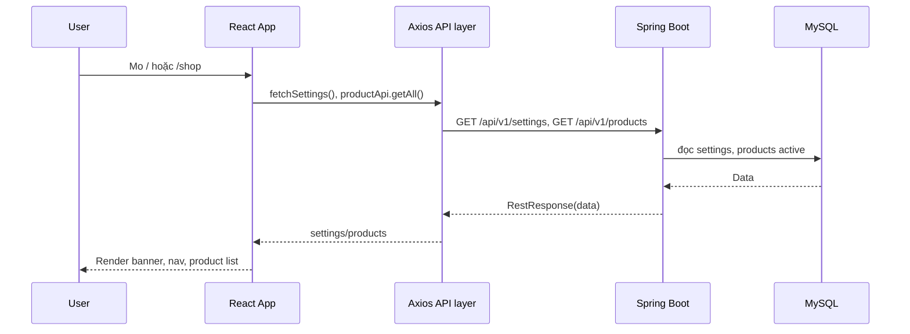
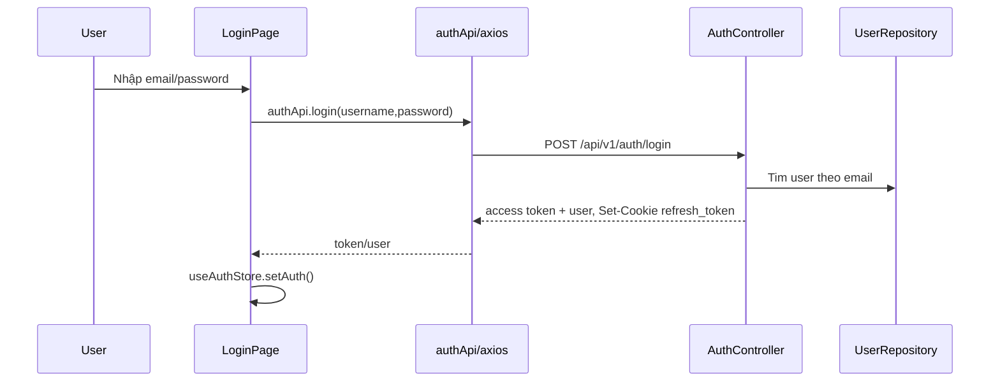
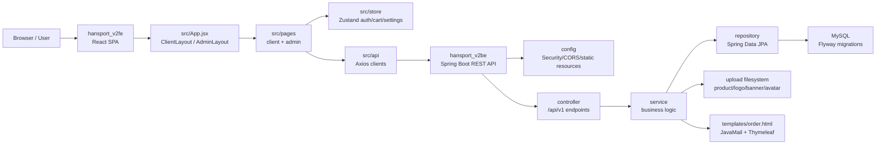

# Phân tích chi tiết cấu trúc project Han Sports v2

Tài liệu này mô tả cấu trúc thư mục, vai trò tổng module và cách các phần frontend, backend, database phối hợp với nhau khi người dùng thao tác trên web. Nội dung chỉ dựa trên source code hiện có trong workspace.

## 1. Tổng quan cấu trúc

```text
Han-Sports-v2-main/
|-- hansport_v2be/                        # Backend Spring Boot REST API
|   |-- src/main/java/com/javaweb/
|   |   |-- config/                       # Cấu hình security, CORS, static resource, seed
|   |   |-- controller/                   # REST controllers /api/v1
|   |   |-- domain/                       # Entity JPA và DTO request/response
|   |   |-- repository/                   # Spring Data JPA repositories
|   |   |-- service/                      # Business logic
|   |   `-- util/                         # Helper, response wrapper, exception, validator
|   |-- src/main/resources/
|   |   |-- application.properties        # Cấu hình DB, JWT, upload, mail, CORS
|   |   |-- db/migration/                 # Flyway SQL migrations
|   |   `-- templates/order.html          # Thymeleaf email template
|   |-- Dockerfile
|   `-- pom.xml
|-- hansport_v2fe/                        # Frontend React/Vite SPA
|   |-- src/
|   |   |-- api/                          # Axios clients gọi REST API
|   |   |-- components/                   # Component dùng lại
|   |   |-- layouts/                      # Layout client/admin
|   |   |-- pages/                        # Page theo route
|   |   |-- store/                        # Zustand stores
|   |   `-- utils/                        # Helper format, image URL, constants
|   |-- upload/
|   |   |-- banner/
|   |   |-- logo/
|   |   `-- product/
|   |-- Dockerfile
|   |-- nginx.conf
|   |-- package.json
|   `-- vite.config.js
|-- docs/                                 # Tài liệu project
|-- backups/                              # SQL backup/init data cho Docker
|-- docker-compose.yml                    # Chạy mysql, backend, frontend
|-- README.md
|-- .env
`-- .env.example
```

## 2. Các thư mục chính

| Đường dẫn | Vai trò | File quan trọng | Module liên quan |
|---|---|---|---|
| `hansport_v2be/` | Backend Java Spring Boot, expose REST API, xử lý nghiệp vụ, truy cập MySQL, gửi email, upload file | `pom.xml`, `Dockerfile`, `src/main/java/com/javaweb/HansportApplication.java` | Auth, Product, Cart, Order, User, Dashboard, Settings, File |
| `hansport_v2fe/` | Frontend React/Vite SPA, hiển thị UI khách hàng và admin | `index.html`, `src/main.jsx`, `src/App.jsx`, `package.json`, `vite.config.js` | Client UI, Admin UI, API client, state |
| `docs/` | Thư mục tài liệu. File này được tạo để ghi phân tích cấu trúc chi tiết | `PROJECT_STRUCTURE_DETAILED.md` | Documentation |
| `docker-compose.yml` | Khai báo các service `mysql`, `backend`, `frontend` để chạy local bằng Docker | `docker-compose.yml` | Deployment local |
| `hansport_v2be/src/main/resources/db/migration/` | Flyway migration tạo và cập nhật schema MySQL | `V1__baseline_schema.sql` đến `V7__add_user_avatar.sql` | Database schema |
| `hansport_v2fe/upload/` | Nơi lưu media local cho frontend/dev. Backend cũng cấu hình upload mặc định trỏ về `../hansport_v2fe/upload` | `banner/`, `logo/`, `product/` | Product images, banner, logo |
| `backups/` | Chứa file SQL backup/init. `docker-compose.yml` mount file backup vào MySQL init | `hansport_v2_old_20260605_175155.sql` nếu tồn tại | MySQL bootstrap |
| `outputs/`, `tmp/` | Thư mục phụ trợ local/dev output | Không thấy module chính import trực tiếp | Runtime/dev artifacts |

## 3. Entry point của backend và frontend

### Backend entry point

File: `hansport_v2be/src/main/java/com/javaweb/HansportApplication.java`

```java
@SpringBootApplication
public class HansportApplication {
    public static void main(String[] args) {
        SpringApplication.run(HansportApplication.class, args);
    }
}
```

Logic:

- `@SpringBootApplication` kich hoat auto-configuration, component scanning vì Spring Boot bootstrap.
- Khi app start, Spring scan các bean trong package `com.javaweb`: `controller`, `service`, `repository`, `config`, ...
- Các `CommandLineRunner` trong `config/DataSeeder.java` vì `config/AppSettingSeeder.java` có thể seed role/settings tuy theo cấu hình.

### Frontend entry point

File: `hansport_v2fe/index.html`

```html
<div id="root"></div>
<script type="module" src="/src/main.jsx"></script>
```

File: `hansport_v2fe/src/main.jsx`

```jsx
createRoot(document.getElementById('root')).render(
  <StrictMode>
    <App />
  </StrictMode>,
)
```

Logic:

- Vite load `index.html`, sau đó load module `/src/main.jsx`.
- React mount app vào DOM node `#root`.
- `App.jsx` là nơi khai báo routing và load settings ban đầu.

File: `hansport_v2fe/src/App.jsx`

```jsx
export default function App() {
  const { fetchSettings } = useSettingStore();

  useEffect(() => {
    fetchSettings();
  }, [fetchSettings]);

  return (
    <BrowserRouter>
      <Routes>
        <Route element={<ClientLayout />}>
          <Route index element={<HomePage />} />
          <Route path="shop" element={<ShopPage />} />
          <Route path="products/:id" element={<ProductDetailPage />} />
          <Route path="cart" element={<CartPage />} />
          <Route path="checkout" element={<CheckoutPage />} />
          <Route path="login" element={<LoginPage />} />
          <Route path="register" element={<RegisterPage />} />
          <Route path="orders" element={<MyOrdersPage />} />
          <Route path="profile" element={<ProfilePage />} />
        </Route>

        <Route path="admin" element={<AdminLayout />}>
          <Route index element={<DashboardPage />} />
          <Route path="products" element={<ProductsPage />} />
          <Route path="orders" element={<OrdersAdminPage />} />
          <Route path="users" element={<UsersPage />} />
          <Route path="settings" element={<SettingsPage />} />
        </Route>
      </Routes>
    </BrowserRouter>
  );
}
```

Logic:

- Nhóm route client dùng `ClientLayout`.
- Nhóm route admin dùng `AdminLayout`.
- `fetchSettings()` gửi API settings public để load banner, categories, nav, shipping fee, brands, targets.

## 4. Backend package detail

### 4.1 `config/`

Vai trò: cấu hình cross-cutting cho toàn backend: security, CORS, static upload, seed dữ liệu nền, user details, rate limit auth.

File quan trọng:

| File | Vai trò |
|---|---|
| `SecurityConfiguration.java` | Cấu hình Spring Security, JWT resource server, role-based access |
| `CorsConfig.java` | Cho frontend origin gửi API với credentials |
| `StaticResourcesWebConfiguration.java` | Map `/storage/**` toi thư mục upload local |
| `UserDetailsCustom.java` | Load user theo email vì gán role authority |
| `DataSeeder.java` | Seed role `ADMIN`, `USER` vì optional local admin |
| `AppSettingSeeder.java` | Seed settings mặc định, banner, category, navigation |
| `AuthRateLimitFilter.java` | Giới hạn tan suat các endpoint auth |
| `CustomAuthenticationEntryPoint.java` | Xử lý lỗi authentication |

Trích code security:

```java
http
    .csrf(c -> c.disable())
    .cors(Customizer.withDefaults())
    .authorizeHttpRequests(
        authz -> authz
            .requestMatchers("/", "/api/v1/auth/login", "/api/v1/auth/register",
                    "/api/v1/auth/refresh", "/storage/**", "/api/v1/auth/google").permitAll()
            .requestMatchers(HttpMethod.GET, "/api/v1/products", "/api/v1/products/**",
                    "/api/v1/files", "/api/v1/settings").permitAll()
            .requestMatchers(HttpMethod.POST, "/api/v1/products", "/api/v1/products/import",
                    "/api/v1/files").hasRole("ADMIN")
            .requestMatchers("/api/v1/users", "/api/v1/users/**").hasRole("ADMIN")
            .requestMatchers("/api/v1/admin", "/api/v1/admin/**").hasRole("ADMIN")
            .anyRequest().authenticated())
    .oauth2ResourceServer((oauth2) -> oauth2.jwt(jwt -> jwt.jwtAuthenticationConverter(jwtAuthenticationConverter())))
    .sessionManagement(session -> session.sessionCreationPolicy(SessionCreationPolicy.STATELESS));
```

Giải thích:

- Product listing, product detail, file đównload vì public settings được public.
- Tạo/sửa/xóa product, upload file, user management, admin dashboard/settings bị chặn bởi role `ADMIN`.
- Mọi request còn lại phải có access token hợp lệ.
- Backend không dùng session server-side; auth là stateless JWT.

Static upload:

```java
registry.addResourceHandler("/storage/**")
        .addResourceLocations(uploadPath.toUri().toString());
```

Giải thích: nếu file được lưu trên local filesystem, backend có thể public qua URL `/storage/**`. Ngoài ra app cũng có endpoint `/api/v1/files` để lấy file qua `FileController`.

### 4.2 `controller/`

Vai trò: nhận HTTP request, validate request body/path/query, lấy current user nếu cần, gửi service và trả response.

Controller chính:

| File | Endpoint/module |
|---|---|
| `AuthController.java` | `/api/v1/auth/login`, `/register`, `/google`, `/account`, `/refresh`, `/logout`, `/change-password` |
| `ProductController.java` | `/api/v1/products`, `/products/{id}`, `/products/import`, `/products/navigation` |
| `CartController.java` | `/api/v1/carts`, `/carts/add`, `/carts/{id}` |
| `OrderController.java` | `/api/v1/orders`, `/orders/my`, update/delete order |
| `UserController.java` | `/api/v1/users` admin CRUD |
| `DashboardController.java` | `/api/v1/admin/dashboard/summary` |
| `AppSettingController.java` | `/api/v1/settings`, `/admin/settings`, `/admin/settings/site` |
| `FileController.java` | `/api/v1/files` upload/download |
| `EmailController.java` | `/api/v1/orders/{id}/send-email` |

Trích code `OrderController`:

```java
@PostMapping("/orders")
public ResponseEntity<ResOrderDTO> placeOrder(@RequestBody @Valid ReqOrderDTO redOrderDTO)
        throws IdInvalidException {
    String email = SecurityUtil.getCurrentUserLogin().isPresent() ?
            SecurityUtil.getCurrentUserLogin().get() : "";

    ResOrderDTO order = this.orderService.placeOrder(email, redOrderDTO);
    return ResponseEntity.ok(order);
}
```

Giải thích:

- Controller không trực tiếp thao tác database.
- Controller lấy email từ JWT thông qua `SecurityUtil`.
- Toàn bộ logic tạo đơn được đẩy xuống `OrderService.placeOrder`.

### 4.3 `domain/`

Vai trò: chưa entity database vì DTO trao đổi với API.

Nhóm file:

| Đường dẫn | Vai trò |
|---|---|
| `domain/*.java` | Entity JPA: `User`, `Role`, `Product`, `ProductImage`, `Cart`, `CartDetail`, `Order`, `OrderDetail`, `AppSetting`, `SiteBanner`, `SiteCategory`, `SiteNavigationItem` |
| `domain/request/` | Request DTO từ frontend vào backend |
| `domain/response/` | Response DTO backend trả về frontend |

Trích code entity `Product`:

```java
@Entity
@Table(name = "products")
public class Product {
    @Id
    @GeneratedValue(strategy = GenerationType.IDENTITY)
    private long id;

    @Column(unique = true, length = 100)
    private String sku;

    private long price;
    private Long originalPrice;
    private long quantity;
    private long sold;
    private String brand;
    private String target;
    private String category;
    private boolean active = true;

    @OneToMany(mappedBy = "product", fetch = FetchType.LAZY,
            cascade = CascadeType.ALL, orphanRemoval = true)
    @OrderColumn(name = "sort_order")
    private List<ProductImage> images = new ArrayList<>();
}
```

Giải thích:

- `Product` map vào bảng `products`.
- Mỗi product có nhiều `ProductImage`.
- `@OrderColumn(name = "sort_order")` gắn thứ tự ảnh vào cột `sort_order`, phù hợp migration `V5__product_image_order.sql`.
- Field `active` cho phép ẩn/hiện sản phẩm với user thường.

### 4.4 `repository/`

Vai trò: lớp truy cập database bằng Spring Data JPA.

Trích code `ProductRepository`:

```java
public interface ProductRepository extends JpaRepository<Product,Long>, JpaSpecificationExecutor<Product> {
    boolean existsByName(String name);
    Optional<Product> findByName(String name);
    Optional<Product> findBySku(String sku);
    boolean existsBySku(String sku);

    @Modifying(flushAutomatically = true)
    @Query("update Product p set p.quantity = p.quantity - :quantity, p.sold = p.sold + :quantity where p.id = :productId and p.quantity >= :quantity")
    int decrementStockIfAvailable(@Param("productId") long productId, @Param("quantity") long quantity);
}
```

Giải thích:

- `JpaRepository` cùng cấp CRUD có ban.
- `JpaSpecificationExecutor` cho phép filter động từ query param/filter.
- `decrementStockIfAvailable` trừ tồn kho và tăng `sold` trong một update query có điều kiện `p.quantity >= :quantity`. Nếu trả về `0`, service hiểu là tồn kho không đủ.

### 4.5 `service/`

Vai trò: chứa business logic thật sự. Đây là nội validate nghiệp vụ, gửi repository, convert entity sang DTO, quản lý transaction.

Service chính:

| File | Vai trò |
|---|---|
| `UserService.java` | đăng ký, tạo/sửa/xóa user, profile, refresh token hash, đổi mật khẩu |
| `ProductService.java` | CRUD product, search/filter, image management, DTO conversion |
| `ProductImportService.java` | Import product từ `.xlsx` hoặc `.csv`, dry-run vì apply |
| `CartService.java` | Thêm/xóa/cập nhật giỏ hàng |
| `OrderService.java` | đặt hàng, trừ tồn kho, tạo order detail, lịch sử order, update status, email |
| `DashboardService.java` | Tổng hợp KPI/dashboard admin |
| `AppSettingService.java` | đọc/cập nhật settings, banner, category, navigation |
| `FileService.java` | Validate, lưu, đọc, xóa file upload |
| `EmailService.java` | Gửi email HTML bằng Thymeleaf template |
| `GoogleTokenVerifierService.java` | Verify Google ID token |

Trích logic tạo product:

```java
@Transactional
public ResCreateProductDTO handleSaveProduct(ReqProductDTO req) throws IdInvalidException {
    String sku = normalizeSku(req.getSku());
    if (sku != null && this.productRepository.existsBySku(sku)) {
        throw new IdInvalidException("SKU da ton tai");
    }
    if (this.productRepository.existsByName(req.getName())) {
        throw new IdInvalidException("San pham da ton tai");
    }
    Product product = new Product();
    this.applyProductRequest(product, req);
    Product currentProduct = this.productRepository.save(product);
    this.addImage(req.getImages(), currentProduct);
    return this.convertToResCreateProductDTO(currentProduct);
}
```

Giải thích:

- `@Transactional` bảo toàn bỏ qua trinh tạo product vì ảnh.
- SKU được normalize trước khi check trung.
- Service không expose entity trực tiếp, mà convert sang `ResCreateProductDTO`.

Trích logic search/filter product:

```java
Specification<Product> activeSpec = (root, criteriaQuery, criteriaBuilder) ->
        criteriaBuilder.isTrue(root.get("active"));
Specification<Product> finalSpec = includeInactive ? spec : combine(spec, activeSpec);
Specification<Product> searchSpec = productSearch(query);
finalSpec = combine(finalSpec, searchSpec);
finalSpec = combine(finalSpec, productFilters(brand, target, category, minPrice, maxPrice));
Page<Product> products = this.productRepository.findAll(finalSpec, pageable);
```

Giải thích:

- User public mặc định chỉ thấy product `active = true`.
- Admin có thể truyền `includeInactive=true`, nhưng controller chỉ cho phép nếu authentication là admin.
- Search/filter được ghep bảng `Specification`.

Trích logic đặt hàng:

```java
@Transactional
public ResOrderDTO placeOrder(String email, ReqOrderDTO reqOrder) throws IdInvalidException {
    User currentUser = this.userRepository.findByEmail(email)
            .orElseThrow(() -> new IdInvalidException("Nguoi dung khong ton tai"));
    Cart cart = this.cartRepository.findByUser(currentUser)
            .orElseThrow(() -> new IdInvalidException("Gio hang dang trong"));

    List<CartDetail> orderItems = allCartDetails.stream()
            .filter(cd -> reqOrder.getCartDetailIds().contains(cd.getId()))
            .collect(Collectors.toList());

    Order order = new Order();
    order.setUser(currentUser);
    order.setStatus("PENDING");
    order.setTotalPrice(sum);
    order = this.orderRepository.save(order);

    for (CartDetail cartDetail : orderItems) {
        int affectedRows = this.productRepository.decrementStockIfAvailable(
                product.getId(), cartDetail.getQuantity());
        if (affectedRows == 0) {
            throw new IdInvalidException("San pham khong du ton kho");
        }
        OrderDetail orderDetail = new OrderDetail();
        orderDetail.setOrder(order);
        orderDetail.setProduct(product);
        orderDetail.setQuantity(cartDetail.getQuantity());
        this.orderDetailRepository.save(orderDetail);
    }

    return this.convertToResOrderDTO(order);
}
```

Giải thích:

- đơn hàng được tạo từ các `cartDetailIds` được frontend chọn.
- Service validate giỏ hàng không rỗng, sản phẩm còn tồn kho.
- Sau khi tạo order, service tạo tổng `OrderDetail`.
- Tồn kho được trừ bằng query atomic trong `ProductRepository`.
- Nếu giỏ hàng còn item chưa checkout, cart được cập nhật; nếu không còn, cart bị xóa.

### 4.6 `util/`

Vai trò: code dùng chung cho backend.

| File | Vai trò |
|---|---|
| `SecurityUtil.java` | Tạo/check JWT, lấy current user login, hash refresh token |
| `FormatRestResponse.java` | Bọc response thành format chung |
| `GlobalException.java` | Chuyen exception thành response lỗi |
| `ApiMessage.java` | Annotation custom để gán message cho API success |
| `StrongPassword.java`, `StrongPasswordValidator.java` | Validator password |
| `IdInvalidException.java`, `StorageException.java` | Custom exception |

Trích code response wrapper:

```java
if (body instanceof RestResponse<?> || body instanceof Resource ||
        (selectedContentType != null && !MediaType.APPLICATION_JSON.includes(selectedContentType))) {
    return body;
}

RestResponse<Object> res = new RestResponse<>();
res.setStatusCode(status);
res.setData(body);
ApiMessage message = returnType.getMethodAnnotation(ApiMessage.class);
res.setMessage(message != null ? message.value() : "Call API success");
return res;
```

Giải thích:

- JSON response thành công được bọc vào object có `statusCode`, `message`, `data`.
- File/resource download không bộ bọc, để browser nhận dùng binary/media response.

## 5. Frontend folder detail

### 5.1 `src/api/`

Vai trò: tập trung tất cả request HTTP vào backend.

| File | Vai trò |
|---|---|
| `axiosSetup.js` | Tạo axios instance, gán Bearer token, refresh token khi 401 |
| `authApi.js` | Login, register, account, refresh, logout, change password, Google login |
| `productApi.js` | Product list/detail/create/update/delete/import/upload |
| `cartApi.js` | Cart get/add/delete/update quantity |
| `orderApi.js` | Create order, my orders, admin orders, update/delete/send email |
| `settingApi.js` | Public/admin settings |
| `userApi.js` | Admin user CRUD |
| `dashboardApi.js` | Admin dashboard summary |

Trích code axios:

```jsx
axiosInstance.interceptors.request.use((config) => {
  const { accessToken } = useAuthStore.getState();
  if (accessToken) {
    config.headers.Authorization = `Bearer ${accessToken}`;
  }
  return config;
});
```

```jsx
if (error.response?.status === 401 && !originalRequest._retry) {
  const { data } = await axiosPublic.get("/api/v1/auth/refresh");
  const newAccessToken = responseData?.access_token || responseData?.accessToken;
  useAuthStore.getState().setAccessToken(newAccessToken);
  return axiosInstance(originalRequest);
}
```

Giải thích:

- Access token được lưu trong Zustand auth store.
- Request private tự động gán header `Authorization`.
- Nếu token hết hạn, client gửi `/api/v1/auth/refresh`; refresh token nằm trong httpOnly cookie đó backend set.

### 5.2 `src/components/`

Vai trò: component dùng lỗi, không gán trực tiếp với route.

| Đường dẫn | Vai trò | Vì đã |
|---|---|---|
| `components/common/` | UI chung cho client | `Header.jsx`, `Footer.jsx`, `MobileNav.jsx`, `ProductCard.jsx`, `SafeImage.jsx` |
| `components/admin/` | UI table/form/toolbar/admin shell | `DataTable.jsx`, `FormModal.jsx`, `Pagination.jsx`, `StatusBadge.jsx`, `AdminSidebar.jsx` |
| `components/ui/` | Component UI nhỏ | `ConfirmDialog.jsx` |

Logic:

- Page client dùng `ProductCard`, `Header`, `Footer`, `MobileNav`.
- Page admin dùng `DataTable`, `AdminToolbar`, `FormModal`, `StatusBadge`, shell sidebar/topbar.
- Component giúp page không lặp lại layout/form/table logic.

### 5.3 `src/pages/`

Vai trò: mới file page tương ứng mất man hình/route.

| Đường dẫn | Vai trò |
|---|---|
| `pages/client/` | Trang khách hàng: home, shop, product detail, cart, checkout, login, register, my orders, profile |
| `pages/admin/` | Trang admin: dashboard, products, orders, users, settings |

Trích code checkout:

```jsx
const { user } = useAuthStore();
const { cartItems, getTotal, selectedIds, removeSelectedItems } = useCartStore();

useEffect(() => {
  if (!user) {
    navigate("/login");
    return;
  }

  if (cartItems.length === 0) {
    navigate("/cart");
  }
}, [user, cartItems.length, navigate]);

const handleSubmit = async (e) => {
  e.preventDefault();
  await orderApi.createOrder({ ...form, cartDetailIds: selectedIds });
  removeSelectedItems();
  setSuccess(true);
};
```

Giải thích:

- Checkout yêu cầu user đăng nhập.
- Nếu cart rỗng thứ quay vì `/cart`.
- Khi submit, frontend gửi thông tin giao hàng vì danh sách cart detail đã chọn xuong backend.
- Sau khi tạo đơn thành công, frontend xóa các item đã checkout khỏi local cart store.

### 5.4 `src/store/`

Vai trò: global state bằng Zustand.

| File | Vai trò |
|---|---|
| `useAuthStore.js` | User hiện tại, access token, helper `isAdmin()` |
| `useCartStore.js` | Cart items, selected IDs, total count, total price |
| `useSettingStore.js` | Settings public/admin, helper parse JSON sẽtting |

Trích code auth store:

```jsx
export const useAuthStore = create(
  persist(
    (set, get) => ({
      accessToken: null,
      user: null,
      setAuth: (accessToken, user) => set({ accessToken, user: normalizeUser(user) }),
      clearAuth: () => set({ accessToken: null, user: null }),
      isAuthenticated: () => !!get().accessToken,
      isAdmin: () => get().user?.role?.name === "ADMIN",
    }),
    {
      name: "hansport-auth",
      partialize: (state) => ({ user: state.user }),
    }
  )
);
```

Giải thích:

- User được persist để khôi phục UI sau reload.
- Access token không persist theo comment trong code, giảm rủi ro lưu token lâu dài.
- Khi app reload, `ClientLayout` có logic gửi refresh để lấy access token mới nếu cần cookie.

### 5.5 `src/utils/`

Vai trò: helper không phụ thuộc React state.

File `constants.js` có:

```jsx
export const API_BASE_URL = (import.meta.env.VITE_API_URL || "").replace(/\/$/, "");

export function getImageUrl(fileName, folder = "product", version = null) {
  if (!fileName) return null;
  if (fileName.startsWith("http")) return fileName;
  const params = new URLSearchParams({ fileName, folder });
  return `${API_BASE_URL}/api/v1/files?${params.toString()}`;
}

export function formatVND(amount) {
  return new Intl.NumberFormat("vi-VN", {
    style: "currency",
    currency: "VND",
    maximumFractionDigits: 0,
  }).format(amount);
}
```

Giải thích:

- `API_BASE_URL` cho phép build frontend với backend URL khác nhau.
- `getImageUrl` bien filename trong DB/API thành URL endpoint `/api/v1/files`.
- `formatVND` format tiền Viet Nam cho UI.

### 5.6 `src/layouts/`

Vai trò: layout bọc các route client/admin.

Trích code `AdminLayout.jsx`:

```jsx
const { user, isAdmin, clearAuth } = useAuthStore();

if (!user) return <Navigate to="/login" replace />;
if (!isAdmin()) return <Navigate to="/" replace />;

return (
  <div className="min-h-screen bg-surface-soft lg:flex">
    <AdminSidebar user={user} onLogout={handleLogout} currentPath={location.pathname} />
    <main className="flex-1 overflow-y-auto p-4 md:p-6 lg:p-8">
      <Outlet />
    </main>
  </div>
);
```

Giải thích:

- Đây là lớp chặn route admin ở frontend.
- Nếu chưa login thứ vì `/login`.
- Nếu login nhưng không có role admin thứ vì `/`.
- `Outlet` render page còn: dashboard/products/orders/users/settings.
- Backend vẫn là lớp bảo vệ chính vì API admin cùng bộ `hasRole("ADMIN")`.

## 6. Resources, migration, upload vì email template

### `application.properties`

File: `hansport_v2be/src/main/resources/application.properties`

```properties
spring.datasource.url=${DB_URL:jdbc:mysql://localhost:3306/hansport_v2?...}
spring.flyway.enabled=${FLYWAY_ENABLED:true}
hansport.upload-file.base-path=${UPLOAD_FILE_BASE_PATH:../hansport_v2fe/upload}
server.port=${SERVER_PORT:8080}
app.frontend.url=${FRONTEND_URL:http://localhost:5173}
```

Giải thích:

- Backend mặc định kết nối MySQL local database `hansport_v2`.
- Flyway được bắt để chạy migration.
- Upload local mặc định nằm trong `../hansport_v2fe/upload`.
- Backend chạy cong 8080.
- CORS/frontend URL mặc định là `http://localhost:5173`.

### Migration

Thư mục: `hansport_v2be/src/main/resources/db/migration/`

| File | Nội dung chính |
|---|---|
| `V1__baseline_schema.sql` | Tạo `roles`, `users`, `products`, `product_images`, `carts`, `cart_detail`, `orders`, `order_detail`, `settings` |
| `V2__money_fields_to_bigint.sql` | Đổi các field tiền sang `BIGINT` |
| `V3__site_content_tables.sql` | Tạo `site_banners`, `site_categories`, `site_navigation_items` |
| `V4__product_sku_and_active.sql` | Thêm `sku`, `active`, index |
| `V5__product_image_order.sql` | Thêm `sort_order` cho `product_images` |
| `V6__product_sale_options.sql` | Thêm `original_price`, option màu/size vào product/cart/order detail |
| `V7__add_user_avatar.sql` | Thêm avatar cho user |

Trích code schema nên:

```sql
CREATE TABLE IF NOT EXISTS users (
    id BIGINT NOT NULL AUTO_INCREMENT,
    email VARCHAR(255) NOT NULL,
    password VARCHAR(255),
    full_name VARCHAR(255) NOT NULL,
    role_id BIGINT,
    refresh_token MEDIUMTEXT,
    PRIMARY KEY (id),
    UNIQUE KEY uk_users_email (email),
    CONSTRAINT fk_users_role FOREIGN KEY (role_id) REFERENCES roles (id)
);

CREATE TABLE IF NOT EXISTS orders (
    id BIGINT NOT NULL AUTO_INCREMENT,
    total_price BIGINT NOT NULL,
    receiver_name VARCHAR(255),
    receiver_address VARCHAR(255),
    receiver_phone VARCHAR(255),
    status VARCHAR(255),
    user_id BIGINT,
    PRIMARY KEY (id),
    CONSTRAINT fk_orders_user FOREIGN KEY (user_id) REFERENCES users (id)
);
```

Giải thích:

- `users.role_id` lien kết toi `roles`.
- `orders.user_id` lien kết toi user đặt hàng.
- `order_detail` lien kết `orders` vì `products`.
- `cart_detail` lien kết `carts` vì `products`.

### Upload

Backend validate file trong `FileService`:

```java
private static final Set<String> ALLOWED_FOLDERS = Set.of("product", "logo", "banner", "avatar");
private static final Set<String> ALLOWED_IMAGE_EXTENSIONS = Set.of("jpg", "jpeg", "png", "webp");
private static final long MAX_IMAGE_BYTES = 5L * 1024 * 1024;
```

Giải thích:

- Chỉ cho upload vào các folder hợp lệ.
- Chỉ chấp nhận ảnh jpg/jpeg/png/webp.
- Giới hạn kich thuộc ảnh 5MB theo `FileService`, đã `application.properties` cho multipart request toi 50MB.

### Email template

File: `hansport_v2be/src/main/resources/templates/order.html`

```html
<h2>Xin chào <span th:text="${customerName}"></span>,</h2>
<span th:text="${phone}"></span>
<span th:text="${address}"></span>
<tr th:each="item : ${items}">
    <td th:text="${item.productName}"></td>
    <td th:text="${item.quantity}"></td>
    <td th:text="${#numbers.formatDecimal(item.price, 0, 'COMMA', 0, 'POINT')} + ' đ'"></td>
</tr>
```

Logic:

- `OrderService.sendOrderEmail` tạo `OrderEmailDTO`.
- `EmailService.sendEmailFromTemplateSync` set variables `customerName`, `address`, `phone`, `totalPrice`, `items`.
- Thymeleaf render `order.html` thành HTML email.

## 7. Docker vì local deployment

### Docker Compose

File: `docker-compose.yml`

```yaml
services:
  mysql:
    image: mysql:8.0

  backend:
    build:
      context: ./hansport_v2be
    environment:
      DB_URL: jdbc:mysql://mysql:3306/hansport_v2?...
      UPLOAD_FILE_BASE_PATH: /app/upload
    ports:
      - "8080:8080"

  frontend:
    build:
      context: ./hansport_v2fe
    ports:
      - "5173:80"
```

Giải thích:

- Docker network cho backend gửi MySQL bằng host service name `mysql`.
- Backend upload vào `/app/upload`, volume `backend-upload`.
- Frontend build static assets vì sẽrve bằng Nginx port container 80, map ra host 5173.

### Frontend Nginx proxy

File: `hansport_v2fe/nginx.conf`

```nginx
location /api/ {
    proxy_pass http://backend:8080/api/;
}

location / {
    try_files $uri $uri/ /index.html;
}
```

Giải thích:

- Khi frontend chạy Docker, browser gửi `/api/...` vào Nginx frontend.
- Nginx proxy request API sang service `backend:8080`.
- SPA routes như `/shop`, `/admin/products` fallback vì `index.html`.

### Vite dev proxy

File: `hansport_v2fe/vite.config.js`

```js
server: {
  port: 5173,
  proxy: {
    '/api': {
      target: 'http://localhost:8080',
      changeOrigin: true,
      secure: false,
    },
  },
}
```

Giải thích:

- Khi dev local bằng Vite, frontend port 5173 proxy `/api` sang backend port 8080.
- Cách này tránh CORS phức tạp trong dev.

## 8. Bằng tổng hợp Đường dẫn, vai trò, file quan trọng, module liên quan

| Đường dẫn | Vai trò | File quan trọng | Module liên quan |
|---|---|---|---|
| `hansport_v2be/src/main/java/com/javaweb` | Root Java package | `HansportApplication.java` | Backend app |
| `hansport_v2be/src/main/java/com/javaweb/config` | Cấu hình hệ thống | `SecurityConfiguration.java`, `CorsConfig.java`, `StaticResourcesWebConfiguration.java` | Security, CORS, upload, seed |
| `hansport_v2be/src/main/java/com/javaweb/controller` | REST API layer | `AuthController.java`, `ProductController.java`, `OrderController.java`, `CartController.java` | HTTP endpoints |
| `hansport_v2be/src/main/java/com/javaweb/domain` | Entity vì DTO | `Product.java`, `User.java`, `Order.java`, `domain/request`, `domain/response` | Data model |
| `hansport_v2be/src/main/java/com/javaweb/repository` | Database access | `ProductRepository.java`, `OrderRepository.java`, `UserRepository.java` | JPA/MySQL |
| `hansport_v2be/src/main/java/com/javaweb/service` | Business logic | `ProductService.java`, `OrderService.java`, `CartService.java`, `UserService.java` | Nghiệp vụ |
| `hansport_v2be/src/main/java/com/javaweb/util` | Shared utilities | `SecurityUtil.java`, `FormatRestResponse.java`, `GlobalException.java` | JWT, response, exception |
| `hansport_v2be/src/main/resources` | Config/resource backend | `application.properties`, `templates/order.html` | Runtime config, email |
| `hansport_v2be/src/main/resources/db/migration` | Schema migrations | `V1__baseline_schema.sql` ... `V7__add_user_avatar.sql` | Database |
| `hansport_v2fe/src` | Root frontend source | `main.jsx`, `App.jsx`, `index.css` | React SPA |
| `hansport_v2fe/src/api` | API client | `axiosSetup.js`, `productApi.js`, `orderApi.js` | REST calls |
| `hansport_v2fe/src/components` | Shared UI components | `common/Header.jsx`, `admin/DataTable.jsx`, `ui/ConfirmDialog.jsx` | UI reusẽ |
| `hansport_v2fe/src/layouts` | Route shell | `ClientLayout.jsx`, `AdminLayout.jsx` | Navigation/layout |
| `hansport_v2fe/src/pages/client` | Customer pages | `HomePage.jsx`, `ShopPage.jsx`, `CheckoutPage.jsx` | Storefront |
| `hansport_v2fe/src/pages/admin` | Admin pages | `DashboardPage.jsx`, `ProductsPage.jsx`, `OrdersAdminPage.jsx`, `SettingsPage.jsx` | Admin console |
| `hansport_v2fe/src/store` | Global state | `useAuthStore.js`, `useCartStore.js`, `useSettingStore.js` | Auth/cart/settings |
| `hansport_v2fe/src/utils` | Helper functions | `constants.js`, `sync.js` | Image URL, formatting, sync |
| `hansport_v2fe/upload` | Upload media local | `banner/`, `logo/`, `product/` | Images |
| `docker-compose.yml` | Multi-container runtime | Root composẽ file | MySQL/backend/frontend |

## 9. Luồng phối hợp khi user thao tác trên web

### 9.1 Mở trang chủ hoặc shop



Thư mục tham giá:

- `pages/client/HomePage.jsx`, `pages/client/ShopPage.jsx`: man hình.
- `store/useSettingStore.js`: load settings.
- `api/productApi.js`, `api/settingApi.js`: gửi backend.
- `ProductController`, `ProductService`, `ProductRepository`: xử lý product.
- `AppSettingController`, `AppSettingService`: xử lý settings.

### 9.2 đăng nhập



Thư mục tham giá:

- `pages/client/LoginPage.jsx`: form login.
- `api/authApi.js`: request login.
- `store/useAuthStore.js`: lưu user/access token.
- `AuthController`, `UserService`, `SecurityUtil`, `UserRepository`: backend auth.
- `SecurityConfiguration`: decode/validate JWT cho các request sau.

### 9.3 Thêm vào giỏ hàng

Luồng logic:

1. User bam thêm sản phẩm trong `ProductDetailPage` hoặc `ShopPage`.
2. Frontend gửi `cartApi.addToCart(productId, quantity, options)`.
3. Axios gán Bearer token.
4. `CartController.addToCart` lấy email current user.
5. `CartService.addProductToCart` tim cart theo user; nếu chưa có thể tạo cart mới.
6. Service tìm product, validate màu/size nếu product có options, check quantity không vượt tồn kho.
7. Service tạo mới hoặc cong đơn `CartDetail`.
8. Backend trả `ResCartDTO`, frontend cập nhật `useCartStore`.

Thư mục tham giá:

- Frontend: `pages/client`, `api/cartApi.js`, `store/useCartStore.js`.
- Backend: `CartController`, `CartService`, `CartRepository`, `CartDetailRepository`, `ProductRepository`.
- Database: `carts`, `cart_detail`, `products`.

### 9.4 Checkout COD

Luồng logic:

1. `CheckoutPage.jsx` yêu cầu user đăng nhập vì cart không rỗng.
2. User nhập receiver name/phone/address.
3. Frontend gửi:

```jsx
await orderApi.createOrder({ ...form, cartDetailIds: selectedIds });
```

4. `OrderController.placeOrder` lấy email từ JWT.
5. `OrderService.placeOrder`:
   - Tim user.
   - Tim cart của user.
   - Lọc cart detail theo `cartDetailIds`.
   - Check tồn kho.
   - Tạo `Order` status `PENDING`.
   - Trừ tồn kho bảng `ProductRepository.decrementStockIfAvailable`.
   - Tạo `OrderDetail`.
   - Xóa item đã checkout khỏi cart, nếu cart rỗng thứ xóa cart.
6. Frontend xóa selected items khỏi local store vì hiển thị success.

Thư mục tham giá:

- Frontend: `pages/client/CheckoutPage.jsx`, `api/orderApi.js`, `store/useCartStore.js`, `store/useSettingStore.js`.
- Backend: `OrderController`, `OrderService`, `OrderRepository`, `OrderDetailRepository`, `ProductRepository`, `CartRepository`.
- Database: `orders`, `order_detail`, `products`, `carts`, `cart_detail`.

### 9.5 Admin quản lý sản phẩm

Luồng logic:

1. User vào `/admin/products`.
2. `AdminLayout` kiểm tra user vì `isAdmin()`.
3. `ProductsPage`/`useProductsAdmin` gửi `productApi.getAll({ includeInactive: true })`.
4. Backend `SecurityConfiguration` yêu cầu role admin cho create/update/delete/upload/import.
5. `ProductController` nhận request.
6. `ProductService` validate SKU/name, map DTO vào entity, lưu product vì images.
7. `ProductRepository`/`ProductImageRepository` ghi MySQL.
8. Nếu upload ảnh, `FileController` gửi `FileService` validate vì lưu file.

Thư mục tham giá:

- Frontend: `pages/admin/ProductsPage.jsx`, `pages/admin/products/*`, `components/admin/*`, `api/productApi.js`.
- Backend: `ProductController`, `ProductService`, `ProductImportService`, `FileController`, `FileService`.
- Database: `products`, `product_images`.
- Upload: `hansport_v2fe/upload/product` local hoặc Docker volume `/app/upload`.

### 9.6 Admin cập nhật nội dung website/settings

Luồng logic:

1. Admin vào `/admin/settings`.
2. Frontend gửi `settingApi.getAdminSettings()`.
3. Admin sửa banner/category/navigation/shipping/contact.
4. Frontend gửi `settingApi.updateSiteSettings(settings)`.
5. `AppSettingController.updateSiteSettings` yêu cầu `hasRole('ADMIN')`.
6. `AppSettingService.updateSiteSettings` validate payload, ghi bảng `settings`, đồng thời replace bảng có cấu trúc:
   - `site_banners`
   - `site_categories`
   - `site_navigation_items`
7. Client public sau đó đọc `/api/v1/settings` để hiển thị settings mới.

Thư mục tham giá:

- Frontend: `pages/admin/settings/*`, `api/settingApi.js`, `store/useSettingStore.js`.
- Backend: `AppSettingController`, `AppSettingService`, `AppSettingRepository`, `SiteBannerRepository`, `SiteCategoryRepository`, `SiteNavigationItemRepository`.
- Database: `settings`, `site_banners`, `site_categories`, `site_navigation_items`.

## 10. Kiến trúc thực tế theo thư mục



Kết luận: cấu trúc hiện tại là client-server với frontend React SPA vì backend Spring Boot monolith theo layered architecture. Thư mục backend chia rõ controller-service-repository-domain; thư mục frontend chia rõ pages-components-api-store-layouts-utils. Database schema được version bằng Flyway, upload file lưu local filesystem/Docker volume, vì frontend/backend giao tiếp qua REST API `/api/v1`.
