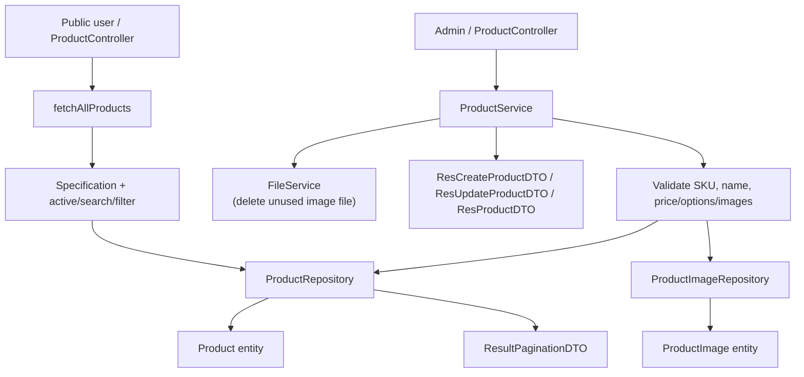
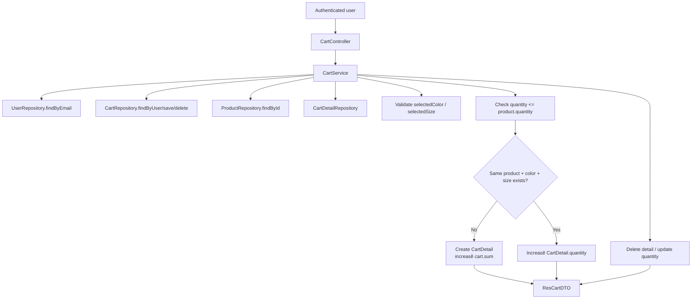
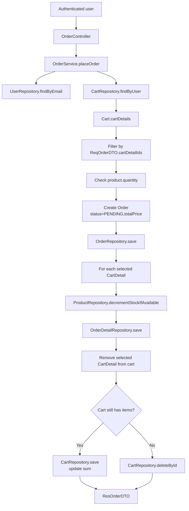

# Phân tích service layer backend - Han Sports v2

Tài liệu này phân tích service layer trong backend Spring Boot `hansport_v2be`.
Nội dung chỉ dựa trên source code hiện có trong:

- `hansport_v2be/src/main/java/com/javaweb/service`
- `hansport_v2be/src/main/java/com/javaweb/repository`
- `hansport_v2be/src/main/java/com/javaweb/domain`
- `hansport_v2be/src/main/java/com/javaweb/domain/request`
- `hansport_v2be/src/main/java/com/javaweb/domain/response`

Service layer hiện có đóng vai trò xử lý nghiệp vụ chính: validate dữ liệu theo ngữ cảnh, đọc/ghi entity qua repository, quản lý transaction, tạo response DTO và phối hợp các service phụ như file/email.

## 1. Danh sách service hiện có

| Service | File | Dependency chính | Nghiệp vụ xử lý |
|---|---|---|---|
| `UserService` | `hansport_v2be/src/main/java/com/javaweb/service/UserService.java` | `UserRepository`, `RoleRepository`, `PasswordEncoder` | Quản lý user, register, admin CRUD user, profile, password, refresh token hash, map user DTO. |
| `ProductService` | `hansport_v2be/src/main/java/com/javaweb/service/ProductService.java` | `ProductRepository`, `ProductImageRepository`, `FileService` | CRUD product, search/filter/pagination, public navigation, image list, xóa file ảnh không còn được dùng. |
| `ProductImportService` | `hansport_v2be/src/main/java/com/javaweb/service/ProductImportService.java` | `ProductRepository` | Import product từ `.xlsx`/`.csv`, dry run, validate row, resolve create/update, apply product/image. |
| `CartService` | `hansport_v2be/src/main/java/com/javaweb/service/CartService.java` | `CartRepository`, `CartDetailRepository`, `UserRepository`, `ProductRepository` | Lấy giỏ hàng, thêm/sửa/xóa cart item, validate owner, validate tồn kho và option màu/size. |
| `OrderService` | `hansport_v2be/src/main/java/com/javaweb/service/OrderService.java` | `OrderRepository`, `OrderDetailRepository`, `UserRepository`, `CartRepository`, `ProductRepository`, `EmailService` | đặt hàng, tạo order detail, trừ tồn kho, dọn cart, list orders, update status, delete order, gửi email đơn hàng. |
| `FileService` | `hansport_v2be/src/main/java/com/javaweb/service/FileService.java` | File system qua `java.nio.file`, config `hansport.upload-file.base-path` | Validate/upload/download/delete file ảnh trong các folder cho phép. |
| `AppSettingService` | `hansport_v2be/src/main/java/com/javaweb/service/AppSettingService.java` | `AppSettingRepository`, `SiteBannerRepository`, `SiteCategoryRepository`, `SiteNavigationItemRepository`, `ObjectMapper` | Quản lý settings, site banners/categories/navigation, serialize/parse JSON settings. |
| `DashboardService` | `hansport_v2be/src/main/java/com/javaweb/service/DashboardService.java` | `ProductRepository`, `UserRepository`, `OrderRepository`, `OrderService` | Tạo admin dashboard summary, revenue, recent orders, daily/monthly stats, top products. |
| `EmailService` | `hansport_v2be/src/main/java/com/javaweb/service/EmailService.java` | `JavaMailSender`, `SpringTemplateEngine` | Render Thymeleaf template và gửi email HTML. |
| `GoogleTokenVerifierService` | `hansport_v2be/src/main/java/com/javaweb/service/GoogleTokenVerifierService.java` | Google API client, `client-id` config | Verify Google ID token và trả về payload. |

Trích source xác nhận các service:

```java
@Service
public class UserService {
    private final UserRepository userRepository;
    private final RoleRepository roleRepository;
    private final PasswordEncoder passwordEncoder;
}
```

File: `hansport_v2be/src/main/java/com/javaweb/service/UserService.java`

```java
@Service
public class OrderService {
    private final OrderRepository orderRepository;
    private final UserRepository userRepository;
    private final CartRepository cartRepository;
    private final OrderDetailRepository orderDetailRepository;
    private final ProductRepository productRepository;
    private final EmailService emailService;
}
```

File: `hansport_v2be/src/main/java/com/javaweb/service/OrderService.java`

## 2. Cách service layer phối hợp với repository/entity/DTO

Mẫu chung dạng có trong source:

1. Controller nhận request DTO/current user.
2. Controller gửi service.
3. Service đọc entity bằng repository.
4. Service validate nghiệp vụ.
5. Service tạo/cập nhật/xóa entity.
6. Service gửi `save`, `delete`, custom query hoặc `findAll`.
7. Service map entity thành response DTO.
8. `FormatRestResponse` bọc response thành `RestResponse` ở tầng util.

Ví dụ với product create:

```java
@Transactional
public ResCreateProductDTO handleSaveProduct(ReqProductDTO req) throws IdInvalidException {
    String sku = normalizeSku(req.getSku());
    if (sku != null && this.productRepository.existsBySku(sku)) {
        throw new IdInvalidException("SKU da ton tai");
    }
    if (this.productRepository.existsByName(req.getName())) {
        throw new IdInvalidException("San pham da ton tai");
    }
    Product product = new Product();
    this.applyProductRequest(product, req);
    Product currentProduct = this.productRepository.save(product);
    this.addImage(req.getImages(), currentProduct);
    return this.convertToResCreateProductDTO(currentProduct);
}
```

File: `hansport_v2be/src/main/java/com/javaweb/service/ProductService.java`

## 3. Phân tích chi tiết các service quan trọng

## 3.1 UserService

File: `hansport_v2be/src/main/java/com/javaweb/service/UserService.java`

### Nghiệp vụ chính

`UserService` xử lý các nghiệp vụ user/account:

- Tạo user bởi admin: `createUser(ReqUserCreateDTO)`.
- Register user thường: `register(ReqRegisterDTO)`.
- Tạo user khi login Google nếu email chưa tồn tại: `googleUser(String email, String name)`.
- Update user bởi admin: `updateUser(ReqUserUpdateDTO)`.
- Xóa user, có chặn xóa chính tài khoản dạng đăng nhập: `deleteUserById(long id, String currentUserEmail)`.
- Lấy danh sách user có filter/pagination: `fetchAllUsers(Specification<User>, Pageable)`.
- Lấy user theo id/email.
- Update profile của tài khoản dạng đăng nhập: `updateAccountProfile`.
- Lưu/xóa refresh token hash: `updateUserRefreshTokenHash`.
- đổi mật khẩu vì revoke refresh token: `changePassword`.

### Input

| Method | Input |
|---|---|
| `createUser` | `ReqUserCreateDTO`: email, password, fullName, address, phone, roleName |
| `register` | `ReqRegisterDTO`: email, password, fullName, address, phone |
| `googleUser` | `email`, `name` từ Google payload |
| `updateUser` | `ReqUserUpdateDTO`: id, email, fullName, address, phone, roleName |
| `deleteUserById` | `id` user còn xóa, `currentUserEmail` |
| `fetchAllUsers` | `Specification<User>`, `Pageable` |
| `updateAccountProfile` | current email, `ReqAccountUpdateDTO` |
| `changePassword` | current email, `ReqChangePasswordDTO` |

### Repository được gửi

- `UserRepository`: `existsByEmail`, `existsById`, `findById`, `findByEmail`, `findAll`, `save`, `deleteById`, `findByRefreshTokenAndEmail`.
- `RoleRepository`: `findByName`.

### Entity tạo/cập nhật/xóa

- Tạo `User`: `createUser`, `googleUser`, `register`.
- Cập nhật `User`: `updateUser`, `updateAccountProfile`, `updateUserRefreshTokenHash`, `changePassword`.
- Xóa `User`: `deleteUserById`.
- Gần `Role` cho `User` khi tạo/update.

Trích code tạo user:

```java
User user = new User();
user.setEmail(req.getEmail());
user.setPassword(this.passwordEncoder.encode(req.getPassword()));
user.setFullName(req.getFullName());
user.setAddress(req.getAddress());
user.setPhone(req.getPhone());
user.setRole(this.getRoleOrThrow(normalizeRoleName(req.getRoleName(), "USER")));

User currentUser = this.userRepository.save(user);
return this.convertToResCreateUserDTO(currentUser);
```

File: `hansport_v2be/src/main/java/com/javaweb/service/UserService.java`

### Transaction

`@Transactional` được dùng cho các method ghi dữ liệu:

- `createUser`
- `googleUser`
- `register`
- `updateUser`
- `deleteUserById`
- `updateAccountProfile`
- `changePassword`

`fetchAllUsers`, `getuserById`, `getUserByUsername`, `updateUserRefreshTokenHash` không có annotation transaction trong source. Riêng `updateUserRefreshTokenHash` vẫn ghi DB qua `userRepository.save`, nên có thể còn cân nhắc thêm `@Transactional`.

### DTO response được tạo như thế nào

DTO được map thủ công bằng các method:

- `convertToResCreateUserDTO(User)` -> `ResCreateUserDTO`.
- `convertToResUpdateUserDTO(User)` -> `ResUpdateUserDTO`.
- `convertToResUserDTO(User)` -> `ResUserDTO`.
- `convertToResRoleDTO(Role)` -> `ResRoleDTO`.

Trích code:

```java
public ResUserDTO convertToResUserDTO(User user){
    ResUserDTO resUserDTO = new ResUserDTO();
    resUserDTO.setId(user.getId());
    resUserDTO.setEmail(user.getEmail());
    resUserDTO.setFullName(user.getFullName());
    resUserDTO.setAddress(user.getAddress());
    resUserDTO.setPhone(user.getPhone());
    resUserDTO.setAvatar(user.getAvatar());
    resUserDTO.setRole(this.convertToResRoleDTO(user.getRole()));
    return resUserDTO;
}
```

File: `hansport_v2be/src/main/java/com/javaweb/service/UserService.java`

## 3.2 ProductService

File: `hansport_v2be/src/main/java/com/javaweb/service/ProductService.java`

### Nghiệp vụ chính

`ProductService` xử lý catalog/product:

- Tạo product: validate SKU/name, map request sang `Product`, lưu product, thêm `ProductImage`.
- Update product: check product tồn tại, check trùng name/SKU, update fields, replace image list.
- Xóa product: xóa image entity, xóa file ảnh nếu ảnh không được product khác dùng, xóa product.
- Lấy detail product theo id.
- Lấy danh sách product có pagination, active filter, keyword search, brand/target/category/price filters.
- Tạo product navigation gồm category/brand/count từ query repository.
- Chuẩn hóa SKU, original price, images, color/size options.

### Input

| Method | Input |
|---|---|
| `handleSaveProduct` | `ReqProductDTO` |
| `handleUpdateProduct` | `ReqProductDTO` có `id` |
| `deleteProductById` | product id |
| `fetchProductById` | product id |
| `fetchAllProducts` | `Specification<Product>`, `Pageable`, `includeInactive`, `query`, `brand`, `target`, `category`, `minPrice`, `maxPrice` |
| `fetchProductNavigation` | Không có input |
| `addImage` | `List<String> images`, `Product product` |

### Repository/service được gửi

- `ProductRepository`: `existsBySku`, `existsByName`, `findById`, `findByName`, `findBySku`, `findAll`, `save`, `delete`, `findActiveCatalogNavigation`.
- `ProductImageRepository`: `findByProductId`, `delete`, `countByImageUrl`.
- `FileService`: `deleteIfExists(imageUrl, "product")`.

### Entity tạo/cập nhật/xóa

- Tạo/cập nhật `Product`.
- Tạo/cập nhật/xóa `ProductImage`.
- Xóa file ảnh vật lý nếu không còn image entity nào khác dùng file đó.

Trích code replace image:

```java
private void replaceImages(List<String> requestedImages, Product product) {
    if (requestedImages == null) {
        return;
    }

    List<String> normalizedImages = normalizeImages(requestedImages);
    Set<String> requestedImageSet = new LinkedHashSet<>(normalizedImages);
    List<ProductImage> managedImages = product.getImages();
    if (managedImages == null) {
        managedImages = new ArrayList<>();
        product.setImages(managedImages);
    }
    ...
    managedImages.clear();
    managedImages.addAll(orderedImages);
}
```

File: `hansport_v2be/src/main/java/com/javaweb/service/ProductService.java`

### Transaction

- Ghi dữ liệu: `handleSaveProduct`, `handleUpdateProduct`, `deleteProductById`, `addImage` dùng `@Transactional`.
- đọc dữ liệu: `fetchProductById`, các overload `fetchAllProducts`, `fetchProductNavigation` dùng `@Transactional(readOnly = true)`.

### DTO response được tạo như thế nào

DTO được map thủ công:

- `convertToResCreateProductDTO(Product)` -> `ResCreateProductDTO`.
- `convertToResUpdateProductDTO(Product)` -> `ResUpdateProductDTO`.
- `convertToResProductDTO(Product)` -> `ResProductDTO`.
- `fetchProductNavigation()` tạo `ResProductNavigationDTO` từ `findActiveCatalogNavigation()`.
- `fetchAllProducts()` tạo `ResultPaginationDTO` gồm `Meta` và list `ResProductDTO`.

Trích code pagination:

```java
Page<Product> products = this.productRepository.findAll(finalSpec, pageable);
ResultPaginationDTO resultPaginationDTO = new ResultPaginationDTO();
ResultPaginationDTO.Meta meta = new ResultPaginationDTO.Meta();

meta.setPage(pageable.getPageNumber()+1);
meta.setPagesize(pageable.getPageSize());
meta.setPages(products.getTotalPages());
meta.setTotal(products.getTotalElements());

resultPaginationDTO.setResult(products.getContent()
        .stream().map(item -> this.convertToResProductDTO(item))
        .collect(Collectors.toList()));
```

File: `hansport_v2be/src/main/java/com/javaweb/service/ProductService.java`

## 3.3 ProductImportService

File: `hansport_v2be/src/main/java/com/javaweb/service/ProductImportService.java`

### Nghiệp vụ chính

`ProductImportService` xử lý import product từ file upload:

- Chấp nhận `.xlsx` vì `.csv`.
- Nếu Excel có sheet `SanPham_ChuanHoa` thì ưu tiên sheet này; nếu không có thì lấy sheet đầu tiên.
- Giới hạn `MAX_IMPORT_ROWS = 1000`.
- đọc header, normalize header thành key.
- Parse tổng dòng thành `ImportProductRow`.
- Validate field bắt buộc, đó dài, image local/external, duplicate trong file.
- Resolve action: `CREATE`, `UPDATE`, `SKIP`.
- Dry run: chỉ tạo report, không ghi DB.
- Apply: tạo/cập nhật `Product`, replace `ProductImage`, save product.

### Input

| Method | Input |
|---|---|
| `importProducts` | `MultipartFile file`, `boolean dryRun` |

File import có các cột được code đọc bằng nhiều alias, ví dụ:

- `sku`, `internal_sku_base`, `source_product_code`
- `name`, `product_name`
- `price`, `current_price_vnd`
- `original_price`, `original_price_vnd`, `list_price`, `list_price_vnd`
- `image_names`, `images`, `external_image_urls`
- `color_options`, `colors`, `color`
- `size_options`, `sizes`, `size`
- `active`, `publish_status`

### Repository được gửi

- `ProductRepository`: `findBySku`, `findByName`, `save`.

### Entity tạo/cập nhật/xóa

- Tạo/cập nhật `Product`.
- Replace `Product.images` bằng danh sách `ProductImage` mới. Do relationship trong `Product` là `cascade = CascadeType.ALL, orphanRemoval = true`, việc clear/add image sẽ được JPA xử lý khi save product.
- Không xóa file ảnh vật lý trong import service.

Trích code main flow:

```java
@Transactional
public ResProductImportDTO importProducts(MultipartFile file, boolean dryRun) throws IOException {
    if (file == null || file.isEmpty()) {
        throw new IllegalArgumentException("Import file must not be empty");
    }

    String fileName = file.getOriginalFilename() == null ? "" : file.getOriginalFilename();
    ParsedImportFile parsedFile = parseFile(file);
    List<ImportProductRow> importRows = buildRows(parsedFile);

    ResProductImportDTO report = validateRows(importRows, dryRun, fileName, parsedFile.sheetName());
    if (!dryRun && report.getErrorRows() == 0) {
        applyRows(importRows, report);
        report.setApplied(true);
    }
    return report;
}
```

File: `hansport_v2be/src/main/java/com/javaweb/service/ProductImportService.java`

### Transaction

`importProducts` dùng `@Transactional`. Như vay parse, validate vì apply dạng nằm trong cùng method transaction. Khi `dryRun = true`, vẫn mo transaction đã không ghi DB.

### DTO response được tạo như thế nào

Service tạo `ResProductImportDTO` trong `validateRows`:

- `dryRun`
- `fileName`
- `matchedSheet`
- `totalRows`
- `validRows`, `errorRows`
- `createdCount`, `updatedCount`, `skippedCount`
- `warnings`
- `rows`: list `ResProductImportRowDTO`

Trích code tạo row report:

```java
ResProductImportRowDTO rowReport = new ResProductImportRowDTO();
rowReport.setRowNumber(row.rowNumber);
rowReport.setSku(row.sku);
rowReport.setName(row.name);
rowReport.setAction(row.action);
rowReport.setStatus(row.errors.isEmpty() ? "VALID" : "ERROR");
rowReport.setErrors(row.errors);
rowReport.setWarnings(row.warnings);
report.getRows().add(rowReport);
```

File: `hansport_v2be/src/main/java/com/javaweb/service/ProductImportService.java`

## 3.4 CartService

File: `hansport_v2be/src/main/java/com/javaweb/service/CartService.java`

### Nghiệp vụ chính

`CartService` xử lý giỏ hàng:

- Lấy giỏ hàng theo email user. Nếu chưa có cart thì trả DTO rỗng, không tạo cart trong DB.
- Thêm product vào cart:
  - Lấy user.
  - Tim cart, nếu chưa có thể tạo `Cart`.
  - Lấy product.
  - Validate selected color/size theo `Product.colorOptions` vì `Product.sizeOptions`.
  - Nếu item cùng product + color + size đã có thể tăng quantity.
  - Nếu chưa có thể tạo `CartDetail`, tăng `cart.sum`.
  - Check quantity không vượt tồn kho.
- Xóa cart detail:
  - Check owner của cart.
  - Xóa detail.
  - Nếu cart còn item thứ giảm sum; nếu không còn thứ xóa cart.
- Update quantity:
  - Check owner.
  - Check product tồn tại.
  - Check quantity <= product quantity.
  - Save cart detail và trả cart mới.

### Input

| Method | Input |
|---|---|
| `getCart` | current user email |
| `addProductToCart` | current user email, `ReqAddProductToCartDTO`: productId, quantity, selectedColor, selectedSize |
| `deleteCartDetail` | current user email, cartDetailId |
| `updateCartDetailQuantity` | current user email, cartDetailId, quantity |

### Repository được gửi

- `UserRepository`: `findByEmail`.
- `CartRepository`: `findByUser`, `save`, `findById`, `deleteById`.
- `CartDetailRepository`: `findById`, `findByCartAndProductAndSelectedColorAndSelectedSize`, `save`, `deleteById`, `existsById`.
- `ProductRepository`: `findById`.

### Entity tạo/cập nhật/xóa

- Tạo `Cart` khi user thêm item đầu tiên.
- Tạo `CartDetail` khi combination product/color/size chưa có.
- Cập nhật `CartDetail.quantity`.
- Cập nhật `Cart.sum`.
- Xóa `CartDetail`.
- Xóa `Cart` nếu sau khi xóa item không còn detail.

Trích code add cart:

```java
Cart cart = this.cartRepository.findByUser(currentUser).orElse(null);
if(cart==null){
    Cart otherCart = new Cart();
    otherCart.setUser(currentUser);
    otherCart.setSum(0);
    cart = this.cartRepository.save(otherCart);
}

Product realProduct = this.productRepository.findById(reqAddProductToCartDTO.getProductId())
        .orElseThrow(() -> new IdInvalidException("San pham khong ton tai"));
```

File: `hansport_v2be/src/main/java/com/javaweb/service/CartService.java`

Trích code validate owner khi xóa:

```java
Cart currentCart = cartDetail.getCart();
if (currentCart == null || currentCart.getUser() == null
        || currentCart.getUser().getId() != currentUser.getId()) {
    throw new IdInvalidException("Ban khong co quyen xoa san pham nay khoi gio hang");
}
```

File: `hansport_v2be/src/main/java/com/javaweb/service/CartService.java`

### Transaction

- `getCart`: `@Transactional(readOnly = true)`.
- `addProductToCart`: `@Transactional`.
- `deleteCartDetail`: `@Transactional`.
- `updateCartDetailQuantity`: `@Transactional`.

### DTO response được tạo như thế nào

Service map thủ công:

- `convertToResCartDTO(Cart)` -> `ResCartDTO`.
- `converToResCartDetailDTO(CartDetail)` -> `ResCartDetailDTO`.
- `convertEmptyCartDTO(User)` -> `ResCartDTO` rỗng.

DTO lấy user summary vì product summary, ảnh product lấy ảnh đầu tiên:

```java
List<com.javaweb.domain.ProductImage> images = cd.getProduct().getImages();
if (images != null && !images.isEmpty()) {
    productCartDetail.setImage(images.get(0).getImageUrl());
} else {
    productCartDetail.setImage(null);
}
```

File: `hansport_v2be/src/main/java/com/javaweb/service/CartService.java`

## 3.5 OrderService

File: `hansport_v2be/src/main/java/com/javaweb/service/OrderService.java`

### Nghiệp vụ chính

`OrderService` là service trung tâm của checkout/order:

- `placeOrder`: user chọn một phần hoặc toàn bộ `CartDetail` để thanh toán.
- Validate cart không rỗng vì item được chọn tồn tại trong cart của user.
- Check tồn kho trước.
- Tạo `Order` status `PENDING`.
- Với tổng cart detail:
  - Trừ stock atomic bảng `ProductRepository.decrementStockIfAvailable`.
  - Tạo `OrderDetail`.
  - Remove item khỏi cart.
- Nếu cart còn item thứ update `cart.sum`; nếu không thứ xóa cart.
- `fetchAllOrders`: admin list orders theo spec/page.
- `fetchMyOrders`: list orders của current user.
- `updateOrderStatus`: validate status và update.
- `deleteOrder`: admin xóa bất kỳ order; user thường chỉ xóa order của mình.
- `sendOrderEmail`: tạo `OrderEmailDTO` và gửi `EmailService`.

### Input

| Method | Input |
|---|---|
| `placeOrder` | current user email, `ReqOrderDTO`: receiverName, receiverPhone, receiverAddress, cartDetailIds |
| `fetchAllOrders` | `Specification<Order>`, `Pageable` |
| `fetchMyOrders` | current user email, `Pageable` |
| `updateOrderStatus` | `ReqUpdateOrderStatusDTO`: id, status |
| `deleteOrder` | current user email, order id |
| `sendOrderEmail` | order id |

### Repository/service được gửi

- `UserRepository`: `findByEmail`.
- `CartRepository`: `findByUser`, `save`, `deleteById`.
- `OrderRepository`: `save`, `findAll`, `findByUser`, `findById`, `findByUserAndId`, `delete`.
- `OrderDetailRepository`: `save`.
- `ProductRepository`: `decrementStockIfAvailable`.
- `EmailService`: `sendEmailFromTemplateSync`.

### Entity tạo/cập nhật/xóa

- Tạo `Order`.
- Tạở nhiều `OrderDetail`.
- Cập nhật `Product.quantity` vì `Product.sold` qua query update.
- Cập nhật hoặc xóa `Cart`.
- Xóa `Order` trong `deleteOrder`.
- Cập nhật `Order.status`.

Trích code checkout:

```java
Order order = new Order();
order.setUser(currentUser);
order.setReceiverName(reqOrder.getReceiverName());
order.setReceiverAddress(reqOrder.getReceiverAddress());
order.setReceiverPhone(reqOrder.getReceiverPhone());
order.setStatus("PENDING");
order.setTotalPrice(sum);
order = this.orderRepository.save(order);
```

File: `hansport_v2be/src/main/java/com/javaweb/service/OrderService.java`

Trích code trừ tồn kho atomic:

```java
int affectedRows = this.productRepository.decrementStockIfAvailable(
        product.getId(),
        cartDetail.getQuantity()
);
if (affectedRows == 0) {
    throw new IdInvalidException("San pham " + product.getName() + " khong du ton kho");
}
```

File: `hansport_v2be/src/main/java/com/javaweb/service/OrderService.java`

Query repository:

```java
@Modifying(flushAutomatically = true)
@Query("update Product p set p.quantity = p.quantity - :quantity, p.sold = p.sold + :quantity where p.id = :productId and p.quantity >= :quantity")
int decrementStockIfAvailable(@Param("productId") long productId, @Param("quantity") long quantity);
```

File: `hansport_v2be/src/main/java/com/javaweb/repository/ProductRepository.java`

### Transaction

- `placeOrder`: `@Transactional`.
- `fetchAllOrders`: `@Transactional(readOnly = true)`.
- `fetchMyOrders`: `@Transactional(readOnly = true)`.
- `updateOrderStatus`: `@Transactional`.
- `deleteOrder`: `@Transactional`.
- `sendOrderEmail`: `@Transactional(readOnly = true)`.

### DTO response được tạo như thế nào

Mapping thủ công:

- `convertToResOrderDTO(Order)` -> `ResOrderDTO`.
- `convertToResOrderDetailDTO(OrderDetail)` -> `ResOrderDetailDTO`.
- `convertToPaginationDTO(Page<Order>, Pageable)` -> `ResultPaginationDTO`.
- `sendOrderEmail` tạo `OrderEmailDTO` riêng cho template email.

Trích mapping order detail:

```java
ResOrderDetailDTO.ProductOrderDetail productCartDetail =
        new ResOrderDetailDTO.ProductOrderDetail();
productCartDetail.setId(orderDetail.getProduct().getId());
productCartDetail.setName(orderDetail.getProduct().getName());

List<com.javaweb.domain.ProductImage> images = orderDetail.getProduct().getImages();
if (images != null && !images.isEmpty()) {
    productCartDetail.setImage(images.get(0).getImageUrl());
}
```

File: `hansport_v2be/src/main/java/com/javaweb/service/OrderService.java`

## 3.6 FileService

File: `hansport_v2be/src/main/java/com/javaweb/service/FileService.java`

### Nghiệp vụ chính

`FileService` xử lý file ảnh local:

- Chỉ cho phép folder: `product`, `logo`, `banner`, `avatar`.
- Chỉ cho phép extension: `jpg`, `jpeg`, `png`, `webp`.
- Giới hạn file size 5MB.
- Validate MIME type theo extension.
- Validate magic bytes/signature của file.
- Tạo folder upload.
- Store file với tên mới: timestamp + sanitized original filename.
- Download file bảng `InputStreamResource`.
- Delete file local nếu filename hợp lệ.

### Input

| Method | Input |
|---|---|
| `validateImageFile` | `MultipartFile file`, `folder` |
| `createDirectory` | `folder` |
| `store` | `MultipartFile file`, `folder` |
| `getFileLength` | `fileName`, `folder` |
| `getResource` | `fileName`, `folder` |
| `deleteIfExists` | `fileName`, `folder` |

### Repository được gửi

`FileService` không gửi repository. Service thao tác với file system bảng `Files`, `Path`, `FileInputStream`.

### Entity tạo/cập nhật/xóa

Không tạo/cập nhật/xóa JPA entity. Service tạo/xóa file trên disk.

### Transaction

Không dùng `@Transactional`, vì không thao tác database.

### DTO response được tạo như thế nào

`FileService` không tạo DTO. Controller `FileController` dùng output `String finalName` từ `store()` để tạo `ResUploadFileDTO`.

Trích code validate upload:

```java
private static final Set<String> ALLOWED_FOLDERS = Set.of("product", "logo", "banner", "avatar");
private static final Set<String> ALLOWED_IMAGE_EXTENSIONS = Set.of("jpg", "jpeg", "png", "webp");
private static final long MAX_IMAGE_BYTES = 5L * 1024 * 1024;
```

File: `hansport_v2be/src/main/java/com/javaweb/service/FileService.java`

```java
public String store(MultipartFile file, String folder) throws IOException {
    String originalName = StringUtils.cleanPath(file.getOriginalFilename() == null ? "file" : file.getOriginalFilename());
    String safeName = originalName.replaceAll("[^a-zA-Z0-9._-]", "_");
    String finalName = System.currentTimeMillis() + "-" + safeName;
    Path path = resolveFile(folder, finalName);
    try (InputStream inputStream = file.getInputStream()) {
        Files.copy(inputStream, path, StandardCopyOption.REPLACE_EXISTING);
    }
    return finalName;
}
```

File: `hansport_v2be/src/main/java/com/javaweb/service/FileService.java`

## 3.7 AppSettingService

File: `hansport_v2be/src/main/java/com/javaweb/service/AppSettingService.java`

### Nghiệp vụ chính

`AppSettingService` quản lý settings và nội dung site:

- đọc tất cả settings từ table `settings`.
- Chèn structured site content vào map settings:
  - `HERO_SLIDES`
  - `CATEGORIES`
  - `HEADER_NAV`
- Public settings chỉ lấy banner/category/nav active.
- Admin settings lấy cả active/inactive.
- Update bulk settings theo key.
- Update site settings theo payload có cấu trúc `ReqSiteSettingsDTO`.
- Validate key hợp lệ, JSON array hợp lệ, path nội bộ bắt đầu bảng `/`, hotline không blank, shipping/free ship không am.
- Sync settings JSON với 3 bảng riêng: `site_banners`, `site_categories`, `site_navigation_items`.

### Input

| Method | Input |
|---|---|
| `getAllSettings` | Không có input |
| `getPublicSettings` | Không có input |
| `updateBulkSettings` | `List<ReqSettingUpdateDTO>` |
| `updateSiteSettings` | `ReqSiteSettingsDTO`: hotline, shippingFee, freeShipLimit, brands, targets, heroSlides, categories, headerNav |

### Repository được gửi

- `AppSettingRepository`: `findAll`, `findBySettingKey`, `save`.
- `SiteBannerRepository`: `deleteAll`, `saveAll`, `findAllByOrderBySortOrderAscIdAsc`, `findByActiveTrueOrderBySortOrderAscIdAsc`.
- `SiteCategoryRepository`: `deleteAll`, `saveAll`, `findAllByOrderBySortOrderAscIdAsc`, `findByActiveTrueOrderBySortOrderAscIdAsc`.
- `SiteNavigationItemRepository`: `deleteAll`, `saveAll`, `findAllByOrderBySortOrderAscIdAsc`, `findByActiveTrueOrderBySortOrderAscIdAsc`.

### Entity tạo/cập nhật/xóa

- Tạo/cập nhật `AppSetting`.
- Xóa toàn bộ vì tạo lỗi `SiteBanner`.
- Xóa toàn bộ vì tạo lỗi `SiteCategory`.
- Xóa toàn bộ vì tạo lỗi `SiteNavigationItem`.

Trích code update site settings:

```java
@Transactional
public void updateSiteSettings(ReqSiteSettingsDTO settings) throws IdInvalidException {
    validateSiteSettings(settings);

    try {
        updateSetting("HOTLINE", settings.getHotline().trim());
        updateSetting("SHIPPING_FEE", String.valueOf(settings.getShippingFee()));
        updateSetting("FREE_SHIP_LIMIT", String.valueOf(settings.getFreeShipLimit()));
        updateSetting("BRANDS", objectMapper.writeValueAsString(cleanStringList(settings.getBrands())));
        updateSetting("TARGETS", objectMapper.writeValueAsString(cleanStringList(settings.getTargets())));
        updateSetting("HERO_SLIDES", objectMapper.writeValueAsString(settings.getHeroSlides()));
        updateSetting("CATEGORIES", objectMapper.writeValueAsString(settings.getCategories()));
        updateSetting("HEADER_NAV", objectMapper.writeValueAsString(settings.getHeaderNav()));
        replaceBanners(settings.getHeroSlides());
        replaceCategories(settings.getCategories());
        replaceNavigationItems(settings.getHeaderNav());
    } catch (JsonProcessingException ex) {
        throw new IdInvalidException("Settings payload must be valid JSON");
    }
}
```

File: `hansport_v2be/src/main/java/com/javaweb/service/AppSettingService.java`

### Transaction

- `updateBulkSettings`: `@Transactional`.
- `updateSiteSettings`: `@Transactional`.
- Read methods `getAllSettings`, `getPublicSettings` không có `@Transactional(readOnly = true)` trong source.

### DTO response được tạo như thế nào

`AppSettingService` không tạo response DTO riêng. Output là `Map<String, String>`.

- `getAllSettings()` đọc `AppSetting` và map `settingKey -> sẽttingValue`.
- `putSiteContent()` serialize list DTO nội bộ thành JSON string bảng `ObjectMapper`.
- `toHeroSlideDto`, `toCategoryDto`, `toNavigationDto` map entity site content sang nested DTO trong `ReqSiteSettingsDTO`.

Trích code public structured content:

```java
private void putSiteContent(Map<String, String> settings, boolean publicOnly) {
    try {
        putStructuredContent(settings, "HERO_SLIDES", bannerDtos(publicOnly));
        putStructuredContent(settings, "CATEGORIES", categoryDtos(publicOnly));
        putStructuredContent(settings, "HEADER_NAV", navigationDtos(publicOnly));
    } catch (JsonProcessingException ex) {
        throw new IllegalStateException("Unable to serialize site content settings", ex);
    }
}
```

File: `hansport_v2be/src/main/java/com/javaweb/service/AppSettingService.java`

## 4. Các service phụ

## 4.1 DashboardService

File: `hansport_v2be/src/main/java/com/javaweb/service/DashboardService.java`

`DashboardService.getSummary()` tạo `ResDashboardSummaryDTO` cho admin dashboard. Service đọc:

- `productRepository.count()`
- `userRepository.count()`
- `orderRepository.count()`
- `orderRepository.sumTotalPrice()`
- `orderRepository.sumTotalPriceSince(recentBoundary)`
- `productRepository.countByQuantityLessThanEqual(5)`
- `orderRepository.findTop5ByOrderByCreatedAtDesc()`
- `orderRepository.findAllByStatusAndCreatedAtBetween(...)`
- `orderRepository.findAll()`

Service có `@Transactional(readOnly = true)`. DTO recent orders được map bảng `orderService.convertToResOrderDTO`.

Đáng chú ý: nếu `allOrders.isEmpty()`, source hiện tại set mock daily orders, monthly revenue, top products, status distribution vì có thể set total/revenue mau. Đây là logic có thật trong source và nên được danh đầu là dữ liệu fallback/mock.

## 4.2 EmailService

File: `hansport_v2be/src/main/java/com/javaweb/service/EmailService.java`

`EmailService` dùng `JavaMailSender` vì `SpringTemplateEngine`:

- `sendEmailSync`: tạo `MimeMessage`, set to/subject/content, gửi mail.
- `sendEmailFromTemplateSync`: cũ `@Async`, tạo Thymeleaf `Context`, render template, gửi `sendEmailSync`.

Input của template order là `OrderEmailDTO`.

## 4.3 GoogleTokenVerifierService

File: `hansport_v2be/src/main/java/com/javaweb/service/GoogleTokenVerifierService.java`

Service verify Google ID token:

- đọc `clientId` từ property `spring.security.oauth2.client.registration.google.client-id`.
- Tạo `GoogleIdTokenVerifier`.
- Verify token.
- Nếu token invalid thứ throw `RuntimeException("Invalid Google Token")`.
- Nếu hợp lệ thì trả `GoogleIdToken.Payload`.

## 5. Bằng tổng hợp input/repository/entity/transaction/DTO

| Service | Input chính | Repository/service gửi | Entity tạo/cập nhật/xóa | Transaction | Output/DTO |
|---|---|---|---|---|---|
| `UserService` | User/account DTO, email, id, spec/page | `UserRepository`, `RoleRepository`, `PasswordEncoder` | `User`, `Role` gán vào user; xóa `User`; update password/refresh token/profile | Ghi có `@Transactional`; read chưa gán readOnly ở nhiều method | `ResCreateUserDTO`, `ResUpdateUserDTO`, `ResUserDTO`, `ResultPaginationDTO` |
| `ProductService` | `ReqProductDTO`, id, filter/page/search params | `ProductRepository`, `ProductImageRepository`, `FileService` | `Product`, `ProductImage`; xóa product/image/file local | Ghi có `@Transactional`; read có `readOnly=true` | `ResCreateProductDTO`, `ResUpdateProductDTO`, `ResProductDTO`, `ResProductNavigationDTO`, `ResultPaginationDTO` |
| `ProductImportService` | `MultipartFile`, `dryRun` | `ProductRepository` | Tạo/cập nhật `Product`, replace `ProductImage` | `importProducts` có `@Transactional` | `ResProductImportDTO`, `ResProductImportRowDTO` |
| `CartService` | email, `ReqAddProductToCartDTO`, cartDetailId, quantity | `UserRepository`, `CartRepository`, `CartDetailRepository`, `ProductRepository` | Tạo/cập nhật/xóa `Cart`, `CartDetail` | Read cart readOnly; add/update/delete có transaction | `ResCartDTO`, `ResCartDetailDTO` |
| `OrderService` | email, `ReqOrderDTO`, spec/page, `ReqUpdateOrderStatusDTO`, order id | `UserRepository`, `CartRepository`, `OrderRepository`, `OrderDetailRepository`, `ProductRepository`, `EmailService` | Tạo `Order`, `OrderDetail`; update stock; update/delete cart; update/delete order | Read có readOnly; place/update/delete có transaction | `ResOrderDTO`, `ResOrderDetailDTO`, `ResultPaginationDTO`, `OrderEmailDTO` |
| `FileService` | `MultipartFile`, folder, filename | File system | Tạo/xóa file local, không có JPA entity | Không dùng transaction | Tra filename, length, `InputStreamResource` |
| `AppSettingService` | `ReqSettingUpdateDTO`, `ReqSiteSettingsDTO` | `AppSettingRepository`, `SiteBannerRepository`, `SiteCategoryRepository`, `SiteNavigationItemRepository`, `ObjectMapper` | Tạo/cập nhật `AppSetting`; xóa/tạo lỗi `SiteBanner`, `SiteCategory`, `SiteNavigationItem` | Update có transaction; read chưa gán readOnly | `Map<String,String>` |
| `DashboardService` | Không có input | `ProductRepository`, `UserRepository`, `OrderRepository`, `OrderService` | Không ghi entity | `@Transactional(readOnly = true)` | `ResDashboardSummaryDTO` |
| `EmailService` | email, subject, template, `OrderEmailDTO` | `JavaMailSender`, `SpringTemplateEngine` | Không ghi DB | Không dùng transaction; template send có `@Async` | Void |
| `GoogleTokenVerifierService` | Google ID token string | Google verifier | Không ghi DB | Không dùng transaction | `GoogleIdToken.Payload` |

## 6. Sơ đồ luồng product



Ghi chú:

- Product create/update nằm trong transaction.
- Product list/detail/navigation là readOnly transaction.
- `includeInactive` đó controller quyết định theo role admin, service chỉ nhận boolean.

## 7. Sơ đồ luồng cart



Ghi chú:

- Cart ownership check nằm trong service khi update/delete cart detail.
- Cart item được phân biệt bằng product + selected color + selected size.

## 8. Sơ đồ luồng order



Ghi chú:

- Toàn bộ `placeOrder` nằm trong `@Transactional`.
- Trừ khó dùng query update có điều kiện `p.quantity >= :quantity`, tránh trừ khó nếu tồn kho không đủ tại thời điểm ghi.
- Service không thấy có logic hoàn khó khi order bộ `CANCELLED` hoặc bị xóa.

## 9. Logic nên refactor sang mapper/helper riêng

Nhưng logic sau dạng có thật trong service và nên cân nhắc tách ra để service mỏng hơn, để test hơn:

| Logic hiện tại | Dạng nằm ở file | đề xuất tách ra |
|---|---|---|
| Map `User` -> `ResUserDTO`, `ResCreateUserDTO`, `ResUpdateUserDTO`, `Role` -> `ResRoleDTO` | `UserService.java` | `UserMapper`, `RoleMapper` |
| Map `Product` -> `ResProductDTO`, create/update DTO, split/join color/size options | `ProductService.java` | `ProductMapper`, `ProductOptionMapper` hoặc `ProductOptionHelper` |
| Build `ResultPaginationDTO.Meta` lặp lại trong user/product/order | `UserService.java`, `ProductService.java`, `OrderService.java` | `PaginationMapper` hoặc `PaginationHelper` |
| Search/filter `Specification<Product>` cho product | `ProductService.java` | `ProductSpecificationBuilder` |
| Quản lý image list vì xóa unused image file | `ProductService.java` | `ProductImageService` hoặc `ProductImageHelper` |
| Parse Excel/CSV/header/delimiter/import row | `ProductImportService.java` | `ProductImportParser`, `CsvParser`, `ExcelProductParser` |
| Validate import row, resolve create/update/skip | `ProductImportService.java` | `ProductImportValidator`, `ProductImportActionResolver` |
| Map `Cart`/`CartDetail` -> `ResCartDTO`/`ResCartDetailDTO` | `CartService.java` | `CartMapper` |
| Validate color/size option trong cart | `CartService.java` | `ProductOptionValidator` |
| Checkout orchestration trong `placeOrder` gồm validate, stock, create order, clean cart | `OrderService.java` | Có thể tách nhỏ thành private helper trước; nếu lớn hơn thứ `CheckoutService` |
| Map `Order`/`OrderDetail` -> response DTO và `OrderEmailDTO` | `OrderService.java` | `OrderMapper`, `OrderEmailMapper` |
| Validate sẽtting JSON/path/text vì parse JSON sang DTO | `AppSettingService.java` | `AppSettingValidator`, `SiteSettingsMapper` |
| Replace banners/categories/navigation bằng deleteAll + saveAll | `AppSettingService.java` | `SiteContentService` hoặc helper riêng |
| Validate file extension/MIME/signature/path | `FileService.java` | `FileValidationHelper`; vẫn có thể giữ trong `FileService` nếu service này được xem là boundary riêng |
| Dashboard aggregation vì mock fallback | `DashboardService.java` | `DashboardAggregationService`; mock fallback nên tách hoặc lộại bộ nếu production không còn |

## 10. Nhận xét kiến trúc service layer

### Điểm tốt

- Service layer tách rõ khỏi controller và repository.
- Các nghiệp vụ ghi quan trọng đã dùng `@Transactional`.
- Order checkout có query trừ khó atomic, tốt hơn số với chỉ check quantity rồi save entity.
- Product/File có validate image vì path khá chat: folder allowlist, extension allowlist, MIME type, magic bytes.
- DTO response không trả thẳng entity ở các API chính.
- App settings có validate key allowlist, giảm nguy cơ update key tùy tiện.

### Điểm cần cải thiện

- Mapping DTO dạng lặp lại vì nằm trong service nhiều, làm service dài.
- `ProductImportService` qua nhiều trách nhiệm: parse file, validate, resolve action, apply DB, tạo report.
- `AppSettingService` qua nhiều trách nhiệm: settings key-value, JSON parsing/validation, site content persistence.
- Một số read method chưa có `@Transactional(readOnly = true)`, ví dụ `UserService.fetchAllUsers`, `AppSettingService.getAllSettings`.
- `UserService.updateUserRefreshTokenHash` ghi DB nhưng không có `@Transactional`.
- `DashboardService` có mock fallback data khi không có order; nếu đây là production backend thứ cần tách mock ra seed/test/demo layer.
- `OrderService.deleteOrder` xóa order nhưng không thấy logic hoàn lại stock; nếu nghiệp vụ yêu cầu hoàn khó thứ cần bổ sung.
- `OrderService.updateOrderStatus` cho `CANCELLED` nhưng không thấy logic hoàn khó khi cancel.
- Nhiều message tiếng Vìệt trong source dạng bị mojibake, nên chuẩn hóa encoding UTF-8.

## 11. Kết luận

Service layer của Han Sports v2 hiện có 10 service. Bốn vùng nghiệp vụ lớn là user/account, product/catalog/import, cart/checkout/order, vì site settings/dashboard/file/email.

Kiến trúc hiện tại dùng service layer dùng vai trò chính: controller mỏng, service xử lý business logic, repository làm persistence. Phần còn cải thiện lớn nhất là tách mapper/validator/parser/helper ra khỏi service, đặc biệt ở `ProductService`, `ProductImportService`, `OrderService`, `CartService` vì `AppSettingService`.
