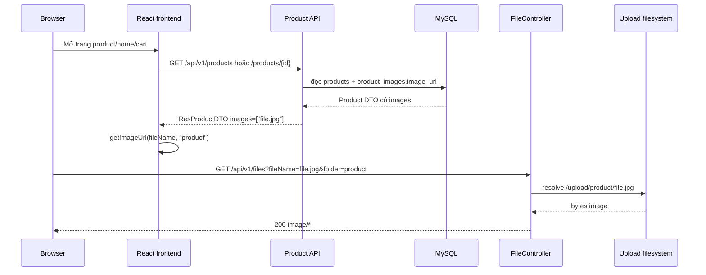

# Phân tích upload file, media và data runtime - Han Sports v2

Tài liệu này chỉ dựa trên source code trong project Han Sports v2.

## 1. FileController và FileService

### 1.1. FileController

File: `hansport_v2be/src/main/java/com/javaweb/controller/FileController.java`

Controller được map theo prefix `/api/v1`:

```java
// hansport_v2be/src/main/java/com/javaweb/controller/FileController.java
@RestController
@RequestMapping("/api/v1")
public class FileController {
```

Upload file:

```java
// hansport_v2be/src/main/java/com/javaweb/controller/FileController.java
@PostMapping("/files")
@ApiMessage("Upload single file")
public ResponseEntity<ResUploadFileDTO> upload(
        @RequestParam(name = "files", required = false) List<MultipartFile> files,
        @RequestParam("folder") String folder)
        throws IOException, StorageException {
    if (files == null || files.isEmpty()) {
        throw new StorageException("file is empty. Please upload the file");
    }

    List<String> fileNames = new ArrayList<>();

    for(MultipartFile file : files) {
        this.fileService.validateImageFile(file, folder);
        this.fileService.createDirectory(folder);

        String uploadedFile = this.fileService.store(file, folder);
        fileNames.add(uploadedFile);
    }

    ResUploadFileDTO res = new ResUploadFileDTO(fileNames, Instant.now());
    return ResponseEntity.ok().body(res);
}
```

Download/hiển thị file:

```java
// hansport_v2be/src/main/java/com/javaweb/controller/FileController.java
@GetMapping("/files")
@ApiMessage("Download a file")
public ResponseEntity<Resource> download(
        @RequestParam(name = "fileName", required = false) String fileName,
        @RequestParam(name = "folder", required = false) String folder)
        throws StorageException, FileNotFoundException {
    if (fileName == null || folder == null) {
        throw new StorageException("Missing required params");
    }

    long fileLength = this.fileService.getFileLength(fileName, folder);
    if (fileLength == 0) {
        throw new StorageException("File not found");
    }

    InputStreamResource resource = this.fileService.getResource(fileName, folder);

    MediaType mediaType = MediaTypeFactory
            .getMediaType(fileName)
            .orElse(MediaType.APPLICATION_OCTET_STREAM);

    return ResponseEntity.ok()
            .header(HttpHeaders.CONTENT_DISPOSITION, "inline; filename=\"" + fileName + "\"")
            .contentLength(fileLength)
            .contentType(mediaType)
            .body(resource);
}
```

Response DTO:

```java
// hansport_v2be/src/main/java/com/javaweb/domain/response/file/ResUploadFileDTO.java
public class ResUploadFileDTO {
    private List<String> fileName;
    private Instant upLoadedAt;
}
```

Lưu ý: field response là `fileName` nhưng kiểu là `List<String>`.

### 1.2. FileService

File: `hansport_v2be/src/main/java/com/javaweb/service/FileService.java`

Folder được phép:

```java
// hansport_v2be/src/main/java/com/javaweb/service/FileService.java
private static final Set<String> ALLOWED_FOLDERS = Set.of("product", "logo", "banner", "avatar");
```

định dạng ảnh được phép:

```java
// hansport_v2be/src/main/java/com/javaweb/service/FileService.java
private static final Set<String> ALLOWED_IMAGE_EXTENSIONS = Set.of("jpg", "jpeg", "png", "webp");
private static final Map<String, Set<String>> ALLOWED_CONTENT_TYPES = Map.of(
        "jpg", Set.of("image/jpeg"),
        "jpeg", Set.of("image/jpeg"),
        "png", Set.of("image/png"),
        "webp", Set.of("image/webp")
);
private static final long MAX_IMAGE_BYTES = 5L * 1024 * 1024;
```

Base path lấy từ config:

```java
// hansport_v2be/src/main/java/com/javaweb/service/FileService.java
@Value("${hansport.upload-file.base-path}")
private String basePath;
```

Validation upload:

```java
// hansport_v2be/src/main/java/com/javaweb/service/FileService.java
public void validateImageFile(MultipartFile file, String folder) throws IOException {
    resolveFolder(folder);
    if (file == null || file.isEmpty()) {
        throw new IllegalArgumentException("File must not be empty");
    }
    if (file.getSize() > MAX_IMAGE_BYTES) {
        throw new IllegalArgumentException("Image file must not exceed 5MB");
    }

    String extension = getExtension(file.getOriginalFilename());
    if (!ALLOWED_IMAGE_EXTENSIONS.contains(extension)) {
        throw new IllegalArgumentException("Only JPG, JPEG, PNG, or WebP images are allowed");
    }

    String contentType = file.getContentType();
    if (contentType == null || !ALLOWED_CONTENT_TYPES.getOrDefault(extension, Set.of()).contains(contentType.toLowerCase(Locale.ROOT))) {
        throw new IllegalArgumentException("Invalid image MIME type");
    }

    if (!hasValidImageSignature(file, extension)) {
        throw new IllegalArgumentException("Invalid image file content");
    }
}
```

Chống path traversal ở folder:

```java
// hansport_v2be/src/main/java/com/javaweb/service/FileService.java
private Path resolveFolder(String folder) {
    if (folder == null || !ALLOWED_FOLDERS.contains(folder)) {
        throw new IllegalArgumentException("Invalid upload folder");
    }
    Path root = Paths.get(basePath).toAbsolutePath().normalize();
    Path folderPath = root.resolve(folder).normalize();
    if (!folderPath.startsWith(root)) {
        throw new IllegalArgumentException("Invalid upload path");
    }
    return folderPath;
}
```

Chống path traversal ở fileName:

```java
// hansport_v2be/src/main/java/com/javaweb/service/FileService.java
private Path resolveFile(String folder, String fileName) {
    String safeName = StringUtils.cleanPath(fileName == null ? "" : fileName);
    if (safeName.isBlank() || safeName.contains("..") || safeName.contains("/") || safeName.contains("\\")) {
        throw new IllegalArgumentException("Invalid file name");
    }
    return resolveFolder(folder).resolve(safeName).normalize();
}
```

Tên file được làm sạch vì thêm timestamp:

```java
// hansport_v2be/src/main/java/com/javaweb/service/FileService.java
public String store(MultipartFile file, String folder) throws IOException {
    String originalName = StringUtils.cleanPath(file.getOriginalFilename() == null ? "file" : file.getOriginalFilename());
    String safeName = originalName.replaceAll("[^a-zA-Z0-9._-]", "_");
    String finalName = System.currentTimeMillis() + "-" + safeName;
    Path path = resolveFile(folder, finalName);
    try (InputStream inputStream = file.getInputStream()) {
        Files.copy(inputStream, path, StandardCopyOption.REPLACE_EXISTING);
    }
    return finalName;
}
```

Kiểm tra magic bytes:

```java
// hansport_v2be/src/main/java/com/javaweb/service/FileService.java
private boolean hasValidImageSignature(MultipartFile file, String extension) throws IOException {
    byte[] header = new byte[12];
    ...
    if ("png".equals(extension)) {
        return read >= 8
                && (header[0] & 0xFF) == 0x89
                && header[1] == 0x50
                && header[2] == 0x4E
                && header[3] == 0x47
                ...
    }
    if ("webp".equals(extension)) {
        return read >= 12
                && header[0] == 0x52
                && header[1] == 0x49
                && header[2] == 0x46
                && header[3] == 0x46
                ...
    }
    return false;
}
```

## 2. File ảnh được upload vào đâu?

Config mặc định:

```properties
# hansport_v2be/src/main/resources/application.properties
hansport.upload-file.base-path=${UPLOAD_FILE_BASE_PATH:../hansport_v2fe/upload}
```

Trong local dev, nếu không set `UPLOAD_FILE_BASE_PATH`, file sẽ được lưu vào:

```text
hansport_v2fe/upload/<folder>/<fileName>
```

Folder hợp lệ:

| Folder | Mục đích dạng thấy trong source |
|---|---|
| `product` | ảnh sản phẩm |
| `logo` | Logo mặc định trong constants frontend |
| `banner` | Ảnh hero/banner site |
| `avatar` | Avatar người dùng |

Trong Docker Compose, backend set path upload là `/app/upload`:

```yaml
# docker-compose.yml
backend:
  environment:
    UPLOAD_FILE_BASE_PATH: /app/upload
  volumes:
    - backend-upload:/app/upload
```

Nghĩa là trong container, file bytes nằm ở:

```text
/app/upload/product
/app/upload/logo
/app/upload/banner
/app/upload/avatar
```

vì được persist qua Docker volume `backend-upload`.

## 3. Database lưu gì và file system lưu gì

### 3.1. File system lưu bytes ảnh

FileService copy bytes upload vào filesystem:

```java
// hansport_v2be/src/main/java/com/javaweb/service/FileService.java
Files.copy(inputStream, path, StandardCopyOption.REPLACE_EXISTING);
```

Filesystem không từ biết file đó thuộc product/order/user nao. Nó chỉ lưu file vật lý.

### 3.2. Database lưu metadata/tham chiếu file

Product image:

```sql
-- hansport_v2be/src/main/resources/db/migration/V1__baseline_schema.sql
CREATE TABLE IF NOT EXISTS product_images (
    id BIGINT NOT NULL AUTO_INCREMENT,
    image_url VARCHAR(255),
    product_id BIGINT,
    PRIMARY KEY (id),
    KEY idx_product_images_product_id (product_id),
    CONSTRAINT fk_product_images_product FOREIGN KEY (product_id) REFERENCES products (id)
);
```

Entity:

```java
// hansport_v2be/src/main/java/com/javaweb/domain/ProductImage.java
@Entity
@Table(name = "product_images")
public class ProductImage {
    @Id
    @GeneratedValue(strategy = GenerationType.IDENTITY)
    private long id;

    private String imageUrl;

    @ManyToOne(fetch = FetchType.LAZY)
    @JoinColumn(name = "product_id")
    private Product product;
}
```

Product entity quan hệ một-nhiều với images:

```java
// hansport_v2be/src/main/java/com/javaweb/domain/Product.java
@OneToMany(mappedBy = "product", fetch = FetchType.LAZY, cascade = CascadeType.ALL, orphanRemoval = true)
@OrderColumn(name = "sort_order")
private List<ProductImage> images = new ArrayList<>();
```

User avatar:

```sql
-- hansport_v2be/src/main/resources/db/migration/V7__add_user_avatar.sql
ALTER TABLE users ADD COLUMN avatar VARCHAR(255) NULL;
```

```java
// hansport_v2be/src/main/java/com/javaweb/domain/User.java
private String avatar;
```

Banner image:

```java
// hansport_v2be/src/main/java/com/javaweb/domain/SiteBanner.java
private String image;
private String imageFolder;
```

Settings JSON cũng có thể lưu `HERO_SLIDES` có image/imageFolder:

```java
// hansport_v2be/src/main/java/com/javaweb/service/AppSettingService.java
updateSetting("HERO_SLIDES", objectMapper.writeValueAsString(settings.getHeroSlides()));
replaceBanners(settings.getHeroSlides());
```

Tóm tắt:

| Nơi lưu | Lưu nội dung gì |
|---|---|
| Filesystem / Docker volume `backend-upload` | Bytes ảnh thật |
| `product_images.image_url` | Tên file hoặc URL ảnh product |
| `users.avatar` | Tên file avatar |
| `site_banners.image`, `site_banners.image_folder` | Tên file banner và folder |
| `settings.setting_value` | JSON/string config, có thể chứa image reference |

## 4. Frontend upload và hiển thị ảnh như thế nào?

### 4.1. Upload product image

Frontend upload qua `productApi.uploadFiles`:

```js
// hansport_v2fe/src/api/productApi.js
uploadFiles: (files, folder = "product") => {
  const formData = new FormData();
  files.forEach((file) => formData.append("files", file));
  formData.append("folder", folder);

  return axiosInstance.post("/api/v1/files", formData);
},
```

Product admin hook nhận fileName từ response vì gán vào form:

```js
// hansport_v2fe/src/pages/admin/products/useProductsAdmin.js
const res = await productApi.uploadFiles(files);
const uploaded = res.data?.data?.fileName || res.data?.fileName || res.data?.data?.fileNames || res.data?.fileNames || [];
const uploadedList = Array.isArray(uploaded) ? uploaded : (uploaded ? [uploaded] : []);
setForm((f) => ({
  ...f,
  images: [...new Set([...(f.images || []), ...uploadedList])],
}));
```

Khi save product, list `images` đi vào `ReqProductDTO` vì backend tạo `ProductImage`:

```java
// hansport_v2be/src/main/java/com/javaweb/service/ProductService.java
public List<ProductImage> addImage(List<String> images, Product product){
    List<ProductImage> managedImages = product.getImages();
    ...
    for(String image : normalizeImages(images)){
        ProductImage productImage = new ProductImage();
        productImage.setImageUrl(image);
        productImage.setProduct(product);
        managedImages.add(productImage);
    }
    this.productRepository.save(product);
    return new ArrayList<>(managedImages);
}
```

### 4.2. Upload banner image

Banner upload dùng folder `banner`:

```js
// hansport_v2fe/src/pages/admin/settings/useAdminSettings.js
const res = await productApi.uploadFile(file, "banner");
...
updateListItem("slides", index, "image", fileName);
updateListItem("slides", index, "imageFolder", "banner");
```

Sau đó admin save settings, backend ghi vào `settings` vì `site_banners`.

### 4.3. Upload avatar

Profile page có code upload avatar:

```js
// hansport_v2fe/src/pages/client/ProfilePage.jsx
const uploadRes = await productApi.uploadFile(file, "avatar");
const fileNames = uploadRes.data?.data?.fileName || uploadRes.data?.fileName || [];
const uploadedFileName = fileNames[0];

const payload = {
  fullName: form.fullName.trim(),
  phone: form.phone.trim(),
  address: form.address.trim(),
  avatar: uploadedFileName,
};
const updateRes = await authApi.updateAccount(payload);
```

Nhưng security hiện tại chỉ cho ADMIN upload `/api/v1/files`:

```java
// hansport_v2be/src/main/java/com/javaweb/config/SecurityConfiguration.java
.requestMatchers(HttpMethod.POST, "/api/v1/products", "/api/v1/products/import", "/api/v1/files").hasRole("ADMIN")
```

Do đó user thường có thể bị chặn khi upload avatar. Nếu avatar là tính năng user, cần tách rule/endpoint riêng cho avatar upload.

### 4.4. Hiển thị ảnh

Frontend tạo URL ảnh bằng helper:

```js
// hansport_v2fe/src/utils/constants.js
export function getImageUrl(fileName, folder = "product", version = null) {
  if (!fileName) return null;
  if (fileName.startsWith("http")) return fileName;
  const params = new URLSearchParams({
    fileName,
    folder,
  });
  if (version) params.set("v", String(version));
  return `${API_BASE_URL}/api/v1/files?${params.toString()}`;
}
```

ProductCard dùng image đầu tiên:

```jsx
// hansport_v2fe/src/components/common/ProductCard.jsx
const imageSrc = getImageUrl(getFirstImage(product), "product", imageVersion);
```

Banner home dùng folder theo slide:

```jsx
// hansport_v2fe/src/pages/client/HomePage.jsx
src={getImageUrl(bannerImage, slide.imageFolder || "banner")}
```

Avatar user dùng folder `avatar`:

```jsx
// hansport_v2fe/src/pages/client/ProfilePage.jsx
src={`${API_BASE_URL}/api/v1/files?fileName=${encodeURIComponent(user.avatar)}&folder=avatar`}
```

## 5. Static resource `/storage/**`

Backend cũng có config expose upload folder qua `/storage/**`:

```java
// hansport_v2be/src/main/java/com/javaweb/config/StaticResourcesWebConfiguration.java
registry.addResourceHandler("/storage/**")
        .addResourceLocations(uploadPath.toUri().toString());
```

Security public:

```java
// hansport_v2be/src/main/java/com/javaweb/config/SecurityConfiguration.java
.requestMatchers("/", "/api/v1/auth/login", "/api/v1/auth/register",
        "/api/v1/auth/refresh", "/storage/**", "/api/v1/auth/google").permitAll()
```

Trong frontend source hiện tại, URL ảnh chú ýếu dùng `/api/v1/files?fileName=...&folder=...`, không phải `/storage/**`.

## 6. Docker volume backend-upload có vai trò gì

Docker Compose:

```yaml
# docker-compose.yml
backend:
  environment:
    UPLOAD_FILE_BASE_PATH: /app/upload
  volumes:
    - backend-upload:/app/upload

volumes:
  backend-upload:
```

Vai trò:

- Lưu file upload ngoài container lifecycle.
- Khi container backend bị xóa/recreate, ảnh vẫn còn trong volume.
- Nếu không backup volume này, các file ảnh product/banner/avatar có thể mất dù bytes vẫn còn reference trong DB.

Backend Dockerfile tạo `/app/upload` và chạy bằng user `app`:

```dockerfile
# hansport_v2be/Dockerfile
WORKDIR /app
RUN addgroup -S app && adduser -S app -G app && mkdir -p /app/upload && chown -R app:app /app
...
USER app
```

## 7. MySQL volume mysql-data có vai trò gì

Docker Compose:

```yaml
# docker-compose.yml
mysql:
  image: mysql:8.0
  volumes:
    - mysql-data:/var/lib/mysql
    - ./backups/hansport_v2_old_20260605_175155.sql:/docker-entrypoint-initdb.d/init.sql

volumes:
  mysql-data:
```

Vai trò:

- Lưu data MySQL runtime: table, index, row data, metadata.
- Khi MySQL container recreate, data vẫn còn nếu volume không bị xóa.
- File SQL trong `/docker-entrypoint-initdb.d/init.sql` chỉ dùng lúc MySQL data dir mới/chưa init.

## 8. Khi copy project sang máy khác, cần backup gì

Cần backup ít nhất:

| Thứ cần backup | Lý do |
|---|---|
| Source code project | Code backend/frontend/migration/docker |
| Database dump MySQL | Lưu users, roles, products, orders, settings, image references |
| Docker volume `backend-upload` hoặc thư mục upload local | Lưu bytes ảnh thật |
| `.env`/secret config | Còn để chạy dùng DB/JWT/Google/Mail, nhưng không nên commit hoặc gửi công khai |
| Backup scripts/tài liệu restore nếu cũ | Đảm bảo restore dùng thứ tự |

Nếu dùng local dev default:

```text
hansport_v2fe/upload
```

Nếu dùng Docker:

```text
Docker volume: backend-upload
Docker volume: mysql-data
```

Nên backup bằng dump thay vì copy raw `mysql-data` khi chuyển máy/OS khác.

## 9. Rủi ro nếu chỉ export SQL mà không copy upload

Nếu chỉ có SQL:

- `product_images.image_url` vẫn có tên file.
- `site_banners.image` vẫn có tên file.
- `users.avatar` vẫn có tên file.
- Nhưng file vật lý trong upload không tồn tại.

Kết quả:

- Product image bộ broken.
- Banner home/settings bộ broken.
- Avatar user bộ broken.
- API `/api/v1/files` trả lỗi `File not found`.

Bằng chứng:

```java
// hansport_v2be/src/main/java/com/javaweb/controller/FileController.java
long fileLength = this.fileService.getFileLength(fileName, folder);
if (fileLength == 0) {
    throw new StorageException("File not found");
}
```

## 10. Rủi ro nếu chỉ copy upload mà không có DB

Nếu chỉ có folder upload:

- File bytes còn, nhưng không có product/user/banner nao tham chiếu đến chung.
- Backend không biết file nào là ảnh của product nào.
- Product list, order, cart, settings đều mất nếu DB không restore.
- Các file thành orphan files.

Bằng chứng: quan hệ product-image nằm trong DB:

```java
// hansport_v2be/src/main/java/com/javaweb/domain/ProductImage.java
@ManyToOne(fetch = FetchType.LAZY)
@JoinColumn(name = "product_id")
private Product product;
```

## 11. Sơ đồ luồng hiển thị ảnh sản phẩm



## 12. Điểm mạnh upload/media

| Điểm mạnh | File |
|---|---|
| Folder allowlist | `FileService.java` |
| Extension allowlist | `FileService.java` |
| MIME type allowlist | `FileService.java` |
| Magic byte validation | `FileService.java` |
| Chốt size 5MB ở service | `FileService.java` |
| Chọn base path qua env | `application.properties`, `docker-compose.yml` |
| Docker volume riêng cho upload | `docker-compose.yml` |
| Response file inline dùng media type | `FileController.java` |
| Chính sách public GET file, admin POST file rõ trong SecurityConfiguration | `SecurityConfiguration.java` |

## 13. Điểm cần cải thiện vì rủi ro

| Vấn đề | File liên quan | Rủi ro | đề xuất |
|---|---|---|---|
| User avatar upload có thể bị chặn bởi rule ADMIN | `ProfilePage.jsx`, `SecurityConfiguration.java` | Frontend user thường gửi `POST /api/v1/files` folder `avatar`, nhưng backend yêu cầu ADMIN. | Tạo endpoint `/api/v1/account/avatar` authenticated hoặc cho `POST /files` authenticated với check folder/ownership trong service. |
| `productApi.getFile` không gửi folder | `hansport_v2fe/src/api/productApi.js` | Backend yêu cầu `fileName` vì `folder`, helper này nếu dùng sẽ lỗi missing params. | Sửa `getFile(fileName, folder = "product")`. |
| `/storage/**` public song song với `/api/v1/files` | `StaticResourcesWebConfiguration.java`, `SecurityConfiguration.java` | Có hai cách truy cập upload; khó quản lý cáche/header/security nhất quán. | Chọn một cách public media chính, ưu tiên `/api/v1/files` hoặc static CDN path rõ ràng. |
| Xóa/sửa ảnh product có xóa file vật lý, nhưng banner/avatar chưa thấy cleanup | `ProductService.java`, `AppSettingService.java`, `UserService.java` | File banner/avatar cũ có thể bị orphan. | Thêm cleanup job hoặc reference counting theo folder. |
| DB vì filesystem không transactional cùng nhau | `FileController.java`, `ProductService.java` | Upload thành công nhưng save product/settings thất bại sẽ tạo file orphan. | Dùng job cleanup temp/orphan hoặc upload vào temp, commit sau khi save DB. |
| Upload fileName dùng timestamp millisecond | `FileService.java` | Xác sựất collision thấp nhưng không bằng UUID, nhất là upload nhiều file cùng tên cùng ms. | Dùng UUID/random suffix. |
| Multipart config 50MB nhưng service image max 5MB | `application.properties`, `FileService.java` | Không phải lỗi bảo mật, nhưng request lớn đến 50MB vẫn vào app trước khi service reject tổng file. | Nếu chỉ upload ảnh 5MB, cân nhắc giảm `spring.servlet.multipart.max-file-size`. |
| Import product có thể lưu external image URL | `ProductImportService.java`, `getImageUrl()` | Frontend hiển thị external URL nếu `fileName.startsWith("http")`, còn review CSP/privacy nếu production. | Nếu còn owned media, yêu cầu import upload ảnh vì storage nội bộ. |

## 14. Quy trình backup/restore đề xuất

### Backup

1. Đặt app vào maintenance mode hoặc tạm dừng ghi upload/order nếu cần consistency.
2. Dump MySQL:

```bash
mysqldump --single-transaction --routines --triggers hansport_v2 > hansport_v2_YYYYMMDD.sql
```

3. Backup upload:

```bash
tar -czf hansport_upload_YYYYMMDD.tar.gz upload/
```

Với Docker volume, có thể dùng container helper để archive `backend-upload`.

4. Backup `.env` vào secret manager/nơi lưu riêng, không dựa vào Git.
5. Lưu checksum cho SQL và archive upload.

### Restore

1. Deploy source code dùng version.
2. Tạo MySQL database mới.
3. Import SQL dump.
4. Restore upload vào dùng path:

```text
local dev: hansport_v2fe/upload
docker: backend-upload mounted at /app/upload
```

5. Đặt lại `.env`.
6. Chạy backend, để Flyway validate/migrate.
7. Kiểm tra:
   - Login admin.
   - Product image.
   - Banner home.
   - Avatar user.
   - đơn hàng gần đây.

## 15. Kết luận

Runtime data của Han Sports v2 có hai phần không thứ tách rồi:

- MySQL lưu dữ liệu nghiệp vụ vì reference media.
- Upload filesystem/volume lưu bytes media thật.

Vì vậy backup production cần gồm cả DB dump và upload volume. Nếu chỉ có một trong hai, hệ thống sẽ bị mất quan hệ dữ liệu hoặc bị broken image.
