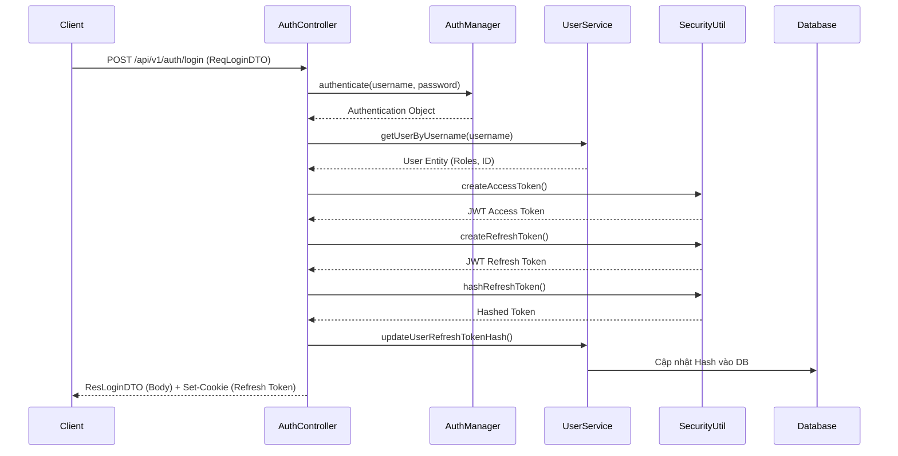
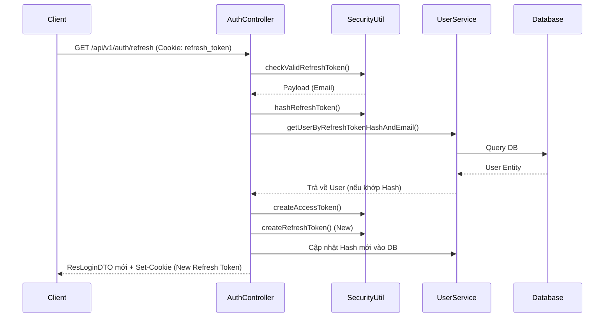

# Phân tích chức năng Authentication & Authorization - Han Sports v2

Hệ thống Han Sports v2 sử dụng mô hình xác thực không trạng thái (Stateless Authentication) dựa trên **JSON Web Token (JWT)** và bảo mật với **Spring Security**.

## 1. Phân tích các luồng (Flows)

### 1.1. Luồng Đăng ký (Register)
- Khách hàng gửi `ReqRegisterDTO` tới `POST /api/v1/auth/register`.
- Controller chuyển xuống `UserService`. Hệ thống kiểm tra trùng email, mã hóa mật khẩu bằng `BCryptPasswordEncoder`.
- Khởi tạo `User` entity với vai trò mặc định là `USER` và lưu xuống database. Trả về `ResCreateUserDTO`.

### 1.2. Luồng Đăng nhập truyền thống (Login)
- Nhận `ReqLoginDTO` (username, password) tại `POST /api/v1/auth/login`.
- Khởi tạo `UsernamePasswordAuthenticationToken` và đưa cho `AuthenticationManagerBuilder` xác thực.
- Khi xác thực thành công, truy xuất `User` từ DB để lấy Role và các thông tin cơ bản (ID, Email, Name).
- **Cấp phát Token**: Gọi `SecurityUtil` để tạo `access_token` và `refresh_token`.
- Lưu mã băm (Hash) của `refresh_token` xuống cột `refresh_token` trong DB (giúp vô hiệu hóa token khi cần).
- Trả về `access_token` trong body (JSON) và `refresh_token` vào HTTP-Only Cookie.

### 1.3. Phân tích JWT Access Token
- Dùng thuật toán chữ ký `HS512` kết hợp `base64-secret`.
- Access token chứa các thông tin (`Claims`):
  - `sub` (subject): email của người dùng.
  - `user`: Thông tin công khai gồm ID, Email, Name.
  - `roles`: Danh sách quyền, ví dụ `["ROLE_USER"]`.
  - `iat` (Issued At), `exp` (Expires At).
- Access token được Client đính kèm vào header `Authorization: Bearer <token>` ở các request tiếp theo.

### 1.4. Phân tích Refresh Token
- Thay vì bắt user đăng nhập lại liên tục khi Access Token hết hạn, hệ thống cấp một Refresh Token sống lâu hơn.
- Trình duyệt gửi `GET /api/v1/auth/refresh` tự động đính kèm HTTP-Only Cookie chứa `refresh_token`.
- Backend giải mã token, lấy ra `email`. Sau đó băm (SHA-256) chuỗi token nhận được để so sánh với chuỗi băm lưu trong DB. Nếu khớp, cấp lại cặp Access Token & Refresh Token mới (cơ chế Refresh Token Rotation).

### 1.5. Luồng Đăng xuất (Logout)
- Gọi `POST /api/v1/auth/logout` (yêu cầu gửi kèm Access Token hiện tại).
- Backend set giá trị `refresh_token` trong DB của user đó về `null` (Xóa hiệu lực Refresh Token ở phía server).
- Trả về Header Set-Cookie với `Max-Age=0` để yêu cầu trình duyệt tự động xóa Refresh Token cookie.

### 1.6. Luồng Đổi mật khẩu
- Gọi `POST /api/v1/auth/change-password` với mật khẩu cũ, mật khẩu mới.
- So sánh mật khẩu cũ bằng `BCryptPasswordEncoder.matches()`. Nếu đúng, mã hóa mật khẩu mới và lưu.
- Cuối cùng, cũng set `refresh_token` về `null` trong DB và xóa cookie, bắt buộc người dùng đăng nhập lại bằng mật khẩu mới trên mọi thiết bị.

### 1.7. Phân tích Google Login (SSO)
- Gọi `POST /api/v1/auth/google`.
- Client (Frontend) xác thực với Google và lấy được chuỗi `idToken`, gửi cho Backend.
- Backend sử dụng `GoogleTokenVerifierService` (thư viện `google-api-client`) để xác thực tính hợp lệ của `idToken` bằng public key của Google.
- Trích xuất `email` và `name` từ payload. Nếu email chưa tồn tại trong DB, hệ thống tự động đăng ký tài khoản (không có password cục bộ). Sau đó sinh token tương tự luồng Login thường.

---

## 2. Cấu hình bảo mật (SecurityConfiguration.java)

Lớp `SecurityConfiguration` định nghĩa các nguyên tắc phân quyền và bảo vệ Endpoint:
- **`permitAll()` (Public Endpoints)**:
  - Tất cả API thuộc `/api/v1/auth/...` (Login, Register, Refresh, Google Login). Chú ý `/api/v1/auth/account`, `logout`, `change-password` phải bỏ ra để filter tự động check vì cần authenticated.
  - Xem danh sách sản phẩm: `GET /api/v1/products`, `/api/v1/products/**`.
  - Xem và tải file: `/api/v1/files`, `/storage/**`.
  - Cấu hình chung: `GET /api/v1/settings`.
  - Actuator: `/actuator/health`.
- **`hasRole("ADMIN")` (Quyền Quản trị)**:
  - Các thao tác thay đổi sản phẩm: `POST`, `PUT`, `DELETE` `/api/v1/products...`
  - Quản trị User: `/api/v1/users`, `/api/v1/users/**`.
  - Quản trị Admin Dashboard/Setting: `/api/v1/admin/**`.
  - Cập nhật, lấy toàn bộ hóa đơn: `/api/v1/orders` (GET/PUT), gửi mail: `/api/v1/orders/*/send-email`.
- **`anyRequest().authenticated()` (Cần Đăng nhập)**:
  - Những API không được khai báo bên trên (vd: Mua hàng, xem giỏ hàng `/carts`, tạo `/orders`) sẽ tự động rơi vào nhóm yêu cầu user gửi kèm Access Token hợp lệ.

---

## 3. Sơ đồ tuần tự (Sequence Diagram)

### 3.1. Luồng Login

### 3.2. Luồng Refresh Token

---

## 4. Rủi ro bảo mật còn lại và Đề xuất cải thiện

1. **Rủi ro Access Token không thể thu hồi lập tức**: 
   - Vì tính chất Stateless, khi user Logout, hệ thống chỉ vô hiệu hóa Refresh Token trong DB. Access Token (nằm trong tay client) vẫn sống và có hiệu lực cho đến khi hết hạn `exp`. Nếu hacker trộm được Access Token trước khi Logout, họ vẫn có thể dùng trong thời gian còn lại.
   - *Đề xuất*: Rút ngắn thời gian sống của Access Token xuống rất thấp (khoảng 5 - 15 phút). Đưa thêm cơ chế Token Blacklist bằng Redis lưu trữ các Access Token bị hủy.
2. **Brute Force Attack Login**:
   - Endpoint `/api/v1/auth/login` không giới hạn số lần thử mật khẩu. Hacker có thể dò pass liên tục. (Mặc dù có class `AuthRateLimitFilter` được gọi nhưng chưa rõ mức độ cấu hình chặn ip).
   - *Đề xuất*: Khóa tài khoản (Account Lockout) sau 5 lần nhập sai, yêu cầu đợi 15 phút hoặc verify qua email.
3. **Cơ chế Refresh Token Theft**:
   - Việc băm Refresh Token lưu ở DB đã giúp chống lộ lọt từ database. Tuy nhiên, nếu Hacker đánh cắp được Refresh Token cookie qua kịch bản XSS/CSRF nâng cao, chúng có thể đem đổi lấy Access Token mới.
   - *Đề xuất*: Áp dụng cơ chế **Refresh Token Reuse Detection**. Nếu server phát hiện một Refresh Token cũ (đã được xoay vòng) bị đem ra sử dụng lại, server phải nhận diện đây là vụ đánh cắp và ngay lập tức REVOKE toàn bộ họ token của user đó, bắt họ đăng nhập lại từ đầu.
