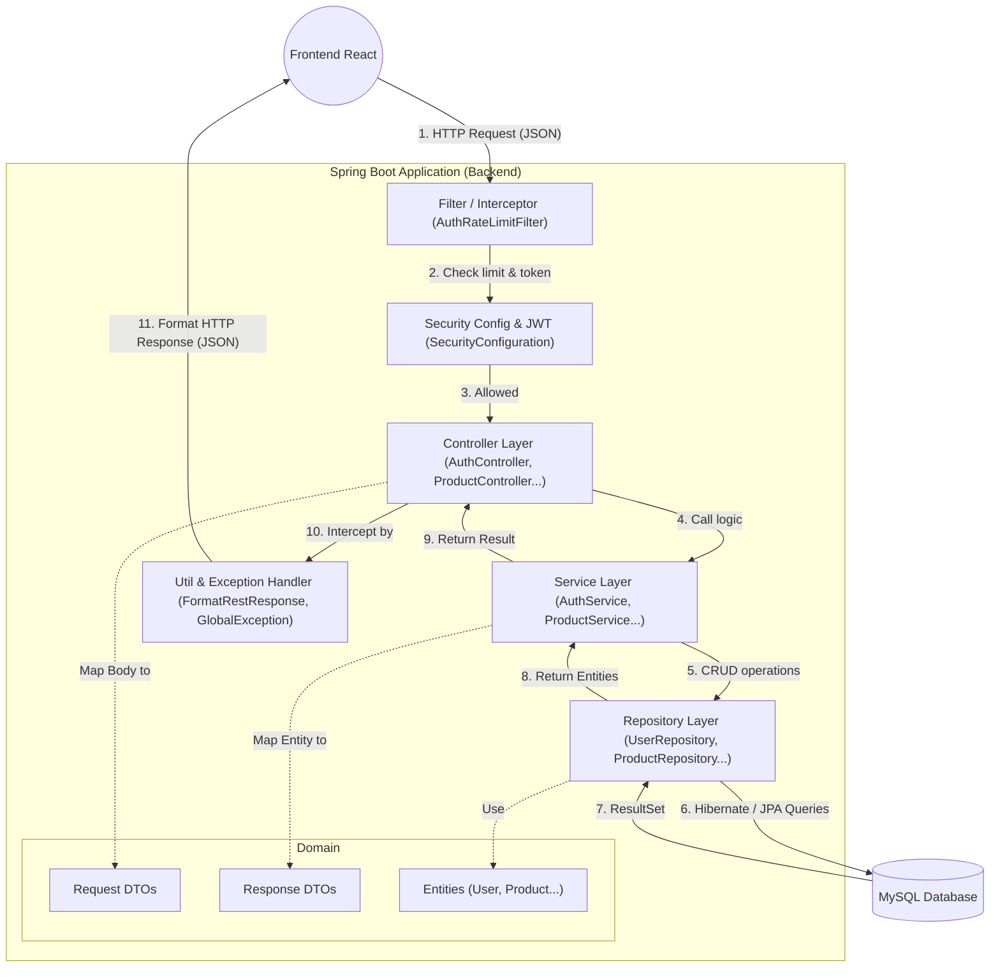

# Phân tích Kiến trúc Backend Spring Boot - Han Sports v2

Dựa trên mã nguồn, dưới đây là bài phân tích chuyên sâu về kiến trúc Backend Spring Boot của dự án **Han Sports v2**.

## 1. Kiến trúc Backend
Backend của hệ thống sử dụng kiến trúc **Layered Architecture (Kiến trúc phân tầng)** truyền thống nhưng rất hiệu quả của Spring Boot. Đồng thời, nó được thiết kế hoàn toàn theo chuẩn **RESTful API**, nghĩa là backend hoàn toàn "stateless" (không lưu trạng thái phiên - sử dụng JWT) và chỉ giao tiếp với các client (Frontend React) thông qua dữ liệu JSON.

## 2. Giải thích luồng xử lý: Controller -> Service -> Repository -> Entity -> DB
Mọi HTTP Request gửi tới backend đều đi qua một luồng chuẩn:

1. **Client (Frontend)** gửi HTTP Request (kèm theo JWT trong Header nếu cần).
2. **Filter/Security**: Request đi qua cấu hình ở `config/` (ví dụ `SecurityConfiguration.java`, `AuthRateLimitFilter.java`) để kiểm tra quyền và rate-limit.
3. **Controller**: Request hợp lệ đi tới Controller tương ứng. Ví dụ lấy danh sách sản phẩm thì vào `ProductController.java`. Controller map dữ liệu JSON từ body thành Object thông qua các lớp ở `domain/request/`.
4. **Service**: Controller gọi hàm trong Service. Ví dụ `ProductService.java`. Tại đây xử lý các nghiệp vụ kinh doanh, tính toán, kiểm tra điều kiện.
5. **Repository**: Service cần thao tác với cơ sở dữ liệu nên sẽ gọi các hàm trong `Repository`. Các repository này kế thừa `JpaRepository`.
6. **Entity & Database**: Spring Data JPA/Hibernate (bên dưới Repository) sẽ tự động tạo các câu lệnh SQL dựa trên các **Entity** (trong thư mục `domain/`) và thực thi chúng xuống MySQL **Database**.
7. **Response**: Khi có kết quả từ DB, Service biến đổi **Entity** thành **DTO** (nằm ở `domain/response/`) để ẩn các thông tin nhạy cảm. DTO được trả ngược về Controller, sau đó thông qua `FormatRestResponse.java` (thuộc `util/`) định dạng lại thành JSON chuẩn và gửi về Client.

---

## 3. Vai trò của từng Package và các File quan trọng

### 3.1. `config`
- **Vai trò**: Cấu hình các thiết lập toàn cục của hệ thống (Bảo mật, CORS, Khởi tạo dữ liệu mẫu, Exception cơ bản của hệ thống).
- **File quan trọng**:
  - `SecurityConfiguration.java`: Cấu hình Spring Security, khai báo các route được phép public và cấu hình giải mã JWT Token.
  - `CorsConfig.java`: Cấu hình CORS để cho phép Frontend (Vite chạy port 5173) gọi API mà không bị block.
  - `DataSeeder.java` & `AppSettingSeeder.java`: Khởi tạo dữ liệu mặc định (Admin user, settings) khi DB mới được tạo.

### 3.2. `controller`
- **Vai trò**: Định nghĩa các API Endpoint (đường dẫn URL), tiếp nhận request (GET/POST/PUT/DELETE) và validate dữ liệu đầu vào.
- **File quan trọng**:
  - `AuthController.java`: Xử lý đăng nhập, đăng ký, đăng nhập qua Google, refresh token.
  - `ProductController.java`: API về sản phẩm.
  - `CartController.java`, `OrderController.java`: API về giỏ hàng và đặt hàng.

### 3.3. `domain`
- **Vai trò**: Chứa các Entity class. Đây là các lớp được đánh dấu `@Entity`, ánh xạ trực tiếp 1-1 với các bảng trong MySQL.
- **File quan trọng**: `User.java`, `Product.java`, `Order.java`, `Cart.java`.

### 3.4. `domain/request`
- **Vai trò**: Chứa các DTO (Data Transfer Object) chuyên dùng để nhận dữ liệu từ request body của Client gửi lên. Giúp tách biệt dữ liệu người dùng gửi và Entity thực tế.
- **Các class tiêu biểu**: `ReqLoginDTO`, `ReqCreateOrderDTO`, v.v.

### 3.5. `domain/response`
- **Vai trò**: Chứa các DTO để trả kết quả về cho Client. Tránh lộ các cột nhạy cảm từ Database (như mật khẩu trong bảng User).
- **Các class tiêu biểu**: `ResUserDTO`, `ResProductDTO`, `ResOrderDTO`.

### 3.6. `repository`
- **Vai trò**: Tầng giao tiếp với cơ sở dữ liệu bằng việc kế thừa `JpaRepository` và `JpaSpecificationExecutor` (hoặc SpringFilter).
- **File quan trọng**:
  - `ProductRepository.java`: Thực hiện các truy vấn lấy sản phẩm.
  - `UserRepository.java`: Ví dụ tìm user theo email `findByEmail()`.

### 3.7. `service`
- **Vai trò**: Trái tim của ứng dụng, chứa toàn bộ "Business Logic" (Logic nghiệp vụ).
- **File quan trọng**:
  - `ProductService.java`: Logic lấy sản phẩm, lọc sản phẩm.
  - `ProductImportService.java`: Logic đọc file Excel/CSV bằng Apache POI và import dữ liệu vào DB.
  - `UserService.java`, `CartService.java`.

### 3.8. `util`
- **Vai trò**: Chứa các hàm tiện ích dùng chung, hoặc các class cấu hình can thiệp vào vòng đời xử lý chung (như AOP, Global Exception).
- **File quan trọng**:
  - `FormatRestResponse.java`: Interceptor bọc mọi kết quả trả về của Controller vào chung một format chuẩn (vd: `{ "statusCode": 200, "message": "Call API success", "data": {...} }`).
  - `SecurityUtil.java`: Cung cấp hàm lấy thông tin User đang đăng nhập hiện tại từ Spring Security Context, tạo token JWT.
  - Các thư mục con `annotation`, `error` (Global Exception Handler) và `validator`.

---

## 4. Sơ đồ Kiến trúc Backend (Mermaid)

---

## 5. Đánh giá Điểm mạnh & Điểm cần cải thiện

### Điểm mạnh:
- **Tách biệt rõ ràng (Separation of Concerns)**: Các tầng Controller, Service, Repository được phân tách trách nhiệm rất chuẩn mực.
- **Sử dụng DTO 패턴 triệt để**: Tách biệt `request` và `response` giúp an toàn dữ liệu, không bị lỗi Mass Assignment Vulnerability và không lộ các trường nhạy cảm trong CSDL ra API.
- **Chuẩn hóa Response**: File `FormatRestResponse.java` giúp mọi API luôn trả về một định dạng thống nhất, phía frontend rất dễ handle và viết interceptor.
- **Hỗ trợ Query Dynamic**: Hệ thống tích hợp thư viện `turkraft.springfilter` trong Maven (pom.xml) để hỗ trợ tìm kiếm động linh hoạt mà không cần code nhiều câu lệnh JPQL.

### Điểm cần cải thiện:
- **Xử lý Transaction**: Trong các tác vụ phức tạp (như đặt hàng liên quan tới cả User, Cart, Order, OrderDetail), cần đảm bảo annotation `@Transactional` trên các hàm ở `Service` được sử dụng kỹ lưỡng và bắt đúng các Exception (rollbackFor) để tránh lệch dữ liệu.
- **Caching**: Hiện tại cấu trúc mang tính CRUD cơ bản gọi thẳng xuống Database. Với website thương mại điện tử, việc sử dụng Cache (như Redis) cho Product là cần thiết vì lượng xem danh sách lớn.
- **Tính năng Upload (FileService)**: Cấu trúc hiện lưu trữ file trên Local Disk Volume. Sẽ an toàn và mở rộng tốt hơn nếu tích hợp Cloud Storage như AWS S3 hoặc Cloudinary vào trong tương lai (kiến trúc hiện tại cho phép dễ sửa điều này vì đã có tầng `FileService` chung).
