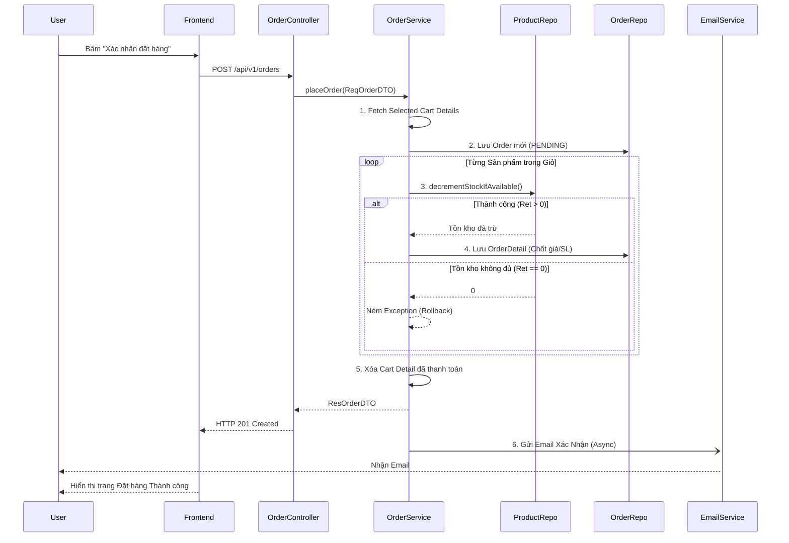

# Phân tích chức năng Giỏ hàng & Đặt hàng (Cart & Order) - Han Sports v2

Hệ thống Han Sports v2 tách biệt giỏ hàng (Cart) và đơn hàng (Order) thành 2 luồng độc lập nhưng có quan hệ kế thừa logic chặt chẽ khi tiến hành thanh toán (Checkout).

## 1. Phân tích chức năng Giỏ hàng (Cart)

Mỗi `User` (Khách hàng) sẽ sở hữu vĩnh viễn 1 `Cart`. Các sản phẩm nằm trong đó được lưu dưới dạng `CartDetail`.
- **Thêm vào giỏ (`POST /carts/add`)**: Nhận `ReqAddProductToCartDTO` chứa ID sản phẩm, số lượng, size, color. Server sẽ kiểm tra tồn kho. Nếu đã có sản phẩm (trùng ID, màu, size) thì cộng dồn số lượng. Ngược lại tạo `CartDetail` mới.
- **Xem giỏ hàng (`GET /carts`)**: Fetch toàn bộ `CartDetail` của người dùng đang đăng nhập, join với bảng `Product` để lấy thông tin giá, tên, hình ảnh.
- **Cập nhật số lượng (`PUT /carts/update`)**: User bấm dấu `+` hoặc `-`. Gọi API cập nhật cột `quantity` trong bảng `CartDetail`.
- **Xóa sản phẩm (`DELETE /carts/remove/{cartDetailId}`)**: Xóa khỏi DB trực tiếp dòng `CartDetail`.

Trong Frontend (React), `CartPage.jsx` và Zustand store (`useCartStore.js`) được sử dụng để đồng bộ State của giỏ hàng lên giao diện lập tức mỗi khi có phản hồi thành công từ API.

---

## 2. Phân tích chức năng Đặt hàng (Checkout / Order)

- **Checkout / Tạo đơn (`POST /orders`)**: 
  - Khách hàng điền form thông tin giao hàng tại `CheckoutPage.jsx`.
  - Frontend gọi `OrderController` kèm `ReqOrderDTO` (Thông tin KH) và danh sách ID của các `CartDetail` được chọn để thanh toán.
  - `OrderService.placeOrder()` xử lý: Tạo Entity `Order` (Pending). Quét qua các `CartDetail`, chuyển thành `OrderDetail` (chốt giá cố định `price`). Trừ số lượng tồn kho của `Product`. Cuối cùng xóa các `CartDetail` đó khỏi `Cart`.
- **User xem đơn hàng (`GET /orders/history`)**: Lấy danh sách các đơn hàng thuộc về `user_id` hiện tại, trả về giao diện lịch sử mua hàng.
- **Admin cập nhật trạng thái (`PUT /admin/orders`)**: Quản trị viên vào `OrdersAdminPage.jsx`, xem chi tiết hóa đơn và thay đổi trạng thái (Từ *PENDING* sang *PROCESSING*, *SHIPPED*, *DELIVERED*, *CANCELLED*).

---

## 3. Rủi ro Oversell và Logic Trừ Tồn Kho

### Hiện trạng giải quyết
Một trong những lỗi nghiêm trọng nhất của E-commerce là **Oversell** (Nhiều người cùng bấm thanh toán 1 sản phẩm chỉ còn 1 cái, dẫn đến âm tồn kho). 

Han Sports v2 xử lý vấn đề này rất chuẩn xác ở tầng Database bằng thao tác **Atomic Update** trong `ProductRepository.java`:
```java
@Modifying(flushAutomatically = true)
@Query("update Product p set p.quantity = p.quantity - :quantity, p.sold = p.sold + :quantity where p.id = :productId and p.quantity >= :quantity")
int decrementStockIfAvailable(@Param("productId") long productId, @Param("quantity") long quantity);
```

### Cơ chế hoạt động:
- Lệnh `UPDATE` của SQL được thực thi trực tiếp bằng database lock mức row (Row-level lock).
- Mệnh đề `WHERE p.quantity >= :quantity` bảo đảm nếu tại thời điểm mili-giây đó tồn kho kho không đủ, nó sẽ không Update, và hàm trả về giá trị `0`.
- Ngay lập tức trong `OrderService`, nếu kết quả bằng `0`, service sẽ văng lỗi `IdInvalidException("Không đủ hàng")`.
- Vì toàn bộ hàm `placeOrder()` được bọc bằng `@Transactional`, Exception văng ra sẽ **Rollback toàn bộ**, ngăn chặn việc tạo Order lỗi. Giỏ hàng của người dùng vẫn còn nguyên, không bị trừ oan.

---

## 4. Giải thích các file chính

1. **`Cart.java`, `CartDetail.java`, `Order.java`, `OrderDetail.java`**: Các Entity JPA định nghĩa cấu trúc bảng quan hệ One-To-Many.
2. **`CartController.java` & `CartService.java`**: Xử lý toàn bộ logic CRUD của giỏ hàng. `CartService` chứa logic map từ các Option (màu, size) gửi lên để quyết định nên tạo dòng mới hay gộp số lượng.
3. **`OrderController.java` & `OrderService.java`**: Chứa Core Business siêu quan trọng: Trừ tồn kho, lưu đơn, và bắn trigger gửi Email (`EmailService`).
4. **`CartPage.jsx`**: Giao diện Giỏ hàng cho User, cho phép check chọn sản phẩm (vì không phải lúc nào User cũng muốn mua tất cả đồ trong giỏ).
5. **`CheckoutPage.jsx`**: Form nhập thông tin Giao hàng (Họ tên, ĐT, Địa chỉ) và xác nhận chọn phương thức Thanh toán (COD).
6. **`OrdersAdminPage.jsx`**: Màn hình quản lý cho Admin, cung cấp bộ lọc `filterStatus` (Tất cả, Đang chờ, Đã giao) và gọi API Update trạng thái cũng như gửi mail cho User.

---

## 5. Sơ đồ Tuần tự (Sequence Diagram) - Luồng Checkout


