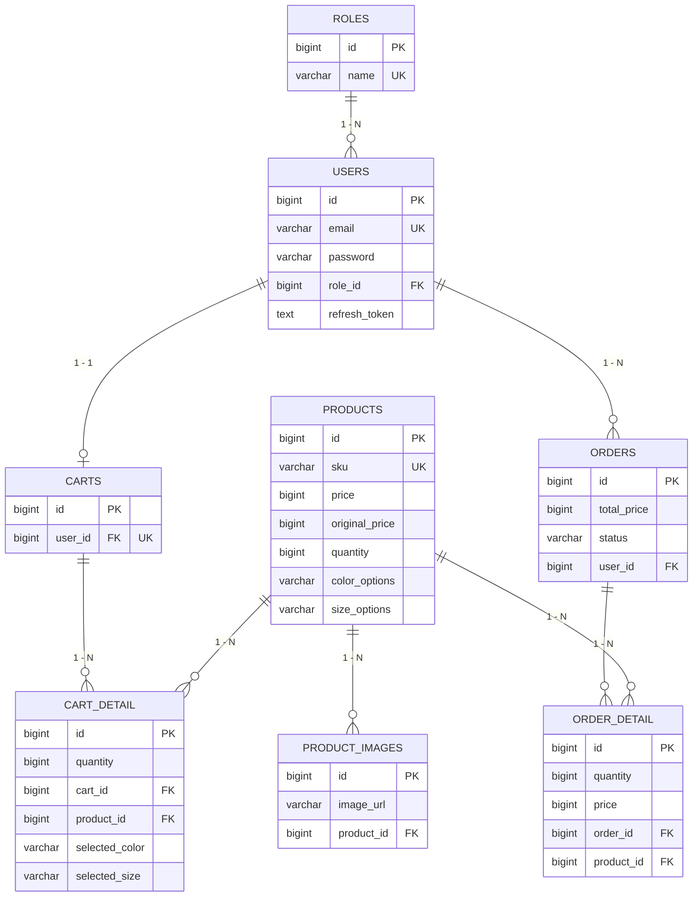

# Phân tích Database & Entity - Han Sports v2

Hệ thống Han Sports v2 sử dụng cơ sở dữ liệu quan hệ (RDBMS) MySQL. Cấu trúc DB được quản lý tự động thông qua công cụ **Flyway Migration**. Các bảng trong DB tương ứng 1-1 với các **JPA Entity** trong code backend (nằm tại thư mục `domain`).

---

## 1. Danh sách toàn bộ bảng Database và Thực thể tương ứng

Dưới đây là danh sách 12 bảng hiện có, ánh xạ trực tiếp với các Entity Java:

| Tên Bảng (Table) | JPA Entity | Mục đích |
| :--- | :--- | :--- |
| `roles` | `Role` | Lưu trữ vai trò phân quyền (VD: USER, ADMIN). |
| `users` | `User` | Lưu trữ thông tin tài khoản người dùng, mã hóa mật khẩu, refresh token. |
| `products` | `Product` | Lưu trữ thông tin sản phẩm (giá, tồn kho, thương hiệu, biến thể...). |
| `product_images` | `ProductImage` | Lưu trữ các URL hình ảnh phụ của từng sản phẩm. |
| `carts` | `Cart` | Giỏ hàng của người dùng (Mỗi người dùng có 1 giỏ hàng duy nhất). |
| `cart_detail` | `CartDetail` | Lưu chi tiết từng sản phẩm, biến thể (màu, size) và số lượng trong giỏ. |
| `orders` | `Order` | Lưu thông tin đơn đặt hàng (thông tin người nhận, trạng thái, tổng tiền). |
| `order_detail` | `OrderDetail` | Lưu chi tiết các sản phẩm đã mua trong một đơn hàng. |
| `settings` | `AppSetting` | Lưu trữ cấu hình dạng key-value của hệ thống. |
| `site_banners` | `SiteBanner` | Lưu trữ dữ liệu cấu hình các banner trình chiếu trên trang chủ. |
| `site_categories` | `SiteCategory` | Lưu cấu hình danh mục ngoài giao diện (Icon, Color, Path). |
| `site_navigation_items`| `SiteNavigationItem` | Lưu các menu điều hướng hiển thị trên thanh Header. |

---

## 2. Phân tích chi tiết các nhóm bảng và Quan hệ

### 2.1. Nhóm Auth & Account (`roles`, `users`)
- **`roles`**:
  - *Cột quan trọng*: `id` (PK), `name` (Unique, VD: "ADMIN").
- **`users`**:
  - *Cột quan trọng*: `email` (Unique), `password` (BCrypt hash), `refresh_token` (Lưu chuỗi băm của Refresh Token cấp cho JWT), `role_id` (FK).
  - *Quan hệ*: N-1 với bảng `roles`. Nhiều user có thể có cùng 1 role.

### 2.2. Nhóm Sản phẩm (`products`, `product_images`)
- **`products`**:
  - *Cột quan trọng*: `id` (PK), `sku` (Unique - Mã hàng), `price` (Giá bán), `original_price` (Giá gốc - V6 migration), `quantity` (Tồn kho), `color_options` & `size_options` (Biến thể được lưu dạng chuỗi phân cách bằng dấu `|`), `active` (Trạng thái ẩn/hiện).
- **`product_images`**:
  - *Cột quan trọng*: `id` (PK), `image_url`, `product_id` (FK).
  - *Quan hệ*: N-1 với `products`. Một sản phẩm có nhiều hình ảnh. Việc tách thành bảng riêng giúp hệ thống mở rộng hỗ trợ upload nhiều ảnh thay vì chỉ 1 cột avatar.

### 2.3. Nhóm Giỏ Hàng (`carts`, `cart_detail`)
- **`carts`**:
  - *Cột quan trọng*: `id` (PK), `sum` (Tổng số loại mặt hàng), `user_id` (FK - Unique Key).
  - *Quan hệ*: 1-1 với `users`. Do có UNIQUE KEY `uk_carts_user_id`, mỗi user chỉ được cấp 1 giỏ hàng tồn tại song song vĩnh viễn.
- **`cart_detail`**:
  - *Cột quan trọng*: `id` (PK), `quantity` (Số lượng đặt), `cart_id` (FK), `product_id` (FK), `selected_color`, `selected_size` (V6 migration - Lưu giữ biến thể người dùng đã chọn lúc bỏ vào giỏ).
  - *Quan hệ*: N-1 với `carts` (1 giỏ có nhiều dòng chi tiết) và N-1 với `products` (1 dòng chi tiết tham chiếu tới 1 sản phẩm gốc).

### 2.4. Nhóm Đơn Hàng (`orders`, `order_detail`)
- **`orders`**:
  - *Cột quan trọng*: `id` (PK), `total_price`, `receiver_name`, `receiver_address`, `status` (PENDING, COMPLETED...). `user_id` (FK).
  - *Quan hệ*: N-1 với `users`. Một người dùng có thể mua nhiều lần sinh ra nhiều Order.
- **`order_detail`**:
  - *Cột quan trọng*: `id` (PK), `price` (Giá chốt tại thời điểm mua), `quantity`, `order_id` (FK), `product_id` (FK), `selected_color`, `selected_size`.
  - *Quan hệ*: N-1 với `orders` và N-1 với `products`.

### 2.5. Nhóm Cấu Hình & Giao Diện (Settings, Site Content)
- Bảng `settings` dùng thiết kế dạng Key-Value (`setting_key` UNIQUE, `setting_value`). Các cấu hình phức tạp như mảng String được Serialize JSON và nhét vào trường Text của Value.
- Các bảng `site_banners`, `site_categories`, `site_navigation_items` lưu danh sách quản lý giao diện, được phân loại với `sort_order` và `active`.

---

## 3. Sơ đồ Thực Thể Liên Kết (ERD)

---

## 4. Đánh giá Thiết Kế Database

**Điểm tốt (Good Practices):**
1. **Dùng Flyway Migration**: Cách quản lý phiên bản Database chuyên nghiệp, có baseline, tránh tình trạng mất đồng bộ schema khi làm việc nhóm.
2. **Snapshot Giá lúc Checkout**: Bảng `order_detail` lưu riêng một cột `price` độc lập với giá ở bảng `products`. Đây là thiết kế chuẩn trong E-commerce, đảm bảo nếu sau này giá sản phẩm tăng lên thì lịch sử đơn hàng cũ không bị nhảy số tiền.
3. **Quản lý biến thể linh hoạt**: Lưu các option màu/size được ngăn cách bằng `|` (Ví dụ: `Đỏ|Xanh|Đen`) ở Product thay vì tạo bảng One-to-Many Variant phức tạp. Điều này giữ hệ thống gọn gàng mà vẫn đủ tính năng.

**Điểm cần cải thiện:**
1. **Cart Detail và Order Detail chưa tối ưu Indexing**: Mặc dù đã có FK, nhưng các bảng thường xuyên query kép bằng 2 thuộc tính (Ví dụ: kiểm tra giỏ hàng có tồn tại sản phẩm A màu Đỏ size M hay không) thì nên thêm **Composite Unique Key** `(cart_id, product_id, selected_color, selected_size)`.
2. **Kiểu dữ liệu tiền tệ**: Đang sử dụng `BIGINT` (long) cho `price` là khá an toàn với đơn vị VNĐ. Tuy nhiên nếu scale quốc tế có thập phân, `DECIMAL(19, 4)` sẽ là kiểu chuẩn chỉ hơn.
3. **Soft Delete**: Các bảng đang dùng xóa thật (Hard Delete). Có thể dẫn đến lỗi nếu xóa User thì tất cả lịch sử Order bị cascade mất trắng (Hoặc DB báo lỗi Constraints). Nên thêm cột `is_deleted` ở bảng `users` và `products`.
