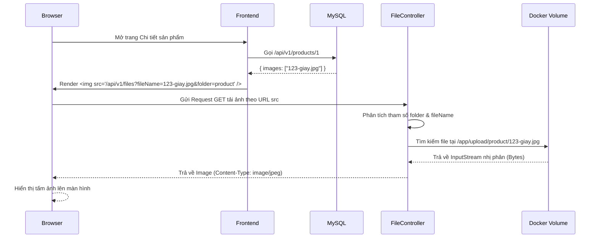

# Phân tích Hệ thống Upload File & Quản lý Data Runtime

Hệ thống Han Sports v2 có chức năng cho phép người quản trị upload hình ảnh sản phẩm, logo, banner. Việc hiểu rõ cơ chế lưu trữ file vật lý và database là cực kỳ quan trọng để bảo trì và sao lưu dự án.

## 1. Phân tích luồng Upload (FileController & FileService)

- **`FileController`**: 
  - `POST /api/v1/files`: Nhận danh sách `MultipartFile` và tham số `folder` (VD: `product`).
  - `GET /api/v1/files`: API dùng để trả về (serve) file vật lý cho trình duyệt khi người dùng gọi thẻ ``. Lấy file bằng cách tạo `InputStreamResource`. Cần truyền tham số `fileName` và `folder`.
- **`FileService`**:
  - Giới hạn file: Chỉ nhận `.jpg`, `.jpeg`, `.png`, `.webp` (<= 5MB).
  - Bảo mật: Có hàm `hasValidImageSignature()` đọc vài Byte đầu tiên của file (Magic Numbers) để xác nhận đây thực sự là hình ảnh thật, chống trường hợp Hacker đổi đuôi file `.exe` thành `.png` rồi upload mã độc.
  - Xử lý lưu: Đổi tên file gốc thành `timestamp_thoi_gian-ten_an_toan.ext` để chống trùng tên. Lưu vào đường dẫn vật lý trên server (ổ cứng) thông qua thư viện NIO `java.nio.file.Files`.

---

## 2. Nơi lưu trữ thực tế (File System vs Database)

### 2.1. File System lưu gì?
File ảnh (các Byte nhị phân) được lưu ở đường dẫn cục bộ khai báo trong `application.yml` (`hansport.upload-file.base-path`).
Trong môi trường Docker Compose hiện tại, biến này được map với biến môi trường `UPLOAD_FILE_BASE_PATH: /app/upload`. 
Nghĩa là file được lưu trực tiếp vào ổ cứng bên trong Container backend tại thư mục `/app/upload/{folder}`.

### 2.2. Database lưu gì?
Bảng `product_images` và `site_banners` chỉ lưu **Tên File** (VD: `170000000-giay-nike.jpg`) vào cột `image_url` hoặc `image`. **Tuyệt đối không lưu file nhị phân (BLOB) vào Database**, đây là Best Practice giúp DB không bị phình to làm chậm hệ thống.

---

## 3. Vai trò của Docker Volumes

Trong `docker-compose.yml`, có hai Volume rất quan trọng:
1. **`backend-upload:/app/upload`**: Đây là Docker Volume map từ ngoài máy Host vào trong Container. Nếu không có dòng này, khi Container backend bị restart hoặc xóa đi build lại, **toàn bộ hình ảnh sản phẩm sẽ bị mất trắng**.
2. **`mysql-data:/var/lib/mysql`**: Tương tự, volume này dùng để giữ lại toàn bộ dữ liệu thật của MySQL (User, Product, Order). Nếu xóa volume này, DB sẽ quay về trạng thái trắng (hoặc chạy file seed SQL ban đầu nếu có).

---

## 4. Các rủi ro khi Di chuyển / Sao lưu (Backup) dự án

Khi bạn copy project sang máy khác, việc chỉ copy source code (các file `.java`, `.jsx`, `.yml`) là **CHƯA ĐỦ**. Bạn phải di chuyển cả Data Runtime.

- **Rủi ro 1: Chỉ Export SQL (Backup DB) mà QUÊN copy thư mục Upload**
  - **Hậu quả**: Khi sang máy mới, bảng Product vẫn có dữ liệu tên ảnh. Tuy nhiên, khi Frontend gọi `GET /files?fileName=...`, ổ cứng máy tính mới không có file vật lý đó. Tất cả hình ảnh trên website sẽ bị lỗi hiển thị biểu tượng "Broken Image" (Lỗi 404 File Not Found).
- **Rủi ro 2: Chỉ Copy thư mục Upload mà QUÊN Backup SQL**
  - **Hậu quả**: Máy mới sẽ có thư mục chứa hàng ngàn tấm ảnh, nhưng MySQL trắng bóc. Không có sản phẩm nào để hiển thị lên website, số hình ảnh kia trở thành "Rác" vì không có Data liên kết.

---

## 5. Sơ đồ Luồng Hiển thị Hình ảnh (Display Image Flow)

---

## 6. Đề xuất quy trình Backup & Scale chuyên nghiệp

Hệ thống lưu File cục bộ hiện tại chỉ phù hợp cho 1 server duy nhất. Nếu Website phát triển lớn và cần chạy nhiều Server Backend cùng lúc (Load Balancing), việc lưu ảnh vào ổ cứng `/app/upload` của máy A thì máy B sẽ không đọc được.

**Các bước nâng cấp đề xuất:**
1. **Dùng Cloud Storage (S3/R2)**: Sửa lại logic trong `FileService` để không lưu vào ổ cứng nữa, mà sử dụng AWS S3 (hoặc Cloudflare R2 / MinIO). Cột `image_url` lúc này sẽ lưu link Full HTTPS của CDN ảnh.
   - *Lợi ích*: Backup nhàn hạ (Cloud tự lo), tốc độ tải ảnh cực nhanh, server Backend siêu nhẹ (Stateless).
2. **Quy trình Backup hiện hành (Workaround)**:
   - Nếu vẫn muốn xài local server, hãy tạo một Cronjob bash script hằng ngày:
     1. Chạy lệnh `mysqldump` để ra file `.sql`.
     2. Lệnh `tar -czvf` để nén toàn bộ nội dung của docker volume `backend-upload`.
     3. Tự động gửi cục nén đó lên một nơi lưu trữ khác (như Google Drive / Server phụ).
