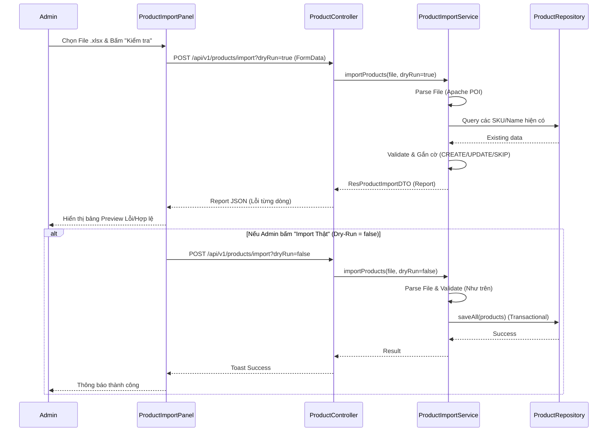

# Phân tích chức năng Sản Phẩm - Han Sports v2

Chức năng Quản lý sản phẩm là module lõi của hệ thống, bao gồm cả Frontend (hiển thị cho khách hàng, quản trị cho admin) và Backend (xử lý logic, database).

## 1. Phân tích các Luồng (Flows) Nghiệp vụ

### 1.1. Xem danh sách sản phẩm Public và Search/Filter
- **Frontend**: Khách hàng truy cập vào trang Shop. Giao diện có các bộ lọc (Thương hiệu, Giá cả, Phân loại). Gọi hàm `productApi.getAll(params)`.
- **API**: `GET /api/v1/products` với các Request Parameters như `brand`, `minPrice`, `maxPrice`, `q` (từ khóa), `page`, `size`.
- **Service (`ProductService.java`)**: 
  - Khởi tạo thư viện `Specification<Product>` kết hợp với thư viện `turkraft.springfilter` để tạo các câu query động (Dynamic Queries).
  - Kết hợp `includeInactive = false` để đảm bảo người dùng bình thường không nhìn thấy các sản phẩm đã bị ẩn.
- **Database**: JPA gửi lệnh SQL truy vấn với các mệnh đề `WHERE` tương ứng và thực hiện phân trang (`LIMIT`, `OFFSET`).
- **Response**: Trả về `ResultPaginationDTO` chứa danh sách `ResProductDTO` và Metadata (Tổng số trang).

### 1.2. Xem chi tiết sản phẩm
- **Frontend**: Click vào một sản phẩm, chuyển hướng sang trang chi tiết với URL `/products/:id`. Gọi `productApi.getById(id)`.
- **API**: `GET /api/v1/products/{id}`.
- **Service**: Tìm bằng `productRepository.findById()`.
- **Response**: Trả về `ResProductDTO` chứa tất cả thông tin: Tên, giá, giá cũ, thương hiệu, danh sách `images`, các tùy chọn màu sắc (`colorOptions`), kích thước (`sizeOptions`).

### 1.3. Admin Thêm/Sửa/Xóa sản phẩm
- **Frontend (`ProductsPage.jsx`)**: 
  - Quản trị viên vào trang quản lý, giao diện hiển thị bảng.
  - Form thêm/sửa dùng chung một Modal, khi submit sẽ gọi `productApi.create()` hoặc `productApi.update()`.
- **API**: `POST` hoặc `PUT /api/v1/products`. Cần JWT Token có `ROLE_ADMIN`.
- **Service**:
  - *Sửa*: Kiểm tra trùng lặp `sku` và `name` qua các hàm trong `ProductRepository`. Cập nhật các trường.
  - Đối với hình ảnh: Có hàm private `replaceImages()` để đồng bộ danh sách ảnh gửi lên với ảnh trong DB. Những URL bị bỏ khỏi list sẽ gọi `fileService.deleteIfExists()` để xóa file vật lý (chống rác máy chủ).
- **Database**: Gọi `productRepository.save()`.

### 1.4. Upload ảnh sản phẩm
- **Frontend**: Upload trực tiếp trong form sửa/thêm. Frontend nối file vào `FormData` gọi `productApi.uploadFile()`.
- **API**: `POST /api/v1/files` kèm biến `folder="product"`.
- **Service (`FileService.java`)**: 
  - Validate đuôi file, dung lượng (<5MB), và check *Byte Signature* để bảo mật.
  - Lưu file vào ổ cứng (`java.nio.file.Files.copy`).
- **Response**: Trả về tên file đã được đổi tên (thêm timestamp để tránh trùng). Frontend sau đó gửi tên file này lên luồng "Thêm/Sửa sản phẩm" ở trên.

### 1.5. Import sản phẩm bằng Excel/CSV (Bulk Import)
- **Frontend (`ProductImportPanel.jsx`)**: Quản trị viên thả file Excel hoặc CSV. Có chức năng **Dry-run** (Kiểm tra thử trước khi lưu thật).
- **API**: `POST /api/v1/products/import` với file và params `dryRun`.
- **Service (`ProductImportService.java`)**: 
  - Dùng thư viện **Apache POI** để đọc file Excel.
  - Validate từng dòng (tên, giá, SKU, URL hình ảnh...).
  - Đánh dấu trạng thái `CREATE`, `UPDATE` hoặc `SKIP` (nếu lỗi).
  - Nếu `dryRun = false` và file không có lỗi, tiến hành lưu toàn bộ vào DB trong 1 vòng Transaction.
- **Database**: Lưu hàng loạt `Product`.
- **Response**: Trả về file report `ResProductImportDTO` (báo lỗi ở dòng nào, cột nào). Frontend sẽ render thành một bảng Review.

---

## 2. Giải thích File/Component quan trọng

### Frontend (React/Vite)
- **`productApi.js`**: Instance cấu hình dùng axios để tương tác với mọi endpoint `/api/v1/products...`.
- **`ProductsPage.jsx`**: Trang cha của luồng Admin, dùng Custom Hook `useProductsAdmin` để quản lý State (Modal đóng mở, Pagination, Selection, Loadings). Cấu trúc Component base chuẩn, chia nhỏ form và table.
- **`ProductImportPanel.jsx`**: Giao diện Panel xịn xò để xử lý Drag & Drop file Excel, chạy kiểm tra Dry-Run và hiển thị report lỗi của từng dòng.

### Backend (Spring Boot)
- **`ProductController.java`**: Phân luồng routing HTTP, gắn annotation quyền (`@PreAuthorize("hasRole('ADMIN')")`).
- **`ProductService.java`**: Xử lý logic thuần của sản phẩm. Nổi bật có hàm `productFilters` ráp các mệnh đề truy vấn động với nhau bằng `Specification`.
- **`ProductImportService.java`**: Class lớn nhất xử lý đọc file POI, custom CSV parser.
- **`ProductRepository.java`**: JPA Interface, có custom query `@Query` để lấy Navigation (đếm số lượng sản phẩm đang active theo danh mục/thương hiệu) nhằm mục đích render Menu.
- **`Product.java` & `ProductImage.java`**: Cấu trúc Entity. `Product` định nghĩa One-to-Many với `ProductImage` với cascade, orphanRemoval.

---

## 3. Sơ đồ Luồng Import Excel / CSV

